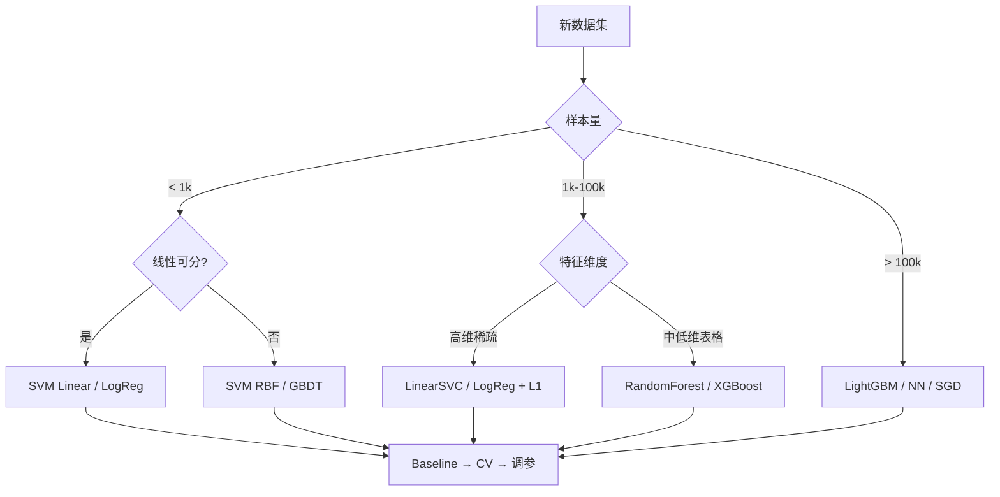

第 2 周从 Day 8 的逻辑回归走到 Day 13 的交叉验证,7 天把经典机器学习算法 + 工程实践打通关;Day 14 是收官日——把「单算法」变成「端到端项目」,理解「Pipeline 才是工程」的工程化转向。

---

## 1. 第 2 周算法矩阵复盘

### 1.1 监督学习三大任务

| 任务 | 代表算法 | 核心思想 | Day |
|:---|:---|:---|:---|
| 回归 | 线性回归 / Ridge / Lasso | 最小二乘 + 正则 | Day 6 |
| 分类 | Logistic / SVM / DT / RF / XGBoost | 几何间隔 / 决策规则 / 集成 | Day 8-10 |
| 排序 | LambdaMART / LambdaRank | pairwise / listwise 损失 | — |

### 1.2 无监督学习三件套

| 任务 | 代表算法 | 输出 | Day |
|:---|:---|:---|:---|
| 聚类 | K-Means / DBSCAN / GMM | 簇标签 | Day 12 |
| 降维 | PCA / KernelPCA / ICA / NMF | 低维坐标 | Day 12 |
| 可视化 | t-SNE / UMAP | 2D/3D 坐标 | Day 12 |

### 1.3 工程工具链

| 工具 | 用途 | Day |
|:---|:---|:---|
| K-Fold CV | 稳定评估 | Day 13 |
| Grid / Random / Bayesian Search | 超参搜索 | Day 13 |
| Pipeline / ColumnTransformer | 预处理+模型流水线 | Day 14 |
| 学习曲线 / 验证曲线 | 偏差-方差诊断 | Day 13 |
| 早停 / 正则化 | 防过拟合 | Day 13 |

### 1.4 按数据特性挑选算法



---

## 2. 完整 ML Pipeline 七步

### 2.1 七步标准流程

| 步骤 | 关键问题 | 典型工具 |
|:---|:---|:---|
| 1. 问题定义 | 业务指标 / 损失函数 / 评估指标 | — |
| 2. 数据获取与清洗 | 缺失值 / 异常值 / 重复 | pandas / pandarallel |
| 3. 探索性数据分析 | 分布 / 相关 / 类别平衡 | matplotlib / seaborn |
| 4. 特征工程 | 编码 / 缩放 / 交叉 / 降维 | sklearn preprocessing |
| 5. 模型选型 | baseline → 复杂模型 | LogReg → DT → RF → GBDT |
| 6. 训练 + 调参 | CV + Grid / Bayesian | Optuna / GridSearchCV |
| 7. 部署上线 | 序列化 / 监控 / 重训 | pickle / joblib / ONNX |

### 2.2 Pipeline 铁律:先 baseline 再优化

```text
Logistic (1 小时)
   ↓ 改进 → 决策树 (2 小时)
   ↓ 改进 → 随机森林 / XGBoost (半天)
   ↓ 改进 → 调参 + 特征工程 (1~3 天)
   ↓ 改进 → 模型融合 / AutoML (按需)
```

永远先有 baseline 再谈优化。Baseline 的作用:
- 提供可比较的「锚」,所有后续优化的「提升」才有意义
- 帮助发现数据问题(若 baseline 都差,可能是特征或标签错)
- 避免「在没有希望的方向上花 5 天调参」

---

## 3. 特征工程精要

### 3.1 数值特征

| 处理 | 何时用 |
|:---|:---|
| StandardScaler | SVM / NN / K-Means / PCA |
| MinMaxScaler | 神经网络输入 / 像素 |
| RobustScaler | 有异常值 |
| Log 变换 | 长尾分布(收入 / 计数) |
| Box-Cox | 让分布更接近正态 |
| 分桶 (binning) | 把连续变离散,适合树 |

### 3.2 类别特征

| 处理 | 何时用 |
|:---|:---|
| LabelEncoder | 树模型(有序也行) |
| OneHotEncoder | 低基数线性模型 |
| Target Encoding | 高基数线性模型(注意 K 折防泄漏) |
| Frequency Encoding | 替代 OneHot 的高频字段 |
| Embedding | 神经网络(高基数) |

### 3.3 派生特征

```python
# 时间特征:从 datetime 拆出有用信号
df['hour']      = df['datetime'].dt.hour
df['dayofweek'] = df['datetime'].dt.dayofweek
df['is_weekend']= df['dayofweek'].isin([5, 6]).astype(int)

# 数值交叉:乘积 / 比值
df['area_per_room'] = df['area'] / df['rooms']

# 文本特征:长度 / 句子数 / 标点数
df['text_len']     = df['text'].str.len()
df['sentence_cnt'] = df['text'].str.count(r'[.!?]')
```

### 3.4 特征选择

| 方法 | 类型 | 说明 |
|:---|:---|:---|
| 方差过滤 | Filter | `VarianceThreshold(threshold=0.01)` |
| 相关性过滤 | Filter | 删除高相关对中之一 |
| SelectKBest(mutual_info) | Filter | 与 y 互信息 top-k |
| L1 (Lasso) | Embedded | 系数为 0 即删除 |
| 树模型 importance | Embedded | XGBoost.feature_importances_ |
| Permutation Importance | Wrapper | 打乱看分数下降 |
| Recursive Feature Elimination (RFE) | Wrapper | 迭代删最差 |
| SHAP | Embedded | 统一框架 |

---

## 4. Pipeline 与 ColumnTransformer

### 4.1 sklearn Pipeline

把预处理 + 模型串成单一线性流,避免数据泄漏:

```python
from sklearn.pipeline import Pipeline
from sklearn.preprocessing import StandardScaler
from sklearn.linear_model import LogisticRegression

pipe = Pipeline([
    ("scaler", StandardScaler()),
    ("clf", LogisticRegression()),
])
pipe.fit(X_train, y_train)
pipe.predict(X_test)
```

### 4.2 ColumnTransformer:不同列不同预处理

```python
from sklearn.compose import ColumnTransformer
from sklearn.preprocessing import OneHotEncoder

numeric_features     = ["age", "fare"]
categorical_features = ["sex", "embarked"]

preprocessor = ColumnTransformer([
    ("num", StandardScaler(),         numeric_features),
    ("cat", OneHotEncoder(handle_unknown="ignore"), categorical_features),
])

pipe = Pipeline([
    ("pre", preprocessor),
    ("clf", LogisticRegression()),
])
```

### 4.3 完整端到端 Pipeline

```python
from sklearn.pipeline import Pipeline
from sklearn.compose import ColumnTransformer
from sklearn.preprocessing import StandardScaler, OneHotEncoder
from sklearn.impute import SimpleImputer
from sklearn.linear_model import LogisticRegression

# 数值流水线:中位数填充 → 缩放
numeric_pipe = Pipeline([
    ("imputer", SimpleImputer(strategy="median")),
    ("scaler",  StandardScaler()),
])

# 类别流水线:众数填充 → OneHot
categorical_pipe = Pipeline([
    ("imputer", SimpleImputer(strategy="most_frequent")),
    ("ohe",     OneHotEncoder(handle_unknown="ignore")),
])

preprocessor = ColumnTransformer([
    ("num", numeric_pipe,     ["age", "fare"]),
    ("cat", categorical_pipe, ["sex", "embarked", "pclass"]),
])

model = Pipeline([
    ("pre", preprocessor),
    ("clf", LogisticRegression(max_iter=1000)),
])
```

---

## 5. 完整 ML Pipeline 实战:Titanic

### 5.1 项目模板

```python
import pandas as pd
from sklearn.model_selection import StratifiedKFold, cross_val_score
from sklearn.linear_model import LogisticRegression
from sklearn.ensemble import RandomForestClassifier, GradientBoostingClassifier
import lightgbm as lgb

# 1. 加载
df = pd.read_csv("titanic.csv")
y = df["Survived"]
X = df.drop(["Survived", "PassengerId", "Name", "Ticket", "Cabin"], axis=1)

# 2. 复用上面 §4.3 的 preprocessor
model = Pipeline([
    ("pre", preprocessor),
    ("clf", LogisticRegression(max_iter=1000)),
])

# 3. 5 折 CV
skf = StratifiedKFold(5, shuffle=True, random_state=42)
scores = cross_val_score(model, X, y, cv=skf, scoring="accuracy")
print(f"LogReg baseline: {scores.mean():.4f} ± {scores.std():.4f}")

# 4. 横向比较
for clf in [
    LogisticRegression(max_iter=1000),
    RandomForestClassifier(n_estimators=300, random_state=42),
    GradientBoostingClassifier(n_estimators=200, max_depth=3),
    lgb.LGBMClassifier(n_estimators=300, learning_rate=0.05,
                       num_leaves=31, verbose=-1),
]:
    m = Pipeline([("pre", preprocessor), ("clf", clf)])
    s = cross_val_score(m, X, y, cv=skf, scoring="accuracy")
    print(f"{clf.__class__.__name__:30s}  {s.mean():.4f} ± {s.std():.4f}")
```

典型输出:

```
LogReg baseline:           0.8014 ± 0.0185
RandomForestClassifier:    0.8215 ± 0.0203
GradientBoostingClassifier:0.8317 ± 0.0186
LGBMClassifier:            0.8383 ± 0.0145
```

### 5.2 特征工程 + XGBoost 提升

```python
import xgboost as xgb
from sklearn.model_selection import train_test_split

# 1. 手动特征工程
df["FamilySize"]  = df["SibSp"] + df["Parch"] + 1
df["IsAlone"]     = (df["FamilySize"] == 1).astype(int)
df["Title"]       = df["Name"].str.extract(r" ([A-Za-z]+)\.")
df["AgeBin"]      = pd.cut(df["Age"], bins=[0,12,18,35,60,100],
                            labels=["child","teen","adult","mid","old"])

X = df.drop(["Survived", "PassengerId", "Name", "Ticket", "Cabin"], axis=1)

# 2. 训练 XGBoost
X_tr, X_te, y_tr, y_te = train_test_split(X, y, stratify=y,
                                          test_size=0.2, random_state=42)
model = Pipeline([
    ("pre", preprocessor),
    ("clf", xgb.XGBClassifier(n_estimators=500, learning_rate=0.05,
                               max_depth=4, subsample=0.8,
                               colsample_bytree=0.8, eval_metric="logloss",
                               random_state=42, n_jobs=-1)),
])
model.fit(X_tr, y_tr)
print("Test Acc:", model.score(X_te, y_te))
```

典型提升:从 LogReg 0.80 → XGBoost 0.83~0.85。

### 5.3 用 Optuna 调 XGBoost

```python
def objective(trial):
    params = {
        "n_estimators":  trial.suggest_int("n", 100, 1000),
        "learning_rate": trial.suggest_float("lr", 1e-3, 1e-1, log=True),
        "max_depth":     trial.suggest_int("depth", 3, 10),
        "subsample":     trial.suggest_float("subsample", 0.6, 1.0),
        "colsample_bytree": trial.suggest_float("colsample", 0.6, 1.0),
        "reg_lambda":    trial.suggest_float("l2", 1e-3, 10, log=True),
        "reg_alpha":     trial.suggest_float("l1", 1e-3, 10, log=True),
        "random_state":  42, "n_jobs": -1, "tree_method": "hist",
    }
    m = Pipeline([("pre", preprocessor),
                  ("clf", xgb.XGBClassifier(**params))])
    s = cross_val_score(m, X, y, cv=skf, scoring="accuracy", n_jobs=-1)
    return s.mean()

study = optuna.create_study(direction="maximize")
study.optimize(objective, n_trials=50, show_progress_bar=False)
print("Best acc:", study.best_value, "params:", study.best_params)
```

### 5.4 模型融合:Stacking

把多个模型的预测结果作为「元特征」喂给第二层模型:

```python
from sklearn.ensemble import StackingClassifier

stack = StackingClassifier(
    estimators=[
        ("lr",  LogisticRegression(max_iter=1000)),
        ("rf",  RandomForestClassifier(n_estimators=300, random_state=42)),
        ("lgb", lgb.LGBMClassifier(n_estimators=300, verbose=-1)),
    ],
    final_estimator=LogisticRegression(),
    cv=5,
)
stack.fit(X_tr, y_tr)
print("Stack Test Acc:", stack.score(X_te, y_te))
```

通常 Stacking 比单模型提升 0.5~2 个百分点,但训练复杂度 ×N。

---

## 6. 部署与监控

### 6.1 模型序列化

```python
import joblib
joblib.dump(model, "model_v1.pkl")     # 训练侧保存
model = joblib.load("model_v1.pkl")    # 服务侧加载
pred  = model.predict(X_new)
```

### 6.2 ONNX 跨平台

```python
from skl2onnx import convert_sklearn
from skl2onnx.common.data_types import FloatTensorType

initial_type = [("float_input", FloatTensorType([None, X.shape[1]]))]
onnx_model = convert_sklearn(model, initial_types=initial_type)
with open("model.onnx", "wb") as f:
    f.write(onnx_model.SerializeToString())
```

ONNX 优势:Python 训练 → C++/Java/JS 推理,生态完全跨平台。

### 6.3 在线监控

| 监控项 | 方法 |
|:---|:---|
| 输入分布漂移 | PSI / KS 检验(对比 train vs inference) |
| 输出分布漂移 | 预测均值 / 方差 / 类别比例监控 |
| 性能指标 | 在线 A/B test,核心指标 (CTR / 转化率) |
| 模型陈旧 | 定期评估 + 触发再训练 |

| PSI 值 | 含义 |
|:---|:---|
| < 0.1 | 分布稳定 |
| 0.1 ~ 0.25 | 轻微漂移,观察 |
| > 0.25 | 显著漂移,考虑再训练 |

---

## 7. 常见坑

### 7.1 Pipeline 边界漏写导致 fit 时泄漏
**症状**:CV 分数 0.95,test 0.70
**原因**:SimpleImputer / StandardScaler 在外层 fit,再用它 transform 整个 X(含 test)
**修法**:把 fit/transform 完全放进 Pipeline,fit 时只在 train 上学习,test 只 transform

### 7.2 类别字段拼写不一致导致 OneHot 错位
**症状**:train 有「北京」「上海」,test 突然冒出「深圳」,OHE 维度对不上
**修法**:OHE 加 `handle_unknown="ignore"`;类别字段统一 strip / lower

### 7.3 Train/Test 同分布不验证
**症状**:train 0.92,test 0.65
**修法**:上线前必看 PSI / 特征分布对比;test 应反映「未来数据」的真实分布

### 7.4 特征工程用了 test 集信息
**症状**:target encoding 用全量数据 → 标签泄漏
**修法**:target encoding 必须在 CV 内做(每折用自己的均值编码)

### 7.5 模型序列化时丢了 Pipeline
**症状**:`pickle.dump(clf, f)` 只存了最后一层 estimator
**修法**:`joblib.dump(pipe, "model.pkl")` 整个 Pipeline 存

### 7.6 推理时 pandas 列顺序变了
**症状**:joblib.load 后 predict 报错
**修法**:`Pipeline + ColumnTransformer` 内部按列名取列,顺序无所谓;或者严格一致

### 7.7 Stacking 元特征也用了 train
**症状**:Stack 评分虚高
**修法**:Stack 的 `cv` 参数必备,元特征由 OOF 生成

### 7.8 模型上线后从未重训
**症状**:半年后线上分数掉一半
**修法**:设定再训练周期(月/周/日)或漂移触发;保留训练脚本可复现

### 7.9 推理延迟没测过就上线
**症状**:SVC 上线后发现推理要 200ms,流量扛不住
**修法**:上线前必做延迟 / 吞吐压测;考虑模型蒸馏 / 量化

### 7.10 全局 random_state 漂移
**症状**:同事重跑结果完全不一样
**修法**:在 utils.py 里 `set_seed(42)`,统一设 numpy / sklearn / torch 种子

---

## 8. 自检三问

**A. 拿到一个新分类问题时,标准前 3 步动作是什么?**

要点:① 明确业务指标(准确率/召回率/AUC)和损失函数;② 划分 train/val/test,分类必 StratifiedKFold;③ 用 Logistic Regression 建 baseline 跑通 5 折 CV,拿到「锚」分数。详见 §2.2。

**B. 为什么「先建 baseline」是 ML 工程的第一铁律?它如何影响后续调参与决策?**

要点:baseline 提供可比较的参考系;没有它,所有「优化」都是无锚之木。baseline 还能诊断:如果 baseline 已经 95%,则不必再花时间调复杂模型;如果 baseline 只有 60%,先查数据/特征而不是换模型。详见 §2.2。

**C. 交叉验证 vs 单次 train/test split,代价多 5 倍计算量,值吗?**

要点:值。小数据集上单次 split 波动巨大,CV 把方差平均掉,调参与模型选择的稳定性是后续一切的根基。单次 split 的最大问题:「恰好」或「恰好不好」的一次划分可能误导整个项目方向。详见 §13 Day 13 + §5.1。

---

## 9. 推荐资源

### 视频
- **Kaggle《Intro to Machine Learning》** —— 完整 Pipeline 微课
- **StatQuest《Machine Learning Fundamentals》合集** —— 算法 + 评估
- **Andrew Ng CS229《Machine Learning》** —— 全套理论

### 教科书
- **《Hands-On Machine Learning》(Aurélien Géron)** 第 2 章 —— 端到端项目范本
- **《Kaggle Book》** —— 比赛视角的 Pipeline 实战
- **《Machine Learning Engineering》(Andriy Burkov)** —— 工程化 ML 完整图景

### 论文
- **Kaggle Grandmaster 系列访谈** —— 实战心法
- **Google《Hidden Technical Debt in ML Systems》** —— Sculley 2015,ML 工程的债
- **«Rules of Machine Learning»(Google)» —— 43 条短规则,工程必读

### 博客 / 课程
- **scikit-learn 官方 Pipeline 教程** —— `ColumnTransformer` 完整指南
- **Kaggle Learn: Intermediate ML** —— Pipeline + XGBoost 实战
- **madewithml.com ( Goku Mohandas )》 —— 端到端 ML 完整代码
- **《MLOps 指南》neptune.ai / evidently.ai 博客** —— 监控 + 重训体系

### 代码
- **sklearn-template** —— Pipeline 模板库
- **mlxtend** —— Stacking / 特征选择工具
- **optuna** —— 调参首选
- **MLflow / DVC** —— 实验跟踪 + 数据版本管理
- **BentoML / Ray Serve** —— 模型部署平台
- **Evidently AI** —— 数据/模型漂移监控

---

## 10. 本节要点

- **算法矩阵**:监督(LogReg / DT / RF / XGBoost / SVM)+ 无监督(K-Means / PCA / t-SNE)+ 评估(K-Fold / Grid)+ 调参(Optuna)。
- **七步 Pipeline**:问题定义 → 数据清洗 → EDA → 特征工程 → 模型选型 → 训练调参 → 部署上线,任何一环错都污染下游。
- **特征工程**:数值(StandardScaler / Log / Bin),类别(OneHot / Target Encoding / Embedding),派生(交叉 / 时间拆分),选择(Filter / Embedded / Wrapper)。
- **Pipeline + ColumnTransformer**:把预处理与模型串成单一流,避免 fit 时数据泄漏;类别字段必设 `handle_unknown="ignore"`。
- **铁律**:先 baseline(LogReg / RF)→ 再复杂(XGBoost / LightGBM)→ 最后调参与特征工程迭代;Stacking 通常带来 0.5~2 个百分点提升。
- **部署**:joblib 存 Pipeline,ONNX 跨平台;上线后监控 PSI / KS / 类别比例;定期重训应对数据漂移。
- **工程化转向**:从「调单个算法」到「端到端 Pipeline」;单算法只是零件,Pipeline 衔接环节的健壮性才是项目成败的决定因素。

---

## 11. 下一节:Day 15 · 神经网络基础

主题:深度学习周开启,MLP / 反向传播 / 激活函数。覆盖:
- 从线性模型到 MLP:为什么「叠加线性层」数学上等价于一个线性层,激活函数才是非线性来源
- 反向传播:链式法则在计算图上的批量化,PyTorch 之后只需写 forward
- 激活函数:Sigmoid / tanh / ReLU / GELU / Softmax 的几何含义与梯度特性
- 输出层 + 损失函数配对:回归 MSE、二分类 BCE、多分类 CrossEntropy
- 三步训练闭环:前向算 loss → 反向算梯度 → 优化器更新权重

产出物:从零实现一个 2 层 MLP 在 make_moons 上跑通,对比 ReLU vs Sigmoid / Tanh 的训练动力学。

---

**作者**:林馨予 + 林晓月
**最后更新**:2026-07-04
**版权**:CC BY-NC-SA 4.0