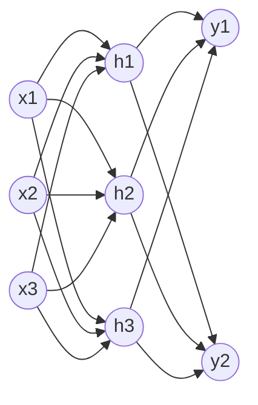
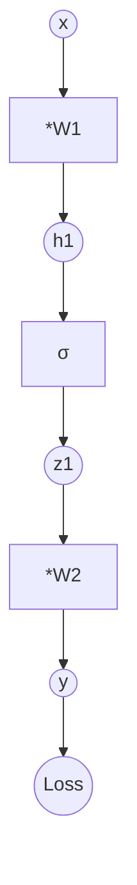

MLP(多层感知机)是深度学习的最小完整单元——把若干个线性变换用非线性激活函数串起来,得到一个能逼近任意连续函数的万能近似器;反向传播则是「链式法则 + 计算图」的高效实现,PyTorch 之后只需写 forward,backward 自动发生。

---

## 1. 从线性模型到 MLP

### 1.1 为什么需要 MLP

线性模型 `y = Wx + b` 只能拟合线性关系。对 XOR、平面对角线分布这种线性不可分的数据,束手无策。

MLP 在线性变换之间插入非线性激活函数,让模型能拟合任意复杂的决策边界:

```math
h^{(1)} = \sigma(W^{(1)} x + b^{(1)})  \quad \text{(隐藏层)}
y = W^{(2)} h^{(1)} + b^{(2)}           \quad \text{(输出层)}
```

`σ` 是激活函数,通常是 ReLU。

### 1.2 MLP 结构图



- **输入层**:接收特征 (n_features 维)
- **隐藏层**:若干层,每层 n_hidden 个神经元,带激活函数
- **输出层**:根据任务决定维度和激活(回归 = 1 维线性,二分类 = 1 维 sigmoid,多分类 = K 维 softmax)

### 1.3 万能近似定理

一个隐藏层 + 足够多的神经元 + 非线性激活,可以以任意精度逼近任意连续函数(在紧集上)。这意味着:

- MLP 理论上有无限能力拟合任何关系
- 实际「够不够」取决于数据、容量、正则
- 深层网络比宽网络参数效率高(同样参数下深网络表达力更强)

---

## 2. 为什么必须有激活函数

### 2.1 没有激活的「深度」网络

设每层是线性变换 `h_i = W_i h_{i-1} + b_i`,则:

```math
h_L = W_L W_{L-1} \cdots W_1 x + \text{常数} = W_{\text{eff}} x + b_{\text{eff}}
```

L 层线性叠加 = 一个线性变换。这是数学事实——再深也是单层。

### 2.2 引入激活 σ 后

```math
h_i = \sigma(W_i h_{i-1} + b_i)
```

叠加后整体不再是线性,带来非线性表达能力。

### 2.3 反例:线性激活的「假深度」

σ = identity 时,5 层 MLP 数学上等价于 1 层线性;「深度」只是错觉。这就是为什么 ReLU / Sigmoid / Tanh 这些非线性函数是 MLP 的灵魂。

---

## 3. 激活函数全谱

### 3.1 五种主流激活

| 名称 | 公式 | 范围 | 零点对称 | 梯度消失 | 备注 |
|:---|:---|:---|:---|:---|:---|
| Sigmoid | `1 / (1 + e^{-x})` | (0, 1) | 否 | 严重 | 二分类输出层 |
| Tanh | `(e^x - e^{-x}) / (e^x + e^{-x})` | (-1, 1) | 是 | 中 | RNN 历史选择 |
| ReLU | `max(0, x)` | [0, ∞) | 否 | 无(正半轴) | 默认首选 |
| Leaky ReLU | `max(0.01x, x)` | (-∞, ∞) | 是 | 无 | 解决 ReLU 死亡 |
| GELU | `x · Φ(x)` | (-0.17, ∞) | 是 | 几乎无 | Transformer 默认 |

### 3.2 Sigmoid 与梯度消失

Sigmoid 导数:

```math
\sigma'(x) = \sigma(x) \cdot (1 - \sigma(x)) \le 0.25
```

最大值 0.25(< 1),多层连乘后梯度指数衰减 → 深层网络底层参数几乎不更新。

Sigmoid 输出恒正(0, 1)→ 下一层输入恒正 → 梯度符号恒定 → 优化时走 zig-zag 路径,收敛慢。

### 3.3 ReLU 的优势

```math
\text{ReLU}(x) = \max(0, x), \quad \text{ReLU}'(x) = \begin{cases}1 & x > 0 \\ 0 & x \le 0\end{cases}
```

- 正半轴梯度恒为 1,无饱和 → 深层网络梯度不消失
- 计算极简(一次比较),比 Sigmoid 快 6 倍
- 输出非负 → 收敛偏 zig-zag(但实践中不致命)
- **死亡 ReLU 问题**:某神经元一旦落入负半轴且学习率过大,可能永远不被激活(梯度全 0)。修法:Leaky ReLU / PReLU / 适当学习率

### 3.4 GELU 的兴起

```math
\text{GELU}(x) = x \cdot \Phi(x) = x \cdot \frac{1}{2}\left[1 + \text{erf}\left(\frac{x}{\sqrt{2}}\right)\right]
```

`Φ(x)` 是标准正态 CDF。GELU 比 ReLU 多了「随机正则化」(门控概率随输入大小变化),在 Transformer / 大模型上表现稳定,已成 LLM 默认。

### 3.5 何时用哪个

| 场景 | 推荐激活 |
|:---|:---|
| 隐藏层(MLP) | ReLU / GELU / SwiGLU |
| 二分类输出 | Sigmoid |
| 多分类输出 | Softmax |
| 回归输出 | Identity(线性) |
| RNN 门控 | Sigmoid(门) + Tanh(候选值) |
| Transformer FFN | GELU / ReLU |
| 极端深度(>100 层) | GELU / SwiGLU |

---

## 4. 反向传播:链式法则的计算图实现

### 4.1 计算图思路

把前向过程拆成基本运算节点,每个节点知道:
- forward:怎么从输入算输出
- backward:怎么从输出梯度算输入梯度(局部导数)



### 4.2 链式法则

对 `L = f(g(h(x)))`:

```math
\frac{\partial L}{\partial x} = \frac{\partial L}{\partial f} \cdot \frac{\partial f}{\partial g} \cdot \frac{\partial g}{\partial h} \cdot \frac{\partial h}{\partial x}
```

反向传播就是从 `∂L/∂y` 开始,沿计算图倒着乘每一段的局部导数。

### 4.3 显式推导(2 层 MLP)

设 `L = ½ (y - t)²`(`t` 是目标):

```math
\frac{\partial L}{\partial y} = y - t
```

```math
\frac{\partial L}{\partial W_2} = \frac{\partial L}{\partial y} \cdot h_1^T = (y-t) h_1^T
```

```math
\frac{\partial L}{\partial h_1} = W_2^T (y-t)
```

```math
\frac{\partial L}{\partial z_1} = W_2^T (y-t) \odot \sigma'(h_1)  \quad \text{(σ' 是 σ 的导数)}
```

```math
\frac{\partial L}{\partial W_1} = \frac{\partial L}{\partial z_1} \cdot x^T
```

每一步都是「局部导数 × 上游梯度」,这就是 BP 的机械动作。

### 4.4 自动求导的三种实现

| 实现方式 | 原理 | 代表 |
|:---|:---|:---|
| 符号求导 | 解析展开 | Theano / SymPy |
| 数值求导 | 有限差分 | 教学 |
| 反向自动求导 | 计算图 + 链式法则 | **PyTorch / TF / JAX** |

PyTorch 用的是 define-by-run 动态图:每一步 forward 立即建图,backward 时沿图反向传播。

---

## 5. 输出层 + 损失函数配对

### 5.1 三种经典配对

| 任务 | 输出层激活 | 损失函数 | 公式 |
|:---|:---|:---|:---|
| 回归 | Identity | MSE | `(y - t)²` |
| 二分类 | Sigmoid | Binary Cross-Entropy | `-t log p - (1-t) log(1-p)` |
| 多分类 | Softmax | Cross-Entropy | `-Σ t_k log p_k` |

### 5.2 为什么配对必须匹配

如果多分类输出用 Sigmoid + BCE,会得到「每类独立二分类」,不强制概率和为 1,语义错乱。

如果回归用 Softmax,会强制输出 ≥ 0 且和为 1,语义错乱。

### 5.3 Cross-Entropy 推导

```math
\text{CE}(p, t) = -\sum_k t_k \log p_k
```

`p` 是预测概率分布,`t` 是 one-hot 真实分布。最小化 CE 等价于最大化对数似然 `log p_t`(正确类别的概率越大越好)。

```math
\text{Softmax}(z_k) = \frac{e^{z_k}}{\sum_j e^{z_j}}
```

数值稳定性:实现时先减 `max(z)` 再 exp,避免溢出。

```python
def log_softmax(z):
    z_shift = z - z.max(axis=-1, keepdims=True)
    return z_shift - np.log(np.exp(z_shift).sum(axis=-1, keepdims=True))
```

### 5.4 BCE with Logits

PyTorch 推荐直接用 `BCEWithLogitsLoss` / `CrossEntropyLoss`,它们把 Sigmoid/Softmax + 数值稳定版 CE 合并,比分开写更稳。

```python
import torch.nn as nn
loss_fn = nn.CrossEntropyLoss()  # 内含 log_softmax + nll_loss
loss_fn = nn.BCEWithLogitsLoss()  # 内含 sigmoid + BCE
```

---

## 6. PyTorch 实战

### 6.1 从零实现 2 层 MLP(make_moons)

```python
import torch
import torch.nn as nn
import torch.nn.functional as F
from sklearn.datasets import make_moons
from sklearn.model_selection import train_test_split
from sklearn.preprocessing import StandardScaler
import matplotlib.pyplot as plt

torch.manual_seed(42)

X, y = make_moons(n_samples=500, noise=0.2, random_state=42)
X = StandardScaler().fit_transform(X)
X_tr, X_te, y_tr, y_te = train_test_split(X, y, test_size=0.2,
                                          stratify=y, random_state=42)

X_tr = torch.tensor(X_tr, dtype=torch.float32)
y_tr = torch.tensor(y_tr, dtype=torch.long)
X_te = torch.tensor(X_te, dtype=torch.float32)
y_te = torch.tensor(y_te, dtype=torch.long)

class MLP(nn.Module):
    def __init__(self, d_in=2, d_hid=16, d_out=2):
        super().__init__()
        self.fc1 = nn.Linear(d_in, d_hid)
        self.fc2 = nn.Linear(d_hid, d_out)

    def forward(self, x):
        h = F.relu(self.fc1(x))
        return self.fc2(h)  # logits,交给 CE 内部处理

model = MLP()
opt = torch.optim.Adam(model.parameters(), lr=1e-2)
loss_fn = nn.CrossEntropyLoss()

for epoch in range(200):
    model.train()
    logits = model(X_tr)
    loss = loss_fn(logits, y_tr)
    opt.zero_grad(); loss.backward(); opt.step()
    if (epoch + 1) % 50 == 0:
        with torch.no_grad():
            model.eval()
            acc = (model(X_te).argmax(1) == y_te).float().mean().item()
        print(f"epoch {epoch+1:3d}  loss {loss.item():.4f}  test acc {acc:.3f}")
```

预期输出:loss 0.6 → 0.05,test acc ≈ 95%。

### 6.2 三种激活的训练动力学对比

```python
import torch.nn as nn, torch.nn.functional as F

class MLP2(nn.Module):
    def __init__(self, d_in=2, d_hid=32, d_out=2, act="relu"):
        super().__init__()
        self.fc1 = nn.Linear(d_in, d_hid)
        self.fc2 = nn.Linear(d_hid, d_hid)
        self.fc3 = nn.Linear(d_hid, d_out)
        self.act_name = act
    def forward(self, x):
        a = {"relu": F.relu, "tanh": torch.tanh, "sigmoid": torch.sigmoid}[self.act_name]
        h = a(self.fc1(x))
        h = a(self.fc2(h))
        return self.fc3(h)

for act in ["sigmoid", "tanh", "relu"]:
    torch.manual_seed(0)
    m = MLP2(act=act); opt = torch.optim.Adam(m.parameters(), lr=1e-2)
    losses = []
    for ep in range(300):
        loss = nn.CrossEntropyLoss()(m(X_tr), y_tr)
        opt.zero_grad(); loss.backward(); opt.step()
        losses.append(loss.item())
    print(f"{act:8s}  final loss {losses[-1]:.4f}")
```

典型结果:

```
sigmoid  final loss 0.45  (卡住,梯度消失)
tanh     final loss 0.10  (能训但比 ReLU 慢)
relu     final loss 0.04  (收敛最快)
```

### 6.3 可视化决策边界

```python
import numpy as np

def plot_decision_boundary(model, X, y):
    x_min, x_max = X[:, 0].min()-0.5, X[:, 0].max()+0.5
    y_min, y_max = X[:, 1].min()-0.5, X[:, 1].max()+0.5
    xx, yy = np.meshgrid(np.linspace(x_min, x_max, 200),
                         np.linspace(y_min, y_max, 200))
    grid = torch.tensor(np.c_[xx.ravel(), yy.ravel()], dtype=torch.float32)
    with torch.no_grad():
        Z = model(grid).argmax(1).numpy().reshape(xx.shape)
    plt.contourf(xx, yy, Z, alpha=0.3)
    plt.scatter(X[:, 0], X[:, 1], c=y, s=10, edgecolor='k')
    plt.show()

plot_decision_boundary(model, X, y)
```

### 6.4 手算梯度(验证理解)

```python
# 验证:对 2 层 MLP 求 ∂L/∂W1 的解析值 vs autograd 值
torch.manual_seed(0)
m = MLP()
x = torch.randn(4, 2); t = torch.tensor([0, 1, 0, 1])
logits = m(x); loss = nn.CrossEntropyLoss()(logits, t)
loss.backward()
auto_grad_w1 = m.fc1.weight.grad.clone()

# 手算
W1, b1 = m.fc1.weight, m.fc1.bias
W2, b2 = m.fc2.weight, m.fc2.bias
h1_pre = x @ W1.T + b1
h1 = F.relu(h1_pre)
z = h1 @ W2.T + b2
# softmax + CE 梯度: (softmax - onehot) / N
softmax = F.softmax(z, dim=1)
onehot = F.one_hot(t, num_classes=2).float()
dL_dz = (softmax - onehot) / len(x)
dL_dh1 = dL_dz @ W2
dL_dh1_pre = dL_dh1 * (h1_pre > 0).float()  # ReLU 导数
manual_grad_w1 = dL_dh1_pre.T @ x

print("差值 max abs:", (auto_grad_w1 - manual_grad_w1).abs().max().item())
# 应输出 ~ 0
```

---

## 7. vs 经典 ML

| 维度 | 经典 ML(LogReg / GBDT / SVM) | 神经网络(MLP) |
|:---|:---|:---|
| 特征工程 | 必须(特征是核心) | 自动学习(表示学习) |
| 数据需求 | 1k~100k 表格 | 1k~10⁹ 图像/文本/语音 |
| 训练时长 | 秒~分钟 | 分钟~月 |
| 推理延迟 | 极低(μs 级) | ms~秒级(GPU) |
| 可解释性 | 高(系数 / 树图) | 低(黑盒,SHAP 解释) |
| 参数规模 | 10²~10⁵ | 10⁶~10¹² |
| 调参难度 | 中(超参几个) | 高(架构 / 学习率 / 正则) |
| 强项 | 表格数据 | 图像 / 文本 / 语音 |

**经验**:表格数据首选 GBDT 系(XGBoost / LightGBM);图像 / 文本 / 语音必须走神经网络;MLP 在表格上很少比 GBDT 强,但深度学习的高阶特征工程(Embedding)能补足这一环。

---

## 8. 常见坑

### 8.1 忘了写激活函数
**症状**:loss 不下降;无论加多少层,效果等同于线性模型
**修法**:每个隐藏层后必接非线性(ReLU / GELU);输出层按任务选

### 8.2 输出层带 Softmax,损失用 MSE
**症状**:训练抖动、收敛慢
**原因**:Softmax + MSE 的梯度被概率饱和压扁
**修法**:多分类 = Softmax + CrossEntropy;二分类 = Sigmoid + BCE

### 8.3 CrossEntropyLoss 喂了 one-hot
**症状**:loss 异常小或异常大
**修法**:CE 期望 label 是 class index(整数张量),不是 one-hot;one-hot 用 `nn.BCEWithLogitsLoss` 或手动算

### 8.4 ReLU 死亡(神经元永久输出 0)
**症状**:训练到一半大量神经元输出恒为 0,准确率上不去
**修法**:① 学习率调小;② 换 Leaky ReLU / GELU;③ 权重初始化用 He / Xavier

### 8.5 学习率太大 loss NaN
**症状**:loss 突然变成 NaN
**修法**:① 降低学习率(从 1e-3 → 1e-4);② 梯度裁剪 `torch.nn.utils.clip_grad_norm_(model.parameters(), 1.0)`;③ 检查输入是否有 inf

### 8.6 训练时忘记 model.train() / model.eval()
**症状**:验证时 Dropout 仍然随机 / BatchNorm 用 batch 统计
**修法**:训练循环开头 `model.train()`,验证开头 `model.eval()`;含 BN/Dropout 的模型必加

### 8.7 权重初始化用 0 或常数
**症状**:所有神经元输出相同,无法分化
**修法**:ReLU 用 He 初始化(`nn.init.kaiming_normal_`);tanh 用 Xavier(`nn.init.xavier_normal_`);PyTorch Linear/Conv 默认已正确

### 8.8 没做输入归一化
**症状**:loss 抖动或 NaN
**修法**:训练前必 `StandardScaler` 或 `(x - mean) / std`;输入数据范围统一

### 8.9 batch_size = 1 或 batch_size = 全量
**症状**:batch=1 抖动剧烈;batch=全量泛化差
**修法**:batch=32~256 是常见稳态;大数据可用 batch=1024~8192 配合大学习率

### 8.10 epochs 设太小
**症状**:loss 还在下降就停,欠拟合
**修法**:画 loss 曲线;设 `epochs=200` + 早停;验证分数饱和时手动停

---

## 9. 自检三问

**A. 为什么 MLP 必须有激活函数?如果全是线性变换,5 层和 1 层数学上等价吗?**

要点:线性变换的复合仍是线性变换 `h_L = W_L W_{L-1} ... W_1 x = W_eff x`,5 层线性 = 1 层线性,深度毫无意义。激活函数 σ 引入非线性,让叠加后的整体成为通用近似器。详见 §2.1。

**B. 说出 ReLU 相比 Sigmoid 的两个优势,并解释为什么能缓解梯度消失。**

要点:① 正半轴梯度恒为 1,饱和不了;Sigmoid 导数 ≤ 0.25,多层连乘指数衰减。② 计算简单(一次比较 vs 一次 exp),训练快 6 倍。③ 缺点:负半轴梯度为 0,可能「死亡」,用 Leaky ReLU / GELU 缓解。详见 §3.3。

**C. 假设做一个 3 分类任务,输出层用几个神经元?激活函数选什么?配套的损失函数是什么?**

要点:输出层 3 个神经元 + Softmax(强制概率和为 1)+ CrossEntropyLoss(等价 log_softmax + nll)。PyTorch 推荐直接 `nn.CrossEntropyLoss()`,它内部含 log_softmax,数值稳定性更好。详见 §5.1。

---

## 10. 推荐资源

### 视频
- **3Blue1Brown《深度学习:神经网络》** —— 4 集系列,几何直觉最强
- **StatQuest《Neural Networks》** —— 6 集系列,讲解清楚
- **李宏毅《机器学习》** —— 神经网络 + 反向传播中文最详细

### 教科书
- **《动手学深度学习》(D2L)** 第 4-5 章 —— MLP + 数值稳定性 + 优化
- **《深度学习》(Goodfellow et al.)** 第 6 章 —— 深度前馈网络数学
- **《神经网络与深度学习》(邱锡鹏)** —— 中文开源教材,推导严谨

### 论文
- **Rumelhart, Hinton, Williams 1986《Learning Representations by Back-Propagating Errors》** —— BP 原论文
- **Nair & Hinton 2010《Rectified Linear Units Improve Restricted Boltzmann Machines》** —— ReLU 引入
- **Hendrycks & Gimpel 2016《Gaussian Error Linear Units (GELUs)》** —— GELU 论文
- **He et al. 2015《Delving Deep into Rectifiers》** —— ReLU 初始化(PReLU)
- **Glorot & Bengio 2010《Understanding the Difficulty of Training Deep Feedforward Neural Networks》** —— Xavier 初始化

### 博客 / 课程
- **PyTorch 官方教程《Learn the Basics》** —— Tensor / autograd / nn.Module
- **Andrej Karpathy《Neural Networks: Zero to Hero》** —— 从零手写
- **Distill.pub《How Backpropagation Works》** —— BP 几何直观
- **《CS231n: Convolutional Neural Networks for Visual Recognition》** —— Stanford 课程,作业经典

### 代码
- **PyTorch `nn.Module` 教程** —— 必读基类
- **PyTorch `torch.nn.functional`** —— 各种激活 / 损失函数
- **tinygrad** —— 200 行从头实现 autograd + 简单 nn
- **micrograd** (Karpathy) —— 微型 autograd 教学库

---

## 11. 本节要点

- **MLP = 线性变换 + 非线性激活**:无激活函数,5 层 = 1 层;激活函数让网络成为万能近似器。
- **ReLU 是隐藏层默认**:正半轴梯度恒 1,无饱和;死亡 ReLU 用 Leaky ReLU / GELU 缓解;GELU 是 Transformer / LLM 默认。
- **Sigmoid 仅用于二分类输出**:梯度 ≤ 0.25,深层易消失;tanh 是零中心版但仍有饱和问题。
- **反向传播 = 链式法则 + 计算图**:PyTorch 自动求导,你只需写 forward;BP 关键动作是「上游梯度 × 局部导数」。
- **输出层 + 损失函数配对**:回归 identity + MSE;二分类 sigmoid + BCE;多分类 softmax + CE。
- **训练三步闭环**:前向算 loss → 反向算梯度 → 优化器更新权重;Adam 是默认起点,学习率 1e-3。
- **vs 经典 ML**:神经网络强在自动特征学习(图像 / 文本 / 语音);表格数据 GBDT 系仍是首选;MLP 在表格上很难超越 XGBoost。

---

## 12. 下一节:Day 16 · PyTorch 入门

主题:Tensor / 自动求导 / nn.Module。覆盖:
- Tensor:PyTorch 核心数据结构,等同「跑在 GPU 上支持自动求导的 ndarray」
- autograd:`requires_grad=True` 后所有运算建计算图,`loss.backward()` 自动反向,梯度累加到 `.grad`
- nn.Module:基类,只需写 `__init__`(声明子层) + `forward`(定义前向),`parameters()` 自动收集
- 训练五步模板:zero_grad → forward → loss → backward → step;`model.train() / eval()` 切换
- 实战:5 行 for batch in loader 跑通 MNIST 训练,看 loss 下降

产出物:`Tensor` 创建 + 跑 backward 打印 `.grad` 的 hello world;一个 2 层 MLP 的最小 `nn.Module`;MNIST 五步训练闭环跑通。

---

**作者**:林馨予 + 林晓月
**最后更新**:2026-07-04
**版权**:CC BY-NC-SA 4.0