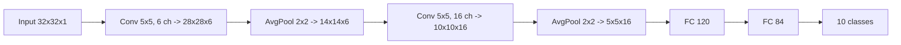
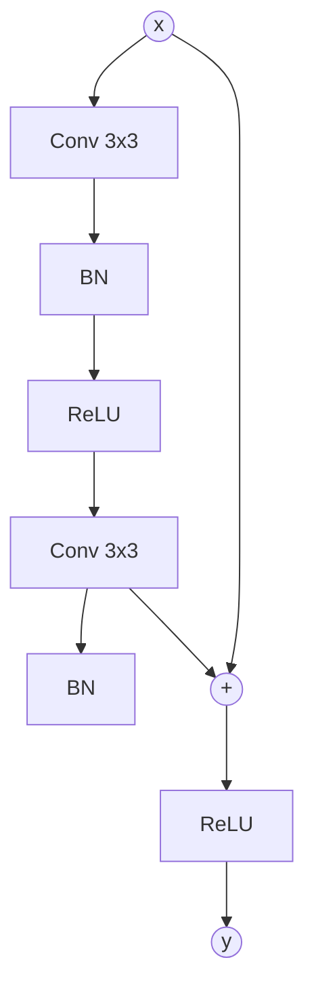

CNN 用「局部连接 + 权值共享」替代全连接,大幅减少参数并引入空间归纳偏置(平移等变);残差连接让训练 50/101/152 层网络成为常态——今天所有计算机视觉应用的底层引擎。

---

## 1. 卷积:局部连接 + 权值共享

### 1.1 直观:手电筒扫图

把一张 32×32 图像想成一间屋子,3×3 卷积核是一盏手电筒——每扫一处就把「这一小块长什么样」算出来,得到一张 30×30 的特征图;32 个不同手电筒 = 32 张特征图堆叠。

### 1.2 二维卷积数学

```math
Y[i, j] = \sum_{u=0}^{k_h-1} \sum_{v=0}^{k_w-1} W[u, v] \cdot X[i+u, j+v] + b
```

`W` 是 `k_h × k_w` 的可学习核,`b` 是偏置。输出尺寸:

```math
H_{\text{out}} = \frac{H_{\text{in}} + 2p - k_h}{s} + 1
```

- `p` = padding(常用 p=(k-1)/2 保持尺寸)
- `s` = stride(常用 1 或 2)

### 1.3 三种关键属性

| 属性 | 含义 | 常用 |
|:---|:---|:---|
| 卷积核大小 `k` | 视野大小 | 3×3(主流)、5×5、7×7 |
| 步长 `s` | 滑动步幅 | 1(细粒度)、2(下采样) |
| 填充 `p` | 边界补零 | 0(Valid)、k/2(Same) |

### 1.4 通道维

输入 `(C_in, H, W)` × 卷积核 `(C_out, C_in, k, k)` → 输出 `(C_out, H', W')`。

每个输出通道 = 一个独立「手电筒」,对应一种特征(边缘 / 角点 / 色块)。

### 1.5 为什么小核堆叠而非大核

3 个 3×3 串联 = 1 个 7×7 的感受野,但参数更少、非线性更多:

| 结构 | 感受野 | 参数 | 表达力 |
|:---|:---|:---|:---|
| 1 个 7×7 | 7×7 | 49 C² | 1 层非线性 |
| 3 个 3×3 | 7×7 | 27 C² | 3 层非线性 |

Simonyan & Zisserman 2014 (VGG) 的关键发现:小核深堆叠优于大核单层。

### 1.6 1×1 卷积

不改变空间维度,只混合通道信息:

```math
Y[:, :, i, j] = W \cdot X[:, :, i, j] + b
```

三种用途:
1. **降维 / 升维**:GoogLeNet 用来压缩通道
2. **加非线性**:在通道方向加一层 MLP
3. **跨通道信息融合**:ResNet 瓶颈块的核心

---

## 2. 池化:降采样 + 平移鲁棒性

### 2.1 Max Pooling

```math
Y[i, j] = \max_{u, v \in \text{window}} X[i \cdot s + u, j \cdot s + v]
```

取窗口内最大值,无参数。

### 2.2 Average Pooling

```math
Y[i, j] = \frac{1}{|\text{window}|} \sum X
```

取平均。最大池化保留「最显著响应」,平均池化保留「整体趋势」。

### 2.3 池化的两个作用

| 作用 | 机制 |
|:---|:---|
| 降采样 | 减半空间分辨率,降低后续计算 |
| 平移鲁棒性 | 图像小幅度移动,池化输出几乎不变 |

### 2.4 全局平均池化 (GAP)

把整张特征图池化成一个数:`(C, H, W) → (C,)`。

```python
nn.AdaptiveAvgPool2d(1)   # 输出 (B, C, 1, 1)
```

优势:
- 替代全连接层,大幅减少参数
- 不受输入尺寸限制
- ResNet / MobileNet / EfficientNet 都用

### 2.5 现代趋势:用 stride=2 的卷积代替池化

```python
nn.Conv2d(in, out, kernel_size=3, stride=2, padding=1)  # 下采样 + 特征提取
```

比 MaxPool 更现代,因为它带可学习参数。

---

## 3. 经典架构演进

### 3.1 LeNet-5 (1998)



首个实用 CNN,手写数字识别奠基。

### 3.2 AlexNet (2012)

ImageNet 2012 冠军,top-5 错误率 15.3%(第二名 26.2%)——深度学习革命的起点。

关键:ReLU + Dropout + GPU 训练 + 数据增强 + 局部响应归一化(LRN)。

### 3.3 VGG (2014)

全部 3×3 卷积 + 2×2 池化,极简风格:VGG-16 / VGG-19。证明「深 + 小核」效果优于「浅 + 大核」。

### 3.4 GoogLeNet / Inception (2014)

并行多个不同尺度卷积(1×1, 3×3, 5×5, pool),Concat 起来。引入 1×1 卷积降维,22 层只有 5M 参数(远少于 VGG 的 138M)。

### 3.5 ResNet (2015) — 深度学习里程碑

ILSVRC 2015 冠军,top-5 错误率 3.57%(首次低于人类水平 5.1%)。ResNet-152 比 VGG-19 深 8 倍但复杂度更低。

**核心创新:残差连接**

```math
y = F(x, \{W_i\}) + x
```

```math
F = W_2 \sigma(W_1 x)
```



每个残差块学「输入到输出的残差」而不是「完整变换」。退化(degradation)问题的解药:即使 `F=0`,`y=x` 也能保留输入,网络至少不退化。

### 3.6 ResNet 变体

| 块 | 结构 | 适用 |
|:---|:---|:---|
| BasicBlock | `3×3 → 3×3` | ResNet-18 / 34 |
| Bottleneck | `1×1 → 3×3 → 1×1` | ResNet-50 / 101 / 152(降维提速) |

Bottleneck 通过 1×1 降维→3×3 卷积→1×1 升维,把计算量压到原来的 1/4。

### 3.7 后续里程碑

| 网络 | 年份 | 创新点 |
|:---|:---|:---|
| DenseNet | 2016 | 密集连接,每层接所有前面层 |
| MobileNet | 2017 | 深度可分离卷积,移动端 |
| EfficientNet | 2019 | 复合缩放 width/depth/resolution |
| ViT | 2020 | Transformer 替代卷积 |
| ConvNeXt | 2022 | 「现代化」的 CNN,反扑 ViT |

---

## 4. PyTorch 实战

### 4.1 从零实现 LeNet-5 跑 MNIST

```python
import torch
import torch.nn as nn
import torch.nn.functional as F
from torchvision import datasets, transforms
from torch.utils.data import DataLoader

torch.manual_seed(42)
device = torch.device('cuda' if torch.cuda.is_available() else 'cpu')

transform = transforms.Compose([
    transforms.ToTensor(),
    transforms.Normalize((0.1307,), (0.3081,)),
])
train_loader = DataLoader(datasets.MNIST('data', train=True, download=True, transform=transform),
                          batch_size=64, shuffle=True)
test_loader  = DataLoader(datasets.MNIST('data', train=False, transform=transform),
                          batch_size=256)

class LeNet5(nn.Module):
    def __init__(self):
        super().__init__()
        self.conv1 = nn.Conv2d(1, 6, kernel_size=5)
        self.conv2 = nn.Conv2d(6, 16, kernel_size=5)
        self.fc1 = nn.Linear(16 * 4 * 4, 120)
        self.fc2 = nn.Linear(120, 84)
        self.fc3 = nn.Linear(84, 10)

    def forward(self, x):
        x = F.max_pool2d(F.relu(self.conv1(x)), 2)
        x = F.max_pool2d(F.relu(self.conv2(x)), 2)
        x = x.view(x.size(0), -1)
        x = F.relu(self.fc1(x))
        x = F.relu(self.fc2(x))
        return self.fc3(x)

model = LeNet5().to(device)
opt = torch.optim.Adam(model.parameters(), lr=1e-3)

for epoch in range(3):
    model.train()
    for x, y in train_loader:
        x, y = x.to(device), y.to(device)
        opt.zero_grad()
        loss = F.cross_entropy(model(x), y)
        loss.backward()
        opt.step()

# 评估
model.eval()
correct = 0
with torch.no_grad():
    for x, y in test_loader:
        x, y = x.to(device), y.to(device)
        correct += (model(x).argmax(1) == y).sum().item()
print(f"LeNet-5 test acc: {correct / 10000:.4f}")
```

预期输出:`test acc ≈ 0.98`(3 epoch)。

### 4.2 torchvision 直接调用 ResNet-18 跑 CIFAR-10

```python
import torchvision
import torchvision.transforms as T

transform_train = T.Compose([
    T.RandomCrop(32, padding=4),
    T.RandomHorizontalFlip(),
    T.ToTensor(),
    T.Normalize((0.4914, 0.4822, 0.4465), (0.2470, 0.2435, 0.2616)),
])
transform_test = T.Compose([
    T.ToTensor(),
    T.Normalize((0.4914, 0.4822, 0.4465), (0.2470, 0.2435, 0.2616)),
])

train_set = torchvision.datasets.CIFAR10('data', train=True, download=True, transform=transform_train)
test_set  = torchvision.datasets.CIFAR10('data', train=False, transform=transform_test)
train_loader = DataLoader(train_set, batch_size=128, shuffle=True, num_workers=2)
test_loader  = DataLoader(test_set, batch_size=256)

# 改 head:CIFAR-10 是 10 类,ImageNet 是 1000
model = torchvision.models.resnet18(weights=None)
model.fc = nn.Linear(model.fc.in_features, 10)
model = model.to(device)

opt = torch.optim.AdamW(model.parameters(), lr=1e-3, weight_decay=5e-4)
sched = torch.optim.lr_scheduler.CosineAnnealingLR(opt, T_max=20)

for epoch in range(20):
    model.train()
    for x, y in train_loader:
        x, y = x.to(device), y.to(device)
        opt.zero_grad()
        loss = F.cross_entropy(model(x), y)
        loss.backward()
        opt.step()
    sched.step()
```

预期 20 epoch 训练后 CIFAR-10 test acc ≈ 92~94%。

### 4.3 迁移学习:冻结 backbone + 微调 FC

```python
# ImageNet 预训练 → 自有数据
model = torchvision.models.resnet18(weights=torchvision.models.ResNet18_Weights.IMAGENET1K_V1)

# 冻结 backbone
for p in model.parameters():
    p.requires_grad = False

# 替换最后分类头
model.fc = nn.Linear(model.fc.in_features, 5)  # 假设 5 类
model = model.to(device)

# 只训练 fc 层
opt = torch.optim.Adam(model.fc.parameters(), lr=1e-3)

# 训练 → 见 fine-tune 提升 ≥10 个百分点(数据 < 1000 时尤其明显)
```

迁移学习是「小数据 + 强模型」的最佳实践,ImageNet 预训练包含大量通用视觉特征,微调即可在新任务上达到 SOTA。

### 4.4 特征图可视化

```python
import matplotlib.pyplot as plt

def show_filters(model):
    W = model.conv1.weight.detach().cpu()  # (out_ch, in_ch, k, k)
    n = min(W.shape[0], 16)
    fig, axes = plt.subplots(2, 8, figsize=(12, 3))
    for i, ax in enumerate(axes.flat):
        if i < n:
            ax.imshow(W[i, 0], cmap='gray')
        ax.axis('off')
    plt.show()

show_filters(model)
```

第一层卷积核可视化通常能看到边缘 / 颜色 / 频率检测器。

---

## 5. CNN vs MLP vs Transformer

| 维度 | MLP | CNN | ViT |
|:---|:---|:---|:---|
| 归纳偏置 | 极少 | 局部 + 平移等变 | 极少(数据够可学到) |
| 数据需求 | 中 | 中 | 大 |
| 图像性能(中小数据) | 差 | 强 | 中 |
| 图像性能(大数据) | 差 | 强 | 极强 |
| 可解释性 | 低 | 中(可视化核) | 低(注意力图) |
| 训练速度 | 快 | 中 | 慢 |
| 部署难度 | 低 | 低 | 中 |
| 当前主流 | 简单任务 | 通用 | 大数据 / 多模态 |

**经验**:中小数据 + 视觉任务,CNN(ResNet / EfficientNet)仍是首选;数据 > 100M 时 ViT 胜出;CNN + Transformer 混合架构(Hybrid)也常见。

---

## 6. 常见坑

### 6.1 Conv 输入维度对不上
**症状**:`RuntimeError: Expected 4D input (got 3D)`
**原因**:Conv2d 需要 `(B, C, H, W)`,直接喂 `(B, H, W)` 报错
**修法**:用 `x.unsqueeze(1)` 加通道维;或 `transforms.Grayscale(1)`

### 6.2 用了 sigmoid 输出做多分类
**症状**:概率和 ≠ 1,语义错
**修法**:多分类输出层不加激活,配合 `nn.CrossEntropyLoss`(内部含 log_softmax)

### 6.3 MaxPool 步长忘了设,输出尺寸对不上 FC
**症状**:`RuntimeError: mat1 and mat2 shapes cannot be multiplied`
**修法**:forward 里 `print(x.shape)` 调试,或者用 `nn.AdaptiveAvgPool2d((1, 1))` + `view(-1)`

### 6.4 ResNet 残差块维度对不上(维度变化处)
**症状**:RuntimeError: sizes mismatch
**原因**:当输入输出通道数或尺寸不一致时,`y = F(x) + x` 直接相加失败
**修法**:`downsample = nn.Conv2d(in_ch, out_ch, 1, stride=2)` 把 x 投影到正确形状

### 6.5 BatchNorm 训 / 推模式混用
**症状**:训练好但预测效果差
**修法**:必加 `model.train() / model.eval()`;BN 用 running 统计推理

### 6.6 数据忘了归一化
**症状**:loss 难收敛
**修法**:用 `transforms.Normalize(mean, std)`,mean/std 取训练集统计

### 6.7 不用数据增强,小数据上严重过拟合
**症状**:train 99% test 60%
**修法**:`RandomCrop / HorizontalFlip / ColorJitter / Cutout / Mixup`,至少 RandomCrop + Flip

### 6.8 学习率没衰减
**症状**:train loss 还在降但 val loss 平台
**修法**:`CosineAnnealingLR` / `StepLR` / `ReduceLROnPlateau`,最后一两轮衰减 10~100 倍

### 6.9 预训练模型 fc 忘了替换
**症状**:1000 类输出层,自有数据只有 5 类,loss 立刻报错
**修法**:`model.fc = nn.Linear(model.fc.in_features, num_classes)`

### 6.10 小数据用 ImageNet 预训练的 BatchNorm
**症状**:微调不稳定,val loss 抖动
**修法**:冻结 BN(`for p in model.bn.parameters(): p.requires_grad=False`),或 `model.eval()` 模式下微调

---

## 7. 自检三问

**A. 为什么卷积层用小核(3×3)堆叠而不是一个大核(7×7)?从参数数、感受野、表达能力三个角度答。**

要点:① 参数:3 个 3×3 = 27 C²,1 个 7×7 = 49 C²,小核省 45% 参数;② 感受野:3 层 3×3 = 7×7 的等效视野;③ 表达能力:3 层非线性 vs 1 层非线性,等效深度更深、表达力更强。这就是 VGG 的核心发现。详见 §1.5。

**B. ResNet 残差块里,如果把 ReLU 去掉或者把 addition 换成 concatenation,会发生什么?**

要点:① 去掉 ReLU:F 变成纯线性变换,残差块退化为线性叠加,等价于 1 个大卷积,失去非线性;② addition → concatenation:通道数累加,维度爆炸,且残差「加性」语义被破坏,深层网络退化为宽度爆炸。ResNet 设计中两者都不可换。详见 §3.5。

**C. 在 CIFAR-10 上训练 ResNet-18,学习率过大 / batch 太小 / 不做数据增强 各会导致什么现象?怎么从 loss 曲线诊断?**

要点:① LR 过大:loss 在前几步震荡 / NaN,曲线像过山车;② batch 太小:train loss 抖动剧烈,val loss 不稳定,泛化差;③ 无数据增强:train 接近 0,val 平台 70%,两曲线 gap 大 = 过拟合。诊断:画 train / val loss 同图,看曲线形态 + gap。详见 §6.7-6.8。

---

## 8. 推荐资源

### 视频
- **3Blue1Brown《Convolutions》** —— 卷积几何直觉
- **StatQuest《CNN》合集** —— 图解
- **李沐《动手学深度学习》CNN 章节** —— 中文实战
- **CS231n(Stanford)Convolutional Networks 章节** —— 经典课程

### 教科书
- **《动手学深度学习》(D2L)》第 6 章 —— LeNet / AlexNet / VGG / NiN / GoogLeNet / ResNet / DenseNet 全家桶
- **《Deep Learning》(Goodfellow)** 第 9 章 —— 卷积网络
- **《Hands-On CNN with TensorFlow》**

### 论文
- **LeCun 1998《Gradient-Based Learning Applied to Document Recognition》** —— LeNet-5
- **Krizhevsky 2012《ImageNet Classification with Deep CNN》** —— AlexNet,深度学习革命
- **Simonyan & Zisserman 2014《Very Deep CNN for Large-Scale Image Recognition》** —— VGG
- **Szegedy 2015《Going Deeper with Convolutions》** —— GoogLeNet
- **He et al. 2016《Deep Residual Learning for Image Recognition》** —— ResNet,50 层起步
- **He et al. 2016《Identity Mappings in Deep Residual Networks》** —— ResNet v2
- **Huang 2017《Densely Connected Convolutional Networks》** —— DenseNet
- **Howard 2017《MobileNets》** —— 移动端 CNN
- **Tan & Le 2019《EfficientNet》** —— 复合缩放

### 博客 / 课程
- **Distill.pub《Feature Visualization》** —— CNN 学到了什么
- **PyTorch 官方 torchvision tutorial** —— 完整图像分类
- **《A Comprehensive Introduction to Different Types of Convolutions》** —— 各种卷积变体
- **ConvNetJS demo** —— 浏览器里跑 CNN

### 代码
- **torchvision.models** —— ResNet / VGG / DenseNet / EfficientNet 预训练权重
- **timm** —— Ross Wightman 的 SOTA 模型库
- **pytorch-image-models** —— 同上,论文复现首选
- **Detectron2** —— Facebook 检测 + 分割框架
- **mmdetection / mmsegmentation** —— OpenMMLab 全家桶

---

## 9. 本节要点

- **卷积** = 可学习的小核在输入上滑动,逐位置点积;权重共享大幅减少参数,引入平移等变偏置;3 个 3×3 = 1 个 7×7 的感受野但更省参数、更多非线性。
- **池化** = 无参数降采样,MaxPool 保留最显著响应,AveragePool 保留整体趋势;现代趋势用 stride=2 卷积代替;GAP 替代 FC 减少参数。
- **ResNet** = `y = F(x) + x` 残差连接,让深层网络至少能学恒等映射,解决退化问题;BasicBlock 用于浅层,Bottleneck 用于深层;ImageNet 2015 首次超越人类。
- **演进**:LeNet(1998) → AlexNet(2012,ReLU+Dropout)→ VGG(2014,小核堆叠)→ GoogLeNet(2014,Inception)→ ResNet(2015,残差)→ MobileNet(2017,轻量)→ EfficientNet(2019,复合缩放)→ ViT(2020,Transformer 替代)。
- **训练技巧**:数据增强必备(RandomCrop + Flip);学习率调度(CosineAnnealing);BN 必须 train/eval 切换;预训练 + 微调是小数据最佳实践。
- **vs MLP**:CNN 适合图像,MLP 在图像上参数爆炸且无平移不变性;vs ViT:中小数据 CNN 强,大数据 ViT 胜。

---

## 10. 下一节:Day 18 · RNN 与 LSTM

主题:RNN / LSTM / GRU 序列建模。覆盖:
- 朴素 RNN 的梯度消失 / 爆炸问题,‖W_h‖^T 指数衰减导致长依赖学不到
- LSTM 三门 + cell state:遗忘门 f_t + 输入门 i_t + 输出门 o_t + 传送带 C_t
- GRU 双门:重置门 r_t + 更新门 z_t,参数量比 LSTM 少约 33%
- 序列建模四大任务:语言模型 / 翻译 / 语音 / NER
- PyTorch 实战:`nn.LSTM` 在 IMDB 情感分类上 ≥85%,变长序列用 `pack_padded_sequence`

产出物:`nn.LSTM` 在 IMDB 上跑通情感分类;GRU 对比 loss 收敛;合成「复制首字到末位」T=50 任务对比 vanilla RNN / LSTM / GRU。

---

**作者**:林馨予 + 林晓月
**最后更新**:2026-07-04
**版权**:CC BY-NC-SA 4.0