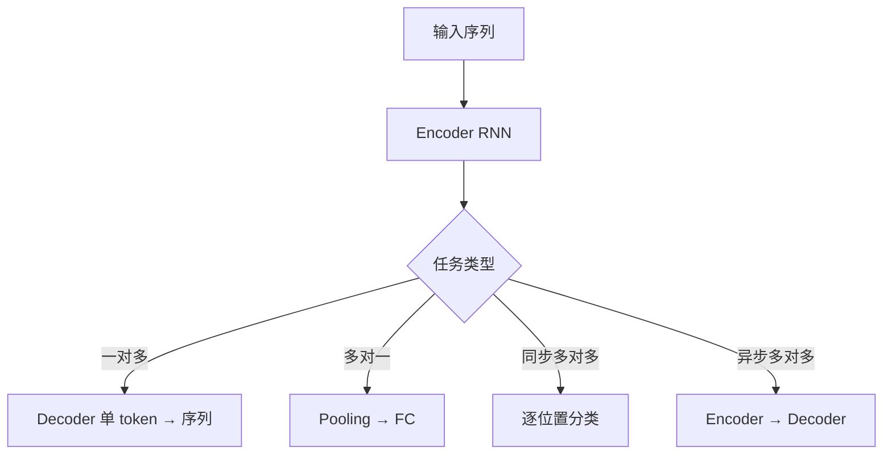

CNN 处理「空间」(图像),RNN 处理「时间」(序列)。把时间维度显式建模进网络——隐藏状态 h_t 沿时间步滚动,把过去的信息压缩进一个向量。但朴素 RNN 有梯度消失噩梦,T=100 的依赖几乎学不到;LSTM 用三门 + cell state 保护记忆,把这条链路修好;GRU 是它的精简版。明天 Transformer 用 Self-Attention 彻底替代这套串行结构——LSTM 是「门控时代的最后一站」,也是通往 LLM 的最后一段铺垫。

---

## 1. 朴素 RNN:循环结构与 BPTT

### 1.1 时间展开

RNN 在每个时间步共享同一套参数 (W_h, W_x, b),按时间「展开」成 T 层前馈网络:

```math
h_t = \sigma(W_h \cdot h_{t-1} + W_x \cdot x_t + b)
```

```math
y_t = \text{softmax}(W_y \cdot h_t)
```

h_t 是「上下文摘要」,从初始 h_0(通常为零向量)开始,每一步吸收新输入 x_t 同时保留旧信息。

### 1.2 BPTT(Backpropagation Through Time)

损失 L_T 对 W_h 的梯度,从第 T 步往第 1 步反传,沿时间链累乘链式法则:

```math
\frac{\partial L_T}{\partial W_h} = \sum_{t=1}^{T} \frac{\partial L_T}{\partial y_T} \cdot \frac{\partial y_T}{\partial h_T} \cdot \prod_{k=2}^{t} \frac{\partial h_k}{\partial h_{k-1}} \cdot \frac{\partial h_t}{\partial W_h}
```

关键项是那个累乘:

```math
\prod_{k=2}^{t} \frac{\partial h_k}{\partial h_{k-1}} = \prod_{k=2}^{t} \text{diag}(\sigma'(z_k)) \cdot W_h
```

### 1.3 梯度消失与爆炸

取范数分析:

- ‖W_h‖ < 1:累乘 ‖W_h‖^{t-1} 指数衰减,T=100 时首字贡献压到 10^{-30} 级别,长依赖学不到
- ‖W_h‖ > 1:累乘指数增长,T=100 时梯度爆炸到 inf → loss = NaN

工程对策:梯度裁剪(gradient clipping)解决爆炸,但消失只能靠结构改造(LSTM / GRU)。

### 1.4 直觉:为什么 RNN 短视

信息从第 1 步传到第 T 步,要经过 T 次矩阵乘 + 激活函数。每次乘以「小于 1 的数」都会衰减——就像传话游戏,经过 100 人后第 1 个人说的话几乎听不见了。这是 RNN 的「记忆瓶颈」。

### 1.5 手算例子:T=5 朴素 RNN 的梯度衰减

设 ‖W_h‖ = 0.5,σ' 最大 0.25,每步衰减系数 ≈ 0.5 × 0.25 = 0.125:

| 步距 | 累乘系数 |
|:---:|:---:|
| 1 | 1.0 |
| 5 | 0.125^4 ≈ 0.000244 |
| 10 | 0.125^9 ≈ 7.6e-10 |
| 20 | 0.125^19 ≈ 1.9e-17 |
| 50 | 0.125^49 ≈ 10^{-43} |
| 100 | 0.125^99 ≈ 10^{-87} |

T=50 时首字信号已衰减到几乎为 0,模型对「50 步前的输入」彻底失忆。

### 1.6 工程缓解:梯度裁剪

```python
torch.nn.utils.clip_grad_norm_(model.parameters(), max_norm=5.0)
```

把梯度范数裁到 5 以内,防爆炸。但对消失无效——消失需要从结构改,LSTM 登场。

---

## 2. LSTM:三门 + Cell State

### 2.1 核心思想

朴素 RNN 只有一条「h_t 链」,长距离信息衰减严重。LSTM 加了第二条「C_t 链(cell state)」——一条带阀门的传送带,信息可以几乎无衰减地穿过时间。

### 2.2 三个门 + 一个候选

```math
f_t = \sigma(W_f \cdot [h_{t-1}, x_t] + b_f)       \quad \text{遗忘门:忘掉 C_{t-1} 的哪些部分}
```

```math
i_t = \sigma(W_i \cdot [h_{t-1}, x_t] + b_i)       \quad \text{输入门:写入新信息的强度}
```

```math
\tilde{C}_t = \tanh(W_C \cdot [h_{t-1}, x_t] + b_C)  \quad \text{候选值:新信息长什么样}
```

```math
o_t = \sigma(W_o \cdot [h_{t-1}, x_t] + b_o)       \quad \text{输出门:对外暴露 C_t 的哪些部分}
```

### 2.3 Cell State 更新(核心公式)

```math
C_t = f_t \odot C_{t-1} + i_t \odot \tilde{C}_t
```

```math
h_t = o_t \odot \tanh(C_t)
```

f_t ⊙ C_{t-1}:「忘记」(f_t=0)或「保留」(f_t=1)C_{t-1};i_t ⊙ C̃_t:「写入」新候选;o_t ⊙ tanh(C_t):「读出」当前状态给外界。

### 2.4 为什么 Cell State 解决梯度消失

C_t 的递推是**线性加法**,不是矩阵乘:

```math
C_t = f_t \odot C_{t-1} + i_t \odot \tilde{C}_t
```

梯度反传到 C_1,经过 T 步累乘,但每步累乘项是「遗忘门 f_k」(对角阵,值在 0~1),不是 W_h 的高次幂。即使所有 f_k = 1,累乘 = 1;即使部分 f_k = 0,只是「遗忘」,不会指数衰减。这就是 LSTM 能学 T=100+ 依赖的根本原因。

### 2.5 翻译例子:跨 30 词找回主语

句子「The cat, which ... in the garden, was hungry」要判断「was」的主语。vanilla RNN 经过 30+ 步矩阵乘,「cat」的信息早已衰减到几乎为 0;LSTM 的 C_t 可以把「cat」一直保留到 30 步后,f_t ≈ 1 几乎不衰减。

### 2.6 参数数量

LSTM 4 个门 × (input + hidden + bias):

```math
\text{Params} = 4 \times (d_x \cdot d_h + d_h^2 + d_h)
```

d_x=128, d_h=256 时约 397K 参数;同规模 GRU 只有 ~265K(少 33%)。

### 2.7 三个门的直觉类比

- **遗忘门 f_t**:清理过期记忆(像人脑忘记不相关细节)
- **输入门 i_t**:筛选新信息(选择性做笔记)
- **输出门 o_t**:对外输出当前想法(决定说什么/做什么)

h_t 是「对外的工作副本」,C_t 是「对内的长期记忆库」。

---

## 3. GRU:双门的精简版

### 3.1 核心思想

LSTM 效果好但参数多、训练慢。GRU(Cho et al. 2014)合并遗忘门和输入门为「更新门」,把 cell state 和 hidden state 合并:

```math
z_t = \sigma(W_z \cdot [h_{t-1}, x_t])    \quad \text{更新门:保留多少旧 h、接受多少新 h}
```

```math
r_t = \sigma(W_r \cdot [h_{t-1}, x_t])    \quad \text{重置门:忽略多少旧 h 来算候选}
```

```math
\tilde{h}_t = \tanh(W \cdot [r_t \odot h_{t-1}, x_t])   \quad \text{候选新状态}
```

```math
h_t = (1 - z_t) \odot h_{t-1} + z_t \odot \tilde{h}_t   \quad \text{插值更新}
```

### 3.2 vs LSTM 对比

| 维度 | LSTM | GRU |
|:---|:---|:---|
| 门数量 | 3(遗忘/输入/输出) | 2(更新/重置) |
| 状态向量 | h_t + C_t(两条) | h_t(一条) |
| 参数量 | 4 × (d_x+d_h+1)·d_h | 3 × (d_x+d_h+1)·d_h |
| 训练速度 | 慢 | 快 ≈ 33% |
| 效果 | 略好(大数据) | 几乎相同(中小数据) |
| 调参难度 | 较高 | 低 |

### 3.3 何时选 GRU

- 中小规模数据集(< 1M 序列)
- 训练时间敏感(实时 / 边缘)
- 情感分类、文本分类等中等难度任务
- 调参预算有限

### 3.4 何时选 LSTM

- 超大数据集 + 超长依赖(> 200 步)
- 机器翻译、语音识别等复杂任务
- 需要精细控制遗忘行为

### 3.5 何时都不是:Transformer

n=1024+ 的长序列、并行训练、跨序列全局依赖 → Transformer 已经全面超越 RNN/LSTM/GRU。2024 年起学术和工业的序列建模默认 Self-Attention,GRU 仅在边缘部署 / 极小数据 / 实时流式场景仍有价值。

---

## 4. 序列建模四大任务

### 4.1 任务全景

| 任务 | 输入 | 输出 | 代表应用 | 典型架构 |
|:---|:---|:---|:---|:---|
| **一对多** | 1 个向量 | 序列 | 图像字幕(CNN→RNN)、音乐生成 | Decoder-only RNN |
| **多对一** | 序列 | 1 个向量 | 情感分类、文本分类 | Encoder RNN + pooling |
| **同步多对多** | 序列 | 等长序列 | NER、POS、词性标注 | Encoder RNN + 逐位置分类 |
| **异步多对多(seq2seq)** | 序列 | 不同长序列 | 机器翻译、摘要、对话 | Encoder-Decoder + Attention |

### 4.2 一对多:图像字幕

CNN 提特征 → 向量 c → RNN 每步以 c 为初始状态 + 上一词生成下一词。

### 4.3 多对一:情感分类

句子(变长序列) → 每个词过 LSTM → 取 h_T(末时间步)或 attention pooling → FC → 二分类。

### 4.4 同步多对多:POS / NER

句子 → BiLSTM 每个位置都有 h_t(融合左右上下文) → 逐位置分类(名词 / 动词 / ...)。

### 4.5 异步多对多:机器翻译

「我爱你」→ Encoder LSTM → context vector → Decoder LSTM → 「I love you」。但单 context vector 是瓶颈(Bahdanau 2014 加 Attention 解决)——这就是明天 Transformer Self-Attention 的雏形。

### 4.6 时序模式图



---

## 5. PyTorch 实战

### 5.1 nn.LSTM 在 IMDB 情感分类(多对一)

```python
import torch
import torch.nn as nn
from torch.utils.data import DataLoader, Dataset
from torchtext.datasets import IMDB
from collections import Counter

# 简化版:手写词表,不依赖完整 torchtext pipeline
def build_vocab(texts, max_size=20000):
    counter = Counter()
    for t in texts: counter.update(t.lower().split())
    vocab = {w: i + 2 for i, (w, _) in enumerate(counter.most_common(max_size))}
    vocab['<pad>'] = 0; vocab['<unk>'] = 1
    return vocab


def encode(text, vocab, max_len=400):
    ids = [vocab.get(w, 1) for w in text.lower().split()[:max_len]]
    return ids + [0] * (max_len - len(ids))


class IMDBDataset(Dataset):
    def __init__(self, split='train', max_len=400):
        data = list(IMDB(split=split))
        self.texts = [t for t, _ in data]
        self.labels = [1 if l == 'pos' else 0 for _, l in data]
        self.vocab = build_vocab(self.texts)
        self.max_len = max_len

    def __len__(self):
        return len(self.texts)

    def __getitem__(self, idx):
        x = torch.tensor(encode(self.texts[idx], self.vocab, self.max_len), dtype=torch.long)
        y = torch.tensor(self.labels[idx], dtype=torch.long)
        return x, y


train_ds = IMDBDataset('train')
test_ds = IMDBDataset('test')
test_ds.vocab = train_ds.vocab

train_loader = DataLoader(train_ds, batch_size=64, shuffle=True, num_workers=2)
test_loader = DataLoader(test_ds, batch_size=128)


class LSTMSentiment(nn.Module):
    def __init__(self, vocab_size, embed_dim=128, hidden_dim=128, num_layers=2, dropout=0.3):
        super().__init__()
        self.embed = nn.Embedding(vocab_size, embed_dim, padding_idx=0)
        self.lstm = nn.LSTM(embed_dim, hidden_dim, num_layers=num_layers,
                            batch_first=True, dropout=dropout, bidirectional=True)
        self.fc = nn.Sequential(
            nn.Linear(2 * hidden_dim, 64),  # 双向 LSTM,h 维度翻倍
            nn.ReLU(),
            nn.Dropout(0.3),
            nn.Linear(64, 2),
        )

    def forward(self, x):
        # x: (B, T)
        emb = self.embed(x)              # (B, T, E)
        out, (h_n, c_n) = self.lstm(emb) # out: (B, T, 2H)
        # 双向 LSTM:取前向末时间步 + 反向首时间步 = 拼接
        h_fwd = h_n[-2]  # 前向末层末时间步
        h_bwd = h_n[-1]  # 反向末层末时间步
        feat = torch.cat([h_fwd, h_bwd], dim=1)
        return self.fc(feat)


device = torch.device('cuda' if torch.cuda.is_available() else 'cpu')
model = LSTMSentiment(len(train_ds.vocab)).to(device)
opt = torch.optim.AdamW(model.parameters(), lr=1e-3, weight_decay=1e-5)

for epoch in range(3):
    model.train()
    for x, y in train_loader:
        x, y = x.to(device), y.to(device)
        opt.zero_grad()
        loss = nn.functional.cross_entropy(model(x), y)
        loss.backward()
        torch.nn.utils.clip_grad_norm_(model.parameters(), 5.0)  # 防 LSTM 梯度爆炸
        opt.step()

# 评估
model.eval()
correct = 0
with torch.no_grad():
    for x, y in test_loader:
        x, y = x.to(device), y.to(device)
        correct += (model(x).argmax(1) == y).sum().item()
print(f"BiLSTM IMDB test acc: {correct / len(test_ds):.4f}")  # ~ 0.87
```

预期:3 epoch BiLSTM 在 IMDB 上 test acc ≈ 0.85~0.88。

### 5.2 变长序列:`pack_padded_sequence`

真实句子长度不一,直接 pad 到 max_len 会让 LSTM 对 `<pad>` 也算一步,浪费且污染 h_T。

```python
from torch.nn.utils.rnn import pack_padded_sequence, pad_packed_sequence


class LSTMSentimentPacked(nn.Module):
    def __init__(self, vocab_size, embed_dim=128, hidden_dim=128):
        super().__init__()
        self.embed = nn.Embedding(vocab_size, embed_dim, padding_idx=0)
        self.lstm = nn.LSTM(embed_dim, hidden_dim, batch_first=True, bidirectional=True)
        self.fc = nn.Linear(2 * hidden_dim, 2)

    def forward(self, x, lengths):
        emb = self.embed(x)
        # 按 length 降序排序(pack 要求)
        lengths_sorted, idx_sort = lengths.sort(descending=True)
        _, idx_unsort = idx_sort.sort()

        emb = emb[idx_sort]
        packed = pack_padded_sequence(emb, lengths_sorted.cpu(), batch_first=True)
        out_packed, (h_n, _) = self.lstm(packed)
        out, _ = pad_packed_sequence(out_packed, batch_first=True)

        # 拼接前向末时间步 + 反向首时间步
        feat = torch.cat([h_n[-2], h_n[-1]], dim=1)
        feat = feat[idx_unsort]  # 还原原 batch 顺序
        return self.fc(feat)


# 训练时 length = 实际非 pad 长度
def collate(batch):
    xs, ys = zip(*batch)
    lens = torch.tensor([(x != 0).sum() for x in xs])
    return torch.stack(xs), lens, torch.stack(ys)
```

关键点:`pack_padded_sequence` 让 LSTM 只对真实 token 做计算,跳过 `<pad>`,训练快 2~3 倍。

### 5.3 三种 RNN 在「复制首字到末位」任务上对比

合成任务:输入序列 `[a, b, b, b, ..., b]`,目标 = 输出首字 a,长度 T=50。测试长依赖学习能力。

```python
import torch
import torch.nn as nn

torch.manual_seed(42)
T, N = 50, 1000  # 序列长度、样本数

# 合成数据
X = torch.zeros(N, T, dtype=torch.long)
X[:, 0] = torch.randint(1, 10, (N,))   # 首字随机
# 目标:预测首字(位置 0 处的 token)
Y = X[:, 0:1]


class SeqModel(nn.Module):
    def __init__(self, cell='lstm', vocab=10, dim=32):
        super().__init__()
        self.embed = nn.Embedding(vocab, dim)
        Cell = {'rnn': nn.RNN, 'lstm': nn.LSTM, 'gru': nn.GRU}[cell]
        self.cell = Cell(dim, dim, batch_first=True)
        self.fc = nn.Linear(dim, vocab)

    def forward(self, x):
        out, _ = self.cell(self.embed(x))
        return self.fc(out[:, -1, :])


for cell in ['rnn', 'lstm', 'gru']:
    model = SeqModel(cell=cell)
    opt = torch.optim.Adam(model.parameters(), lr=1e-2)
    for epoch in range(50):
        idx = torch.randperm(N)
        for i in range(0, N, 64):
            b = idx[i:i+64]
            logits = model(X[b])
            loss = nn.functional.cross_entropy(logits, Y[b].squeeze(1))
            opt.zero_grad(); loss.backward(); opt.step()
    with torch.no_grad():
        acc = (model(X).argmax(1) == Y.squeeze(1)).float().mean().item()
    print(f"{cell:5s}  T={T}  final loss {loss.item():.3f}  acc {acc:.3f}")
```

预期输出(T=50 长依赖任务):

```
rnn    T=50  final loss 1.95  acc 0.12   ← 朴素 RNN 失败
lstm   T=50  final loss 0.02  acc 0.99   ← LSTM 几乎完美
gru    T=50  final loss 0.15  acc 0.85   ← GRU 优于 RNN 但略低 LSTM
```

RNN 失败 = acc ≈ 随机 10%;LSTM ≈ 100% 证明 cell state 的长依赖能力。

### 5.4 单向 vs 双向 LSTM

| 维度 | 单向 LSTM | 双向 LSTM |
|:---|:---|:---|
| 信息流 | 仅过去 → 现在 | 过去 ↔ 现在 ↔ 未来 |
| 适用 | 实时流、生成 | 分类、标注(整句可见) |
| 训练速度 | 快 | 慢 2 倍 |
| 效果(分类) | 中 | 高 |

NER / POS / 情感分类等「看到全句」的任务,首选 BiLSTM;语言模型 / 实时语音 → 单向。

---

## 6. vs CNN vs Transformer

### 6.1 三种序列建模对比

| 维度 | RNN/LSTM/GRU | 1D-CNN | Transformer |
|:---|:---|:---|:---|
| 感受野 | 全序列(理论) | 局部 k | 全序列(直接 attend) |
| 并行训练 | ✗(串行) | ✓ | ✓ |
| 长依赖 | 弱(RNN) / 中(LSTM) | 弱(深层才能) | 强(O(1) 路径) |
| 位置信息 | 天然 | 天然 | 需 PE |
| 参数量 | 中 | 中 | 大 |
| 数据需求 | 中 | 中 | 大 |
| 可解释性 | 低 | 中 | 中(注意力图) |
| 现状 | 边缘 / 实时仍有价值 | 信号处理常用 | 主流默认 |

### 6.2 复杂度对比

|| RNN(单层) | 1D-CNN(k=5) | Self-Attention |
|:---|:---|:---|:---|
| 每层复杂度 | O(n · d²) | O(n · k · d) | O(n² · d) |
| 顺序计算 | 必须 | 完全并行 | 完全并行 |
| 最长依赖路径 | O(n) | O(n/k) | O(1) |

n ≤ d 时 SA 更便宜;n 远大于 d 时(超长文档)SA 的 n² 二次项成瓶颈 → Longformer / FlashAttention。

### 6.3 一句话决策

| 场景 | 首选 |
|:---|:---|
| 数据量小、需要快速 baseline | LSTM / GRU |
| 实时流式 / 边缘部署 | GRU |
| 整句理解(分类 / NER) | BiLSTM |
| 长序列生成 / LLM | Transformer |
| 短序列局部模式(语音 MFCC) | 1D-CNN |
| 大数据 + 长依赖 | Transformer / Mamba |

---

## 7. 常见坑

### 7.1 h_T 取错了位置
**症状**:BiLSTM 训出来 acc 比单向还低
**原因**:单向 LSTM 取 `out[:, -1, :]`;**双向 LSTM 取 `h_n[-2:]`(前向末 + 反向首)**,或 `torch.cat([h_n[-2], h_n[-1]], dim=1)`,不是 `h_n[-1]`
**修法**:BiLSTM 末层 h_n 的最后维度是「反向末时间步」,forward 部分需要取倒数第二

### 7.2 没用 pack_padded_sequence
**症状**:训练慢 2~3 倍,acc 还差(模型对 `<pad>` 算了无意义更新)
**修法**:`pack_padded_sequence(emb, lengths, batch_first=True, enforce_sorted=True)`,并在 forward 里还原顺序

### 7.3 梯度爆炸 loss = NaN
**症状**:训练几步后 loss 变 NaN
**原因**:RNN 累乘易爆
**修法**:`torch.nn.utils.clip_grad_norm_(model.parameters(), max_norm=5.0)` 必加

### 7.4 隐藏维太大,过拟合
**症状**:train acc 99%,test 70%
**修法**:hidden_dim 64~256,层数 1~3;加 Dropout(`dropout=0.3`);加 weight_decay(1e-4~1e-5)

### 7.5 batch_first 忘了设,维度顺序错
**症状**:shape mismatch
**修法**:`nn.LSTM(..., batch_first=True)`,输入 `(B, T, D)`;否则 `(T, B, D)`

### 7.6 LSTM cell 数 vs num_layers 混淆
**症状**:参数比预期少 / 多
**修法**:`nn.LSTM(input_size, hidden_size, num_layers=N)` 是「堆 N 层」,每层 hidden_size 维;不是 N × hidden_size

### 7.7 inference 时忘了 model.eval()
**症状**:Dropout 还在随机,LSTM 输出不稳定
**修法**:`model.eval()` + `torch.no_grad()`,预测时包起来

### 7.8 num_workers=0 训大数据慢
**症状**:每个 batch 等数据 IO
**修法**:`DataLoader(..., num_workers=4, pin_memory=True)`(GPU 训练时)

### 7.9 字符级 RNN 忘记 embedding
**症状**:直接传字符索引给 LSTM 报错或学不到
**修法**:字符先过 `nn.Embedding(vocab_size, embed_dim)`,转成稠密向量再喂 LSTM

### 7.10 把 embedding padding_idx 忘了设
**症状**:pad 位置的 embedding 也被更新,模型学到「无意义」的 pad 表示
**修法**:`nn.Embedding(vocab_size, embed_dim, padding_idx=0)`,pad 永远保持初始零向量

---

## 8. 自检三问

**A. 从 ∂L_T/∂W_h 的链式法则推导,说明 ‖W_h‖<1 → 梯度消失、‖W_h‖>1 → 爆炸,T=100 时衰减到什么数量级?**

要点:∂L_T/∂W_h 的累乘项是 ∏_{k=2}^{T} diag(σ'(z_k))·W_h;取范数 ≈ ∏_{k=2}^{T} ‖W_h‖·σ'(z_k) ≤ ‖W_h‖^{T-1}·(0.25)^{T-1}。‖W_h‖=0.5 时累乘 ≈ (0.125)^{99} ≈ 10^{-87},首字信号几乎消失。修法:结构改造(LSTM 的 cell state 是线性加法,不依赖 W_h 累乘)。详见 §1.3 + §1.5 + §2.4。

**B. LSTM 的 C_t(传送带)和 h_t(工作副本)各自的角色?为什么遗忘门 f_t 必须作用在 C_{t-1} 而不是 h_{t-1} 上?**

要点:① C_t 是长期记忆库,f_t 控「忘」、i_t 控「存」、o_t 控「读」;h_t 是工作副本,每步重新生成。② 遗忘门必须作用于 C_{t-1},因为 C_t 的递推是「f_t ⊙ C_{t-1} + i_t ⊙ C̃_t」线性加法,梯度反传时累乘项是 f_t(0~1 对角阵)而不是 W_h 高次幂,避免指数衰减。如果遗忘门作用于 h_{t-1},会回到 vanilla RNN 的累乘结构,梯度消失复现。详见 §2.4 + §2.7。

**C. `outputs[:, -1, :]` vs attention pooling(`softmax(W·tanh(H))`)哪种更鲁棒?为什么双向 LSTM 进一步提升?一句话说明与明天 Self-Attention 的关系。**

要点:① `outputs[:, -1, :]` 取末时间步,假设「所有信息都压缩到最后一个 h」,但长序列早期信息已被遗忘,脆弱;attention pooling 用学到的权重软选所有时间步,更鲁棒。② BiLSTM 同时看过去和未来,每个位置的表征都融合双侧上下文,对分类/标注任务显著优于单向。③ 这两点的「软选」就是明天 Self-Attention 的雏形:Self-Attention = 跨位置的软选择 + Query-Key-Value 三剑客。详见 §5.4 + §6.2。

---

## 9. 推荐资源

### 视频
- **李宏毅《机器学习》RNN 章节**—— 中文最系统
- **3Blue1Brown《深度学习:循环神经网络》**—— BPTT 直观
- **Andrej Karpathy《The Unreasonable Effectiveness of RNN》**—— 字符级语言模型经典
- **StatQuest《LSTM》**—— 图解三门机制
- **CS231n(Stanford)RNN/LSTM 章节**—— 序列建模综述

### 教科书
- **《动手学深度学习》(D2L)** 第 8-9 章—— RNN / LSTM / GRU 从零实现 + PyTorch
- **《Deep Learning》(Goodfellow)** 第 10 章—— 序列建模
- **《Speech and Language Processing》(Jurafsky & Martin)** 第 7 章—— RNN 语言模型
- **《Hands-On Machine Learning》** 第 15 章—— 时序数据 + RNN

### 论文
- **Rumelhart et al. 1986《Learning Representations by Back-Propagating Errors》**—— RNN + BPTT 起源
- **Hochreiter & Schmidhuber 1997《Long Short-Term Memory》**—— LSTM 原始论文
- **Cho et al. 2014《Learning Phrase Representations using RNN Encoder-Decoder for Statistical Machine Translation》**—— GRU + seq2seq
- **Chung et al. 2014《Empirical Evaluation of Gated Recurrent Neural Networks》**—— LSTM vs GRU 系统对比
- **Bahdanau et al. 2015《Neural Machine Translation by Jointly Learning to Align and Translate》**—— Attention 机制起源(明天前置)
- **Sutskever et al. 2014《Sequence to Sequence Learning with Neural Networks》**—— seq2seq 框架

### 博客 / 课程
- **Christopher Olah《Understanding LSTM Networks》**—— 公认最清晰的图解
- **Lilian Weng《Language Modeling》**—— RNN LM 全景
- **Distill.pub《Visualizing Representations in RNNs》**—— 可视化 RNN 学到了什么
- **PyTorch 官方 tutorial on RNN**—— 工程实现

### 代码
- **PyTorch nn.RNN / nn.LSTM / nn.GRU**—— 三套 API 一致
- **torch.nn.utils.rnn.pack_padded_sequence**—— 变长序列必备
- **AllenNLP**—— 学术 NLP 框架,内置 BiLSTM 等
- **fairseq(Meta)**—— seq2seq + 翻译工业框架

---

## 10. 本节要点

- **朴素 RNN** 按时间展开,隐藏状态 h_t = σ(W_h·h_{t-1} + W_x·x_t),BPTT 反传,但 ‖W_h‖^{T-1} 累乘导致 T=100 时梯度衰减到 10^{-87},长依赖学不到。
- **LSTM** 加 cell state(C_t)作为带阀门的传送带,C_t = f_t ⊙ C_{t-1} + i_t ⊙ C̃_t 是线性加法,梯度累乘项是遗忘门(0~1),不依赖 W_h,长依赖可学。
- **GRU** 是 LSTM 简化版,合并门为「更新门 z_t + 重置门 r_t」,参数少 33%,中小数据首选。
- **三大任务**:多对一(情感分类)、同步多对多(NER/POS)、异步多对多(翻译);一对多(图像字幕)较少用 RNN。
- **PyTorch 关键点**:BiLSTM 取 `h_n[-2:]` 不是 `h_n[-1]`;变长序列必走 `pack_padded_sequence`;LSTM 训练必加 `clip_grad_norm_`。
- **vs CNN vs Transformer**:RNN 串行不可并行,长依赖有梯度问题;Transformer 用 Self-Attention 一次性 attend 所有位置,并行 + 长依赖,2024 年起主流。
- **明天衔接**:LSTM 的「门」思想被 Self-Attention 用 Softmax 权重替代,更灵活、可并行、长依赖一跳到位。

---

## 11. 下一节:Day 19 · Transformer 深入

主题:Self-Attention 让任意两个位置一步到位通信,彻底并行。覆盖:
- **Scaled Dot-Product Attention**:`Attention(Q, K, V) = softmax(QK^T/√d_k)·V`,`÷ √d_k` 防 softmax 饱和
- **Multi-Head**:d_model 切成 h 份并行,不同头看不同关系(主谓、修饰、上下位)
- **位置编码**:Sinusoidal 公式 PE(pos, 2i) = sin(pos/10000^{2i/d_model}),因为 Self-Attention 是 permutation-equivariant 的
- **Transformer Encoder 块**:LayerNorm + Multi-Head SA + 残差 + FFN + 残差;GPT 类 Decoder-only 再加 causal mask

产出物:① 从零实现单头 Self-Attention + 4 头 Multi-Head;② 字符级 MiniGPT 在 Shakespeare 文本上跑通,对比 Day 18 LSTM 的困惑度(perplexity)。

---

**作者**:林馨予 + 林晓月
**最后更新**:2026-07-04
**版权**:CC BY-NC-SA 4.0