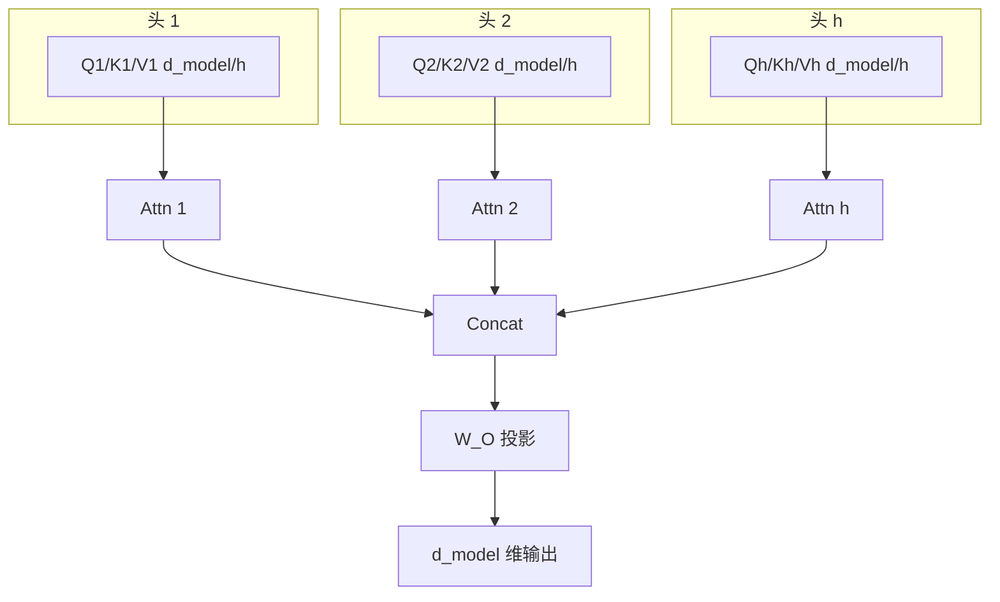
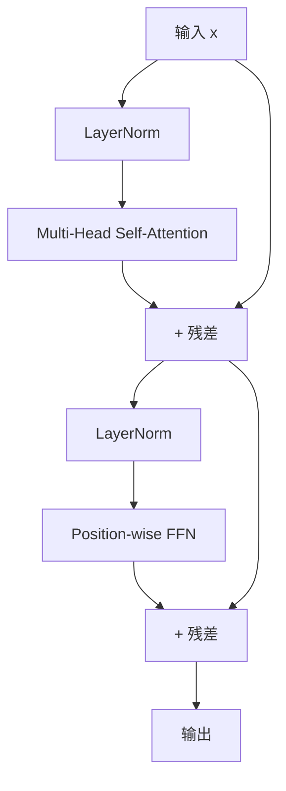

Transformer 用一个叫 Self-Attention 的机制替代了 RNN 的循环计算,从此 GPU 终于可以大展身手——今天所有 LLM(GPT / Claude / Gemini / Qwen / DeepSeek)的地基。CNN 的「局部」和 RNN 的「串行」两大痛点被同时解决:Self-Attention 让每个 token 看全局、完全并行、长依赖一跳到位。

---

## 1. Scaled Dot-Product Attention

### 1.1 定义

给定查询 Q、键 K、值 V:

```math
Attention(Q, K, V) = softmax(QK^T / √d_k) · V
```

### 1.2 Q / K / V 三剑客

每个位置 t 都从输入 X 同时生成三个向量:

| 向量 | 来源 | 角色 | 类比 |
|:---|:---|:---|:---|
| **Query(Q)** | q_t = W_Q · x_t | 「我想找什么」 | 图书馆检索的关键词 |
| **Key(K)** | k_t = W_K · x_t | 「我能提供什么」 | 每本书的索引标签 |
| **Value(V)** | v_t = W_V · x_t | 「找到后给你什么」 | 每本书的实际内容 |

翻译「The cat sat」到中文时,「cat」的 Q 会去问「animal? subject?」,整个句子的 K 都会响应,最后用 softmax 权重把对应的 V 拿过来。

### 1.3 流程图

```mermaid
flowchart LR
    A[输入 X (n, d_model)] --> B[W_Q]
    A --> C[W_K]
    A --> D[W_V]
    B --> E[Q (n, d_k)]
    C --> F[K (n, d_k)]
    D --> G[V (n, d_v)]
    E --> H[QK^T<br/>相似度 (n, n)]
    F --> H
    H --> I[÷ √d_k]
    I --> J[softmax<br/>行归一化]
    J --> K[权重 (n, n)]
    K --> L[× V]
    G --> L
    L --> M[输出 (n, d_v)]
```

### 1.4 为什么除以 √d_k

设 q、k 各分量独立同分布,均值为 0、方差为 1,则 q·k 的方差 = d_k。d_k 越大 → QK^T 越大 → softmax 越接近 one-hot → 梯度消失。

`÷ √d_k` 让方差归 1,softmax 处于「梯度友好」工作区间。

**手算例子**:d_k = 64 时,QK^T 标准差 ≈ 8,softmax 输出几乎全 0/1,梯度消失;÷ 8 后标准差 ≈ 1,softmax 输出接近均匀,梯度正常回传。

### 1.5 完整手算

4 词「The cat sat down」,d_k = 2:

```math
Q = [[1,0],   K = [[0,1],
     [0,1],        [1,0],
     [1,1],        [1,1],
     [0,0]]        [0,0]]
```

```math
QK^T = [[0, 1, 1, 0],
        [1, 0, 1, 0],
        [1, 1, 2, 0],
        [0, 0, 0, 0]]
```

÷ √2 ≈ 1.414 → softmax(行归一化)→

```math
[[0.21, 0.34, 0.34, 0.13],
 [0.34, 0.21, 0.34, 0.13],
 [0.22, 0.22, 0.43, 0.13],
 [0.25, 0.25, 0.25, 0.25]]
```

最后一行「down」权重均匀(Q 是 0 向量);「sat」对「The / cat / sat」三词注意力各 1/3。

---

## 2. Multi-Head Attention

### 2.1 定义

把 Q/K/V 沿 d_model 维切成 h 个头,每个头独立算 Self-Attention,最后 concat 起来线性投影回 d_model:

```math
MultiHead(Q, K, V) = Concat(head_1, ..., head_h) · W_O
```

```math
head_i = Attention(Q · W_Q_i, K · W_K_i, V · W_V_i)
```

### 2.2 为什么多头

单头一次只能看一种「关系」(主谓、修饰、上下位),多头并行多个子空间:

- 头 1:动词看主语
- 头 2:形容词看名词
- 头 3:代词回指上文
- 头 4:否定词反转语义

每个头在 d_model/h 维子空间独立工作,参数量与单头等价,表达力数倍提升。



### 2.3 典型配置

| 模型 | d_model | h | d_k = d_v | 参数量 |
|:---|:---|:---|:---|:---|
| Transformer-base | 512 | 8 | 64 | ≈ 65M |
| Transformer-big | 1024 | 16 | 64 | ≈ 213M |
| GPT-3 | 12288 | 96 | 128 | ≈ 175B |

---

## 3. 位置编码

### 3.1 为什么必须显式补

Self-Attention 是 permutation-equivariant 的:打乱输入顺序,输出同样打乱。它天然看不到「这个词在第几位」。对 Self-Attention 来说,「我爱你」和「你爱我」是一回事。

### 3.2 Sinusoidal 公式

```math
PE(pos, 2i)   = sin(pos / 10000^(2i / d_model))
PE(pos, 2i+1) = cos(pos / 10000^(2i / d_model))
```

- `pos` = 词在序列中的位置(0, 1, 2, ...)
- `i` = 维度索引(0, 1, ..., d_model/2 - 1)
- 不同维度对应不同频率的正弦波

### 3.3 直觉:不同频率的时钟

| 维度 | 频率 | 用途 |
|:---|:---|:---|
| i = 0 | 最高频(周期 2π) | 区分相邻位置 |
| i = d_model/4 | 中频 | 区分近处位置 |
| i = d_model/2 - 1 | 最低频(周期 10000·2π) | 区分远处位置 |

数学上的优雅性质:pos + k 的编码可以写成 pos 编码的线性组合(三角恒等式),天然支持相对位置和外推。

### 3.4 5 种位置编码方案对比

| 方案 | 来源 | 优点 | 缺点 |
|:---|:---|:---|:---|
| **Sinusoidal** | Transformer 原论文 | 不用学习,天然支持外推 | 位置信号间接 |
| **Learned PE** | BERT | 直接学,表达力强 | 不能外推到训练时未见过的长度 |
| **Relative Position Bias** | T5 | 直接建模相对距离 | 实现稍复杂 |
| **RoPE** | GPT-NeoX / RoFormer | 旋转矩阵,优雅支持任意位置 | 数学稍抽象 |
| **ALiBi** | BLOOM | 线性偏置,极简 | 表达力有限 |

---

## 4. Transformer Encoder 块

### 4.1 结构



### 4.2 每个组件的角色

| 组件 | 作用 | 为什么必要 |
|:---|:---|:---|
| **LayerNorm** | 归一化激活值到均 0 方差 1 | 稳定训练,允许大学习率 |
| **Multi-Head Self-Attention** | 全局信息聚合 | 让每个 token 看其他所有 token |
| **残差连接** | y = x + Sublayer(x) | 让梯度可以跳过,100+ 层也能训 |
| **Position-wise FFN** | 两层 MLP,逐位置非线性 | 给模型「逐位置的非线性变换能力」 |
| **LayerNorm(第二次)** | 再次归一化 | 防止 FFN 输出漂移 |

### 4.3 三种 Transformer 家族

| 类型 | 代表 | Attention 模式 | 擅长 |
|:---|:---|:---|:---|
| **Encoder-only** | BERT | 双向(每个位置看所有位置) | 理解 / 分类 / NER |
| **Decoder-only** | GPT / Claude | 单向 + causal mask(只看过去) | 生成 / 对话 |
| **Encoder-Decoder** | T5 / BART | 编码全句 + 解码生成 | 翻译 / 摘要 |

---

## 5. PyTorch 实战

### 5.1 单头 Self-Attention(从零实现)

```python
import torch
import torch.nn as nn
import math


class SelfAttention(nn.Module):
    def __init__(self, d_model, d_k, d_v):
        super().__init__()
        self.W_Q = nn.Linear(d_model, d_k)
        self.W_K = nn.Linear(d_model, d_k)
        self.W_V = nn.Linear(d_model, d_v)
        self.d_k = d_k

    def forward(self, x):
        # x: (B, n, d_model)
        Q = self.W_Q(x)
        K = self.W_K(x)
        V = self.W_V(x)
        scores = Q @ K.transpose(-2, -1) / math.sqrt(self.d_k)
        attn = scores.softmax(dim=-1)
        out = attn @ V
        return out, attn


B, n, d_model = 2, 4, 8
x = torch.randn(B, n, d_model)
sa = SelfAttention(d_model, d_k=8, d_v=8)
out, attn = sa(x)
print(out.shape)   # (2, 4, 8)
print(attn.sum(dim=-1))  # 每行和 = 1
```

### 5.2 完整 Decoder-only GPT(字符级,可跑)

```python
import torch
import torch.nn as nn
import torch.nn.functional as F


class CausalSelfAttention(nn.Module):
    def __init__(self, d_model, n_head, max_len=512):
        super().__init__()
        assert d_model % n_head == 0
        self.n_head = n_head
        self.d_k = d_model // n_head
        self.W_QKV = nn.Linear(d_model, 3 * d_model)
        self.W_O = nn.Linear(d_model, d_model)
        mask = torch.triu(torch.ones(max_len, max_len), diagonal=1).bool()
        self.register_buffer("mask", mask)

    def forward(self, x):
        B, T, C = x.shape
        qkv = self.W_QKV(x).reshape(B, T, 3, self.n_head, self.d_k)
        q, k, v = qkv.permute(2, 0, 3, 1, 4)
        scores = (q @ k.transpose(-2, -1)) / (self.d_k ** 0.5)
        scores = scores.masked_fill(self.mask[:T, :T], float("-inf"))
        attn = scores.softmax(dim=-1)
        out = (attn @ v).transpose(1, 2).reshape(B, T, C)
        return self.W_O(out)


class GPTBlock(nn.Module):
    def __init__(self, d_model, n_head):
        super().__init__()
        self.ln1 = nn.LayerNorm(d_model)
        self.attn = CausalSelfAttention(d_model, n_head)
        self.ln2 = nn.LayerNorm(d_model)
        self.ffn = nn.Sequential(
            nn.Linear(d_model, 4 * d_model),
            nn.GELU(),
            nn.Linear(4 * d_model, d_model),
        )

    def forward(self, x):
        x = x + self.attn(self.ln1(x))
        x = x + self.ffn(self.ln2(x))
        return x


class MiniGPT(nn.Module):
    def __init__(self, vocab_size, d_model=128, n_head=4, n_layer=4, max_len=256):
        super().__init__()
        self.token_emb = nn.Embedding(vocab_size, d_model)
        self.pos_emb = nn.Embedding(max_len, d_model)
        self.blocks = nn.ModuleList(
            [GPTBlock(d_model, n_head) for _ in range(n_layer)]
        )
        self.ln_f = nn.LayerNorm(d_model)
        self.head = nn.Linear(d_model, vocab_size, bias=False)

    def forward(self, idx):
        B, T = idx.shape
        tok = self.token_emb(idx)
        pos = self.pos_emb(torch.arange(T, device=idx.device))
        x = tok + pos
        for block in self.blocks:
            x = block(x)
        x = self.ln_f(x)
        return self.head(x)


# 训练字符级语言模型
text = "To be, or not to be, that is the question." * 100
chars = sorted(set(text))
stoi = {c: i for i, c in enumerate(chars)}
data = torch.tensor([stoi[c] for c in text], dtype=torch.long)
model = MiniGPT(vocab_size=len(chars), d_model=64, n_head=4, n_layer=2)
optim = torch.optim.AdamW(model.parameters(), lr=3e-4)

for step in range(500):
    ix = torch.randint(0, len(data) - 32, (4,))
    x = torch.stack([data[i:i + 16] for i in ix])
    y = torch.stack([data[i + 1:i + 17] for i in ix])
    logits = model(x)
    loss = F.cross_entropy(logits.view(-1, len(chars)), y.view(-1))
    optim.zero_grad(); loss.backward(); optim.step()
    if step % 100 == 0:
        print(f"step {step:3d}  loss {loss.item():.4f}")
```

预期输出(loss 稳步下降到 0.5 以下):
```
step   0  loss 3.0451
step 100  loss 1.8234
step 200  loss 1.1208
step 300  loss 0.7842
step 400  loss 0.5917
```

---

## 6. Self-Attention vs RNN

### 6.1 复杂度对比

| 指标 | RNN(单层) | Self-Attention(单层) |
|:---|:---|:---|
| 每层复杂度 | O(n · d²) | O(n² · d) |
| 顺序计算 | 必须(n 步串行) | 完全并行 |
| 最长路径 | O(n) | O(1) |
| 长依赖能力 | 弱(梯度衰减) | 强(直接 attend) |
| 位置信息 | 天然有 | 需 PE 补回 |

n ≤ d 时(典型 NLP),Self-Attention 更便宜;n 远大于 d 时(超长文档),n² 二次项成为瓶颈——这正是 Longformer / FlashAttention / Sparse Attention 的发力点。

### 6.2 运算量对比(n=词数,d=512)

| 序列长 n | RNN ops | SA ops | 谁赢 |
|:---|:---|:---|:---|
| 128 | 1.7×10⁷ | 1.7×10⁷ | 平手 |
| 512 | 6.7×10⁷ | 2.7×10⁸ | RNN |
| 1024 | 1.3×10⁸ | 1.1×10⁹ | RNN |
| 2048 | 2.7×10⁸ | 4.3×10⁹ | RNN |

---

## 7. 常见坑

### 7.1 漏掉 √d_k
**症状**:训练 loss 不下降 / 训到一半 NaN
**原因**:QK^T 直接 softmax,d_k 大时饱和,梯度消失
**修法**:`scores = Q @ K^T / sqrt(d_k)` 必加

### 7.2 attn_mask 形状错误
**症状**:RuntimeError: shape of the mask does not match
**原因**:PyTorch 的 attn_mask 期望 (T, T) 且 True=屏蔽,不是 float 也不是 (B, T, T) 三维
**修法**:`mask = torch.triu(torch.ones(T, T), diagonal=1).bool()`

### 7.3 位置编码忘加
**症状**:模型分不清「我爱你」和「你爱我」
**原因**:Self-Attention 是 permutation-equivariant 的
**修法**:`x = token_emb(idx) + pos_emb(torch.arange(T))`,PE 必加

### 7.4 LayerNorm 维度搞错
**症状**:val loss 抖动
**原因**:`nn.LayerNorm(d_model)` 对最后一维归一化,不是 batch 维
**修法**:确认 `normalized_shape=(d_model,)`

### 7.5 残差维度对不上
**症状**:RuntimeError: mat1 and mat2 shapes cannot be multiplied
**原因**:`y = x + Sublayer(x)` 要求维度完全一致
**修法**:统一在 `__init__` 里设 `self.d_model`,所有子层都用它

### 7.6 Decoder 漏掉 causal mask
**症状**:训练 loss 极低(作弊成功),inference 时崩坏
**原因**:训练时 Decoder 偷看未来,模型「背诵答案」
**修法**:`tgt_mask = triu(ones(T, T), diagonal=1).bool()`

### 7.7 训练时不开 model.train()
**症状**:结果奇怪、Dropout 不随机
**修法**:训练循环开头 `model.train()`,验证时 `model.eval()`

---

## 8. 自检三问

**A. Scaled Dot-Product Attention 公式里除以 √d_k 这一步到底是为什么?能否从 softmax 的 Jacobian / 点积方差的角度推导出「不除会梯度消失」的结论?**

要点:Q 和 K 各分量独立同分布 → QK^T 点积方差 = d_k → softmax 对大输入饱和 → 梯度消失。÷ √d_k 让方差归 1,softmax 处于「梯度友好」工作区间。详见 §1.4。

---

**B. Multi-Head 把 d_model 切成 h 份,既然单头 d_model 维就能学任意关系,为什么要切成多头?**

要点:
- 优化景观:多个独立优化方向,避免单头陷入局部最优
- 子空间分解:不同关系(语法/语义/长距离)天然在不同子空间
- 归纳偏置:强制模型「分多个角度去看」,比单头「看完所有」更易学
- 类比:人类视觉有专门的形状/颜色/运动处理区

详见 §2.2。

---

**C. 假设你忘了给 Decoder 加 causal mask,模型在训练时会看到什么「作弊」信息?为什么 inference 时完全崩坏?**

要点:训练时 Decoder 看到完整目标序列,模型学到「直接复制当前位置的下一 token」。Inference 时没有未来可偷看,模型输出随机崩坏。Mask 的几何含义:上三角(True)屏蔽未来位置,让 attention 权重只在历史和当前位置分配。详见 §4.1 + §7.6。

---

## 9. 推荐资源

### 视频
- **3Blue1Brown《深度学习:注意力机制》**—— 5 分钟直觉
- **李宏毅《机器学习 / 2021 / 2023》Transformer 章节**—— 中文最直观
- **Andrej Karpathy《Let's build GPT: from scratch, in code, spelled out》**—— 从零手写 nanoGPT

### 教科书
- **《动手学深度学习》(D2L)** 第 10-11 章—— 从零实现 + PyTorch / MXNet 双版本
- **《Deep Learning》(Goodfellow et al.)** 第 10 章

### 论文
- **Vaswani et al. 2017《Attention Is All You Need》**—— 原论文,§3 描述 Scaled Dot-Product、§3.2 解释 Multi-Head、§3.5 介绍 Positional Encoding
- **Lin et al. 2022《A Survey on Transformers》**—— 全家族综述
- **Tay et al. 2022《Efficient Transformers: A Survey》**—— 长序列优化路线图

### 博客 / 课程
- **Lilian Weng《Attention? Attention!**》—— 图解最清楚
- **Jay Alammar《The Illustrated Transformer》**—— 一图胜千言
- **Stanford CS336《Language Modeling From Scratch》**—— 工业级视角

### 代码
- **nanoGPT** (Karpathy) —— 300 行 PyTorch 完整 GPT
- **Hugging Face Transformers** —— 工业级实现
- **x-transformers** (lucidrains) —— 各种 attention 变体集合

---

## 10. 本节要点

- **Self-Attention** 让序列每个位置通过 Q/K/V 三剑客聚合所有其他位置信息,完全并行,长依赖一跳到位。
- **公式** `Attention(Q, K, V) = softmax(QK^T / √d_k) · V`,其中 `÷ √d_k` 让 QK^T 方差归 1,避免 softmax 饱和导致梯度消失。
- **Multi-Head** 把 d_model 切成 h 份,每个头在 d_model/h 维子空间并行看不同关系(主谓、修饰、上下位),最后 concat + 投影。
- **位置编码** 必要,因为 Self-Attention 本身是 permutation-equivariant 的;Sinusoidal 用不同频率正弦/余弦让模型看见相对位置。
- **Encoder 块** = LayerNorm + Multi-Head SA + 残差 + LayerNorm + FFN + 残差;Decoder-only(GPT 类)再加 causal mask 阻止偷看未来。
- **vs RNN**:Self-Attention 复杂度 O(n²·d),RNN 是 O(n·d²);n ≤ d 时 Self-Attention 更便宜且并行,这是 Transformer 取代 RNN 的工程根因。
- **PyTorch 关键点**:`÷ sqrt(d_k)`、`triu(ones(T, T), diagonal=1).bool()` 做 causal mask、`x = token_emb + pos_emb` 必加 PE、`model.train() / eval()` 切换。

---

## 11. 下一节:Day 20 · 训练技巧

主题:优化器、学习率、正则化、混合精度。覆盖:
- AdamW vs SGD:为什么大模型几乎只用 AdamW?weight decay 与 L2 正则的本质区别
- 学习率调度:warmup + cosine decay 的几何含义
- 混合精度:fp16 / bf16 为什么能让显存减半、训练速度翻倍
- 梯度裁剪:gradient clipping 防止 loss spike 导致的训练崩溃

产出物:`nn.TransformerDecoder` 在字符级 LM 上跑一遍完整训练 pipeline,对比 fp32 vs fp16 的显存占用与训练速度。

---

**作者**:林馨予 + 林晓月
**最后更新**:2026-07-04
**版权**:CC BY-NC-SA 4.0