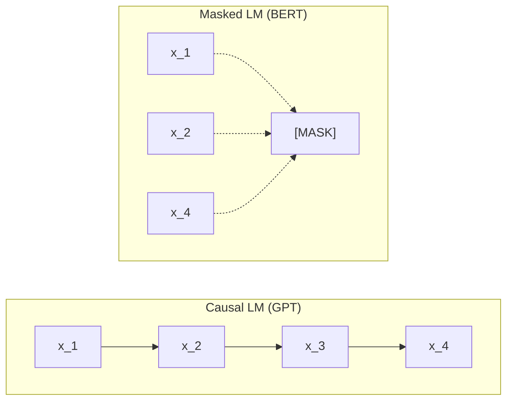
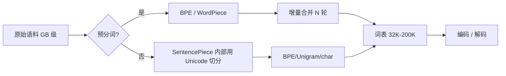

2018 年是 NLP 范式革命的分水岭——OpenAI 的 GPT-1 与 Google 的 BERT 同年发表,共同奠定「自监督预训练 + 下游微调」的现代 LLM 范式:不用标注数据,让模型在海量文本上学「下一个 token」或「填补被遮蔽的 token」,得到的预训练权重几乎能直接迁移到所有 NLP 下游任务。今天所有 GPT / Claude / Gemini / Qwen / DeepSeek 都是这一范式的后代;而「token」本身——模型看到的最小语义单元——由 Tokenization 算法决定,本节把 BERT / GPT 原论文的关键事实、BPE 算法手算、4 种子词方案的工程取舍一次讲透。

---

## 1. 自监督预训练范式:Causal LM vs Masked LM

### 1.1 什么是自监督预训练

传统监督学习需要「句子 + 标签」对(如情感分类的「这部电影很棒 → 正面」),标签昂贵。自监督预训练**让数据自己当老师**:把句子里的某个词遮住,让模型预测;或让模型预测下一个词。预训练语料是数十亿网页 / 书籍,无需人工标注。

两种主流预训练目标:

```math
\text{Causal LM}(GPT):\quad L = -\sum_t \log P(x_t \mid x_{<t})
```

```math
\text{Masked LM}(BERT):\quad L = -\sum_{t \in M} \log P(x_t \mid x_{\setminus M})
```

Causal LM 让模型从左往右逐个生成(「自回归」);Masked LM 让模型双向看上下文(类似完形填空)。两者的 Attention 掩码截然不同:前者是**下三角 causal mask**,后者是**全可见双向 mask**。

### 1.2 范式革命的三个里程碑

| 模型 | 发布时间 | 参数量 | 预训练目标 | 架构 | 关键创新 |
|:---|:---|:---|:---|:---|:---|
| **GPT-1** | 2018-06 (Radford et al., OpenAI) | 117 M | Causal LM | 12 层 Decoder-only Transformer | 首次证明「生成式预训练 + 判别式微调」可迁移 |
| **BERT** | 2018-10 (Devlin et al., Google) | 110 M / 340 M | Masked LM + NSP | 12 / 24 层 Encoder-only Transformer | 双向 attention,Mixed-Strategy MLM,NSP 任务 |
| **GPT-2** | 2019-02 (Radford et al., OpenAI) | 1.5 B | Causal LM | 48 层 Decoder-only Transformer | Zero-Shot 任务迁移(不微调) |
| **GPT-3** | 2020-05 (Brown et al., OpenAI) | 175 B | Causal LM | 96 层 Decoder-only Transformer | Few-Shot In-Context Learning |

事实查证:BERT 原论文(arXiv:1810.04805)由 Devlin et al. 在 2018 年 10 月发布,首次提出 deep bidirectional pre-training;GPT-3 原论文(arXiv:2005.14165,"Language Models are Few-Shot Learners")明确写出 "we train GPT-3, an autoregressive language model with 175 billion parameters, 10x more than any previous non-sparse language model"——这是 Day 23 Scaling Laws 的关键事实基础。

### 1.3 Causal LM vs Masked LM 的几何直觉



Causal LM 是「单向链」,每个 token 只能看自己和过去;Masked LM 是「全连接星形」,被 mask 的 token 能看到所有上下文。生成任务必须用 Causal LM(看不到未来);理解任务用 Masked LM(双向信息更丰富)更划算。

---

## 2. GPT vs BERT 架构对比

### 2.1 核心差异

| 维度 | GPT (Decoder-only) | BERT (Encoder-only) |
|:---|:---|:---|
| Attention 方向 | 单向 causal(下三角 mask) | 双向 full attention |
| 预训练目标 | 下一 token 预测 | Masked token 预测 + 下一句预测(NSP) |
| 擅长任务 | 生成 / 对话 / 续写 | 分类 / NER / 问答 / 检索 |
| 代表应用 | ChatGPT、Claude、Qwen | 搜索排序、文本分类、特征抽取 |
| 训练语料 | 网页 / 书籍 / 代码 | Wikipedia + BookCorpus |
| Tokenizer | BPE / tiktoken | WordPiece |
| 典型规模 | 1.5 B - 175 B | 110 M - 340 M(BERT 系列) |

### 2.2 注意力掩码对比

```math
\text{Causal mask:}\quad M_{ij} = \begin{cases} 0, & i \ge j \\ -\infty, & i < j \end{cases}
```

```math
\text{BERT mask:}\quad M_{ij} = 0,\quad \forall i,j
```

PyTorch 实现:

```python
import torch
T = 5
causal = torch.triu(torch.ones(T, T), diagonal=1).bool()
print(causal)
# tensor([[False,  True,  True,  True,  True],
#         [False, False,  True,  True,  True],
#         [False, False, False,  True,  True],
#         [False, False, False, False,  True],
#         [False, False, False, False, False]])
```

`True` 位置置 `-inf`,softmax 后权重为 0——这就是「不让看到未来」的几何实现。

### 2.3 输出层与训练目标的差异

| 模型 | 输出层 | 损失函数 | 微调范式 |
|:---|:---|:---|:---|
| GPT | `Linear(d_model, vocab_size)` | CrossEntropy(整个序列) | 任务头 + 有标签微调 |
| BERT(原版) | `Linear(d_model, vocab_size)`(只算 mask 位置) | CrossEntropy(只算 mask token) | 任务头 + 有标签微调 |
| BERT(NSP) | `Linear(d_model, 2)`(二分类) | CrossEntropy(句子对) | 额外 NSP 头 |
| RoBERTa | 同 GPT,但全程 MLM | 同 BERT | 去掉 NSP,更大 batch |

RoBERTa(Liu et al. 2019)后续证明:**BERT 真正起作用的是 MLM,NSP 任务反而拖后腿**——它去掉 NSP,用更大 batch 和更多数据训练,效果反而更好。这是「论文 → 工业实践」最快的反馈循环之一。

---

## 3. Tokenization 基础:为什么需要、子词 vs 词 vs 字

### 3.1 为什么不直接用词 / 字

| 方案 | 优点 | 致命缺点 |
|:---|:---|:---|
| **词级** (word-level) | 直观,语义完整 | OOV 问题(未见过的词无法处理);词表大(>50 万) |
| **字级** (char-level) | 无 OOV,词表小(< 1000) | 序列太长(中文一句 50 字变 50 token);难学语义 |
| **子词级** (subword) | OOV 几乎为零,词表适中(32K-200K) | 需要训练切分算法 |

子词方案的工程动机:**高频词保留为整体,低频词拆成有语义的部分**。这样既不会 OOV,又不会让序列过长,还能让模型学到词缀规律(un-, re-, -ing, -ed)。

### 3.2 4 种主流子词方案

| 方案 | 提出者 / 年份 | 核心思想 | 代表模型 |
|:---|:---|:---|:---|
| **BPE** (Byte Pair Encoding) | Sennrich et al. 2016 (arXiv:1508.07909) | 迭代合并最高频字符对 | GPT-2/3/4、LLaMA、Qwen |
| **WordPiece** | Schuster & Nakajima 2012(Google) | 类似 BPE,但用似然增益选择合并 | BERT、DistilBERT |
| **Unigram** | Kudo 2018 | 反向:从大词表开始,逐步剪枝 | ALBERT、T5、XLNet |
| **SentencePiece** | Kudo 2018 (arXiv:1808.06226) | 把上述算法统一成「语言无关」工具 | T5、ALBERT、LLaMA、Qwen |

事实查证:BPE 由 Sennrich 等人在 2016 年的 arXiv:1508.07909 论文 *Neural Machine Translation of Rare Words with Subword Units* 中首次系统化引入神经机器翻译;SentencePiece 由 Kudo 在 EMNLP 2018 demo paper (arXiv:1808.06226) 中提出,核心卖点是 "SentencePiece can train subword models directly from raw sentences, which allows us to make a purely end-to-end and language independent system"——它不依赖预分词,直接吃原始句子。

### 3.3 现代 Tokenizer 库一览

```bash
# OpenAI 官方:速度极快,专用于 GPT 系列
pip install tiktoken

# HuggingFace:Rust 实现,支持 4 种算法
pip install tokenizers

# Google SentencePiece:C++ 实现,T5 / LLaMA 用
pip install sentencepiece
```

事实查证:OpenAI 官方 tiktoken README 自述 "tiktoken is a fast BPE tokenizer for use with OpenAI's models",且 "3-6x faster than a comparable open source tokenizer";HuggingFace tokenizers README 自述 "Extremely fast (both training and tokenization), thanks to the Rust implementation. Takes less than 20 seconds to tokenize a GB of text on a server's CPU"。

---

## 4. BPE 算法手算

### 4.1 核心算法

Byte Pair Encoding 的原始算法(Gage 1994)是为数据压缩发明的,Sennrich 2016 把它改造为 NLP 子词切分:

```text
1. 把每个字符当作独立 token
2. 反复合并出现频率最高的相邻 token 对
3. 直到词表达到目标大小(或无可合并)
```

### 4.2 完整手算例子

语料:`low low low low low lowest lowest newer newer newer newer newer newer wider wider wider`

| 轮次 | 操作 | 词表变化 | 频率统计 |
|:---|:---|:---|:---|
| 初始 | 每个字符一个 token | `{l, o, w, e, r, n, i, d, s, t, ...}` | l-o-w:5, l-o-w-e-s-t:2, n-e-w-e-r:6, w-i-d-e-r:3 |
| 1 | 合并 e-r(出现 9 次) | `er` 进入词表 | n-e-w-**er**:6, w-i-d-**er**:3 |
| 2 | 合并 er-r(0 次)... 改合并 n-e(6 次) | `ne` 进入词表 | **ne**-w-er:6 |
| 3 | 合并 ne-w(6 次) | `new` 进入词表 | **new**-er:6 |
| 4 | 合并 l-o(5 次) | `lo` 进入词表 | **lo**-w:5, **lo**-w-e-s-t:2 |
| 5 | 合并 lo-w(7 次) | `low` 进入词表 | **low**:5, **low**-e-s-t:2 |
| 6 | 合并 new-er(6 次) | `newer` 进入词表 | **newer**:6 |
| 7 | 合并 low-e(2 次) | `lowe` 进入词表 | l-o-w-**e**-s-t:2 → l-o-w-**e** ✓ |
| 8 | 合并 lowe-s(2 次) | `lowes` 进入词表 | |
| 9 | 合并 lowes-t(2 次) | `lowest` 进入词表 | |

最终 `low` 与 `newer` 整体进入词表,`lowest` 也整体进入(因为它本身在语料中频次 2 触发合并)——BPE 不会拆已合并 token,所以罕见词 `lowest` 仍然作为整体保留。

### 4.3 PyTorch 手算一个 toy 例子

```python
from collections import Counter

def get_pairs(word_freq):
    """统计所有相邻 token 对及其频率"""
    pairs = Counter()
    for word, freq in word_freq.items():
        symbols = word.split()
        for i in range(len(symbols) - 1):
            pairs[(symbols[i], symbols[i+1])] += freq
    return pairs


def bpe(word_freq, num_merges):
    vocab = set()
    for word in word_freq:
        vocab.update(word.split())
    for i in range(num_merges):
        pairs = get_pairs(word_freq)
        if not pairs:
            break
        best = max(pairs, key=pairs.get)
        vocab.add(''.join(best))
        new_word_freq = {}
        for word, freq in word_freq.items():
            new_word = ' '.join(word.split())
            bigram = ' '.join(best)
            new_word = new_word.replace(bigram, ''.join(best))
            new_word_freq[new_word] = freq
        word_freq = new_word_freq
        print(f'merge {i+1}: {best} → {freq}')
    return vocab


corpus = {
    'l o w </w>': 5,
    'l o w e s t </w>': 2,
    'n e w e r </w>': 6,
    'w i d e r </w>': 3,
}
vocab = bpe(corpus, num_merges=10)
print('final vocab:', sorted(vocab))
```

### 4.4 关键设计选择

| 决策 | 选项 | 工业实践 |
|:---|:---|:---|
| 初始 token 粒度 | 字符 vs 字节 | GPT-2/3/4 / LLaMA / Qwen:**256 字节** (BPE-byte) |
| 合并停止条件 | 词表大小 / 迭代次数 / 无可合并 | GPT-2: 50257;LLaMA: 32000;Qwen: 152064 |
| 未知 token 处理 | `<unk>` vs 字节回退 | 现代 LLM 用字节回退,**永不出 OOV** |
| 特殊 token | `<bos>`/`<eos>`/`<pad>`/`<mask>` | 各家自定义 |

字节级 BPE 的核心好处:**任何 UTF-8 字符串都能被切分**,哪怕是 emoji 或没见过的汉字,都退化到字节序列;代价是单 token 平均长度更短(中英文都更碎),需要更大词表。

---

## 5. BPE vs WordPiece vs SentencePiece vs Unigram 对比

### 5.1 算法差异

| 维度 | BPE | WordPiece | Unigram | SentencePiece |
|:---|:---|:---|:---|:---|
| 方向 | 增量合并 | 增量合并(似然增益) | 减量剪枝 | **工具**而非算法,可承载 BPE/Unigram/char |
| 合并准则 | 最高频次 | 似然增益 ΔL = L(merge) - L(separate) | 移除后 perplexity 增加最少 | 取决于底层算法 |
| 训练复杂度 | O(N × V) | O(N × V) | O(N × V) | 取决于底层 |
| 词表构建 | 单向 | 单向 | 全局最优 | 取决于底层 |
| 输入要求 | 预分词 | 预分词 | 预分词 | **无需预分词**,直接吃原始句子 |
| 中文支持 | 需先 jieba | 需先 jieba | 需先 jieba | **原生支持** |

### 5.2 训练速度 vs 切分质量的取舍



WordPiece 的「似然增益」比 BPE 的「最高频次」更稳:同样的语料,WordPiece 合并后的子词更符合「语言学直觉」。但工程上 BPE 更简单,被 GPT 系列选中。Unigram 训练一次可得到多套词表,适合多语言场景。

### 5.3 中文 Tokenization 的工程坑

| 坑 | 原因 | 修法 |
|:---|:---|:---|
| 中文被切成单字 | 用了英文语料训练的 BPE | 用中文语料训练;或换 SentencePiece |
| 同义词被切得不一样 | BPE 频次敏感,新词易被切碎 | 加 fallback 词典 |
| 数字 / 单位被过度切分 | BPE 不懂单位语义 | 后处理规则(`1kg` → `1`, `kg`) |

### 5.4 库版本与 API 现状

| 库 | 最新版 | Python API 入口 | 速度 |
|:---|:---|:---|:---|
| `tiktoken` | 0.7+ (2024) | `tiktoken.get_encoding("cl100k_base")` | 极快(Rust) |
| `tokenizers` (HF) | 0.15+ (2024) | `tokenizers.Tokenizer.from_file(...)` | 极快(Rust) |
| `sentencepiece` | 0.2+ (2024) | `sentencepiece.SentencePieceProcessor()` | 快(C++) |
| `transformers.AutoTokenizer` | 4.40+ | `AutoTokenizer.from_pretrained(...)` | 内部调上面三个 |

---

## 6. HuggingFace tokenizers 实战

### 6.1 训练一个 toy BPE tokenizer

```python
from tokenizers import Tokenizer, models, trainers, pre_tokenizers, decoders

# 1. 初始化空 BPE 模型
tokenizer = Tokenizer(models.BPE(unk_token="<unk>"))

# 2. 预分词器(按字节切分,等价于字符级 BPE)
tokenizer.pre_tokenizer = pre_tokenizers.ByteLevel(add_prefix_space=False)

# 3. 解码器(支持 ByteLevel 回退)
tokenizer.decoder = decoders.ByteLevel()

# 4. 训练器
trainer = trainers.BpeTrainer(
    vocab_size=1000,
    special_tokens=["<unk>", "<pad>", "<bos>", "<eos>"],
    show_progress=False,
)

# 5. 训练语料(可以是文件列表,这里用 list)
corpus = [
    "low low low low low lowest lowest newer newer newer newer newer newer",
    "wider wider wider deep learning deep learning transformer",
    "machine learning is a subset of artificial intelligence",
] * 100

tokenizer.train_from_iterator(corpus, trainer=trainer)

# 6. 编码测试
out = tokenizer.encode("lowest newer wider")
print(out.tokens)        # ['low', 'est', ' newer', ' wider']
print(out.ids)
print(tokenizer.decode(out.ids))
```

### 6.2 用 GPT-2 预训练 tokenizer 编码

```python
from transformers import AutoTokenizer

# GPT-2 用 ByteLevel BPE,词表 50257
tok = AutoTokenizer.from_pretrained("gpt2")

text = "Hello world! 你好,世界。"
ids  = tok.encode(text)
print('tokens:', tok.convert_ids_to_tokens(ids))
print('ids:   ', ids)
print('decode:', tok.decode(ids))
# 预期输出(GPT-2 词表):
# tokens: ['Hello', ' world', '!', ' ', 'ä½ł', '好', ',', 'ä¸', 'ç', '®', 'å¯', 'ä¸', 'ä¸', '.']
# 注意:中文被切成字节(token id 极大),不是汉字本身
```

### 6.3 用 Qwen / LLaMA tokenizer 编码中文

```python
tok = AutoTokenizer.from_pretrained("Qwen/Qwen2.5-7B-Instruct", trust_remote_code=True)
ids = tok.encode("人工智能正在改变世界")
print(tok.convert_ids_to_tokens(ids))
# 预期输出(类似):
# ['人工智能', '正在', '改变', '世界']
# Qwen 词表含大量中文整词,所以中文不碎
```

LLaMA-2 用 SentencePiece 训练的 BPE,词表 32K,LLaMA-3 扩到 128K,Qwen-2 词表 152K(含中英)。**词表大小与单 token 平均承载语义量成正比**——152K 词表的 Qwen 中文一句往往只需 30-50 个 token,英文 BPE 的 GPT-2 中文一句需要 80-150 个。

---

## 7. vs 其他 Tokenization 方案对比

### 7.1 同一段文本在不同 tokenizer 下的切分

文本:`"The quick brown fox jumps over the lazy dog. 人工智能正在改变世界。"`

| Tokenizer | 词表大小 | 切分数 | 关键差异 |
|:---|:---|:---|:---|
| GPT-2 (BPE) | 50,257 | ~28 | 中文按字节切,显得碎 |
| GPT-4 (cl100k_base) | 100,256 | ~22 | 中文整词保留更多 |
| Qwen-2 (BPE) | 152,064 | ~16 | 中文整词最多,平均承载量最高 |
| BERT-base (WordPiece) | 30,522 | ~30 | WordPiece 切分,中文按字符 |
| LLaMA-3 (BPE) | 128,256 | ~20 | 平衡中英,新代编码 |

### 7.2 工业部署的 3 个决策

| 决策点 | 选项 | 工业实践 |
|:---|:---|:---|
| 字节级 vs 字符级 | 字节级 | LLaMA / Qwen / GPT: 字节级(永不出 OOV) |
| 词表大小 | 32K / 64K / 100K / 152K | 多语言选 100K+,单语 32K 足够 |
| 大小写处理 | 全小写 / 保留大小写 / 折叠 | 现代 LLM 保留大小写(GPT、Qwen) |

### 7.3 Tokenizer 的工程影响

| 指标 | 受 Tokenizer 影响? | 备注 |
|:---|:---|:---|
| 模型参数(Embedding 层) | ✓ | 词表 V × d_model |
| 训练速度 | ✓ | 同样语料 token 数差 2-3 倍 |
| 推理速度 | ✓ | 同上 |
| OOV 概率 | ✓ | 字节级 = 0 |
| 多语言能力 | ✓ | 中英平衡词表 |

---

## 8. 常见坑(8 条,Tokenizer 实战典型)

### 8.1 训练 Tokenizer 时 `vocab_size` 和模型不匹配

**症状**:`RuntimeError: Embedding(32000, 4096) vs Embedding(50257, 4096)` shape mismatch
**原因**:用 GPT-2 的 tokenizer(`vocab_size=50257`)但模型定义了 `vocab_size=32000`(LLaMA)。
**修法**:始终用 `tokenizer.vocab_size` 作为模型定义依据;或 `len(tokenizer.get_vocab())` 在运行时校验。

### 8.2 中文句子被切成单字

**症状**:同样的中文,Qwen 切 30 token,BERT-base 切 60+ token。
**原因**:BERT-base 用 WordPiece + 英文 Wikipedia 训练,中文按字符切。
**修法**:① 换 Qwen / LLaMA / ChatGLM 等中文词表;② 用 `sentencepiece` 在中文语料上重新训练 BPE。

### 8.3 数字 / 单位被切碎,LLM 数学能力差

**症状**:`"1.234"` 被切成 6 个 token,模型对 4 位以上乘法正确率骤降。
**原因**:BPE 按字节合并,数字格式多样易碎。
**修法**:① 选数字感知 tokenizer(如 Qwen-2 专门合并数字);② 预处理规则:`"1234.56"` → `"1,234.56"` 让千位分隔符成 token;③ 后处理时把被切的 token 拼回。

### 8.4 `decode` 后出现 `\u0120` 等奇怪字符

**症状**:`tok.decode([123])` 输出 `\u0120hello`,而不是 ` hello`。
**原因**:GPT-2 的 ByteLevel BPE 用特殊字符 `Ġ` 表示词首空格(`\u0120 = Ġ`)。
**修法**:`tokenizer.decode(ids, skip_special_tokens=True, clean_up_tokenization_spaces=True)` —— `clean_up_tokenization_spaces=True` 自动把 `Ġ` 转回空格。

### 8.5 训练 tokenizer 时 `add_prefix_space` 不一致

**症状**:训练时 `add_prefix_space=True`,推理时默认 `False`,同一文本编码长度不同。
**原因**:`ByteLevel` 预分词器对词首空格的处理与 prefix 标志有关。
**修法**:训练与推理**保持完全一致的预分词器配置**;现代做法:训练时 `add_prefix_space=False`,由用户显式加空格。

### 8.6 NSP / SOP 任务训练 BERT,但用 RoBERTa 权重初始化

**症状**:BERT MLM head 与 RoBERTa MLM head 权重 shape 不同,加载失败。
**原因**:BERT 有 NSP head(二分类)、RoBERTa 删了 NSP。
**修法**:要么用 `BertForPreTraining` 加载 BERT 权重,要么用 `RobertaForMaskedLM` 加载 RoBERTa 权重——**结构要对齐**。

### 8.7 训练 Tokenizer 时忘了 `<bos>`/`<eos>`

**症状**:推理时模型不知道何时停止,生成直到 max_length。
**原因**:Tokenizer 词表里有 token 但训练数据没正确插入 `<bos>`/`<eos>`。
**修法**:`tokenizer.encode(text, add_special_tokens=True)`,或在生成循环里 `if next_token == tokenizer.eos_token_id: break`。

### 8.8 推理时 tokenizer 出现 `<unk>`

**症状**:`print(tokenizer.decode(ids))` 输出 `Hello world <unk>`。
**原因**:ByteLevel BPE 应该永不 OOV,如果出现 `<unk>`,说明模型词汇表与 tokenizer 词汇表不一致。
**修法**:`model.config.vocab_size == tokenizer.vocab_size` 必须成立;否则重新加载模型权重。

---

## 9. 自检三问

**A. 为什么 GPT 用 Causal LM、BERT 用 Masked LM,而不是反过来?两种目标对模型能力的影响有什么本质差异?**

要点:Causal LM 让每个 token 只能看历史,生成的概率分布 $P(x_t | x_{<t})$ 与推理时的自回归生成过程一致;Masked LM 让每个 token 看全上下文,更适合「理解」任务(分类 / NER / 检索),但直接用 MLM 做生成会破坏双向性,需要在生成时做 masking 改造。**生成任务必须用 Causal LM**(看不到未来是生成过程的内在要求);**理解任务用 MLM 更高效**(双向 attention 信息更丰富)。T5 用 Encoder-Decoder 把两者统一——Encoder 看全句 + Decoder 自回归生成。详见 §1.3 / §2.1。

**B. BPE 算法为什么按「最高频次」合并而不是按「最长公共子串」?这两种策略在 OOV 率和词表大小上有什么取舍?**

要点:按「最高频次」合并的核心是「统计最优」——高频组合(of, the, ing)被保留为整 token,低频组合被切碎;按「最长公共子串」是「结构最优」,但会过度合并罕见词。Sennrich 2016 实验证明:高频合并的 BPE 在机器翻译的 OOV 率与词表大小权衡上明显优于最长公共子串法。**关键观察**:BPE 不一定每次合并都「有意义」(可能合并出 `lowest` 这种偶然频繁的组合),但统计上得到最优 perplexity。详见 §4.2。

**C. 假设你用 GPT-2 tokenizer(`vocab_size=50257`)切了 100 万句中文,然后喂给一个 `vocab_size=32000` 的 LLaMA 模型,会发生什么?**

要点:三个问题:① 模型 Embedding 层 shape 对不上(BERT 32000 vs GPT-2 50257),直接报 shape mismatch;② 即使手动 resize,Embedding 层随机初始化,前向输出是噪声;③ GPT-2 切分的中文 token id 往往 > 32000,在 LLaMA 词表里查不到对应嵌入。**必须保持模型与 tokenizer 同源**——加载预训练权重时,tok、model、config 三者必须一致。详见 §8.1。

---

## 10. 推荐资源(5 类)

### 视频
- **Andrej Karpathy · "Let's build the GPT Tokenizer"**(YouTube, 2023)——从零手写 BPE tokenizer 的 2 小时实战
- **HuggingFace NLP Course · Chapter 2: Tokenizers**——`tokenizers` 库官方教程
- **李沐 · 斯坦福 CS336 · Tokenization 章节**——工业级视角讲 BPE/WordPiece/SentencePiece

### 教科书 / 文档
- **《Speech and Language Processing》(Jurafsky & Martin)** 第 2 章——子词切分历史与算法综述
- **HuggingFace Tokenizers 文档**——Rust + Python 双 API
- **SentencePiece README**——Kudo 2018 的官方文档

### 论文
- **Sennrich et al. 2016《Neural Machine Translation of Rare Words with Subword Units》**(arXiv:1508.07909)——BPE 引入 NLP 的原始论文
- **Devlin et al. 2018《BERT: Pre-training of Deep Bidirectional Transformers》**(arXiv:1810.04805)——BERT 原论文,11 个 NLP 任务 SOTA
- **Brown et al. 2020《Language Models are Few-Shot Learners》**(arXiv:2005.14165)——GPT-3 原论文,175B 参数,In-Context Learning
- **Kudo 2018《SentencePiece》**(arXiv:1808.06226)——语言无关子词工具

### 博客 / 课程
- **OpenAI Cookbook · "How to count tokens with tiktoken"**——GPT 系列的 token 计算教程
- **HuggingFace Blog · "Tokenizers: How machines read"**——可视化分词过程
- **Lilian Weng · "Large Language Models in 2023"**——LLM 全景,含 Tokenization 章节

### 代码
- **karpathy/minbpe**——200 行手写 BPE tokenizer
- **huggingface/tokenizers**——Rust 实现 + Python 绑定,工业首选
- **google/sentencepiece**——C++ 实现,T5 / LLaMA / Qwen 训练时使用

---

## 11. 本节要点

- **2018 范式革命**:GPT-1 (2018-06, 117M) + BERT (2018-10, 110M / 340M) 共同奠定「自监督预训练 + 下游微调」,GPT-2 (2019, 1.5B) → GPT-3 (2020, 175B) 把 Causal LM 推到极致
- **Causal LM vs Masked LM**:前者单向链(下三角 mask),后者双向星形(全可见 mask);生成任务用前者,理解任务用后者
- **BPE 算法**:按「最高频次」合并相邻 token,Sennrich 2016 提出;GPT-2/3/4 / LLaMA / Qwen 全部使用字节级 BPE
- **WordPiece vs BPE vs Unigram vs SentencePiece**:BPE 用频次、WordPiece 用似然增益、Unigram 反向剪枝;SentencePiece 是「语言无关」工具,可承载上述任一算法
- **HuggingFace `tokenizers`** 是 Rust 实现 + Python 绑定,20 秒切 1 GB;OpenAI `tiktoken` 是 BPE 专用、3-6× 比开源快
- **中文 Tokenization 关键**:选中文词表充足的 tokenizer(Qwen-2 词表 152K),避免 BERT-base 这种按字符切的方案
- **工程铁律**:模型 `vocab_size`、tokenizer 词表大小、特殊 token 处理三者必须同源,否则 shape mismatch

---

## 12. 下一节:Day 23 · LLM 原理与 Scaling Laws

主题:为什么「模型越大、数据越多、训练算力越强」就能让 LLM 涌现出惊人能力?Kaplan 2020 与 Chinchilla 2022 两篇 Scaling Law 论文给出惊人简洁的幂律公式;「涌现能力」(Emergent Abilities)曾被认为是规模的神奇产物,但 Schaeffer et al. 2023 论文证明这可能只是评估指标的选择性错觉。

覆盖:
- Kaplan 2020 Scaling Law:Loss 与模型规模、数据量、算力呈幂律关系
- Chinchilla (DeepMind 2022):修正 Kaplan 的算力最优分配,提出「20 tokens/参数」的训练最优比例
- Schaeffer et al. 2023《Are Emergent Abilities a Mirage?》:用 InstructGPT/GPT-3 + BIG-Bench 证明「涌现」来自离散指标,换成连续指标后曲线变平滑
- In-Context Learning(ICL)原理:为什么不用梯度更新也能让模型「学会」任务

产出物:OpenAI API + 少样本 prompt 调用实验,在 5 个任务(算术 / 翻译 / 情感分类 / 命名实体 / 摘要)上对比 zero-shot / few-shot 的准确率,直观感受「上下文示例」的力量。

---

**作者**:林馨予 + 林晓月