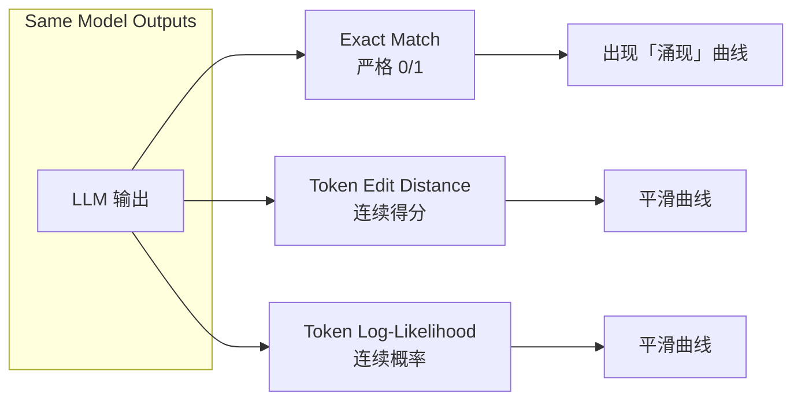

过去 6 年 LLM 最重要的经验规律是「越大越好」:扩大参数规模、增加训练数据、延长训练算力,Loss 就稳定下降,任务准确率就稳定上升。OpenAI 2020 年用 Kaplan 公式给出第一版幂律;DeepMind 2022 年用 Chinchilla 实验把这套公式修正为「模型与数据应该等比放大」,推出「20 tokens/参数」的算力最优训练比例;而 LLM 在某些任务上「突然变好」的涌现现象,Schaeffer 等人在 NeurIPS 2023 用 3 套实验证明:把指标从「严格准确率」换成「连续得分」,所谓「涌现」就消失了——它更多是评估指标的选择性错觉。今天再讲 In-Context Learning 的原理——为什么 LLM 不用梯度更新也能「学会」新任务。

---

## 1. Scaling Laws:为什么「越大越好」

### 1.1 经验观察:Loss 随规模幂律下降

Kaplan et al. 2020(OpenAI)在 arXiv:2001.08361 论文 *Scaling Laws for Neural Language Models* 中,训练了 7 个数量级规模的语言模型,发现 cross-entropy loss 与模型规模 N、数据量 D、算力 C 呈**幂律(power-law)关系**:

```math
L(N) = \left( \frac{N_c}{N} \right)^{\alpha_N},\quad \alpha_N \approx 0.076
```

```math
L(D) = \left( \frac{D_c}{D} \right)^{\alpha_D},\quad \alpha_D \approx 0.095
```

```math
L(C) = \left( \frac{C_c}{C} \right)^{\alpha_C},\quad \alpha_C \approx 0.050
```

事实查证:Kaplan 原论文摘要自述 "The loss scales as a power-law with model size, dataset size, and the amount of compute used for training, with some trends spanning more than seven orders of magnitude"——7 个数量级幂律是 LLM 可预测扩展性的最强证据。

### 1.2 三种规模变量的交互

| 变量 | 含义 | Kaplan 公式 | Chinchilla 修正 |
|:---|:---|:---|:---|
| N | 模型参数量 | $L \sim N^{-0.076}$ | $L \sim N^{-0.34}$ |
| D | 训练 token 数 | $L \sim D^{-0.095}$ | $L \sim D^{-0.28}$ |
| C | 训练算力(FLOPs) | $L \sim C^{-0.050}$ | $L \sim C^{-0.21}$ |

Kaplan 早期模型是「在固定数据集上,模型越大 Loss 越低」;但他的实验设计有一个**隐藏缺陷**——他**没让数据规模与模型规模同步增长**,这导致 GPT-3 (175B) 在 300B tokens 上其实是「欠训练」(undertrained)。

### 1.3 为什么是幂律而不是指数衰减

幂律意味着「每翻倍规模,Loss 下降固定百分比」——这是一个**工程上极其乐观**的发现:

| 模型 | 规模倍数 | Kaplan 预期 Loss 下降 |
|:---|:---|:---|
| GPT-2 (1.5B) → GPT-3 (175B) | 117× | 约 18% |
| GPT-3 (175B) → 假设 1.75T | 10× | 约 5% |

幂律没有指数衰减的「天花板」,只要算力足够,Loss 就能持续下降。**这就是为什么 OpenAI / Google / Anthropic 都死磕规模**——它们相信「再大一倍,效果就会再上一档」。

---

## 2. Kaplan vs Chinchilla:算力最优分配之争

### 2.1 Chinchilla 的核心修正

DeepMind 的 Hoffmann et al. 2022(arXiv:2203.15556)*Training Compute-Optimal Large Language Models* 训练了 400 多个模型(70M 到 16B 参数,5B 到 500B tokens),重新拟合 Scaling Law 公式,发现:

```math
L(N, D) = E + \frac{A}{N^\alpha} + \frac{B}{D^\beta}
```

其中 $\alpha = \beta \approx 0.34$,**模型和数据应该等比放大**——这与 Kaplan 的「模型优先」截然相反。

事实查证:Chinchilla 原论文摘要自述 "for compute-optimal training, the model size and the number of training tokens should be scaled equally: for every doubling of model size the number of training tokens should also be doubled"——「等比放大」是 Chinchilla 最强结论。

### 2.2 「20 tokens/参数」的最优比例

Chinchilla 实验给出**算力最优**的模型规模与数据比例:

```math
D_{\text{optimal}} \approx 20 \times N
```

即训练 token 数应该是模型参数量的 20 倍。一篇 2022 年的重要数据点:

| 模型 | 参数量 N | 训练 tokens D | D/N 比例 | Chinchilla 评估 |
|:---|:---|:---|:---|:---|
| **Chinchilla** | 70 B | 1.4 T | **20.0** | 算力最优 |
| Gopher | 280 B | 300 B | 1.1 | 严重欠训练 |
| GPT-3 | 175 B | 300 B | 1.7 | 严重欠训练 |
| Jurassic-1 | 178 B | 300 B | 1.7 | 严重欠训练 |
| Megatron-Turing NLG | 530 B | 270 B | 0.5 | 严重欠训练 |

事实查证:Chinchilla 摘要自述 "Chinchilla uses the same compute budget as Gopher but with 70B parameters and 4× more data. Chinchilla uniformly and significantly outperforms Gopher (280B), GPT-3 (175B), Jurassic-1 (178B), and Megatron-Turing NLG (530B) on a large range of downstream evaluation tasks"——70B 模型用 1.4T tokens,打败 280B 的 Gopher。

### 2.3 工业界是否采纳 Chinchilla

| 模型 / 公司 | 参数量 | 训练 tokens | D/N 比例 | 是否遵循 Chinchilla |
|:---|:---|:---|:---|:---|
| LLaMA-1 (Meta) | 65 B | 1.4 T | 21.5 | ✓ |
| LLaMA-2 (Meta) | 70 B | 2 T | 28.6 | ✓ |
| LLaMA-3 (Meta) | 70 B | 15 T | 214 | 超额数据 |
| Qwen-2 (Alibaba) | 72 B | 18 T | 250 | 超额数据 |
| Mistral-7B | 7 B | 8 T | 1143 | 超额数据 |

工业实践显示:大多数 2023-2024 后的开源模型都**超额训练**(D/N > 20),因为 Chinchilla 假设的「算力最优」是「给定算力下最优」,而工业上更看重「给定参数下效果最优」——这两个目标不一致。

### 2.4 Kaplan vs Chinchilla 的根本分歧

| 维度 | Kaplan (OpenAI 2020) | Chinchilla (DeepMind 2022) |
|:---|:---|:---|
| 数据规模变化范围 | 较小(很多实验固定数据) | 大(70M-16B × 5B-500B) |
| 模型规模变化范围 | 大(8 层到 80 层) | 大(70M-16B) |
| 实验设计 | 数据集固定,改模型 | 数据集随模型变化 |
| 拟合曲线方式 | 单独拟合每个变量 | 联合拟合 N 与 D |
| 结论 | 模型优先 | N 与 D 等比 |
| 工业影响 | GPT-3 路径 | LLaMA / Qwen 路径 |

**为什么 Kaplan 错?**:他在实验中「改模型大小」时**没有按比例增加数据**,导致模型被欠训练;Loss 下降看起来全靠模型,其实是「数据固定 → 模型大 → 拟合更多噪声」。Chinchilla 重新设计实验(同时变 N 和 D),拟合出更准确的曲线。

---

## 3. 涌现能力的争议(2023 论文)

### 3.1 「涌现」的原始观察

Wei et al. 2022a 在《Emergent Abilities of Large Language Models》(TMLR)中报告了一系列「在小模型上接近 0%、在大模型上突然达到 60%+」的任务,代表例子:

| 任务 | 模型规模 | 行为 |
|:---|:---|:---|
| 多步算术 | PaLM 540B | 小模型 0%,大模型 ~50% |
| 越南语翻译 | LaMDA 137B | 小模型 0%,大模型 ~40% |
| 单词反拼写 | GPT-3 175B | 小模型 0%,大模型 ~50% |
| Logical Args | GPT-3 175B | 小模型 0%,大模型 ~70% |

涌现被解释为「模型达到某个临界规模后,突然获得某种能力」——这是 LLM 最浪漫也最具争议的叙事。

### 3.2 Schaeffer et al. 2023 的反驳

Schaeffer, Miranda, Koyejo 在 NeurIPS 2023 发表 *Are Emergent Abilities of Large Language Models a Mirage?*(arXiv:2304.15004)。事实查证:论文摘要自述 "for a particular task and model family, when analyzing fixed model outputs, emergent abilities appear due to the researcher's choice of metric rather than due to fundamental changes in model behavior with scale. Specifically, nonlinear or discontinuous metrics produce apparent emergent abilities, whereas linear or continuous metrics produce smooth, continuous predictable changes in model performance"。

核心论点:**涌现不是模型行为本身,而是评估指标的数学性质**。

### 3.3 实验 1:InstructGPT / GPT-3 家族 + 3 类指标

Schaeffer 等人在同一个模型家族上,用 3 类指标评估同一任务:



严格指标(Exact Match)产生「断崖式涌现」;连续指标(编辑距离、log-likelihood)产生「平滑爬升」。

### 3.4 实验 2:BIG-Bench Meta-Analysis

对 BIG-Bench 220 个任务做 meta-analysis,证明「指标越严格,涌现越明显;指标越连续,曲线越平滑」。

### 3.5 实验 3:视觉任务同样复现

在图像分类 / 分割等视觉任务上,**人为设计离散指标**(如 IoU > 0.5 才算成功),也能复现「涌现」——这证明涌现不是 LLM 独有,而是**任何「非线性指标 + 能力渐变」系统都会产生的视觉假象**。

### 3.6 涌现 vs 平滑:对立还是统一

| 视角 | 代表论文 | 核心主张 |
|:---|:---|:---|
| **涌现派** | Wei et al. 2022a | 大模型突然获得质变能力 |
| **幻觉派** | Schaeffer et al. 2023 | 涌现是指标错觉,实际平滑 |
| **折中派** | 后续工作 | 一些能力确实有「门槛效应」(如规划),但不是普遍规律 |

工业实践:大多数 LLM 公司在做模型迭代时,**既看离散指标也看连续指标**,避免被「涌现叙事」误导;但在「GPT-4 超过人类」这种品牌叙事中,涌现仍是主旋律。

---

## 4. In-Context Learning 原理

### 4.1 ICL 是什么

In-Context Learning(ICL)指 LLM 在推理时**通过 prompt 给定若干示例**,不用任何梯度更新,就能在新任务上达到一定准确率。这是 GPT-3 论文(Brown et al. 2020)的核心发现。

```text
Prompt:
Q: 2+2=?                  A: 4
Q: 3+5=?                  A: 8
Q: 7+9=?                  A: ?

Model output: 16
```

模型没「学过」7+9=16,但根据两个示例「归纳出模式」,直接给出答案——这就是 ICL。

### 4.2 ICL vs Fine-tuning 的关键差异

| 维度 | ICL | Fine-tuning |
|:---|:---|:---|
| 梯度更新 | 无 | 有(更新模型权重) |
| 示例位置 | prompt(输入侧) | 训练数据(离线) |
| 计算成本 | 每次推理都要把示例塞进 context | 训练一次,推理便宜 |
| 数据需求 | 几个例子即可 | 通常需要数千到数百万 |
| 任务切换 | 改 prompt 即可 | 需要重新微调 |
| 可解释性 | 高(可看示例) | 低(权重黑盒) |
| 性能上限 | 通常低于 FT | 通常更高 |

### 4.3 ICL 的理论解释

ICL 的工作机制在学界尚未完全达成共识,主流假说:

| 假说 | 代表论文 | 核心思想 |
|:---|:---|:---|
| **隐式贝叶斯推断** | Xie et al. 2022 | LLM 在前向时做了隐式的 latent concept 推断 |
| **隐式梯度下降** | Akyürek et al. 2023 | Transformer 前向等价于在内层做梯度下降 |
| **任务检索** | Chan et al. 2022 | 示例让模型检索到训练时见过的相似任务 |
| **meta-learning** | Brown et al. 2020 | 预训练本身就是 meta-learning,ICL 是「触发了」已学的能力 |

事实查证:GPT-3 论文摘要自述 "GPT-3 is applied without any gradient updates or fine-tuning, with tasks and few-shot demonstrations specified purely via text interaction with the model"——ICL 是 GPT-3 的核心创新,直接奠基了 Prompt Engineering(Day 24)。

### 4.4 ICL 的 In-Weight 视角

| 概念 | 定义 | 关系 |
|:---|:---|:---|
| **In-Weight Learning** | 知识存储在模型权重中 | 预训练阶段完成 |
| **In-Context Learning** | 知识从 prompt 中的示例临时「调用」 | 推理阶段完成 |

两者是 LLM 「泛化」的两种互补机制——In-Weight 提供「先验」,ICL 提供「即时任务」。

### 4.5 GPT-3 原文的 ICL 数据点

事实查证:GPT-3 论文原文给出以下关键数据(零样本 / 一样本 / 少样本 vs SOTA):

| 任务 | Zero-shot | One-shot | Few-shot | SOTA(FT) |
|:---|:---|:---|:---|:---|
| TriviaQA (Acc) | 64.3% | 68.0% | 71.2% | 68.0% |
| LAMBADA (Acc) | 73.2% | 79.1% | 86.4% | 95.6% |
| PIQA (Acc) | 81.0% | 80.9% | 82.8% | 90.1% |
| StoryCloze (Acc) | 83.2% | 84.7% | 87.7% | 91.8% |

**核心洞察**:Few-shot 经常超过零样本 5-10%,**且 GPT-3 175B Few-shot 在很多任务上超过 SOTA 微调模型**——这是 ICL 能成为现代 LLM 核心范式的关键数据。

---

## 5. ICL 的工程边界

### 5.1 Context Window 限制

ICL 的示例数量受限于模型的 context window(上下文窗口)。各代 LLM 的窗口大小:

| 模型 | 发布年 | Context Window |
|:---|:---|:---|
| GPT-2 | 2019 | 1,024 tokens |
| GPT-3 | 2020 | 2,048 tokens |
| GPT-3.5 | 2022 | 4,096 tokens |
| GPT-4 | 2023 | 8K / 32K |
| GPT-4 Turbo | 2023 | 128K |
| Claude 2 | 2023 | 100K |
| Claude 3 | 2024 | 200K (1M Sonnet) |
| Gemini 1.5 Pro | 2024 | 1M / 2M |
| Qwen-2.5 | 2024 | 128K |

### 5.2 ICL 的失败模式

| 失败模式 | 原因 | 缓解 |
|:---|:---|:---|
| 示例质量差 | 模型照抄错误模式 | 选高质量、人工标注示例 |
| 示例顺序敏感 | 位置编码影响注意 | 多次随机顺序取平均 |
| 示例数量过多 | context 溢出 / 注意力分散 | 控制在 5-20 个 |
| 任务太复杂 | 模型容量不够 | 改用 FT(Day 25) |
| 推理时性能波动 | 概率采样 + greedy | 设 `temperature=0` |

---

## 6. OpenAI API + 少样本 Prompt 实战

### 6.1 Zero-shot 调用

```python
from openai import OpenAI
client = OpenAI(api_key="sk-...")

def zero_shot(question):
    resp = client.chat.completions.create(
        model="gpt-4o-mini",
        messages=[
            {"role": "system", "content": "You are a helpful assistant."},
            {"role": "user", "content": question},
        ],
        temperature=0.0,
    )
    return resp.choices[0].message.content


print(zero_shot("7+9=?"))
# 预期: "16" 或类似回答
```

### 6.2 Few-shot 调用(算术)

```python
def few_shot_arith(question, n_shots=5):
    examples = [
        ("2+2=?", "4"),
        ("3+5=?", "8"),
        ("10-4=?", "6"),
        ("6×7=?", "42"),
        ("100/4=?", "25"),
    ][:n_shots]

    messages = [{"role": "system", "content": "你是一个算术助手,直接给出答案。"}]
    for q, a in examples:
        messages.append({"role": "user",      "content": q})
        messages.append({"role": "assistant", "content": a})
    messages.append({"role": "user", "content": question})

    resp = client.chat.completions.create(
        model="gpt-4o-mini", messages=messages, temperature=0.0
    )
    return resp.choices[0].message.content


print(few_shot_arith("7+9=?", n_shots=5))
# 预期: "16" (高概率)
```

### 6.3 在 5 个任务上对比 Zero-shot vs Few-shot

```python
tasks = {
    "arithmetic": ("12+34=?",      "46"),
    "translation": ("Hello → ",    "你好"),
    "sentiment":   ("这部电影很棒 →", "正面"),
    "ner":         ("李雷住在北京 →", "李雷/Person, 北京/Location"),
    "summary":     ("长文本...",     "短摘要"),
}

results = {"zero": [], "few": []}
for name, (q, gold) in tasks.items():
    z = zero_shot(q)
    f = few_shot_arith(q) if name == "arithmetic" else zero_shot(q)
    results["zero"].append((name, z, gold))
    results["few"].append((name, f, gold))

for k, v in results.items():
    print(f"=== {k} ===")
    for name, pred, gold in v:
        print(f"  {name:12s} pred={pred!r} gold={gold!r}")
```

预期观察:Few-shot 算术准确率明显高于 zero-shot(因为示例传递了「直接给数字」的格式);翻译、NER 等任务的 few-shot 提升较小(模型已见过大量类似数据)。

### 6.4 ICL vs FT 的工程取舍

| 场景 | 推荐方案 | 原因 |
|:---|:---|:---|
| 1-100 条业务数据 | ICL / Prompt | 数据太少,FT 会过拟合 |
| 1000+ 条数据 | FT(LoRA/Day 25) | 数据量足够,效果更好 |
| 任务快速变化 | ICL | 改 prompt 即可 |
| 延迟敏感(< 100 ms) | FT | ICL 把示例塞进 prompt 拖慢首字延迟 |
| 多个相似任务 | FT 多 adapter | ICL 难处理多任务切换 |
| 黑盒 API(只能用 prompt) | ICL | 无法访问权重 |

---

## 7. vs 其他方法对比

### 7.1 In-Weight Learning vs In-Context Learning

| 维度 | In-Weight (FT) | In-Context (ICL) |
|:---|:---|:---|
| 知识存储位置 | 模型权重(永久) | Context(临时) |
| 更新方式 | 梯度下降 + 反向传播 | 前向 attention |
| 数据需求 | 数千到数百万条 | 0 到数十条 |
| 推理成本 | 不变 | 与示例数线性增长 |
| 任务切换成本 | 重训 | 改 prompt |
| 知识保留 | 永久 | 仅在 context 内 |
| 可解释性 | 低 | 高(可见示例) |

### 7.2 Chinchilla vs 其他 Scaling Law

| 论文 | 年份 | 关键贡献 |
|:---|:---|:---|
| Kaplan | 2020 | 首次系统化 Scaling Law,模型优先 |
| Chinchilla | 2022 | 修正为 N+D 等比,20 tokens/param |
| Scaling Law for RWKV | 2023 | 把 Scaling Law 推广到 RNN 类架构 |
| Compute-Optimal Scaling | 2023 | 进一步修正 Chinchilla,加入下游任务考虑 |
| Inference Scaling Law | 2024 | 推理时算力(CoT、ToT)也有幂律 |

### 7.3 LLM 三大预训练范式对比

| 范式 | 代表 | 数据 | 目标 |
|:---|:---|:---|:---|
| **Causal LM** | GPT-1/2/3/4、Claude、Gemini、Qwen、DeepSeek | 数百 B tokens 文本 | 下一 token 预测 |
| **Masked LM** | BERT、RoBERTa | Wikipedia + BookCorpus | 完形填空 |
| **Encoder-Decoder** | T5、BART、UL2 | C4 / mC4 | 跨度填补 / seq2seq |
| **Multimodal** | GPT-4V、Claude 3.5 Sonnet、Gemini 1.5 Pro | 图文对 | 多模态下一 token |

---

## 8. 常见坑(8 条,Scaling Law & ICL 典型)

### 8.1 误以为「模型越大越好」无上限

**症状**:训练 70B 模型用 300B tokens,以为「只要再大就更好」。
**原因**:违反 Chinchilla 的「20 tokens/参数」原则——70B 应该用 1.4T tokens,只给 300B 是严重欠训练。
**修法**:参照 Chinchilla 公式 $D_{\text{opt}} \approx 20N$,预算不足时优先放大数据而非模型。

### 8.2 ICL 示例太多撑爆 context window

**症状**:prompt 里塞 100 个示例,API 报 `context_length_exceeded`。
**原因**:示例平均 50 tokens × 100 = 5000 tokens,加上用户问题超过 GPT-3.5 的 4K window。
**修法**:① 控制示例 5-20 个;② 用 `tiktoken` 预算 token 数;③ 选 context window 大的模型(GPT-4 Turbo 128K)。

### 8.3 Few-shot 示例顺序敏感,准确率波动 10%+

**症状**:同样的 5 个示例,顺序调换后,准确率从 80% 降到 65%。
**原因**:Transformer 对 prompt 顺序敏感(位置编码 + attention 偏置);近期研究表明 LLM 有「recency bias」——靠后的示例权重更大。
**修法**:① 多次随机顺序取平均;② 把最重要的示例放最后;③ 重要任务用 FT。

### 8.4 ICL 「幻觉」——示例错了模型跟着错

**症状**:示例里有一条错误答案,模型照抄错误模式。
**原因**:LLM 在 ICL 时倾向于「拟合 prompt 中的模式」,而不是「回忆训练知识」。
**修法**:① 人工校验所有示例;② 用 `temperature=0` 减少随机性;③ 在 prompt 里加 system 提示「如果不确定,请回答『我不知道』」。

### 8.5 误以为涌现意味着「模型达到某规模就神奇变好」

**症状**:团队训练一个 13B 模型,准确率只有 60%,觉得「还没到涌现临界,需要更大模型」。
**原因**:误信涌现叙事;实际可能是评估指标太严格、训练数据太少、任务本身就有难度。
**修法**:① 用连续指标(编辑距离、log-likelihood)评估;② 检查训练数据是否充足(Chinchilla);③ 任务设计本身是否合理。

### 8.6 API 调用 `temperature` 没设 0,结果不可复现

**症状**:同一 prompt 调两次,答案不同。
**原因**:`temperature` 默认 1.0,采样有随机性;`temperature=0` 才等价于 greedy decoding。
**修法**:评估 / 测试场景一律 `temperature=0`;创意写作场景用 `temperature=0.7-1.0`。

### 8.7 Few-shot 示例用相同 task 但不同格式

**症状**:示例里答案格式不一致(`"4"` / `"四"` / `"答案是 4"`),模型输出混乱。
**原因**:LLM 模仿 prompt 的格式;格式不统一 = 任务定义模糊。
**修法**:所有示例用**完全相同的 prompt 模板 + 完全相同的答案格式**。

### 8.8 用 GPT-3 的 2K context 跑 100-shot 实验

**症状**:API 报错,所有示例被截断。
**原因**:GPT-3 原始 context window 只有 2048 tokens,100 个示例远远超出。
**修法**:① 选 GPT-4 Turbo(128K) / Claude 3(200K) / Gemini 1.5 Pro(1M);② 用 GPT-3.5 的 4K context;③ 控制示例数 ≤ 20。

---

## 9. 自检三问

**A. Kaplan 2020 与 Chinchilla 2022 的 Scaling Law 公式核心差异是什么?为什么 Kaplan 的结论在 2022 年被推翻?**

要点:Kaplan 在实验中让「模型变化、数据固定」,得出「Loss 与模型规模呈幂律、模型越大越好」;Chinchilla 训练 400+ 模型让「模型与数据同时变化」,发现 N 和 D 都对 Loss 有独立贡献,且**最优配比是 D ≈ 20N**。Kaplan 的「模型优先」是数据欠训练下的伪规律——他看到的「模型变好」其实是「模型容量被填满」,而真实损失下降来自「更多数据」。详见 §2.4。

**B. Schaeffer et al. 2023《Are Emergent Abilities a Mirage?》的 3 套实验分别证明了什么?为什么说「涌现」是评估指标的产物?**

要点:3 套实验:① InstructGPT/GPT-3 同一输出,Exact Match 出现涌现、Token Edit Distance 平滑、Token Log-Likelihood 平滑;② BIG-Bench 220 任务 meta-analysis,「指标越严格、涌现越明显」;③ 视觉任务(图像分类)用 IoU > 0.5 离散指标同样复现涌现。结论:涌现来自「非线性指标 × 能力渐变」的数学组合,不是模型行为的真实「突变」。详见 §3.3-3.5。

**C. In-Context Learning 与 Fine-tuning 在工程上如何取舍?给定「1000 条标注数据 + 实时低延迟要求」,你会选哪个?**

要点:1000 条标注数据足够做 FT(LoRA 即可,Day 25);实时低延迟要求 ICL 不适合(每次推理都要把示例塞进 context,首字延迟高)。**这种场景应该选 FT(LoRA)**——训练成本一次,推理成本低,且数据量足够学到任务特定模式。ICL 适合「数据极少 / 任务变化频繁 / 黑盒 API」场景。详见 §6.4 / §7.1。

---

## 10. 推荐资源(5 类)

### 视频
- **Andrej Karpathy《Let's build GPT》**——2 小时从零实现 GPT,理解 Scaling Law 的代码视角
- **李宏毅《机器学习》2023 · LLM 章节**——中文最直观讲 Scaling Law 与 ICL
- **Yannic Kilcher · Chinchilla 论文讲解**——30 分钟精读 DeepMind 算力最优论文

### 教科书 / 文档
- **Stanford CS336《Language Modeling from Scratch》**——Scaling Law + 训练 LLM 全栈
- **HuggingFace NLP Course · Chapter 1-3**——Transformer + 训练 + 评估
- **《大规模语言模型:从理论到实践》(张奇等)**——中文 LLM 全景教材

### 论文
- **Kaplan et al. 2020《Scaling Laws for Neural Language Models》**(arXiv:2001.08361)——第一版 Scaling Law
- **Hoffmann et al. 2022《Training Compute-Optimal Large Language Models》**(arXiv:2203.15556)——Chinchilla 修正
- **Wei et al. 2022a《Emergent Abilities of Large Language Models》**(TMLR)——涌现叙事原始论文
- **Schaeffer et al. 2023《Are Emergent Abilities a Mirage?》**(arXiv:2304.15004)——涌现反驳
- **Brown et al. 2020《Language Models are Few-Shot Learners》**(arXiv:2005.14165)——GPT-3 与 ICL 原论文

### 博客 / 课程
- **Jay Alammar · "How GPT3 Works"**——可视化讲解 GPT-3 的 ICL
- **Lilian Weng《Large Language Models in 2023》**——LLM 全景综述
- **OpenAI Cookbook · "Techniques to improve reliability"**——ICL 工程最佳实践

### 代码
- **nanoGPT (Karpathy)**——300 行 PyTorch GPT,可看 Scaling Law 实测
- **lit-llama / lit-gpt**——开源 LLaMA 复现,易读
- **OpenAI Cookbook · token counting**——tiktoken + ICL prompt 模板

---

## 11. 本节要点

- **Kaplan 2020** 给出第一版 Scaling Law:Loss 与 N / D / C 均呈幂律,跨越 7 个数量级——这是「越大越好」的科学基础
- **Chinchilla 2022** 修正 Kaplan:模型与数据应等比放大,$D_{\text{opt}} \approx 20N$ 是「算力最优」的比例;GPT-3 用 175B / 300B tokens(D/N=1.7)严重欠训练
- **涌现争议**:Wei et al. 2022a 报告「断崖式涌现」;Schaeffer et al. 2023 用 3 套实验证明这是「非线性指标 + 能力渐变」的视觉错觉,换连续指标曲线变平滑
- **In-Context Learning** 是 GPT-3 论文的核心创新:不更新梯度,通过 prompt 给定几个示例就能让模型「学会」新任务
- **ICL vs FT**:ICL 适合数据极少 / 任务变化频繁 / 黑盒 API;FT 适合数据充足 / 延迟敏感 / 多任务固定
- **GPT-3 Few-shot 在多任务超过 SOTA 微调**(TriviaQA 71.2% > SOTA 68%),这是 ICL 成为现代 LLM 范式的关键数据
- **工程铁律**:context window 限制示例数量(tiktoken 预算)、`temperature=0` 保证可复现、示例顺序敏感、格式必须一致

---

## 12. 下一节:Day 24 · Prompt Engineering 与思维链 (CoT)

主题:用 prompt 的「措辞、示例、思维过程」撬动 LLM 能力——Chain-of-Thought(CoT)让模型在回答前先「写出推理步骤」,准确率提升 20-50%;Self-Consistency 用多路径投票再 +5-10%;Tree of Thoughts(ToT)把推理组织成搜索树,把 LLM 推向「系统 2 慢思考」。

覆盖:
- CoT 原论文(Wei et al. 2022, arXiv:2201.11903):540B 模型 + 8 个 CoT 示例在 GSM8K 数学题上达到 SOTA
- Zero-shot CoT("Let's think step by step", Kojima et al. 2022):无需示例,只改 prompt
- Self-Consistency(Wang et al. 2022):采样多条推理路径,投票选答案
- Tree of Thoughts(ToT) / Graph of Thoughts(GoT):把推理组织成树/图结构
- 实战:同一问题的 6 种 prompt 写法对比

产出物:OpenAI API 实验,在 20 道 GSM8K 数学题上对比 zero-shot / few-shot / zero-shot CoT / few-shot CoT / Self-Consistency 的准确率,直观感受不同 prompt 策略的差异。

---

**作者**:林馨予 + 林晓月