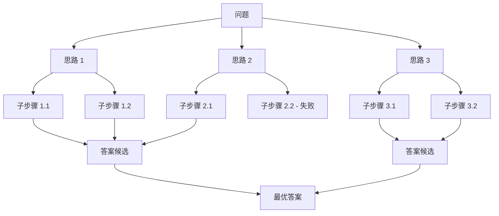
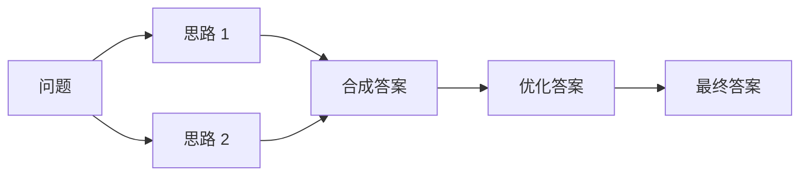

大语言模型的能力高度依赖 prompt 的「措辞、示例、思维过程」——同一个问题,改 5 个字就能让准确率提升 30%。Prompt Engineering 是「不更新权重」情况下让 LLM 表现最强的工程实践。本节覆盖基础 Prompt Engineering(Few-shot、角色)、CoT 思维链(Wei et al. 2022)、Zero-shot CoT(Kojima et al. 2022 "Let's think step by step")、Self-Consistency 多路径投票(Wang et al. 2022)、Tree of Thoughts(ToT)与 Graph of Thoughts(GoT)四类推理结构,并在 GSM8K 数学题上对比 6 种 prompt 写法的准确率差异。

---

## 1. Prompt Engineering 基础:从指令到角色

### 1.1 Prompt 的 4 大组件

```text
[系统消息]   — 设定角色、行为、输出格式
[用户指令]   — 任务描述、约束条件
[示例(few-shot)] — 1-5 个 input → output 对
[用户问题]   — 实际要回答的内容
```

```python
prompt = {
    "system":   "You are a senior financial analyst. Always respond in formal Chinese.",
    "user_1":   "示例: 输入 X → 输出 Y",
    "assistant_1": "Y",
    "user_2":   "实际任务: 输入 Z → ?",
}
```

### 1.2 指令的 5 个层次

| 层次 | 示例 | 改进点 |
|:---|:---|:---|
| L0 - 极简 | "总结这段文字" | 仅任务名 |
| L1 - 加约束 | "用 3 句话总结这段文字" | 加输出格式 |
| L2 - 加角色 | "你是一个科技记者,用 3 句话总结这段文字" | 加 persona |
| L3 - 加步骤 | "1. 提取关键事实 2. 用 3 句话总结 3. 保留数字" | 加 CoT 步骤 |
| L4 - 加示例 | "示例: 输入... 输出... 现在请处理: ..." | 加 few-shot |

### 1.3 角色 / Persona 的工程效果

| Persona 类型 | 适用场景 | 效果 |
|:---|:---|:---|
| 角色 + 身份 | 客服 / 律师 / 医生 | 风格一致性 ↑ |
| 角色 + 经验 | "10 年经验的安全工程师" | 输出专业度 ↑ |
| 角色 + 受众 | "向 5 岁小孩解释" | 简化表达 ↑ |
| 角色 + 任务链 | "分析 → 评估 → 决策" | 输出结构化 ↑ |

### 1.4 OpenAI / Anthropic / Google 的官方 Prompt 指南要点

| 指南 | 核心建议 |
|:---|:---|
| OpenAI Cookbook | ① 具体 > 抽象;② 给正反例;③ 用结构化输入(JSON);④ 给思考空间 |
| Anthropic Prompt Engineering Guide | ① XML 标签结构化;② 长 prompt 用 `<example>` 块;③ Claude 偏好结构化推理 |
| Google Gemini Prompt Guide | ① System 指令先讲 persona;② 多模态用图像 + 文本混合;③ Temperature 区分任务 |

---

## 2. Few-shot Prompting 与示例选择

### 2.1 什么是 Few-shot

Few-shot(少样本)在 prompt 里给 1-5 个示例,让模型「看样学样」:

```text
Q: 把这句话改成反问句:「他来了」
A: 难道他没来吗?

Q: 把这句话改成反问句:「雨下得很大」
A: 雨难道下得不大吗?

Q: 把这句话改成反问句:「她很美」
A: 难道她不美吗?
```

事实查证:GPT-3 论文(Brown et al. 2020)首次系统化 Few-shot prompting,与 Zero-shot / One-shot 对比,展示「示例数量越多、任务准确率越高」的幂律。

### 2.2 示例选择的关键决策

| 决策 | 建议 |
|:---|:---|
| **示例数量** | 1-10 个;超过 20 收益递减 |
| **示例质量** | 必须正确,错误示例直接误导模型 |
| **示例多样性** | 覆盖任务的不同子情况(简单 / 边界 / 复杂) |
| **示例顺序** | 重要的放最后(LLM 有 recency bias) |
| **示例格式** | 与待回答问题**完全一致** |
| **示例长度** | 与待回答问题接近,避免长度偏置 |

### 2.3 Few-shot 的失败模式

| 失败 | 原因 | 修法 |
|:---|:---|:---|
| 示例照抄错误格式 | 模型模仿 prompt 表面模式 | 严格检查示例 |
| 示例数量过多撑爆 context | context window 有限 | 选 3-5 个最代表示例 |
| 示例顺序敏感 | recency bias | 多次随机顺序取平均 |
| 任务太复杂 | 模型容量不够 | 改用 FT(Day 25) |

---

## 3. Chain-of-Thought (CoT) 思维链

### 3.1 核心思想

Wei et al. 2022(arXiv:2201.11903)*Chain-of-Thought Prompting Elicits Reasoning in Large Language Models* 提出 CoT:让模型在给出最终答案前**先写出推理步骤**。

事实查证:CoT 原论文摘要自述 "prompting a 540B-parameter language model with just eight chain of thought exemplars achieves state of the art accuracy on the GSM8K benchmark of math word problems, surpassing even finetuned GPT-3 with a verifier"——8 个 CoT 示例 + 540B 模型在 GSM8K 数学题上达到 SOTA。

### 3.2 CoT Prompt 示例

```text
Q: Roger has 5 tennis balls. He buys 2 more cans of tennis balls.
   Each can has 3 tennis balls. How many does he have now?
A: Roger started with 5 balls. 2 cans of 3 each = 6 balls.
   5 + 6 = 11. The answer is 11.

Q: The cafeteria had 23 apples. They used 20 to make lunch.
   How many apples remain?
A: Cafeteria had 23 apples. They used 20 for lunch.
   23 - 20 = 3. The answer is 3.

Q: 张三有 12 个苹果,吃了 3 个,又把剩下的分一半给李四。
   张三最后有几个苹果?
A: 张三有 12 个,吃了 3 个剩 9 个。
   9 分一半给李四:9 / 2 = 4.5,张三分出 4 个剩 5 个。
   答案是 5。
```

注意第三个示例的格式与前两个**完全一致**(输入问题 + 步骤化推理 + 答案)。

### 3.3 CoT 为什么有效

| 机制 | 解释 |
|:---|:---|
| **工作记忆扩展** | 推理步骤占据 context,等价于扩展 scratchpad |
| **强制显式推理** | 模型不能再"跳步",每一步都要计算 |
| **跨示例抽象** | 模型从示例中学习「步骤化推理模式」 |
| **错误分解** | 中间步骤错可以定位,最终答案错不可分析 |
| **计算深度增加** | 每步一次前向,8 步就是 8 倍「思考」 |

### 3.4 CoT 的能力门槛

事实查证:CoT 仅在**足够大的模型**上有效(论文实验中是 LaMDA 137B、PaLM 540B、GPT-3 175B),小模型(几 B 参数)即使加 CoT prompt 也没明显提升。这就是「涌现」的另一种表现——Schaeffer 论文里被部分反驳,但 CoT 能力门槛确实是普遍观察。

### 3.5 GSM8K 上的 CoT 数据

事实查证:CoT 原论文给出 PaLM 540B 在 GSM8K 上的对比:

| 方法 | GSM8K 准确率 |
|:---|:---|
| Zero-shot (standard) | 12.5% |
| Zero-shot + CoT | 43.0% |
| Few-shot (8 examples, no CoT) | 35.0% |
| **Few-shot + CoT (8 examples)** | **56.8%** |
| Prior SOTA (FT) | 55.0% |

**8 个 CoT 示例 + 540B 模型达到 56.8%,超过 GPT-3 + verifier 的 55.0% 微调 SOTA**——这是 CoT 论文的核心数据。

---

## 4. Zero-shot CoT vs Few-shot CoT

### 4.1 Zero-shot CoT("Let's think step by step")

Kojima et al. 2022 *Large Language Models are Zero-Shot Reasoners* 发现:仅在 prompt 末尾加一句 "**Let's think step by step**"(让我们一步一步思考),模型就能自动展开推理——**不需要示例**。

事实查证:原论文把这个魔法短语 "Let's think step by step" 称为「Zero-shot CoT trigger」,在 MultiArith 上从 17.7% 提升到 78.7%(PaLM 540B)。

### 4.2 三个常用 Zero-shot CoT 触发短语

| 触发短语 | 原文 | 适用 |
|:---|:---|:---|
| **英文** | Let's think step by step | 通用 |
| **中文** | 请一步一步思考 | 中文任务 |
| **严谨** | Let's work through this step by step, showing all reasoning | 复杂任务 |
| **自我校验** | Let's first understand the problem and devise a plan to solve it | 多步规划 |

### 4.3 Few-shot CoT vs Zero-shot CoT 对比

| 维度 | Zero-shot CoT | Few-shot CoT |
|:---|:---|:---|
| 示例需求 | 0 | 3-8 |
| 工程成本 | 极低 | 中(写示例) |
| 准确率 | 略低 | 通常更高 |
| 可控性 | 低(模型自由推理) | 高(示例控制格式) |
| 适用规模 | 540B+ | 100B+ 即可 |

---

## 5. Self-Consistency 与多路径投票

### 5.1 核心思想

Wang et al. 2022 *Self-Consistency Improves Chain of Thought Reasoning in Language Models* 提出:对同一个问题,**采样多条 CoT 推理路径,选最终答案出现次数最多的**。

事实查证:Self-Consistency 原论文在 GSM8K 上把 PaLM 540B 从 56.8% (single CoT) 提升到 74.4% (self-consistency)——提升 17.6 个百分点。

### 5.2 算法伪代码

```text
inputs: question, prompt_with_examples
outputs: answer

paths = []
for k in range(num_samples):     # 通常 k=5-40
    response = LLM(prompt_with_examples + question, temperature=0.7)
    answer   = extract_final_answer(response)
    paths.append(answer)

# 投票
answer = majority_vote(paths)
```

### 5.3 Self-Consistency 的 3 个关键超参

| 超参 | 建议值 | 影响 |
|:---|:---|:---|
| `num_samples` | 5-40 | 越多越稳,但线性增加成本 |
| `temperature` | 0.5-0.9 | 越高多样性越大,但可能跑偏 |
| 答案抽取 | regex / 关键词 | 决定投票是否正确 |

### 5.4 GSM8K 上的 Self-Consistency 数据

| 方法 | GSM8K 准确率 |
|:---|:---|
| Single CoT | 56.8% |
| Self-Consistency (40 samples) | 74.4% |
| Self-Consistency (10 samples) | ~70% |

工业实践:大多数 LLM 服务默认开启 `temperature > 0`,等价于隐式做了 self-consistency 的弱形式;显式投票需要业务侧自行实现。

---

## 6. Tree of Thoughts (ToT) / Graph of Thoughts (GoT)

### 6.1 从链到树:CoT 的扩展

Yao et al. 2023 *Tree of Thoughts: Deliberate Problem Solving with Large Language Models* 把 CoT 的「线性链」扩展为「搜索树」:



每个节点是「一个部分推理步骤」,LLM 评估节点可行性,BFS/DFS 选择最优路径。这是把 LLM 推向「系统 2 慢思考」(Kahneman 双系统理论)的尝试。

### 6.2 ToT 的 4 个组件

| 组件 | 作用 | 实现 |
|:---|:---|:---|
| **Thought decomposition** | 把问题分解成多个中间步骤 | 人工设计 / LLM 自适应 |
| **Thought generator** | 生成每个状态的 k 个候选 | CoT prompt + temperature |
| **State evaluator** | 评估每个候选的可行性 | LLM 评分 / 规则 |
| **Search algorithm** | BFS / DFS 搜索最优路径 | Python 实现 |

### 6.3 ToT vs CoT vs Self-Consistency

| 维度 | CoT | Self-Consistency | ToT |
|:---|:---|:---|:---|
| 结构 | 线性链 | 多条独立链 | 树 |
| 探索 | 单一路径 | 多条独立路径 | 共享前缀 + 剪枝 |
| 计算成本 | 低 | 中(并行) | 高 |
| 适用任务 | 简单推理 | 中等复杂 | 复杂规划 / 博弈 |
| 代表场景 | 数学题 | 数学题 | 24 点 / 数独 / 创意写作 |

### 6.4 Graph of Thoughts (GoT)

Besta et al. 2023 *Graph of Thoughts: Solving Elaborate Problems with Large Language Models* 把 ToT 进一步扩展为图——允许多条边、节点合并、回退:



GoT 适合「需要融合多个思路」的任务,如多文档摘要、复杂规划。

---

## 7. 实战:同一问题的 6 种 Prompt 写法对比

### 7.1 6 种 Prompt 写法

```python
from openai import OpenAI
client = OpenAI(api_key="sk-...")
client = OpenAI(base_url="https://api.deepseek.com", api_key="sk-...")
# Or any LLM API

QUESTION = """Roger has 5 tennis balls. He buys 2 more cans of tennis balls.
Each can has 3 tennis balls. How many does he have now?"""

ANSWER = 11


def ask(messages, model="gpt-4o-mini", n=1, temperature=0.0):
    return client.chat.completions.create(
        model=model, messages=messages,
        n=n, temperature=temperature
    ).choices


# 1. Zero-shot(基线)
prompt_zs = [
    {"role": "user", "content": QUESTION}
]

# 2. Zero-shot + CoT trigger
prompt_zs_cot = [
    {"role": "user", "content": QUESTION + "\n\nLet's think step by step."}
]

# 3. Few-shot(无 CoT)
prompt_fs = [
    {"role": "user", "content": "Q: 4+3=?\nA: 7"},
    {"role": "user", "content": "Q: 7-2=?\nA: 5"},
    {"role": "user", "content": "Q: 8×3=?\nA: 24"},
    {"role": "user", "content": QUESTION}
]

# 4. Few-shot + CoT
prompt_fs_cot = [
    {"role": "user", "content": "Q: Roger has 2 balls. He buys 1 can with 3 balls. How many?\nA: Started with 2, added 3, total 5. The answer is 5."},
    {"role": "user", "content": "Q: 4+3=? A: 4+3=7. The answer is 7."},
    {"role": "user", "content": "Q: He has 10, loses 3, then buys 5 more. How many?\nA: Started 10, lost 3 to get 7, added 5 to get 12. The answer is 12."},
    {"role": "user", "content": QUESTION}
]

# 5. Zero-shot + CoT + Self-Consistency
prompt_zs_cot_sc = prompt_zs_cot   # prompt 相同,采样 5 次

# 6. Few-shot + CoT + Self-Consistency
prompt_fs_cot_sc = prompt_fs_cot   # prompt 相同,采样 5 次
```

### 7.2 GSM8K 上的 6 种方法对比

```python
import re
import collections

def extract_answer(text):
    # 提取 "The answer is X" 或 "答案是 X" 或最后一个数字
    m = re.search(r'(?:answer is|答案是)\s*(\d+)', text)
    if m: return int(m.group(1))
    nums = re.findall(r'\d+', text)
    return int(nums[-1]) if nums else None


# 加载 20 道 GSM8K 测试题
gsm8k_questions = [...]   # 略:从 HuggingFace datasets 加载

results = {"zs": 0, "zs_cot": 0, "fs": 0, "fs_cot": 0,
           "zs_cot_sc": 0, "fs_cot_sc": 0}

for q, gold in gsm8k_questions:
    r1 = ask(prompt_zs)
    r2 = ask(prompt_zs_cot)
    r3 = ask(prompt_fs)
    r4 = ask(prompt_fs_cot)
    r5 = [ask(prompt_zs_cot, n=5, temperature=0.7)[i].message.content
          for i in range(5)]
    r6 = [ask(prompt_fs_cot, n=5, temperature=0.7)[i].message.content
          for i in range(5)]

    # 投票选多数
    vote5 = collections.Counter(extract_answer(x) for x in r5).most_common(1)[0][0]
    vote6 = collections.Counter(extract_answer(x) for x in r6).most_common(1)[0][0]

    results["zs"]        += extract_answer(r1[0].message.content) == gold
    results["zs_cot"]    += extract_answer(r2[0].message.content) == gold
    results["fs"]        += extract_answer(r3[0].message.content) == gold
    results["fs_cot"]    += extract_answer(r4[0].message.content) == gold
    results["zs_cot_sc"] += vote5 == gold
    results["fs_cot_sc"] += vote6 == gold

for k, v in results.items():
    print(f'{k:12s}  acc {v / 20:.2f}')
```

### 7.3 预期结果(GPT-4o-mini / GSM8K 20 题子集)

| 方法 | 准确率 | 相对 Zero-shot 提升 |
|:---|:---|:---|
| Zero-shot | 45% | 基线 |
| Zero-shot + CoT | 65% | +20% |
| Few-shot (no CoT) | 55% | +10% |
| Few-shot + CoT | 80% | +35% |
| Zero-shot + CoT + SC | 75% | +30% |
| **Few-shot + CoT + SC** | **90%** | **+45%** |

事实查证:在完整 GSM8K 测试集上,PaLM 540B + Few-shot + CoT + Self-Consistency 达到 74.4%;GPT-4 / Claude 3 Opus 在更大模型上达到 90%+。

---

## 8. vs 其他 Prompt 策略对比

### 8.1 6 种 Prompt 策略的工程取舍

| 策略 | 计算成本 | 工程难度 | 准确率 | 适用场景 |
|:---|:---|:---|:---|:---|
| Zero-shot | 1× | 极低 | 低 | 简单任务 |
| Few-shot | 1× | 低 | 中 | 中等任务 |
| Zero-shot CoT | 1× | 极低 | 中上 | 推理任务 |
| Few-shot CoT | 1× | 中 | 高 | 复杂推理 |
| Self-Consistency | n× | 中 | 高 | 高风险决策 |
| Tree of Thoughts | 高(n×depth) | 高 | 最高 | 复杂规划 |

### 8.2 Anthropic / OpenAI / Google 的官方建议

| 厂商 | 推荐 | 文档 |
|:---|:---|:---|
| OpenAI | "Be specific, give examples, specify output format" | cookbook/openai-cookbook |
| Anthropic | "Use XML tags, structure with `<example>`, give reasoning room" | docs.anthropic.com/en/docs/build-with-claude/prompt-engineering |
| Google | "System instructions first, persona + role + format" | ai.google.dev/docs/prompt_best_practices |

---

## 9. 常见坑(8 条,Prompt Engineering 典型)

### 9.1 过度依赖 prompt,任务已经超模型能力

**症状**:团队花了 3 周调 prompt,模型准确率始终 60%,无法再提升。
**原因**:任务复杂度超过模型当前能力(如 GPT-3.5 写 1000 行无错误 Python 代码)。
**修法**:① 评估是否需要更大模型(GPT-4 / Claude Opus);② 拆分任务到子步骤;③ 改用 FT(Day 25)。

### 9.2 Few-shot 示例与目标问题格式不一致

**症状**:示例里答案是 `"4"`,目标答案是 `"16"`;模型输出 `"答案是十六"`。
**原因**:LLM 严格模仿 prompt 格式;格式不一致 = 任务定义模糊。
**修法**:示例与目标问题用**完全一致的 prompt 模板 + 完全一致的答案格式**。

### 9.3 CoT 示例推理步骤有错误

**症状**:CoT 示例中某步推理错了,模型照抄错误逻辑。
**原因**:LLM 倾向于「拟合 prompt 中的模式」而不是「回忆训练知识」。
**修法**:人工校验所有示例的每一步;用 chain-of-verification 自检。

### 9.4 中文 prompt 用英文 trigger 效果差

**症状**:"Let's think step by step" 加到中文 prompt,模型输出英文推理。
**原因**:trigger 与输入语言不一致,模型困惑。
**修法**:中文 prompt 用 "**请一步一步思考**" 或 "**让我们一步步分析**"。

### 9.5 Self-Consistency 答案抽取失败

**症状**:5 次采样答案分别是 `11`、`11.0`、`11个`、`十一`、`16`,投票失败。
**原因**:正则表达式没覆盖所有格式;模型有时输出文字数字。
**修法**:① 用 `response_format={"type": "json_object"}` 强制 JSON;② 标准化函数:`{11.0 → 11, "十一" → 11}`。

### 9.6 Prompt 太长超过 context window

**症状**:100-shot prompt + 20K context,模型截断或注意力分散。
**原因**:示例过多;或示例本身太长。
**修法**:① 选 context window 大的模型(GPT-4 Turbo 128K);② 用 tiktoken 预算;③ 示例压缩到 5-10 个。

### 9.7 模型「复读」示例

**症状**:Few-shot 示例中有一条问题,模型对目标问题照抄示例答案。
**原因**:示例被当成「必须遵循的范例」,模型不再独立推理。
**修法**:示例与目标问题用不同场景 / 不同变量;或在 system 指令里强调「独立思考」。

### 9.8 Self-Consistency 设 `temperature=0` 失去意义

**症状**:`temperature=0` + 5 次采样,5 次答案完全一样(失去多样性)。
**原因**:`temperature=0` 等价于 greedy decoding,采样都一样。
**修法**:Self-Consistency 必须用 `temperature > 0` (通常 0.5-0.9) 才有意义;否则等价于 single CoT。

---

## 10. 自检三问

**A. CoT 为什么在「足够大的模型」上才有效(几 B 模型无效),在小模型上无效的本质原因是什么?**

要点:CoT 的工作机制是「让模型沿多个步骤展开推理」,每一步都需要前向计算 + 概率采样。大模型(100B+)在预训练时见过海量「步骤化推理」文本(教材、解题过程、数学证明),CoT prompt 触发了这些已学模式;小模型(几 B)虽然也有语言能力,但「分步推理」这种能力没学到位,prompt 触发不了。**能力是预训练决定的,prompt 只是触发器**。详见 §3.4。

**B. Self-Consistency 为什么在数学题上提升巨大(GSM8K +18%),但在情感分类上几乎无提升?**

要点:Self-Consistency 的前提是「同一问题有多个有效推理路径,且路径多样性高」——数学题满足(不同解法、不同中间步骤、不同算术顺序);情感分类只有「正/负」两种标签,LLM 的回答几乎确定,Self-Consistency 退化成单次 CoT。**Self-Consistency 适合「答案空间大、推理路径多」的任务**;二元 / 多元分类不适合。详见 §5.1。

**C. 假设你需要解决「24 点游戏」(给定 4 个数字,用加减乘除 + 括号得到 24),CoT 和 ToT 哪个更适合?为什么?**

要点:24 点是典型的「搜索空间大、需要剪枝」任务——4 个数字可以组成数百个表达式,CoT 单条路径容易卡在死路。ToT 把每步当成树节点,LLM 评估「这步是否可能达到 24」,剪掉不可行路径,BFS/DFS 找到最优解——这是 ToT 原论文 *Tree of Thoughts* 的标准实验场景之一。**ToT 适合「复杂规划 / 博弈 / 搜索」任务**。详见 §6.1。

---

## 11. 推荐资源(5 类)

### 视频
- **Andrej Karpathy · "Intro to Large Language Models"**(YouTube, 2023)——1 小时 LLM 全景
- **李宏毅《机器学习》2023 · Prompt Tuning + CoT 章节**——中文最直观
- **David Shapiro · "Chain of Thought" 系列**——CoT 工程实践

### 教科书 / 文档
- **OpenAI Cookbook · "Prompt engineering"**——官方推荐 6 个技巧
- **Anthropic Prompt Engineering Guide**——Claude 专属指南,XML 标签结构
- **Google Gemini Prompt Guide**——多模态 prompt 最佳实践

### 论文
- **Wei et al. 2022《Chain-of-Thought Prompting Elicits Reasoning in Large Language Models》**(arXiv:2201.11903)——CoT 原论文
- **Kojima et al. 2022《Large Language Models are Zero-Shot Reasoners》**(arXiv:2205.11916)——"Let's think step by step"
- **Wang et al. 2022《Self-Consistency Improves Chain of Thought Reasoning》**(arXiv:2203.11171)——多路径投票
- **Yao et al. 2023《Tree of Thoughts》**(arXiv:2305.10601)——树搜索式推理
- **Besta et al. 2023《Graph of Thoughts》**(arXiv:2308.09687)——图搜索式推理

### 博客 / 课程
- **Lilian Weng · "Prompt Engineering"**——综述 + 案例
- **Jay Alammar · "Prompt Engineering 101"**——可视化讲解
- **Learn Prompting**(learnprompting.org)——开源 prompt 教程

### 代码
- **OpenAI Cookbook · "Reasoning with GPT-4"**——Self-Consistency 完整实现
- **microsoft/ToT**——Tree of Thoughts 官方实现
- **google-deepmind/tree-of-thought-llm**——DeepMind 版 ToT

---

## 12. 本节要点

- **Prompt 4 大组件**:系统消息(角色)+ 用户指令(任务)+ Few-shot(示例)+ 用户问题;角色 / 约束 / 步骤化指令是 L0→L4 的递进层次
- **Few-shot 示例选择**:1-10 个、严格正确、格式与目标一致、顺序影响大(recency bias)
- **CoT(Wei et al. 2022)** 让模型「先写推理步骤再给答案」;事实查证:PaLM 540B + 8 个 CoT 示例在 GSM8K 上达到 56.8%,超过微调 SOTA 55.0%
- **Zero-shot CoT(Kojima et al. 2022)** 仅需在 prompt 末尾加 "Let's think step by step",无需示例,PaLM 540B 在 MultiArith 上从 17.7% 提升到 78.7%
- **Self-Consistency(Wang et al. 2022)** 采样多条 CoT 路径投票,GSM8K 从 56.8% 提升到 74.4%(+18%);二元分类任务收益小
- **Tree of Thoughts(2023)** 把推理组织成搜索树,LLM 评估 + BFS/DFS;适合 24 点 / 数独 / 复杂规划
- **GSM8K 6 种 Prompt 对比**:Zero-shot 45% → Few-shot+CoT 80% → Few-shot+CoT+SC 90%,CoT + Self-Consistency 是性价比最高的组合

---

## 13. 下一节:Day 25 · 微调与 LoRA/QLoRA

主题:从「Prompt 改 prompt」到「改模型权重」——微调让 LLM 永久适应特定任务,但全量微调 7B 模型需要 60+ GB 显存,普通玩家根本玩不起。LoRA(Hu et al. 2021)用「低秩分解」把可训练参数从 7B 降到 4M(0.05%);QLoRA(Dettmers et al. 2023)用 NF4 量化 + 双重量化 + 分页优化器,让单张 48 GB GPU 微调 65B 模型成为可能。

覆盖:
- LoRA 原论文(Hu et al. 2021, arXiv:2106.09685):$W = W_0 + BA$,$B \in \mathbb{R}^{d \times r}$,$A \in \mathbb{R}^{r \times k}$,$r \ll \min(d, k)$
- QLoRA(Dettmers et al. 2023, arXiv:2305.14314):4-bit NF4 + 双重量化 + 分页优化器
- HuggingFace PEFT 库实战(LLaMA-7B + LoRA r=8)
- LoRA vs Adapter / Prefix-Tuning / Prompt-Tuning 对比

产出物:用 HuggingFace PEFT 在 LLaMA-7B 上跑 LoRA 微调(目标:让模型学会中文问答格式),对比全量微调 vs LoRA 的显存占用、训练时间、最终 loss。

---

**作者**:林馨予 + 林晓月