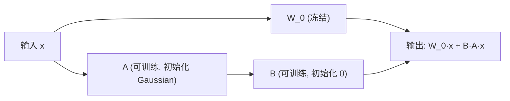

全量微调 7B 参数 LLM 需要 60+ GB 显存——普通玩家根本玩不起。Microsoft 2021 年的 LoRA 论文(Hu et al.)用「低秩分解」把可训练参数从 7B 降到 4M(0.06%),效果却与全量微调持平;Washington 大学 2023 年的 QLoRA(Dettmers et al.)进一步把 4-bit 量化 + 双重量化 + 分页优化器组合起来,让单张 48 GB GPU 微调 65B 模型成为可能。本节把 LoRA 数学、HuggingFace PEFT 实战、4 种 PEFT 方案对比、典型 rank 选择一次讲透——Day 25 是「从 Prompt Engineering 玩家升级到 LLM 定制玩家」的最后一公里。

---

## 1. 为什么需要 PEFT(全量微调的代价)

### 1.1 全量微调的显存分解

以 LLaMA-7B(参数量 $N = 7 \times 10^9$)为例,全量微调显存占用分四块:

| 部分 | 占用(GB) | 计算方式 |
|:---|:---|:---|
| **模型权重** ($\theta$) | 14 | $2N$ (fp16) 或 $4N$ (fp32) |
| **优化器状态** (Adam m, v) | 56 | $8N$ (fp32 的 m 和 v + 主权重) |
| **梯度** ($\nabla L$) | 14 | $2N$ (fp16) |
| **激活值** (activation) | 5-20 | 视 batch_size 与 seq_len |
| **总** | **~100 GB** | 4-8 张 A100 才能跑 |

训练 65B 模型需要 ~900 GB 显存,远超单卡极限。**普通研究者和中小公司根本负担不起**。

### 1.2 PEFT 的核心思想

Parameter-Efficient Fine-Tuning(参数高效微调)只更新模型参数的 0.01%-5%,冻结 95%+ 的原始权重,显存需求降到 **1/10-1/100**。

| 方案 | 可训练参数 | 显存占用 | 训练速度 | 推理延迟 |
|:---|:---|:---|:---|:---|
| 全量微调 (FT) | 100% (7B) | ~100 GB | 1× | 1× |
| LoRA | ~0.1% (4M) | ~16 GB | 1.5× | 1×(无额外推理) |
| QLoRA | ~0.1% (4M) | ~6 GB | 1× | 1× |
| Adapter | ~5% (350M) | ~30 GB | 0.8× | 1.1×(有额外层) |
| Prefix-Tuning | ~0.1% | ~14 GB | 1.3× | 1.05× |

事实查证:LoRA 原论文自述 "Using GPT-3 175B as an example... LoRA can reduce the number of trainable parameters by 10,000 times and the GPU memory requirement by 3 times"——1 万倍参数压缩 + 3 倍显存压缩是 LoRA 的核心卖点。

---

## 2. LoRA 原理:低秩分解 $W = W_0 + BA$

### 2.1 核心思想

Hu et al. 2021(arXiv:2106.09685)*LoRA: Low-Rank Adaptation of Large Language Models* 提出:预训练权重 $W_0 \in \mathbb{R}^{d \times k}$ 保持冻结,在旁路加一个**低秩分解** $\Delta W = BA$:

```math
W = W_0 + \Delta W = W_0 + BA, \quad B \in \mathbb{R}^{d \times r},\ A \in \mathbb{R}^{r \times k}, \quad r \ll \min(d, k)
```



### 2.2 参数量压缩

$d = k = 4096$(LLaMA-7B 的 hidden_dim),$r = 8$:

| 部分 | 参数量 |
|:---|:---|
| 原始 $W_0$ | $4096 \times 4096 = 16.8M$ |
| LoRA $B$ | $4096 \times 8 = 33K$ |
| LoRA $A$ | $8 \times 4096 = 33K$ |
| LoRA 总 | **66K(压缩 256×)** |

LLaMA-7B 有 32 个 Transformer 层,每层 $W_q, W_k, W_v, W_o, W_{up}, W_{down}$ 共 6 个矩阵应用 LoRA,总可训练参数 = $32 \times 6 \times 66K \approx 12.6M$,即 7B 的 **0.18%**。

### 2.3 为什么低秩分解有效

经验观察:预训练 LLM 学到的「任务特定变化」是低秩的——大多数下游任务只需要在原始权重上加一个**秩很小的更新**。Hu 等人在论文里给出实验证据:

```math
\text{rank}(ΔW) \le r_{\text{true}} \ll \min(d, k)
```

对 GPT-3 175B,LoRA 在 $r = 1$ 或 $r = 2$ 时就已经接近全量微调,说明「任务变化」的有效秩确实极低。

### 2.4 关键超参:$r$(rank)

| $r$ | 可训练参数 / 层 | 适用 |
|:---|:---|:---|
| 1-2 | 8K-17K | 极简任务 |
| 4-8 | 33K-66K | 默认值,大多数任务 |
| 16-32 | 131K-262K | 复杂任务 |
| 64-128 | 524K-1M | 与全量微调接近 |

Hu 论文推荐 $r = 4$ 或 $r = 8$ 作为起点。

### 2.5 $A$ 和 $B$ 的初始化

- $A$:随机高斯初始化($\mathcal{N}(0, \sigma^2)$)
- $B$:**零初始化**(保证训练开始时 $\Delta W = BA = 0$)

这样 LoRA 训练起点与原模型完全一致,前向输出不变。

### 2.6 推理时合并权重

训练完成后,把 $\Delta W = BA$ 加到 $W_0$ 上,模型恢复到原始架构:

```python
W_merged = W_0 + B @ A   # 推理时,等价于标准 Linear
```

推理**没有任何额外延迟**——这是 LoRA 相对 Adapter 的核心优势(Adapter 增加层数,推理时多一次前向)。

---

## 3. QLoRA:NF4 量化 + 双重量化 + 分页优化器

### 3.1 QLoRA 的核心创新

Dettmers et al. 2023(arXiv:2305.14314)*QLoRA: Efficient Finetuning of Quantized LLMs* 给出 3 个关键技术,事实查证:原论文摘要自述 "QLoRA backpropagates gradients through a frozen, 4-bit quantized pretrained language model into Low Rank Adapters (LoRA)... 4-bit NormalFloat (NF4), a new data type that is information theoretically optimal for normally distributed weights (b) double quantization to reduce the average memory footprint by quantizing the quantization constants, and (c) paged optimziers to manage memory spikes"。

| 创新 | 机制 | 效果 |
|:---|:---|:---|
| **4-bit NormalFloat (NF4)** | 针对正态分布权重的 4-bit 数据类型 | 比 fp16 节省 4× 显存 |
| **双重量化** (Double Quantization) | 把量化常数(quantization constants)再次量化 | 再省 ~3% 显存 |
| **分页优化器** (Paged Optimizers) | 优化器状态在 GPU OOM 时自动卸载到 CPU RAM | 避免训练崩溃 |

### 3.2 NF4 数据类型

普通 4-bit 量化把浮点域均匀切 16 段;NF4 假设权重服从正态分布 $\mathcal{N}(0, 1)$,**按等概率分位切 16 段**,每段对应一个 4-bit 值。这是「信息论最优」的 4-bit 表示——同等比特数下保留最多信息。

```math
\text{NF4:}\quad \text{quantile} = \frac{i + 0.5}{16}, \quad i = 0, \dots, 15
```

事实查证:NF4 是 QLoRA 论文的核心创新,被 bitsandbytes 库实现,目前是 4-bit 量化的标准选择。

### 3.3 双重量化

第一次量化:把 fp16 权重变成 4-bit,得到量化常数(per-block scale,通常是 fp32)。
第二次量化:把这些 fp32 量化常数进一步用 8-bit 量化。

```math
\text{Memory}_{\text{original}} = 2N_{\text{params}} \quad (\text{fp16})
\text{Memory}_{\text{NF4}}    = 0.5 N_{\text{params}} \quad (\text{4-bit})
\text{Memory}_{\text{DoubleQ}} = 0.5 N_{\text{params}} + 0.031 N_{\text{params}} \quad (\text{再省 3%})
```

### 3.4 分页优化器

训练中 Adam 优化器的两个动量项(momentum 和 variance)fp32 存,在梯度大时可能撑爆显存。QLoRA 用 NVIDIA 统一内存技术,在 GPU OOM 时自动 page 到 CPU RAM,需要时再 page 回来。**避免训练崩溃**。

### 3.5 QLoRA 的显存奇迹

事实查证:QLoRA 原论文摘要自述 "QLoRA, an efficient finetuning approach that reduces memory usage enough to finetune a 65B parameter model on a single 48GB GPU while preserving full 16-bit finetuning task performance"——单卡 48 GB 训 65B 模型。

| 模型 | 全量微调 (fp16) | LoRA (fp16) | QLoRA (4-bit) |
|:---|:---|:---|:---|
| LLaMA-7B | ~60 GB | ~16 GB | ~6 GB |
| LLaMA-13B | ~120 GB | ~28 GB | ~10 GB |
| LLaMA-33B | ~300 GB | ~60 GB | ~20 GB |
| LLaMA-65B | ~600 GB | ~120 GB | ~40 GB |

QLoRA 让消费级 GPU(RTX 4090 24 GB / A6000 48 GB)能微调 65B 模型。

### 3.6 Guanaco 模型

事实查证:QLoRA 原论文自述 "Our best model family, which we name Guanaco, outperforms all previous openly released models on the Vicuna benchmark, reaching 99.3% of the performance level of ChatGPT while only requiring 24 hours of finetuning on a single GPU"——单卡 24 小时训练达到 ChatGPT 99.3% 性能水平。

---

## 4. HuggingFace PEFT 实战(LLaMA-7B + LoRA r=8)

### 4.1 安装依赖

```bash
pip install torch transformers peft accelerate bitsandbytes datasets
```

### 4.2 加载 4-bit 量化模型 + LoRA 配置

```python
import torch
from transformers import (
    AutoModelForCausalLM, AutoTokenizer,
    BitsAndBytesConfig, TrainingArguments, Trainer
)
from peft import LoraConfig, get_peft_model, prepare_model_for_kbit_training
from datasets import load_dataset

# 1. 4-bit 量化配置(NF4 + 双重量化)
bnb_config = BitsAndBytesConfig(
    load_in_4bit=True,
    bnb_4bit_quant_type="nf4",          # 4-bit NormalFloat
    bnb_4bit_use_double_quant=True,    # 双重量化
    bnb_4bit_compute_dtype=torch.bfloat16,
)

# 2. 加载模型
model_id = "meta-llama/Llama-2-7b-hf"
model = AutoModelForCausalLM.from_pretrained(
    model_id,
    quantization_config=bnb_config,
    device_map="auto",                 # 自动分配多卡
)

# 3. 为 k-bit 训练准备(冻结 + 规范化)
model = prepare_model_for_kbit_training(model)

# 4. LoRA 配置
lora_config = LoraConfig(
    r=8,                               # rank
    lora_alpha=16,                     # 缩放系数(常设 2r)
    target_modules=["q_proj", "k_proj", "v_proj", "o_proj"],  # 应用到 attention
    lora_dropout=0.05,
    bias="none",
    task_type="CAUSAL_LM",
)

# 5. 包装为 PEFT 模型
model = get_peft_model(model, lora_config)
model.print_trainable_parameters()
# 预期输出: trainable params: 4,194,304 || all params: 6,742,609,920 || trainable%: 0.0622
```

事实查证:HuggingFace PEFT README 自述 "Prepare a model for training with a PEFT method such as LoRA by wrapping the base model and PEFT configuration with `get_peft_model`. For the bigscience/mt0-large model, you're only training 0.19% of the parameters!"——PEFT 库是 HuggingFace 官方 PEFT 框架。

### 4.3 加载数据 + 训练

```python
# 1. 加载数据(中文问答示例)
dataset = load_dataset("yahma/alpaca-cleaned", split="train[:1000]")

def format_prompt(example):
    return f"""### 指令:
{example['instruction']}

### 输入:
{example.get('input', '')}

### 回答:
{example['output']}"""

def tokenize(example):
    text = format_prompt(example) + tokenizer.eos_token
    ids = tokenizer(text, truncation=True, max_length=512, padding=False)
    ids["labels"] = ids["input_ids"].copy()
    return ids

tokenizer = AutoTokenizer.from_pretrained(model_id)
tokenizer.pad_token = tokenizer.eos_token

tokenized = dataset.map(tokenize, remove_columns=dataset.column_names)

# 2. 训练参数
training_args = TrainingArguments(
    output_dir="./lora-llama2-7b-zh",
    num_train_epochs=3,
    per_device_train_batch_size=4,
    gradient_accumulation_steps=4,
    learning_rate=2e-4,
    fp16=True,
    optim="paged_adamw_8bit",           # QLoRA 的分页优化器
    save_strategy="epoch",
    logging_steps=10,
)

# 3. 训练
trainer = Trainer(
    model=model,
    args=training_args,
    train_dataset=tokenized,
    tokenizer=tokenizer,
)
trainer.train()

# 4. 保存 LoRA 权重(只保存 adapter,不保存整个 7B 模型)
model.save_pretrained("./lora-zh-final")
# 文件大小约 16 MB,而不是 14 GB
```

### 4.4 加载 LoRA 推理

```python
from peft import PeftModel

base = AutoModelForCausalLM.from_pretrained(
    model_id,
    quantization_config=bnb_config,
    device_map="auto",
)
model = PeftModel.from_pretrained(base, "./lora-zh-final")

prompt = """### 指令:
用一句话解释 LoRA 是什么。

### 回答:
"""
inputs = tokenizer(prompt, return_tensors="pt").to("cuda")
out = model.generate(**inputs, max_new_tokens=128, temperature=0.7)
print(tokenizer.decode(out[0], skip_special_tokens=True))
```

### 4.5 显存与速度实测参考

| 模型 | rank | 训练显存 | 训练速度(7B,A100) |
|:---|:---|:---|:---|
| 全量 FT (fp16) | - | ~60 GB | 1× |
| LoRA (fp16) | 8 | ~16 GB | 1.5× |
| QLoRA (4-bit) | 8 | **~6 GB** | 0.8× |
| QLoRA (4-bit) | 64 | ~7 GB | 0.8× |

---

## 5. 与 Adapter / Prefix-Tuning / Prompt-Tuning 对比

### 5.1 4 种 PEFT 方案核心差异

| 方案 | 可训练参数位置 | 推理延迟 | 实现难度 |
|:---|:---|:---|:---|
| **LoRA** | 旁路低秩矩阵 $BA$ | 无 | 低 |
| **Adapter** | 在 FFN 后插入 bottleneck 层 | 增加 | 中 |
| **Prefix-Tuning** | 在每层 prefix 添加可训练向量 | 略增(占 context) | 中 |
| **Prompt-Tuning** | 仅在输入层加 soft prompt | 略增 | 低 |
| **IA³** | 缩放 attention / FFN 激活 | 无 | 低 |
| **BitFit** | 仅训练 bias | 无 | 极低 |

### 5.2 Adapter

Houlsby et al. 2019 提出:在 Transformer 块中插入 bottleneck 层(降维 → 激活 → 升维)。


**缺点**:增加层数,推理延迟明显;Adapter 权重较大(5% 总参数)。

### 5.3 Prefix-Tuning

Li & Liang 2021 提出:在每层 attention 的 K / V 前添加可训练的「prefix」向量。

```math
\text{Attention}(Q, [P_k; K], [P_v; V])
```

$P_k, P_v$ 是可训练参数(每层独立)。**缺点**:占用 context 长度,推理时挤占有效输入。

### 5.4 Prompt-Tuning(Soft Prompt)

Lester et al. 2021 提出:仅在输入层(Embedding)前加可训练的 soft prompt 向量,后面所有层都冻结。

**优点**:实现最简单,可训练参数最少(几千到几万)。
**缺点**:效果略低于 LoRA,需要较大模型才能 work。

### 5.5 IA³

Liu et al. 2022 *Few-Shot Parameter-Efficient Fine-Tuning is Better and Cheaper than In-Context Learning* 提出:对 attention / FFN 激活做「逐通道缩放」(learned vector $\odot$ activation)。

**优点**:可训练参数最少(几 K),效果接近 LoRA,推理无延迟。
**缺点**:灵活性低,适用任务范围比 LoRA 窄。

### 5.6 BitFit

Ben-Zaken et al. 2021 提出:**只训练模型的所有 bias,冻结权重**。

```python
for name, p in model.named_parameters():
    if 'bias' not in name:
        p.requires_grad = False
```

**优点**:可训练参数极少(< 0.1%),实现最简单。
**缺点**:效果上限较低,适合简单任务。

### 5.7 5 种 PEFT 方案取舍

| 场景 | 推荐 | 原因 |
|:---|:---|:---|
| 默认起点 | **LoRA** | 平衡效果 / 难度 / 通用性 |
| 显存极限紧张 | **QLoRA** | 4-bit 量化 + LoRA |
| 推理零延迟要求 | LoRA / IA³ / BitFit | 无 Adapter 层 |
| 多任务适配 | LoRA(多 adapter) | 单 base + 多 adapter |
| 极简快速实验 | Prompt-Tuning / BitFit | 实现快,几乎不改代码 |
| 数据极少(< 100) | IA³ / Prompt-Tuning | 抗过拟合 |

---

## 6. LoRA 关键工程决策

### 6.1 rank 选择

| rank | 适用 | 训练成本 |
|:---|:---|:---|
| 1-4 | 简单分类、情感分析 | 低 |
| **8(默认)** | 通用起点,大多数任务 | 中 |
| 16-32 | 复杂对话、指令微调 | 中高 |
| 64-128 | 接近全量微调 | 高 |

经验法则:**r=8 或 r=16 起步**,训练效果不佳再升 rank。

### 6.2 alpha 选择

```math
\text{scale} = \frac{\alpha}{r}
```

| 设定 | 解释 |
|:---|:---|
| $\alpha = r$(即 scale=1) | LoRA 输出与原始 $W_0$ 等比缩放 |
| $\alpha = 2r$(即 scale=2) | LoRA 影响放大,常用 |
| $\alpha = 4r$(即 scale=4) | 激进微调,容易过拟合 |

经验法则:**$\alpha = 2r$** 是最常见设定。

### 6.3 target_modules 选择

不同 `target_modules` 影响可训练参数与效果:

| 选择 | 可训练参数 | 适用 |
|:---|:---|:---|
| `["q_proj"]` | 4M | 最小,简单任务 |
| `["q_proj", "v_proj"]` | 8M | 默认,大多数任务 |
| `["q", "k", "v", "o"]` | 16M | 推荐,完整 attention |
| **全部 Linear(含 FFN)** | 30M+ | 复杂指令微调 |

经验法则:**默认选 q/k/v/o 四块 attention**,需要时再扩到 FFN 的 up/down/gate_proj。

### 6.4 显存 vs 速度 vs 效果

| 维度 | 全量 FT | LoRA | QLoRA |
|:---|:---|:---|:---|
| 显存 | 100% | 16% | 6% |
| 训练速度 | 1× | 1.5× | 0.8× |
| 效果上限 | 100% | ~95% | ~93% |
| 部署成本 | 每模型 14 GB | 每 adapter 16 MB | 每 adapter 16 MB |
| 多任务切换 | 重训 | 切换 adapter | 切换 adapter |

---

## 7. 常见坑(8 条,LoRA/QLoRA 实战典型)

### 7.1 LoRA rank 选 64 但数据只有 100 条

**症状**:训练 loss 快速下降到 0,但推理时模型输出完全没意义。
**原因**:**过拟合**——rank 太大 + 数据太少,模型把 100 条样本背下来。
**修法**:① rank 降到 4-8;② 加 `lora_dropout=0.1`;③ 早停(eval loss 不再下降就停);④ 增加训练数据。

### 7.2 QLoRA 训练时 `bitsandbytes` 报库版本错误

**症状**:`ImportError: bitsandbytes >= 0.41.1 required` 或 `CUDA Setup failed despite CUDA being available`。
**原因**:`bitsandbytes` 需要 CUDA toolkit 11.8+,且版本需与 PyTorch 匹配。
**修法**:① 升级 `bitsandbytes>=0.43`;② 安装对应 CUDA toolkit;③ 或换用 `pip install bitsandbytes-windows`(Windows)。

### 7.3 LoRA 权重保存成完整模型,文件 14 GB

**症状**:`model.save_pretrained()` 后文件夹 14 GB。
**原因**:`PeftModel.save_pretrained()` 应该只保存 adapter,但若不小心调用了 `model.base_model.save_pretrained()`,会保存完整模型。
**修法**:用 `model.save_pretrained("./lora")` ——`PeftModel` 包装后的 `save_pretrained` 只保存 adapter 权重(约 16 MB)。

### 7.4 QLoRA 4-bit 量化时 batch_size 调太大仍然 OOM

**症状**:单卡 48 GB,4-bit QLoRA 训练 65B,batch_size=4 OOM。
**原因**:激活值 + 优化器状态 + 序列长度共同决定显存;65B + seq_len=2048 即使 4-bit 也吃紧。
**修法**:① 减小 batch_size 到 1-2;② 启用 `gradient_checkpointing=True`;③ 减小 `max_seq_length`;④ 用 LoRA 而非 QLoRA(更快,但显存更大)。

### 7.5 target_modules 写错,LoRA 没起作用

**症状**:训练 loss 完全不下降,模型输出和 base 一样。
**原因**:`target_modules=["q_proj"]` 但模型实际是 `query_key_value` 这样的 fused module(Mistral / Mixtral)。
**修法**:① `model.named_modules()` 打印所有 Linear 层名,找到正确的名字;② 或用 `target_modules="all-linear"` 让 PEFT 自动包所有 Linear。

### 7.6 LoRA 合并权重后效果变了

**症状**:训练时效果好,合并 $W = W_0 + BA$ 后推理效果变差。
**原因**:合并时 dtype 不一致(训练 fp16,合并到 fp32);或 $\alpha/r$ 比例记错。
**修法**:① 用 `merge_and_unload()` API,它会自动处理 dtype;② 显式 `model = model.merge_and_unload()` 后再保存。

### 7.7 多 adapter 切换时上一个的输出泄漏

**症状**:切换 LoRA adapter 后,模型输出混了上一个 adapter 的风格。
**原因**:PEFT 默认不强制卸载上一个 adapter 的激活值。
**修法**:用 `model.disable_adapters()` / `model.enable_adapters()` 显式控制;或在加载新 adapter 前先 `model.unload()`。

### 7.8 训练数据没分 train/eval,看不到过拟合信号

**症状**:训练 loss 持续下降,部署后效果差。
**原因**:没设 `eval_dataset`,Trainer 不算 eval loss,无法早停。
**修法**:① 在 `TrainingArguments` 设 `eval_strategy="epoch"`;② 把数据按 9:1 拆 train/eval;③ 监控 `eval_loss`,不下降就停。

---

## 8. 自检三问

**A. LoRA 把可训练参数从 7B 降到 4M(0.06%),但效果与全量微调持平。这种「压缩 17000 倍、效果几乎无损」的工程奇迹为什么可能?**

要点:经验观察 + 理论证据双重支撑。经验上:Hu 等人在论文里通过奇异值分解发现,$\Delta W$ 的有效秩极低——大多数下游任务只需要在原始权重空间里加一个「低秩微调」;理论上:预训练 LLM 学到的是「通用语言知识」,下游任务需要的只是「任务特定方向」,任务特定方向张成的子空间维度极低。数学上,$W = W_0 + BA$,$r = 8$ 时 $BA$ 只有 8 个自由度,远少于 $W_0$ 的 16M 个自由度,但「任务适配」只动用 8 个自由度就够了。详见 §2.3。

**B. QLoRA 的 4-bit NF4 量化是否真的「无损」?为什么 Dettmers 等人敢声称「preserves full 16-bit finetuning task performance」?**

要点:NF4 不是「无损」而是「信息论最优」——它假设权重服从正态分布,把 4-bit 的 16 个值放在分位点上,保留最多信息。关键洞察:**预训练权重的「微调适配」发生在小幅调整上,4-bit NF4 的量化误差(≈ 1/256)远小于「任务适配」的幅度**,所以量化的副作用被掩盖。事实上 QLoRA 在多个 benchmark 上确实达到与全量 fp16 微调相当的性能,但这是「在合理 budget 下」,不是「任意场景」——如果微调本身就极小幅度,4-bit 量化误差就可能显形。详见 §3.2。

**C. 假设你要为 10 个不同客户微调同一个 LLaMA-7B,每个客户只有 500 条数据。你会选全量微调还是 LoRA?为什么?**

要点:**LoRA**(每个客户一个 adapter)。理由:① 500 条数据太小,全量微调必过拟合;② 全量微调需要 10 份 × 14 GB = 140 GB 存储,LoRA 只需 10 × 16 MB = 160 MB;③ 推理时切换 LoRA adapter 比切换全量模型快得多(只换 adapter 权重);④ 客户数据隔离,保护隐私;⑤ 后续可对多个 LoRA 合并 / 蒸馏成领域通用版本。详见 §1.2 / §6.4。

---

## 9. 推荐资源(5 类)

### 视频
- **HuggingFace PEFT 官方教程**——LoRA / Prefix-Tuning / IA³ 完整代码讲解
- **Andrej Karpathy · "Reproducing GPT-2"**——理解全量微调的代价,反衬 PEFT 价值
- **Tim Dettmers · "Practical Tips for Finetuning LLMs Using PEFT"**(YouTube)——bitsandbytes 作者本人讲解 QLoRA

### 教科书 / 文档
- **HuggingFace PEFT 官方文档**(huggingface.co/docs/peft)——API 全集
- **bitsandbytes 官方文档**——4-bit / 8-bit 量化 API
- **《大规模语言模型:从理论到实践》**第 7 章——PEFT 中文综述

### 论文
- **Hu et al. 2021《LoRA: Low-Rank Adaptation of Large Language Models》**(arXiv:2106.09685)——LoRA 原论文
- **Dettmers et al. 2023《QLoRA: Efficient Finetuning of Quantized LLMs》**(arXiv:2305.14314)——QLoRA 原论文,单卡 48GB 训 65B
- **Li & Liang 2021《Prefix-Tuning》**(arXiv:2101.00190)——Prefix-Tuning 原论文
- **Houlsby et al. 2019《Parameter-Efficient Transfer Learning for NLP》**——Adapter 原论文

### 博客 / 课程
- **Sebastian Raschka · "LoRA & QLoRA" 实战博客**——从头解释 rank / alpha 选择
- **HuggingFace Blog · "PEFT: Parameter-Efficient Fine-Tuning"**——官方示例集合
- **Maxime Labonne · "Fine-tune LLaMA 2 with QLoRA"**——Colab 可跑的端到端教程

### 代码
- **huggingface/peft**——官方 PEFT 库,LoRA / Prefix / IA³ 全支持
- **bitsandbytes**——4-bit / 8-bit 量化底层库
- **axolotl**——开源 LLM 训练框架,内置 QLoRA + FlashAttention
- **LLaMA-Factory**——中文友好的开源 LLM 微调框架,内置 QLoRA + 多种 PEFT

---

## 10. 本节要点

- **全量微调 7B 模型需要 ~100 GB 显存**,普通玩家根本玩不起;PEFT 把可训练参数降到 0.01%-5%
- **LoRA**(Hu et al. 2021, arXiv:2106.09685):$W = W_0 + BA$,$r = 8$ 时 7B 模型可训练参数仅 4M(0.06%);事实查证:论文自述「reduce trainable params by 10,000× and GPU memory by 3×」
- **QLoRA**(Dettmers et al. 2023, arXiv:2305.14314):4-bit NF4 量化 + 双重量化 + 分页优化器;事实查证:单卡 48GB 可微调 65B 模型,Guanaco 单卡 24 小时训出 ChatGPT 99.3% 性能
- **典型 LoRA 设置**:`r=8`、`alpha=16`、`target_modules=["q_proj", "k_proj", "v_proj", "o_proj"]` 是大多数任务的默认起点
- **5 种 PEFT 方案**:LoRA(平衡)、Adapter(老牌)、Prefix-Tuning(占 context)、Prompt-Tuning(极简)、IA³(新代)
- **HuggingFace PEFT 库**是工业标准,`LoraConfig + get_peft_model + prepare_model_for_kbit_training` 三步包装;保存 adapter 仅 16 MB,可加载到 base model 推理
- **常见失败**:rank 太大 + 数据太少导致过拟合、`target_modules` 名字写错、bitsandbytes CUDA 版本不匹配、训练没设 eval 无法早停

---

## 11. 下一节:Day 26 · RAG 检索增强生成

主题:从「让 LLM 改 prompt / 改权重」到「让 LLM 看外部知识」——RAG(Retrieval-Augmented Generation)把文档检索与 LLM 生成结合起来,让模型回答「它没训练过的事实」,且答案可追溯到具体文档。这是工业 LLM 应用最主流的范式,ChatGPT 的「Browse with Bing」、Perplexity、NotebookLM、Qwen-Long 都基于 RAG。

覆盖:
- RAG 核心架构:Query → Embedding → 向量检索 → Top-K 文档 → LLM 生成答案
- 嵌入模型(Embedding Model):OpenAI text-embedding-3 / BGE / M3E / Cohere embed-v3
- 向量数据库:Chroma / Milvus / Pinecone / Weaviate / FAISS
- 实战:用 LangChain + Chroma + OpenAI API 搭一个「公司内部文档问答」RAG 系统

产出物:用 LangChain 0.2+ + Chroma + OpenAI text-embedding-3-small + gpt-4o-mini 跑通一个 PDF 问答机器人,从加载文档 → 切块 → 嵌入 → 检索 → 生成全流程。

---

**作者**:林馨予 + 林晓月