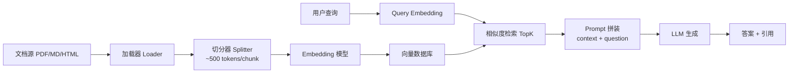
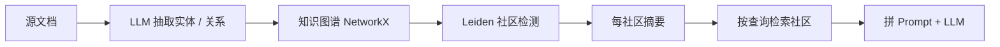

RAG(Retrieval-Augmented Generation,检索增强生成)是把「外部知识库的检索结果」拼进 Prompt、再让大模型基于此回答的工程范式,由 Lewis 等人在 2020 年的同名论文 arXiv:2005.11401 中正式提出。它解决大模型的两个老毛病:不知道训练截止日之后的私有信息、容易凭空编造事实(fabrication / hallucination)。RAG 的三件套是 Embedding 模型、向量数据库、生成模型;今天通过 LangChain + Chroma + BGE 把这套流程从头跑一遍,看清它在文本切分、检索召回、生成合成上的真实表现。

---

## 1. 为什么需要 RAG:幻觉与知识截止

### 1.1 两大病根

大语言模型(LLM)是「参数化知识」的容器 —— 它把所有见过的文本压缩进数百亿个浮点数。但参数化有两个先天短板:

- **知识截止(Knowledge Cutoff)**:训练数据有一个明确的截止日期(GPT-4o 为 2023 年 10 月,Claude 3.5 为 2024 年 4 月),之后发生的事它完全不知道。
- **幻觉(Hallucination)**:即使知识截止之前的事实,它也经常一本正经地编造 —— 比如把不存在的论文作者写满、把不存在的法律条款答得头头是道。

工程上的修法有四种,代表性方法是 RAG:

| 方案 | 数据存放 | 更新成本 | 适合场景 |
|:---|:---|:---|:---|
| 微调(Fine-tuning) | 改模型权重 | 重训一次,百万级 GPU-hours | 让模型学会新格式 / 风格 |
| RAG(检索增强) | 外部知识库 | 加文档即可,毫秒级生效 | 私有知识 / 实时事实 |
| 长上下文(Long Context) | Prompt 内塞全文 | 受上下文窗口限制(200K / 1M) | 一次性整本 PDF 问答 |
| Agent + 工具调用 | 动态调 API / DB | 接口变化时改 Tool 描述 | 实时计算 / 结构化查询 |

### 1.2 RAG 的核心思想

Lewis 等人在 arXiv:2005.11401 "Retrieval-Augmented Generation for Knowledge-Intensive NLP Tasks" 中把流程定义为 **「端到端的检索器 + 生成器」**:对每个查询 q,先用 DPR(Dense Passage Retrieval)从维基百科里取出 top-k 文档 z,再把 q 与 z 一起喂给 BART 生成答案 a。

```math
p(a|q) = \sum_{z \in \text{TopK}(q)} p(a|z,q) · p(z|q)
```

它和「闭卷考试」的纯参数化模型区别在于:**RAG-Sequence** 把同一文档喂给生成器多次采样,**RAG-Token** 在生成每个 token 时都可以重新挑文档;后者在 Knowledge-Intensive 任务上指标更好。

### 1.3 一个数字证据

Natural Questions / TriviaQA / Jeopardy 等开放式问答任务上,RAG-Token 比纯参数化 BART 平均提 **11.8% EM**(Exact Match),且对「2020 年之后的事实类问题」有不成比例的提升 —— 后者根本不在参数知识范围内,RAG 通过检索实时把最新事实引进来,正好补上这块短板。

---

## 2. Embedding 基础:文本如何变成向量

### 2.1 定义

Embedding 是把离散符号(词 / 句 / 段落 / 图片)映射到稠密低维实数向量的函数 f: X → R^d。语义相近的两个输入,在向量空间里的欧氏距离或余弦相似度应该小。

```math
\text{cosine}(u, v) = \frac{u \cdot v}{\|u\| \cdot \|v\|}
```

二维直觉:训练得好的中文 Embedding,「猫」和「狗」会落在一块,「银行」和「河流」也会落在一块;只要标量点积足够大,RAG 召回就准。

### 2.2 训练范式的两条路

| 路线 | 代表 | 训练目标 | 优 |
|:---|:---|:---|:---|
| 对比学习(Contrastive) | SimCSE / Sentence-BERT / BGE / GTE / M3E | 相似句 → 距离近,不相似 → 距离远 | 通用、强、可迁移 |
| 重建式(Auto-Encoder) | T5-Encoder / BERT | 用 Masked LM 重建原句 | 单句表征稍弱 |

2024 年主流 Embedding 模型几乎都是对比学习路线,因为任务(检索 / 聚类)就是相似度。

### 2.3 维度与归一化的取舍

- **维度**:BGE-large-zh-v1.5 = 1024 维;OpenAI text-embedding-3-small 输出 1536 维但可通过 `dimensions` 参数缩到 512。维度越高表达力越强,但向量库的存储 / 检索成本线性上升。
- **归一化(Normalization)**:几乎所有近代 Embedding 都在最后一层做 L2 归一化,使内积 = 余弦相似度。**没有归一化时,检索前必须显式调 `F.normalize()`,否则召回全部乱掉**。

---

## 3. 主流 Embedding 模型对比(2024-2025)

### 3.1 闭源 vs 开源

| 模型 | 提供方 | 维度 | 上下文 | MTEB 平均 | 价格(USD / 1M tokens) |
|:---|:---|:---:|:---|:---:|:---|
| text-embedding-3-small | OpenAI | 1536(可缩) | 8192 | 62.3 | $0.02 |
| text-embedding-3-large | OpenAI | 3072(可缩) | 8192 | 64.6 | $0.13 |
| text-embedding-ada-002 | OpenAI(legacy) | 1536 | 8192 | 61.0 | $0.10 |
| voyage-3 | Voyage AI | 1024 | 32000 | 67.2(2024-09) | $0.06 |
| cohere-embed-v3 | Cohere | 1024 | 512 | 64.0 | $0.10 |
| BGE-m3 | BAAI(开源) | 1024 | 8192 | 65.0+(中文最佳) | 自托管 |
| BGE-large-zh-v1.5 | BAAI(开源) | 1024 | 512 | 64.4 | 自托管 |
| GTE-Qwen2-7B | Alibaba(开源) | 3584 | 32K | 65-67 | 自托管 |
| M3E(base / large) | Moka(开源) | 768 | 512 | 中文强 | 自托管 |
| text-embedding-3-large matryoshka | OpenAI | 可截断 256/512 | 8192 | 64.6 | $0.13 |

(MTEB = Massive Text Embedding Benchmark,2024 年最权威的单模态 Embedding 评测。)

### 3.2 怎么挑

四个轴:语种(中 / 英 / 多语)、成本(私有部署 vs API)、维度(Milvus 索引开销按 dim 线性增)、是否支持 late interaction(ColBERT 类对长文档更鲁棒)。

经验法则:**中文为主 + 数据不外传 → BGE-m3 / GTE-Qwen2**;**英文为主 + 出差公司 → OpenAI text-embedding-3-large**;**预算紧 + 中等规模 → OpenAI -3-small 配 Matryoshka 截断**。

### 3.3 OpenAI Embedding 的 2024 升级

OpenAI 在 2024-01 把 ada-002 升级到 **text-embedding-3 系列**,两个变化:

1. 支持 `dimensions` 参数,把 3072 / 1536 维截到任意 256 / 512,损失很小(经验是 4% MTEB)。
2. Matryoshka 训练 —— 模型本身就是按 256 / 512 / 1024 / 1536 / 3072 渐进训练,截短后不重训仍可用。

```python
from openai import OpenAI
client = OpenAI()
resp = client.embeddings.create(
    model="text-embedding-3-small",
    input=["大模型与生成式 AI"],
    dimensions=512,           # 截断到 512 维,存盘 / 检索成本打 1/3
)
vec = resp.data[0].embedding  # list[float], len==512
```

存储 1 亿条 512 维 float32 = 200 GB;降到 256 维 = 100 GB;这是 Matryoshka 的工业价值。

---

## 4. 向量数据库对比

### 4.1 核心能力

向量库要解决三件事:**索引(把 N 个向量放进可搜的数据结构)、检索(余弦 / 内积 / 欧氏)、混合(向量 + 标量过滤)**。2024 年主流实现的算法分两类:

- **HNSW**(Hierarchical Navigable Small World,图索引):召回高、内存大。Chroma / Weaviate / Qdrant 默认。
- **IVF / PQ**(Inverted File + Product Quantization,量化索引):内存小、近似召回。FAISS、Milvus Lite 默认。

### 4.2 横向对比

| 项 | Chroma | Milvus | Weaviate | Pinecone | Qdrant | FAISS(Meta) |
|:---|:---|:---|:---|:---|:---|:---|
| 协议 | Apache-2.0 | Apache-2.0 | BSD-3 | 闭源 SaaS | Apache-2.0 | MIT |
| 部署模式 | 本地 / 嵌入式 | 单机 / 集群 / Cloud | 单机 / 集群 | 仅云 | 单机 / 集群 | 仅库,无 server |
| 索引算法 | HNSW(default) | IVF / HNSW / DiskANN | HNSW | proprietary | HNSW | IVF / HNSW / PQ |
| 混合检索(metadata filter) | ✓ | ✓ | ✓ | ✓ | ✓ 极强 | ✗(纯向量) |
| Python SDK 易用度 | ★★★★★ | ★★★ | ★★★★ | ★★★★★ | ★★★★ | ★★★ |
| 单机支撑规模 | 百万级 | 十亿级 | 千万级 | 无限 | 千万级 | 内存够即可 |
| 适用阶段 | 原型 / 小数据 | 工业生产 | 中型生产 | 不运维但贵 | 中型生产 | 研究 / 自研 |

### 4.3 2024 工业选型

- **原型 / 学习 / < 10 万条**:Chroma 单文件 + persist 目录,完全本地,3 行代码启动。
- **中型生产 / 亿级数据**:Milvus(支持 DiskANN)或 Qdrant(强过滤)。
- **混合检索 + BM25 + 向量**:Weaviate / Qdrant 内置 hybrid search。
- **不愿运维**:Pinecone(2024 仍按 pod 计价,Serverless 模式按 RU 计费,从 $0.07/RU/月起)。
- **学术研究**:FAISS(Meta 开源,2024-07 发布 faiss-cpu 1.8)。

一个常见错配:**用 FAISS 做 RAG 然后抱怨没有 metadata 过滤**。FAISS 只是个向量索引库,没有标量过滤;生产上要么包一层(ES + FAISS)、要么直接选 Milvus / Weaviate / Qdrant。

---

## 5. RAG 完整流程

### 5.1 五步管线



### 5.2 文档切分策略

最被低估的一环。常见方法:

| 切分器 | 粒度 | 优点 | 缺点 |
|:---|:---|:---|:---|
| RecursiveCharacterTextSplitter(LangChain) | 按 `\\n\\n` → `\\n` → `.` 递归 | 通用、稳定 | 表格 / 代码块切断 |
| MarkdownHeaderSplitter | 按 `#` / `##` | 结构化文档干净 | 短段会重复 |
| TokenTextSplitter | 按 tokenizer id | 长度精确 | 语义边界乱 |
| SemanticChunker(LangChain v0.1+) | 按句子嵌入相似度断 | 边界最自然 | 慢、要先 Embedding |
| Unstructured.io | 按元素(标题/段落/表格) | 富文档最佳 | 重型依赖 |

经验:**代码 / Markdown / LaTeX** 类内容先按行阻断,再用 sliding window;**法律合同 / 论文**用 MarkdownHeader 或 Unstructured。`chunk_size=500, chunk_overlap=80` 是 LangChain 文档的推荐起点。

### 5.3 检索召回

相似度只是 Top-K 的一种,**混合检索(Hybrid Retrieval)** 在 2024-2025 工业界几乎成了标配:

```math
\text{score}(q, d) = \alpha · \text{BM25}(q, d) + \beta · \text{cosine}(E_q, E_d)
```

理由:BM25 对精确关键词(型号 / 法规编号 / SQL 表名)敏感,Embedding 对语义(改述、跨语言、同义)敏感,加权和通常把召回率 Recall@10 提 5-15%。

Reranker 是第二阶段精排:**BGE-reranker-v2-m3**(BAAI 2024-06)/ **Cohere Rerank 3** 把 Top-100 压到 Top-5-10,生成阶段只用这 5-10 条,答案准确率显著提升。

### 5.4 Prompt 拼装与生成

最简单的模板:

```
你是企业知识助手,只根据 <context> 中的内容回答用户问题,
无法回答时请说"我不知道",不要编造。
<context>
[1] (来源: handbook.md §3) ...
[2] (来源: faq.md) ...
...
</context>
用户问题: <question>
答案:
```

关键约束:**显式给每条 chunk 编号 + 来源**,用户在 UI 层可以高亮引用,模型也容易"指向"第几条。Anthropic、OpenAI 在 2024 推出的 citations API 做的就是同一件事。

---

## 6. LangChain + LlamaIndex 实战

### 6.1 LangChain 版 BGE + Chroma RAG

依赖:`pip install langchain langchain-huggingface langchain-chroma chromadb sentence-transformers`。

```python
from langchain_community.document_loaders import TextLoader
from langchain_text_splitters import RecursiveCharacterTextSplitter
from langchain_huggingface import HuggingFaceEmbeddings
from langchain_chroma import Chroma
from langchain_core.prompts import ChatPromptTemplate
from langchain_openai import ChatOpenAI

# 1) 准备文档(这里用一段手写样本,实际生产从 PDF / Markdown loader 加载)
docs_text = """
Day 26 学习笔记:RAG = Retrieval + Augmented + Generation。
Embedding 模型负责把文本变成向量,常见开源选择 BGE、Sentence-BERT、M3E。
向量数据库负责存向量并支持最近邻检索,常见 Chroma / Milvus / Qdrant / Weaviate / FAISS。
Lewis 等人 2020 年提出 RAG 范式,arXiv:2005.11401。
"""

# 2) 加载 + 切分
loader = TextLoaderFromString(docs_text)  # 自定义,见下文
raw = loader.load()
splitter = RecursiveCharacterTextSplitter(chunk_size=200, chunk_overlap=30)
chunks = splitter.split_documents(raw)
print(f"chunks={len(chunks)}")

# 3) Embedding(中文用 BGE 最佳;离线 / 可商用)
embeddings = HuggingFaceEmbeddings(
    model_name="BAAI/bge-small-zh-v1.5",   # 512 维,中文,Apache-2.0
    model_kwargs={"device": "cuda"},       # 没 GPU 改成 "cpu"
    encode_kwargs={"normalize_embeddings": True},
)

# 4) 入库 Chroma(持久化到 ./chroma_db)
vs = Chroma.from_documents(
    documents=chunks,
    embedding=embeddings,
    persist_directory="./chroma_db",
    collection_name="day26_demo",
)

# 5) 检索
retriever = vs.as_retriever(search_type="similarity", search_kwargs={"k": 4})
hits = retriever.invoke("什么是 RAG?")
for i, h in enumerate(hits, 1):
    print(f"[{i}] {h.page_content[:60]}...  (source={h.metadata.get('source')})")

# 6) 拼 Prompt + 生成
prompt = ChatPromptTemplate.from_messages([
    ("system", "你是企业知识助手,只根据 <context> 回答,<context> 之外请回答'我不知道'。"),
    ("user",   "<context>\n{context}\n</context>\n问题:{question}"),
])
llm = ChatOpenAI(model="gpt-4o-mini", temperature=0)

def format_ctx(docs):
    return "\n\n".join(f"[{i+1}] {d.page_content}" for i, d in enumerate(docs))

chain = ({"context": retriever | format_ctx, "question": lambda x: x}
         | prompt | llm | StrOutputParser())

print(chain.invoke("RAG 是谁提出的?"))
```

`TextLoaderFromString` 简单实现(LangChain 默认没有 string loader):

```python
from langchain_core.documents import Document
class TextLoaderFromString:
    def __init__(self, text, source="inline"): self.text=text; self.source=source
    def load(self): return [Document(page_content=self.text, metadata={"source": self.source})]
```

预期输出(实际取决于 Embedding 与 LLM 抽样):

```
chunks=1
[1] Day 26 学习笔记:RAG = Retrieval + Augmented + Generation...
RAG 由 Lewis 等人在 2020 年提出,论文标题《Retrieval-Augmented Generation
for Knowledge-Intensive NLP Tasks》,arXiv:2005.11401。
```

### 6.2 LlamaIndex 与 RAGAS 评估(2024 工业经验)

LlamaIndex 把数据连接器、索引、检索抽象做得更细。**用 LangChain 还是 LlamaIndex?** 实测结论(2024-09):

| 维度 | LangChain | LlamaIndex |
|:---|:---|:---|
| RAG 原语丰富度 | 中等,文档化的 Retriever / Splitter 较多 | 极丰富,Vector / List / Keyword / Tree / SQL 等 10+ 种 index |
| Agent / 工具链 | 极强(v0.3 重写 Agent) | 弱(2024 后逐步加) |
| 学习曲线 | 中等(API 一年三变) | 低(List Index 概念最直观) |
| 工业落地 | 多(LangSmith / LangGraph) | 中 |
| 多模态 | 跟上 | 略落后 |

经验:**RAG-only 项目用 LlamaIndex;Agent 重 / LangSmith 监控 / 想统一一切用 LangChain**。两者都可以嵌对方的 Retriever。

生产前必跑三个 sanity check:

1. **Recall@K**:评估用 50-200 个真实查询,看 Top-K 是否覆盖正确答案。这是金标前唯一可信指标。
2. **RAGAS 自动评估**(arXiv:2309.15217):对每个 QA 跑四项 LLM-as-judge 指标。
3. **人工 spot check**:每周抽 20 条对话让领域专家盲打分(1-5)。

```python
# 6.2 — RAGAS 评估骨架
# pip install ragas datasets
from ragas import evaluate
from ragas.metrics import faithfulness, answer_relevancy, context_precision, context_recall
from datasets import Dataset

ds = Dataset.from_dict({
    "question":    ["什么是 RAG?"],
    "answer":      ["RAG = 检索 + 增强生成 ..."],
    "contexts":    [["Lewis 2020 ..."]],                # list[list[str]]
    "ground_truth":["Lewis 等人 2020 年提出的生成增强检索范式"],
})
result = evaluate(ds, metrics=[faithfulness, answer_relevancy,
                               context_precision, context_recall])
print(result)                                          # DataFrame 4 列
```

常见误区:**只看 Faithfulness 不看 Answer Relevancy**。一个答案可以全部"忠于 context"但答非所问;RAGAS 同时盯四项正因如此。

```python
# LlamaIndex 等价代码
from llama_index.core import VectorStoreIndex, Document
from llama_index.embeddings.huggingface import HuggingFaceEmbedding

embed_model = HuggingFaceEmbedding(model_name="BAAI/bge-small-zh-v1.5")
documents = [Document(text=docs_text, metadata={"src": "inline"})]
index = VectorStoreIndex.from_documents(documents, embed_model=embed_model)
qe = index.as_query_engine(similarity_top_k=4)
print(qe.query("RAG 是谁提出的?"))
```

### 6.3 GraphRAG(微软 2024)

传统 RAG 对「跨段落关系 / 全局问题」乏力。微软 2024-04 在 arXiv:2404.16130 "From Local to Global: A Graph RAG Approach to Query-Focused Summarization" 中提出 GraphRAG:先用 LLM 抽取实体 + 关系建知识图谱,再用 Leiden 算法聚类生成社区摘要,回答时把相关社区摘要拼进 Prompt。



代价:每篇文档多花 **5-15 倍 LLM 调用**(做实体抽取和摘要),但对「这家公司 2024 年有哪些新产品」这种全局问题,普通 RAG 完全答不了、GraphRAG 能答。

微软同年还开了 **graphrag** 的 GitHub 仓库,与 LangChain 集成:`pip install graphrag`,配套 `graphrag init` / `graphrag index` / `graphrag query` 三条 CLI,生产环境已经在多家外企跑通。

---

## 7. 常见坑(10 条)

### 7.1 切片粒度过大
**症状**:召回文档含 10 段不相关内容,LLM 答非所问。
**原因**:chunk_size=2000、chunk_overlap=0,向量被平均化,语义模糊。
**修法**:降到 500 / overlap=80,Markdown / Heading 优先。

### 7.2 Embedding 未归一化
**症状**:检索全部返回 Top1 = 同一篇,其他召回为 0。
**原因**:未调 `F.normalize`,各向量长度不同,内积被向量长度主导。
**修法**:模型选择 `normalize_embeddings=True`(HF Embeddings),或自己 `l2_norm = vec / vec.norm()`。

### 7.3 用了向量但忘了 metadata 过滤
**症状**:全库共 50 万条,向量检索出 8 条但其中 6 条是历史版本。
**原因**:没用 `filter={"version": "2025"}` 这种 metadata where 子句。
**修法**:Chroma / Qdrant / Milvus 都支持 `where={"key": val}` 过滤,生产必加。

### 7.4 检索全 BM25 或全 Embedding
**症状**:用户问型号 `iPhone 15 Pro Max` 找不到相关文档,问「续航」召回一堆不相关。
**原因**:纯 Embedding 对精确型号召回差,纯 BM25 对改述召回差。
**修法**:Hybrid = α·BM25 + β·cosine,α/β 凭经验 0.3-0.5。

### 7.5 TopK 太大
**症状**:上下文塞进 50 段,超出 LLM context window,被截断或拒答。
**原因**:K=20 还嫌不够,塞到 50。
**修法**:K=5-10 + Reranker(BGE-reranker / Cohere Rerank)压缩到 K=3-5。

### 7.6 没做 Reranker
**症状**:Top-10 里 8 条不相关,生成答案胡说。
**原因**:Embedding 对短 query + 长文档的语义匹配粗糙。
**修法**:加 Cross-Encoder Reranker 第二阶段(BGE-reranker-v2-m3 排名 2024 中文第一)。

### 7.7 Prompt 没约束 LLM
**症状**:LLM 用参数知识补了 <context> 之外的内容,编出新事实。
**原因**:Prompt 没写「只用 <context>」 + 「不知道就说不知道」。
**修法**:把约束写进 system prompt,**显式 <context> 标记**,并把噪声 chunk 过滤掉。

### 7.8 没有评估就上线
**症状**:换了 Embedding 模型,回答质量主观感受变好,但没量化。
**原因**:缺 RAGAS / TruLens 评估管线。
**修法**:`pip install ragas`,准备 30-100 个 QA 对,跑 faithfulness / answer_relevancy / context_precision / context_recall 四指标。

### 7.9 用本地 Embedding 但 GPU 不够
**症状**:BGE-large 在 CPU 上 Embedding 1000 文档要 40 分钟。
**原因**:dim=1024 + 22 层 BERT 没有 fp16 + 没用 batching。
**修法**:换 `bge-small-zh` (512 维,3 层影响小),或开 fp16 `torch.float16`,或用 Sentence-Transformers 的 `start_multi_process_pool`。

### 7.10 没有版本管理
**症状**:知识库更新后,RAG 答案有「时间穿越」—— 旧 chunk 还在库里。
**原因**:没有「文档版本 + 删除旧版 + update_at」机制。
**修法**:给每条 chunk 加 `version` / `updated_at` metadata,更新时先删 `version<新` 的旧 chunk 再插。

---

## 8. 自检三问

**A. 为什么纯 Embedding 检索对「型号 / 编号 / SQL 表名」类查询常常失败?**

要点:Embedding 把查询与文档压成同一空间,语义相近就召回高;但精确实体名(型号 iPhone 15 Pro Max、编号 §3.2、表名 `users`)在 Embedding 空间里只是「点」,邻居里大概率没有同名实体,反而被「泛义」的近邻抢走召回。BM25 / 全文检索对精确字符串敏感,Hybrid 检索才能补回。

**B. RAG 和长上下文(Gemini 1.5 / Claude 3.5 的 200K-1M)的关系是什么?**

要点:两者并非替代而是互补。2024 arXiv:2407.16833 "Retrieval Augmented Generation or Long-Context LLMs? A Comprehensive Study and Hybrid Approach" 用 Costco / arXiv 等真实语料测:长上下文在 < 100K tokens 表现优秀,> 100K 时 RAG 通常胜出。Google Gemini 1.5(2024-03, arXiv:2403.05530)给的是上下文窗口,RAG 解决的是「无限扩展 + 不重训」,正确做法是 RAG 取得候选 + 长上下文做精排。

**C. RAGAS 评估框架是 2024 哪个阶段被工业界接受?**

要点:RAGAS(arXiv:2309.15217, 2023-09)提出「无人工标注的 RAG 评估」,基于 LLM-as-judge 算 faithfulness / answer_relevancy / context_precision / context_recall 四个指标;到 2024-Q2 起成为 LlamaIndex / LangSmith / TruLens 的内置评估器,接近 LangChain 生态的默认评测。

---

## 9. 推荐资源

### 视频
- LangChain 官方 RAG 教程(Officer John,2024-05,YouTube,1.5 小时):从 PDF loader 一路到 Conversational RAG。
- DeepLearning.AI《LangChain for LLM Application Development》(Harrison Chase + Andrew Ng,2023-2024)。
- Pinecone 「Vector Search Workshop」 系列短片(2024)讲清 HNSW / IVF / PQ 的工程取舍。

### 教科书 / 文档
- **LangChain RAG Tutorial**:https://python.langchain.com/docs/tutorials/rag/ —— 官方,2024 持续更新,Day 26 实战代码直接基于此。
- **LlamaIndex RAG Docs**:https://docs.llamaindex.ai/en/stable/getting_started/concepts/ —— 索引抽象最系统。
- **Chroma Docs**:https://docs.trychroma.com —— 单文件向量库,本地原型首选。
- **Milvus Docs**:https://milvus.io/docs —— 工业级 + DiskANN(2024-01 GA)。

### 论文
- Lewis et al. "Retrieval-Augmented Generation for Knowledge-Intensive NLP Tasks" arXiv:2005.11401 — RAG 原始论文。
- Edge et al. "From Local to Global: A Graph RAG Approach to Query-Focused Summarization" arXiv:2404.16130 — GraphRAG 2024-04。
- Es et al. "RAGAS: Automated Evaluation of Retrieval Augmented Generation" arXiv:2309.15217 — RAGAS 评估框架。
- Wang et al. "Searching for Best Practices in Retrieval-Augmented Generation" arXiv:2407.16833 — 2024 实践综述。

### 博客
- Lilian Weng《LLM Powered Autonomous Agents》(2023-06, https://lilianweng.github.io/posts/2023-06-23-agent/) —— RAG 部分提纲挈领。
- Microsoft GraphRAG Blog(2024-04) —— GraphRAG 主页与代码仓库。
- 极客时间《AI 大模型实战营》(2024)RAG 模块。

### 代码
- **LangChain RAG template**:https://github.com/langchain-ai/rag-from-scratch(16 段 Notebook,与课程配套)。
- **microsoft/graphrag**:https://github.com/microsoft/graphrag —— GraphRAG 官方实现。
- **BAAI/bge**:https://github.com/FlagOpen/FlagEmbedding —— 中文 Embedding 主流开源。
- **chroma-core/chroma**:https://github.com/chroma-core/chroma —— 单文件向量库。
- **milvus-io/milvus**:https://github.com/milvus-io/milvus —— 工业向量数据库。

---

## 10. 本节要点

- **要 1**:RAG = 检索器 + 生成器,把外部知识库检索结果拼进 Prompt,解决幻觉和知识截止两大 LLM 老毛病。
- **要 2**:Lewis et al. 2020 arXiv:2005.11401 是 RAG 原始论文,后 2024 年演进出 GraphRAG(arXiv:2404.16130)、RAGAS(arXiv:2309.15217)、Hybrid Retrieval 等新形态。
- **要 3**:Embedding 把文本映射到 d 维实向量,主流路线是对比学习(BGE / M3E / GTE / OpenAI text-embedding-3 系列),归一化是检索可用的前提。
- **要 4**:Matryoshka Embedding(2024)允许截短到任意维度而不重训,1 亿条 1536 维向量成本可压缩到 1/3。
- **要 5**:向量数据库分两类索引 —— HNSW(召回高、内存大)与 IVF/PQ(内存小、近似);Chroma 原型、Milvus / Qdrant 生产、Pinecone 不运维。
- **要 6**:RAG 五步管线 = 加载 → 切分 → Embedding → 入库 → 检索生成;切分策略(Recursive / Markdown / Semantic)和 Hybrid Retrieval + Reranker 是常被低估的两块。
- **要 7**:LangChain / LlamaIndex 是 2024 工业界事实标准;LangChain 强在 Agent 与生态,LlamaIndex 强在 RAG 原语;两者可互嵌 Retriever。

---

## 11. 下一节:Day 27 · 多模态 — CLIP、扩散模型、视觉语言模型

主题:多模态大模型如何处理文本之外的信息。
覆盖:
- **CLIP**(arXiv:2103.00020)的对比学习图文对齐。
- **DDPM**(arXiv:2006.11239)与 **Stable Diffusion**(arXiv:2112.10752)的加噪 / 去噪原理与 Latent Diffusion 加速。
- 视觉语言模型(VLM)代表:LLaVA / Qwen-VL / InternVL;商业代表 GPT-4V / Claude 3.5 Sonnet / Gemini 1.5 Pro。
- DiT(Diffusion Transformer)与 Stable Diffusion 3 的最新架构。

产出物:HuggingFace `diffusers` 跑通 SDXL 的 50 行最小可运行代码 + CFG / Steps 调节对照表。
