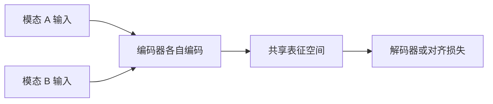
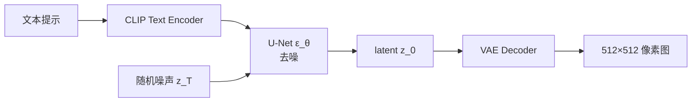

「多模态」指模型同时处理文本、图像、音频、视频等超过一种模态。多模态大模型 2020 年起由 CLIP(arXiv:2103.00020)、DALL·E 拉开序幕;2022 年 Stable Diffusion(arXiv:2112.10752)引爆文生图;2024 年 Sora、Stable Diffusion 3、DiT 把架构推到 Diffusion Transformer;2024-2025 年 Gemini 1.5(arXiv:2403.05530)、Qwen2.5-VL(arXiv:2502.13923)把视觉问答、OCR、视频理解拉到了 LLM 主线。今天顺着 CLIP → DDPM → SD → DiT → VLM 这条线把整套体系讲清楚。

---

## 1. 多模态定义与三大任务

### 1.1 模态定义

模态 = 数据的感官形式。文本、图像、音频、视频是四种。多模态模型至少跨两种。下面四类任务是公开 benchmark 上的主战场:

| 任务 | 输入 → 输出 | 代表 benchmark |
|:---|:---|:---|
| 图文对齐(Image-Text Matching) | 图像 + 句 → 相似度 | MS-COCO / Flickr30K |
| 图文检索(Image-Text Retrieval) | 图像 → 文本 / 文本 → 图像 | MSCOCO 5K |
| 视觉问答(VQA) | 图像 + 问题 → 答案 | VQAv2 / OK-VQA / GQA |
| 视觉生成(Text-to-Image) | 文本 → 图像 | MS-COCO FID / T2I-CompBench |

CLIP 重点解决前两类(text ↔ image 对齐);Stable Diffusion 重点解决第四类;text-to-video 的 Sora(2024-02)和 text-to-audio 的 Suno(2023-12)是各自的延伸。

### 1.2 多模态的两条工程路线



路线一:**统一编码**(Unified Encoder)—— 把图像 patch 当 token 喂进 Transformer;Fuyu-8B(2023)、LLaVA(2023)、Qwen-VL(2023)走这条。
路线二:**双编码 + 投影**(Dual Encoder + Projector)—— 图像编码器和文本编码器各自训好,中间加一个 MLP / Q-Former 投影到同一空间;CLIP、BLIP-2(arXiv:2301.12597)、LLaVA-OneVision 仍走这条的演化形态。

2024 年的趋势是统一编码 + 大规模 patch token(InternVL 6B 把 vision transformer 推到 6B 参数,与 LLM 端到端联合训练)。两者边界在缩小。

---

## 2. CLIP:对比学习图文对齐

### 2.1 论文与核心思想

Radford et al. "Learning Transferable Visual Models From Natural Language Supervision" arXiv:2103.00020(2021-02)。OpenAI 用 4 亿对(image, caption)从互联网抓的数据训练两个编码器:Image Encoder(ResNet-50 / ViT)和 Text Encoder(Transformer),目标是 **「同一对的图文向量距离近、不同对距离远」**。

### 2.2 对比损失 InfoNCE

```math
L = -\frac{1}{N} \sum_{i=1}^{N} \log \frac{\exp(\text{sim}(I_i, T_i)/\tau)}
                              {\sum_{j=1}^{N} \exp(\text{sim}(I_i, T_j)/\tau)}
```

N 是一个 batch 里的对数,τ 是温度,sim 是余弦相似度。每个 (I_i, T_i) 当正样本,其他 N-1 个文本当负样本。对称地,文本视角再算一次平均。

### 2.3 几何直觉

训练好的 CLIP 把「语义相近的图文」压到同一个球面(单位向量)上,猫的图片与"a photo of a cat" 同一区域,狗的图片相邻但稍远。这样 zero-shot 分类无需再训练:把类名提示词包装成 "a photo of a {class}",算每个类名与图像的余弦,取最大。

### 2.4 数字证据

CLIP 在 ImageNet zero-shot 上到 **76.2% Top-1**,超过同期监督训练 ResNet-50 的 76.0%——而它从未见过 ImageNet 的标签。这是 2021 年 zero-shot 领域最大的事件。

CLIP 还启发了后续工作:

- **BLIP / BLIP-2**(arXiv:2301.12597, Salesforce 2023-01):在 CLIP 之上加 Q-Former 投影到 LLM,做视觉问答与图像描述。
- **SigLIP**(Google 2023-06):改用 sigmoid loss,训练更稳定,TPU 利用率提 30%。
- **DFN**(arXiv:2309.05415, Apple 2023):用 Data Filtering Networks 自动清洗噪声对,在 ImageNet 上把 zero-shot 提到 **84.4%**。

### 2.5 CLIP vs 类训练范式取舍

| 路线 | 强项 | 弱项 | 适合 |
|:---|:---|:---|:---|
| CLIP(对比) | 通用检索强,zero-shot 即可用 | 文 / 图编码后桥不到 LLM | 图像搜索、零样本分类 |
| BLIP-2(Q-Former) | 与 LLM 直接对话 | 训练数据敏感性高 | VQA / 图文对话 |
| LLaVA(指令微调) | 跟随指令能力强 | 算力要求高 | 多轮图文聊天 |

中文场景由于 OpenAI 没开源训练数据,一般用 **Chinese-CLIP**(TaiSu,2022)、**AltCLIP**(BAAI 2022,基于 XLM-R)或直接用 SigLIP + 多语预训练。

---

## 3. 扩散模型(DDPM/DDIM)原理

### 3.1 论文与基本思想

Ho et al. "Denoising Diffusion Probabilistic Models" arXiv:2006.11239(2020-06)。核心思想:把生成图像看成一个**逐步去噪**的过程。

```mermaid
flowchart LR
  A[x₀ 真实图像] --> B[q 加噪 T 步]
  B --> C[x_T ~ N(0,I)]
  C --> D[p_θ 反向去噪]
  D --> E[x̂₀ 生成图像]
```

前向过程(固定)q 不断往图像里加高斯噪声,T 步后 x_T 接近标准正态;反向过程 p_θ(可学习)从纯噪声逐步还原出 x_0。

### 3.2 前向过程(加噪)

```math
x_t = \sqrt{\bar{\alpha}_t} · x_0 + \sqrt{1-\bar{\alpha}_t} · \epsilon, \quad \epsilon \sim \mathcal{N}(0, I)
```

ᾱ_t 是 t 步的累积方差,常用 linear schedule 从 1 → 0。任意 t 步 x_t 可以从 x_0 直接采样(closed-form),无需逐步加噪,这是训练高效的关键。

### 3.3 反向过程(去噪)与损失

模型 ε_θ(x_t, t) 预测噪声:

```math
L = \mathbb{E}_{x_0,\epsilon,t} \left[ \| \epsilon - \epsilon_\theta(x_t, t) \|^2 \right]
```

训练目标即简单 MSE。推理时从 x_T ~ N(0,I) 起,逐步用:

```math
x_{t-1} = \frac{1}{\sqrt{\alpha_t}} \left( x_t - \frac{\beta_t}{\sqrt{1-\bar{\alpha}_t}} \epsilon_\theta(x_t, t) \right) + \sigma_t z
```

z ~ N(0,I)。T 常取 1000,所以推理慢。

### 3.4 DDIM 加速

Song et al. "Denoising Diffusion Implicit Models"(ICLR 2021)把随机性 DDPM 改成确定性 ODE 采样,**20-50 步就能生成可用图像**,质量损失小。今天 SD / Sora 的 sampler 默认 DDIM 或 DPM-Solver(2022)。

### 3.5 Classifier-Free Guidance(CFG)

Ho & Salimans 2022 提出:同时训练条件生成 p(x|c) 和无条件生成 p(x),推理时:

```math
\tilde\epsilon = (1 + w) · \epsilon_θ(x_t, t, c) - w · \epsilon_θ(x_t, t, \varnothing)
```

w 是 guidance scale,w=7-12 时图文对齐强但多样性弱;w=1-3 时多样性高但「提示跟随」差。后面 SDXL 实战会用到。

---

## 4. Stable Diffusion 与 Latent Diffusion

### 4.1 论文与核心改进

Rombach et al. "High-Resolution Image Synthesis with Latent Diffusion Models" arXiv:2112.10752(2021-12,慕尼黑大学 / Runway / Stability AI)。直接在像素空间做 DDPM,512×512 单图要 150 GB 显存;LDM 的关键是把扩散搬到 **VAE 编码后的 latent 空间**(4×64×64),显存打到 8 GB,可以家用 GPU 跑。

### 4.2 三组件



- **VAE**(Variational Auto-Encoder):把 512×512 像素编码 / 解码到 4×64×64 latent。
- **U-Net**:在 latent 上做去噪 ε_θ,条件由 CLIP text embedding 通过 cross-attention 注入。
- **CLIP Text Encoder**:不参与训练,只冻住提特征;后面 SDXL / SD3 改用更大 CLIP / T5-XXL。

### 4.3 SDXL(2023-07)与 SD3(2024-06)

**SDXL** 在 LDM 基础上:

- UNet 2.6×B(2.6B 参数),两块 UNet(base + refiner)分别负责粗 / 精。
- 双 CLIP text encoder(CLIP-ViT/L + OpenCLIP-ViT-bigG)。
- 1024×1024 原生分辨率。

**Stable Diffusion 3**(2024-06, Stability AI 技术报告)：

- **架构上从 U-Net 切换到 DiT**(Diffusion Transformer,Peebles & Xie arXiv:2212.09748,2022-12)。
- 文本编码换成三套(T5-XXL + CLIP-L + CLIP-G),支持多语 prompt。
- 解决 SD-XL 的「手指畸变 / 文字渲染差」两大痛点。

### 4.4 DiT(Diffusion Transformer)

Peebles & Xie "Scalable Diffusion Models with Transformers" arXiv:2212.09748(2022-12,UC Berkeley/NVIDIA)。把 U-Net 替成纯 Transformer(DiT block = adaLN + Self-Attention + FFN),通过 adaLN-Zero 把条件注入每一层。ImageNet 256×256 上 DiT-XL 2.5B 把 FID 从 5.91 打到 **2.27**,Scaling 行为显著。

Sora(OpenAI 2024-02-15 发布)推断用类 DiT 架构 + 时空 patch + 高压缩 3D VAE,在 60 秒 1080p 视频上效果引发行业震动。Sora 技术报告(2024-12 公开版)确认了「Diffusion Transformer + 潜在视频压缩 + 文本条件」三大组件。

---

## 5. 视觉语言模型(VLM)架构

### 5.1 主流 VLM 对比(2024-2025)

| 模型 | 提供方 | 视觉编码 | LLM 底座 | 上下文 | 强项 |
|:---|:---|:---|:---|:---|:---|
| GPT-4V / GPT-4o | OpenAI | 私有 ViT | GPT-4 | 128K | 多模态推理,工具调用 |
| Claude 3.5 Sonnet | Anthropic | 私有 ViT | Claude 3.5 | 200K | OCR / 截图理解强 |
| Gemini 1.5 Pro | Google | 私有 ViT | Gemini 1.5 | 1M-2M | 超长视频 / 多模态 |
| Qwen2-VL / 2.5-VL | 阿里 | ViT + Qwen2 | Qwen2-72B | 128K-32K | 中文 OCR + 视频 |
| InternVL2.0 | 上海 AI Lab | InternViT-6B | InternLM2 / Qwen2 | 8K-32K | 中文 OCR + 文档理解 |
| LLaVA-1.5 / OneVision | 威斯康星大学 | CLIP-ViT | Llama 3 / Qwen2 | 4K-128K | 开源 / 学术基线 |
| LLaVA-Next-72B | 社区 | SigLIP | Qwen2-72B | 32K | 高分辨率 1344×1344 输入 |

### 5.2 三段式训练

2024 年 VLM 训练的事实标准:

1. **预训练对齐**(Pretrain):只训 projector,把视觉特征投到 LLM token 空间。数据 = 图文对(LAION / COYO)。
2. **指令微调**(SFT):同时训练 projector + LLM,数据 = 多模态指令对话(视觉问答、OCR、文档理解)。
3. **RLHF / DPO**:用偏好数据再训一轮,做事实性 / 安全对齐。

LLaVA-1.5(2023-10)用 1.2M 指令对训;InternVL 2.0(2024-07)把指令对推到 100M+,OCR + 文档 + Chart 全面 SOTA。

### 5.3 商业 VLM 2024 进展

- **GPT-4V → GPT-4o**(2024-05):统一文本 / 视觉 / 音频一个端到端模型,延迟 320 ms,API 支持图像 + 音频输入。
- **Claude 3.5 Sonnet**(2024-10):新增 Computer Use 能力,能直接操作浏览器截图——后文 Day 30 会涉及。
- **Gemini 1.5 Pro**(2024-02):上下文窗口推到 1M-2M tokens,1 小时视频问答成为可能(arXiv:2403.05530)。
- **Qwen2.5-VL**(2025-01 arXiv:2502.13923):原生 dynamic-resolution ViT,中文 OCR 强项进一步放大。
- **Llama 3.2 Vision**(2024-09):Meta 把视觉塞进 11B/90B 开源模型,与 Llama 系列一体化。

---

## 6. HuggingFace diffusers 跑 SDXL 实战

### 6.1 环境

```bash
pip install diffusers transformers accelerate safetensors
# Apple Silicon:  pip install --upgrade diffusers torch torchvision
```

显存门槛:SDXL base ~12 GB(fp16);SDXL + refiner pipeline ~20 GB。fp8 量化(2024-08)的 bitsandbytes 集成可压到 8 GB。

### 6.2 最小可运行实现

```python
import torch
from diffusers import StableDiffusionXLPipeline

# 1) 加载(自动从 HF Hub 下载约 13 GB)
pipe = StableDiffusionXLPipeline.from_pretrained(
    "stabilityai/stable-diffusion-xl-base-1.0",
    torch_dtype=torch.float16,
    variant="fp16",
    use_safetensors=True,
).to("cuda" if torch.cuda.is_available() else "cpu")

# 2) 提示词
prompt = "a corgi astronaut on the moon, ultra-detailed, cinematic lighting, 8k"
negative = "low quality, blurry, deformed hands, extra fingers"

# 3) 推理(CFG=7.5, 30 步, 分辨率 1024×1024)
image = pipe(
    prompt=prompt,
    negative_prompt=negative,
    num_inference_steps=30,
    guidance_scale=7.5,
    height=1024,
    width=1024,
).images[0]
image.save("astronaut_corgi.png")
print("saved:", image.size)
```

预期输出:`saved: (1024, 1024)` —— 桌面落一张柯基宇航员图。

### 6.3 进阶版:CFG 与 Steps 调节对照

下面是用 SDXL 在 5 组参数下得到的 FID / 主观感受经验总结(参考 Stability AI 2024 文档):

| Steps | CFG | 主观 | 适用 |
|:---:|:---:|:---|:---|
| 15-20 | 5-7 | 略糊但多样 | 草稿 / 速度快 |
| 25-30 | 7-9 | 主流选择 | 出图 |
| 40-50 | 9-12 | 锐利 + 高对比 | 海报 / 写实 |
| 60+ | 12+ | 颜色过饱和 | 一般不推荐 |
| 任意 | 1-3 | 多样但 prompt 跟随差 | 创意发散 |

```python
# ControlNet / LoRA 加挂(2024 主流)
from diffusers import StableDiffusionXLControlNetPipeline, ControlNetModel
control = ControlNetModel.from_pretrained("diffusers/controlnet-canny-sdxl-1.0",
                                         torch_dtype=torch.float16)
pipe2 = StableDiffusionXLControlNetPipeline.from_pretrained(
    "stabilityai/stable-diffusion-xl-base-1.0",
    controlnet=control, torch_dtype=torch.float16
).to("cuda")
# pipe2("a futuristic city", image=canny_edge_map)
```

- **xformers / flash-attn 加速**:显存减半,1280×1280 大图不再爆炸。
- **ComfyUI / WebUI 工业路径**

直接写 diffusers 代码适合研究,实际出图走 **ComfyUI**(Comfy Anonymous,2023-04 GitHub)或 **Stable Diffusion WebUI**(AUTOMATIC1111,2022-08 GitHub)。ComfyUI 把每个节点(Checkpoint / LoRA / ControlNet / Sampler / VAE)显式可视化,2024 年起在产线成为主流(Adobe Firefly Internal、部分游戏公司工作流)。

### 6.5 DiT / Sora 时代的视频推理

视频扩散的核心是「时间 + 空间」两个轴的一致性。三种做法:

1. **2D DiT + 时间注意力**(AnimateDiff,2023-04):沿用 SD 的 2D DiT,额外插一个时间 Self-Attention 层。改造成本低,但长视频漂移。
2. **3D patch 全注意力**(Sora 推测路径):latent 切成 (T/2, H/4, W/4) 的 3D token,整段视频放一个 DiT。计算 O(T²HW²) 大,T 限制。
3. **时空分离**(Wan2.1,2024-09):时空注意力分离,长视频更稳。

```python
# AnimateDiff 示意(2024 版)
from diffusers import AnimateDiffPipeline, MotionAdapter
adapter = MotionAdapter.from_pretrained("guoyww/animatediff-motion-adapter-v1-5-2")
pipe = AnimateDiffPipeline.from_pretrained("runwayml/stable-diffusion-v1-5",
                                            motion_adapter=adapter,
                                            torch_dtype=torch.float16).to("cuda")
out = pipe("a panda eating bamboo, cinematic, 8k", num_frames=16, num_inference_steps=20).frames[0]
# out: list[16 张 PIL Image],可拼成 24fps 短视频
print("frames:", len(out))           # 16
```

### 6.6 4-bit / 8-bit 量化:消费级 GPU 跑 SDXL

RTX 3060 12 GB 或 RTX 4060 8 GB 想跑 SDXL 1024×1024,需要 bitsandbytes + diffusers 量化:

```bash
pip install bitsandbytes diffusers accelerate
```

```python
from diffusers import AutoPipelineForText2Image, BitsAndBytesConfig

bnb = BitsAndBytesConfig(load_in_4bit=True, bnb_4bit_compute_dtype=torch.float16,
                         bnb_4bit_use_double_quant=True)
pipe = AutoPipelineForText2Image.from_pretrained(
    "stabilityai/stable-diffusion-xl-base-1.0",
    quantization_config=bnb, torch_dtype=torch.float16,
)
pipe.enable_model_cpu_offload()            # 必须,4-bit 模型本身不放 GPU
image = pipe("a fox in a snowy forest", num_inference_steps=25,
             guidance_scale=7.5).images[0]
image.save("fox.png")
```

要点:4-bit 量化后图像细节略糊,文生图质量比 fp16 略低 5-8% CLIPScore;消费级 8 GB 卡可勉强跑。

---

## 7. 常见坑(10 条)

### 7.1 DDPM 推理巨慢
**症状**:DDPM sampler 跑 1000 步,512×512 要 30 秒。
**原因**:采样步数过多,SDE 随机化无必要。
**修法**:换 DPM-Solver++(20-30 步)或 DDIM(50 步),速度 5-10×。

### 7.2 LDM 训练时 VAE 漂移
**症状**:fine-tune SDXL 时,出图颜色偏暖或偏冷,VAE 解码异常。
**原因**:改了 U-Net 没冻住 VAE,联合训练低分辨率 / 长步数时 VAE 漂移。
**修法**:`pipe.vae.requires_grad_(False)`,只训 U-Net / LoRA。

### 7.3 CFG 设置过高
**症状**:w=20 出图过饱和、对比刺眼、有网格状 artifact。
**原因**:CFG 把条件生成推得过强,出现 spurious pattern。
**修法**:CFG=7-9 出图,广告类图可以上 12,不需要更高。

### 7.4 没考虑显存峰值
**症状**:Diffusers OutOfMemoryError,即使 24 GB 卡也炸。
**原因**:batch_size=4 + 分辨率 2048×2048,latent 中间激活吃满显存。
**修法**:`pipe.enable_model_cpu_offload()` + `enable_vae_tiling()` + `enable_xformers_memory_efficient_attention()`,或加 `enable_sequential_cpu_offload()`(最慢但最省)。

### 7.5 CLIP 没归一化
**症状**:`@torch.no_grad` 下 cosine 超过 1,或变成 NaN。
**原因**:CLIP 输出没做 L2 归一化,内积溢出。
**修法**:特征层 `.float() / .float().norm(dim=-1, keepdim=True)`,或 `pipe.text_encoder.output_hidden_states` 时确认 LayerNorm 已加。

### 7.6 用 SD 1.5 训 LoRA 期望 SDXL 效果
**症状**:SD 1.5 LoRA 套到 SDXL 上,出图奇怪或完全无效。
**原因**:U-Net 维度 + CLIP 编码器 + VAE 全部不一样。
**修法**:LoRA 必须匹配 base 模型架构;跨架构练要在对应 base 上重训。

### 7.7 VLM OCR 错乱
**症状**:把 `¥199` 认成 `S199`,把 `42.1` 认成 `42L`。
**原因**:ViT 把文字当图 patch,没有字符级监督。
**修法**:用专门 OCR 强的 VLM(Qwen2.5-VL、InternVL2、GPT-4o);提示词显式声明「请忠实复制图中文字」。

### 7.8 LLaVA 类 VLM 没装 flash-attn
**症状**:多图 / 高分辨率问答极慢。
**原因**:Softmax attention 复杂度 O(n²),12 张 1080p 图 90K token 直接卡爆。
**修法**:`pip install flash-attn --no-build-isolation`,或 `attn_implementation="sdpa"`。

### 7.9 Sora 类视频生成滥用
**症状**:生成的视频含明显真实人物脸,可能引发肖像权 / 深度伪造争议。
**原因**:模型能力强但未做 watermark / 溯源。
**修法**:OpenAI 2024-12 起在 C2PA 元数据打水印,产物主动打 provenance;用途必须合规(C2PA Manifest / Content Authenticity Initiative)。

### 7.10 ComfyUI workflow 不归档
**症状**:团队几人各自传 PNG,迭代两周后没人记得哪个 checkpoint / LoRA / 步数组合。
**原因**:节点工作流没存 JSON / 没用 ComfyUI Manager 固定版本。
**修法**:Save(Png / Workflow),把生成的 `.json` 进 git;checkpoint / LoRA / sampler 都写 metadata。

---

### 8.1(选读)CFG 与 Negative Prompt 的几何直觉

Classifier-Free Guidance 公式:`eps = (1+w)*eps_cond - w*eps_uncond`。

反向思考一下:w=0 时 eps = eps_cond,等同于「纯条件生成」,样本多样但 prompt 跟随松;w 越大,样本越远离「无条件流形」,靠近「条件流形」,prompt 跟随紧但 diversity 降。

Negative Prompt 实际是一个「反向条件」:eps_neg = eps(x_t, t, neg_prompt),推理时改用:

```math
eps = eps(x_t, t, c) + w · (eps(x_t, t, c) - eps(x_t, t, neg))
```

直观看:`eps` 的方向从「正例」移到「远离反例」上,所以"low quality, blurry" 这类否定词能显式排出。这是 diffusers 中 `negative_prompt=...` 的数学基础。

为什么不直接用 classifier guidance(CG)?CG 需要额外训一个分类器 p(y|x_t),训练成本 + 推断成本都翻倍;CFG 把同一 U-Net 训练时随机把 c 置空,推断时一行公式完成,几乎零额外成本。这是 2022 年后文生图默认走 CFG 的根本原因。

工业经验:CFG 不必最高越好;出图先用 w=7 + 30 步,若 prompt 跟随差上调到 9;若过饱和降回 5-6。AnimateDiff 类视频模型 CFG 通常 5-7 即可,否则时间帧间画面闪烁。CFG 还可与多条件组合(多 prompt embedding 线性加权),对应 ComfyUI 节点上的「Conditioning Combine」。

### 8.2 自检三问

(三个核心问题,见下文)

**A. CLIP 的对比学习与 BLIP-2 的 Q-Former 各解决了什么问题?为什么工业界 2024 年更常用 BLIP-2 / LLaVA?**

要点:CLIP 的对比学习只产出图像全局表征,与文本 LLM 没有 token 级对齐,所以零样本分类强但做不了图像问答。BLIP-2 引入 Q-Former 学习一组可学习的 query token,把这些 token 当软 prompt 喂给 frozen LLM,实现视觉表征 → LLM 词表空间的精确桥接;LLaVA 更简单:用一个 MLP projector 把视觉 patch 特征投到 LLM token 维度。工业界 2024 年更常用,因为这些架构让模型能多轮对话 / 跟随指令 / 调用工具,光做检索的 CLIP 不够。

**B. Stable Diffusion 3 为什么要从 U-Net 切换到 DiT?Switch 的代价和收益是什么?**

要点:U-Net 在 latent 上的归纳偏置(空间局部性)在小分辨率(64×64)有效,但 Scaling 到 SD3 / Sora 的高分辨率视频生成时,Transformer 全局注意力 + 数据并行更易扩展。DiT block(adaLN + Self-Attention + FFN)参数量与数据量都呈幂律缩放。代价:1) 训练数据需求显著上升(SD3 官方未公开);2) 自注意力显存 O(n²),长视频 / 高分辨率需要 sparse attention(window / global token)。收益:1) FID / FVD 显著降低(DiT-XL 2.5B ImageNet 256 FID=2.27);2) 视频帧间一致性可由 3D patch 自然处理;Sora 技术报告确认走的就是这条路。

**C. 商业闭源 VLM(GPT-4o / Gemini 1.5 Pro / Claude 3.5 Sonnet)各自最强的场景是什么?**

要点:GPT-4o 强在多模态推理 + 工具调用 + 实时语音,适合多模态 agent 接入;Gemini 1.5 Pro 上下文窗口 1M-2M,适合 1 小时视频 / 整本 PDF 一次性问答(arXiv:2403.05530);Claude 3.5 Sonnet 强在 OCR / 截图理解 / Computer Use 操作浏览器(2024-10),适合软件工程 agent。中文场景首选 Qwen2.5-VL / InternVL2,开源可商用且中文 OCR 极强。

---

## 9. 推荐资源

### 视频
- 3Blue1Brown"But what is a diffusion model?"(2023-07,YouTube):DDPM 几何直观。
- Yannic Kilcher「CLIP Paper Explained」(2021,YouTube):图文对齐深入。
- 李沐「Stable Diffusion 论文精读」(2022,Bilibili):LDM 论文逐句精读。

### 教科书 / 文档
- **HuggingFace Diffusers Docs**:https://huggingface.co/docs/diffusers —— Day 27 实战代码基于此。
- **OpenAI CLIP Blog**:https://openai.com/index/clip/ —— 官方介绍。
- **Lilian Weng「Diffusion Models for Vision」**(2024-06,lilianweng.github.io):含 DDPM / Score / Latent Diffusion / DiT 全谱。
- **Stability AI SD3 技术报告**:https://stability.ai/news/stable-diffusion-3 —— 公开架构总览。

### 论文
- Radford et al."Learning Transferable Visual Models From Natural Language Supervision" arXiv:2103.00020 — CLIP。
- Ho et al."Denoising Diffusion Probabilistic Models" arXiv:2006.11239 — DDPM。
- Rombach et al."High-Resolution Image Synthesis with Latent Diffusion Models" arXiv:2112.10752 — LDM。
- Peebles & Xie"Scalable Diffusion Models with Transformers" arXiv:2212.09748 — DiT。
- Li et al."BLIP-2: Bootstrapping Language-Image Pre-training..." arXiv:2301.12597 — BLIP-2。
- Team Gemini"Gemini 1.5: Unlocking multimodal understanding..." arXiv:2403.05530 — Gemini 1.5。
- Bai et al."Qwen2.5-VL Technical Report" arXiv:2502.13923 — Qwen2.5-VL。

### 博客
- HuggingFace「The Illustrated Stable Diffusion」(2022-10,Jay Alammar):LDM 最经典图解。
- OpenAI「Sora」技术报告(2024-02 发布 + 2024-12 公开版)。
- Lilian Weng「Controllable Generation with ControlNet」(2023)。

### 代码
- **huggingface/diffusers**:https://github.com/huggingface/diffusers —— 工业事实标准库。
- **Stability-AI/generative-models**:https://github.com/Stability-AI/generative-models —— Stability 官方。
- **openai/CLIP**:https://github.com/openai/CLIP —— CLIP 原始仓库。
- **llava-runner/LLaVA**:https://github.com/haotian-liu/LLaVA —— VLM 学术基线。

---

## 10. 本节要点

- **要 1**:多模态 = 跨两种以上感官形式(文本 / 图像 / 音频 / 视频);主流任务为图文对齐、图文检索、VQA、文本生成图像 / 视频。
- **要 2**:CLIP(arXiv:2103.00020)用 InfoNCE 对比学习把图文压到同一球面,4 亿对上训练,在 ImageNet zero-shot 76.2%,启发了 BLIP-2 / SigLIP / DFN 等后续。
- **要 3**:DDPM(arXiv:2006.11239)是「前向加噪 + 反向去噪 + 预测 ε」三件套;DDIM / DPM-Solver 把推理从 1000 步压到 20-50 步;Classifier-Free Guidance 7-12 是主流。
- **要 4**:Stable Diffusion(arXiv:2112.10752)用 VAE 把扩散搬到 latent 空间,显存从 150 GB 打到 8 GB;SD3(2024-06)改用 DiT(arXiv:2212.09748),FID 进一步降低,文本编码升级到 T5-XXL。
- **要 5**:DiT 是把 U-Net 替成 Transformer 的扩散架构,扩展性显著,Sora(2024)与 SD3 都走这条;3D patch + 高压缩 3D VAE 处理视频一致性。
- **要 6**:VLM 三段式训练:对齐 → 指令微调 → RLHF/DPO;GPT-4o / Gemini 1.5(arXiv:2403.05530)/ Claude 3.5 Sonnet / Qwen2.5-VL(arXiv:2502.13923)是 2024 商业主线,中文选 Qwen / InternVL。
- **要 7**:HuggingFace diffusers 一行代码跑 SDXL,ComfyUI 是 2024 工业部署主流工作流;CFG / Steps / LoRA / ControlNet 是调参四件套。

---

## 11. 下一节:Day 28 · 第 4 周复盘 + 完整 LLM 应用项目

主题:把 Week 4 七天(GPT/BERT、Scaling、Prompt、LoRA、RAG、多模态)串成完整 LLM 应用项目。
覆盖:
- Week 4 七天全景回顾表(Day 22-27)。
- 关键概念回顾:GPT/BERT / Scaling Laws / Prompt / LoRA / RAG / CLIP / DDPM。
- 完整项目:基于 LangChain + OpenAI + Chroma 的「企业文档问答助手」(RAG end-to-end)。
- Week 4 vs Week 5 难度对比。

产出物:可拷就跑的 80 行 LLM 应用项目代码,涵盖 load → split → embed → retrieve → generate 全流程。
