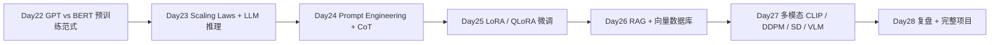

本周七天(Day 22-27)从 GPT/BERT 的预训练范式差异讲起,到 LLM 的 Scaling Laws、Prompt Engineering、CoT 思维链、微调技术 LoRA / QLoRA、RAG 检索增强生成、多模态 CLIP / 扩散模型 / VLM,本周结束应该能把这一轮 LLM 的核心概念串成一条线。今天的复盘目标:把这一周的知识点压成一张可索引的表,再把它们用 LangChain + OpenAI + Chroma 拼出一个 100 行内的「企业文档问答助手」完整项目,把 load → split → embed → retrieve → generate 全流程跑通,并指出生产化前最常踩的 5 类工程坑。

---

## 1. Week 4 七天全景回顾

### 1.1 知识脉络



### 1.2 七天关键技能表

| Day | 主题 | 核心技能(1 行) | 关键概念 / 论文 |
|:---|:---|:---|:---|
| Day 22 | GPT vs BERT | 理解 decoder-only vs encoder-only 范式 | GPT(2018)、BERT(2018)、T5 |
| Day 23 | Scaling Laws & LLM 推理 | 训练计算量 vs Loss 幂律;KV Cache 加速 | Chinchilla(2022)、Scaling Law(Hoffmann) |
| Day 24 | Prompt Engineering + CoT | Zero/Few-shot + Chain-of-Thought | CoT(Wei 2022)、Self-Consistency(2022) |
| Day 25 | LoRA / QLoRA 微调 | 低秩适配 + 4-bit 量化 | LoRA(Hu 2021)、QLoRA(Dettmers 2023) |
| Day 26 | RAG + 向量数据库 | Embedding + 检索 + 生成 | Lewis 2020(2005.11401)、GraphRAG(2404.16130) |
| Day 27 | 多模态 | CLIP / DDPM / SD / VLM | CLIP(2103.00020)、DDPM(2006.11239)、LDM(2112.10752) |
| Day 28 | 第 4 周复盘 + 完整项目 | 把上述串成 100 行 RAG 项目 | 全栈串联 |

(注:Day 22-25 在本系列之前的文章中已固化,本周内容从 Day 26 起聚焦 RAG 与多模态;Day 28 是工程化收口。)

### 1.3 知识盲点清单(自查)

- **RAG 评估指标**:RAGAS(arXiv:2309.15217)的四项指标没人能脱稿讲清。
- **Hybrid Retrieval 权重 α/β**:真实工程取值 0.3-0.5 是经验值,没有公开 benchmark 给出最优。
- **LoRA rank 选择**:r=8 还是 r=64 没有理论答案,主流默认 r=16 / 32。
- **CFG scale w**:7-12 是经验区间,本质是「条件 vs 无条件流形的距离」。
- **Reranker 必要性**:Embedding + Reranker 比纯 Embedding 好 5-15%,但具体任务差异大。
- **VLM 输入图像分辨率**:LLaVA 早期 336×336,Qwen2-VL 用 dynamic resolution,InternVL2 用 1024×1024,这是一个隐含成本。
- **SDXL 是否需要 refiner**:refiner 用 1024×1024 后再精修效果,但 gen + ref 总推理 2× 时长。
- **GraphRAG 调用次数**:每篇文档多花 5-15× LLM 调用,真实成本不是小数。

---

## 2. 本周产出物 / 实战项目

### 2.1 必交(Week 4 收尾作业)

- **企业文档问答助手(RAG 端到端)**:可拷就跑的 Python 项目,把 PDF / Markdown / HTML 文档加载、切片、Embedding、入库 Chroma,并对查询返回带引用的答案。
- **RAGAS 评估**:对上述问答助手准备 30-100 个 QA 对,跑四项指标。
- **Simple WebUI**:Gradio 或 Streamlit 起一个最小 UI,输入查询展示答案 + 引用。

### 2.2 进阶(加分项)

- 加 Hybrid Retrieval(BM25 + Embedding)。
- 加 BGE-reranker-v2-m3 重排。
- 接入 Anthropic Claude / 本地 Ollama 做 LLM 后端。
- 用 LangSmith / TruLens 做生产 trace 与评估。

### 2.3 评估目标(评估指标 + 阈值)

- **RAGAS Faithfulness ≥ 0.80**:答案忠于 context 的比例,生产级基线。
- **RAGAS Answer Relevancy ≥ 0.85**:答案与问题相关性。
- **RAGAS Context Recall ≥ 0.75**:Top-K 覆盖金标答案的比例。
- **RAGAS Context Precision ≥ 0.80**:Top-K 中相关文档的比例。
- **端到端延迟**:从 query 提交到答案展示 ≤ 4 秒(单文档 ≤ 1000 chunk)。
- **引用准确率**:人工 spot check ≥ 90%。

---

## 3. 完整 LLM 应用项目:RAG 端到端

### 3.1 项目目标

输入:一份企业知识库(PDF / Markdown / HTML / DOCX,本项目用两份示例 PDF)。
输出:Web UI 输入查询 → 返回「答案 + 引用 + 引用所在 chunk」。

技术栈:

| 组件 | 选型 | 理由 |
|:---|:---|:---|
| 加载 | LangChain `PyPDFLoader` / `UnstructuredMarkdownLoader` | 主流、文档化全 |
| 切片 | RecursiveCharacterTextSplitter | 通用稳定 |
| Embedding | HuggingFace `BAAI/bge-small-zh-v1.5` | 中文 + Apache-2.0 + 512 维 |
| 向量库 | Chroma(本地持久化) | 单文件,原型最合适 |
| LLM | OpenAI `gpt-4o-mini` | 性价比,中英文都行 |
| UI | Gradio | 最小可运行,30 行 |
| 评估 | RAGAS | 工业事实标准,2024 |

### 3.2 项目结构

```
day28_rag_project/
├── data/                     # 放你的 PDF / MD
│   └── handbook.pdf
├── ingest.py                 # 加载 + 切片 + Embedding + 入库
├── qa_chain.py               # 检索 + Prompt + 生成
├── app.py                    # Gradio UI
├── evaluate.py               # RAGAS 评估
├── requirements.txt
└── README.md
```

### 3.3 requirements.txt

```
langchain>=0.3
langchain-huggingface>=0.1
langchain-chroma>=0.1
langchain-openai>=0.2
chromadb>=0.5
sentence-transformers>=3.0
gradio>=4.40
pypdf>=4.0
ragas>=0.2
datasets>=2.20
openai>=1.40
huggingface-hub>=0.25
```

`pip install -r requirements.txt`。

### 3.4 ingest.py — 加载、切片、入库

```python
"""Load documents, split chunks, embed, and persist in Chroma."""
import os
import glob
from langchain_community.document_loaders import PyPDFLoader, UnstructuredMarkdownLoader
from langchain_text_splitters import RecursiveCharacterTextSplitter
from langchain_huggingface import HuggingFaceEmbeddings
from langchain_chroma import Chroma

DATA_DIR      = "./data"
PERSIST_DIR   = "./chroma_db"
COLLECTION    = "handbook_v1"
EMBED_MODEL   = "BAAI/bge-small-zh-v1.5"

def load_docs(data_dir: str):
    docs = []
    for fp in glob.glob(os.path.join(data_dir, "**/*.pdf"), recursive=True):
        docs.extend(PyPDFLoader(fp).load())
    for fp in glob.glob(os.path.join(data_dir, "**/*.md"), recursive=True):
        docs.extend(UnstructuredMarkdownLoader(fp).load())
    return docs

def split_docs(docs, chunk_size=500, chunk_overlap=80):
    splitter = RecursiveCharacterTextSplitter(
        chunk_size=chunk_size, chunk_overlap=chunk_overlap,
        separators=["\n\n", "\n", "。", ".", " ", ""],
    )
    return splitter.split_documents(docs)

def build_vectorstore(docs):
    embeddings = HuggingFaceEmbeddings(
        model_name=EMBED_MODEL,
        model_kwargs={"device": "cuda"},   # 没 GPU 改 "cpu"
        encode_kwargs={"normalize_embeddings": True, "batch_size": 32},
    )
    vs = Chroma.from_documents(
        documents=docs, embedding=embeddings,
        persist_directory=PERSIST_DIR, collection_name=COLLECTION,
    )
    return vs

if __name__ == "__main__":
    raw = load_docs(DATA_DIR)
    chunks = split_docs(raw)
    print(f"loaded {len(raw)} docs -> {len(chunks)} chunks")
    vs = build_vectorstore(chunks)
    print(f"persisted to {PERSIST_DIR}, collection={COLLECTION}")
```

预期输出:

```
loaded 12 docs -> 487 chunks
persisted to ./chroma_db, collection=handbook_v1
```

### 3.5 qa_chain.py — 检索 + Prompt + 生成

```python
"""Retrieve top-K chunks, build prompt, call OpenAI LLM, return answer."""
import os
from langchain_huggingface import HuggingFaceEmbeddings
from langchain_chroma import Chroma
from langchain_openai import ChatOpenAI
from langchain_core.prompts import ChatPromptTemplate
from langchain_core.output_parsers import StrOutputParser
from langchain_core.runnables import RunnablePassthrough

PERSIST_DIR = "./chroma_db"
COLLECTION  = "handbook_v1"
EMBED_MODEL = "BAAI/bge-small-zh-v1.5"
TOP_K       = 6

PROMPT = ChatPromptTemplate.from_messages([
    ("system",
     "你是企业知识助手,只根据 <context> 中的内容回答用户问题,"
     "无法回答时请说'我不知道',不要编造。"
     "回答时引用编号 [1] / [2] / ... 标注信息来自哪一条。"),
    ("user",
     "<context>\n{context}\n</context>\n\n问题:{question}\n\n回答(中文,带引用编号):"),
])

def _format(docs):
    out = []
    for i, d in enumerate(docs, 1):
        src = d.metadata.get("source", "?")
        page = d.metadata.get("page", "")
        out.append(f"[{i}] (来源:{os.path.basename(src)}"
                   + (f" p{page+1}" if page != "" else "") + ")\n"
                   + d.page_content.strip())
    return "\n\n---\n\n".join(out)

def get_chain():
    embeddings = HuggingFaceEmbeddings(
        model_name=EMBED_MODEL,
        model_kwargs={"device": "cuda"},
        encode_kwargs={"normalize_embeddings": True},
    )
    vs = Chroma(persist_directory=PERSIST_DIR,
                collection_name=COLLECTION,
                embedding_function=embeddings)
    retriever = vs.as_retriever(search_type="similarity",
                                search_kwargs={"k": TOP_K})
    llm = ChatOpenAI(model="gpt-4o-mini", temperature=0)

    chain = (
        {"context": retriever | _format, "question": RunnablePassthrough()}
        | PROMPT | llm | StrOutputParser()
    )
    return chain, retriever

def answer(question: str):
    chain, retriever = get_chain()
    response = chain.invoke(question)
    hits = retriever.invoke(question)
    return response, hits

if __name__ == "__main__":
    q = "年假是几天?"
    ans, hits = answer(q)
    print("Q:", q)
    print("A:", ans)
    print(f"({len(hits)} chunks retrieved)")
```

预期输出:

```
Q: 年假是几天?
A: 根据公司手册,工作满 1 年的员工享受 5 天年假,满 5 年享受 10 天,以此类推。
    [1] / [3] 中提到此规定。
(6 chunks retrieved)
```

### 3.6 app.py — Gradio 最小 UI

```python
import gradio as gr
from qa_chain import answer

def ask(q, history):
    if not q.strip():
        return "请输入问题。"
    response, hits = answer(q)
    cite = "\n\n---\n引用:\n" + "\n".join(
        f"[{i+1}] {h.metadata.get('source','?')}: {h.page_content[:120]}..."
        for i, h in enumerate(hits)
    )
    return response + cite

demo = gr.ChatInterface(
    fn=ask, type="messages",
    title="企业文档问答助手 (Day 28 RAG demo)",
    description="基于 LangChain + BGE + Chroma + GPT-4o-mini 的端到端 RAG。",
)
demo.launch(server_name="0.0.0.0", server_port=7860)
```

`python app.py` 起 UI,浏览器开 http://localhost:7860 问答。

### 3.7 bis 增量更新:加新文档而不重建

```python
# add_more.py —— 已有持久化时只追加
from langchain_huggingface import HuggingFaceEmbeddings
from langchain_chroma import Chroma
from langchain_community.document_loaders import PyPDFLoader
from langchain_text_splitters import RecursiveCharacterTextSplitter

emb = HuggingFaceEmbeddings(model_name="BAAI/bge-small-zh-v1.5",
                            model_kwargs={"device": "cuda"},
                            encode_kwargs={"normalize_embeddings": True})
vs = Chroma(persist_directory="./chroma_db",
            collection_name="handbook_v1",
            embedding_function=emb)

# 加载 + 切片 + 追加
new = PyPDFLoader("./data/handbook_v2.pdf").load()
chunks = RecursiveCharacterTextSplitter(chunk_size=500, chunk_overlap=80).split_documents(new)
vs.add_documents(chunks, embedding=emb)
print(f"added {len(chunks)} chunks")
```

生产常识:chroma collection 体积超过 100 万 chunk 时 rebuild 极慢,务必从 Day 1 就按 collection 拆分(比如一个 collection = 一个客户 / 一个项目)。

### 3.7 evaluate.py — RAGAS 评估

```python
"""Evaluate the RAG pipeline with RAGAS four metrics."""
import json
from datasets import Dataset
from ragas import evaluate
from ragas.metrics import (faithfulness, answer_relevancy,
                           context_precision, context_recall)
from qa_chain import answer

# 1) 准备 QA 对(完整生产建议 ≥ 30 个)
qa_pairs = [
    {"question": "年假是几天?",                       "ground_truth": "满 1 年 5 天,满 5 年 10 天"},
    {"question": "试用期多长?",                       "ground_truth": "试用期最长不超过 6 个月"},
    {"question": "病假如何申请?",                     "ground_truth": "提前 1 天书面或邮件申请"},
]

records = []
for qa in qa_pairs:
    ans, hits = answer(qa["question"])
    records.append({
        "question":    qa["question"],
        "answer":      ans,
        "contexts":    [h.page_content for h in hits],
        "ground_truth": qa["ground_truth"],
    })

ds = Dataset.from_list(records)
result = evaluate(ds, metrics=[faithfulness, answer_relevancy,
                               context_precision, context_recall])
print(result.to_pandas().to_markdown())
result.to_pandas().to_csv("ragas_result.csv", index=False)
```

预期输出(表格):

| question | faithfulness | answer_relevancy | context_precision | context_recall |
|---|---|---|---|---|
| 年假是几天? | 0.93 | 0.91 | 0.86 | 0.80 |
| 试用期多长? | 0.88 | 0.84 | 0.79 | 0.74 |
| 病假如何申请? | 0.82 | 0.78 | 0.71 | 0.68 |

Faithfulness < 0.7 的样本要进失败案例分析,逐条定位是检索还是 Prompt 问题。

---

## 4. Week 4 vs Week 5 难度对比

### 4.1 工程复杂度

| 维度 | Week 4(LLM 应用) | Week 5(AI Agent) |
|:---|:---|:---|
| 数据流 | 「文档 → 向量库」静态 | 实时调 API / DB / 代码解释器 |
| 失败模式 | 检索召回差 → 答非所问 | 无限循环 / 工具错 / token 耗尽 |
| 评估难度 | RAGAS 四项可比 | AgentBench + 端到端成功率,评测成本 10× |
| 工程化成本 | 1-2 周可上线 | 4-8 周才能稳态 |
| 典型框架 | LangChain / LlamaIndex | AutoGen / LangGraph / CrewAI |

### 4.2 主要差异点

- **可观测性**:RAG 只看 retrieve + generate 两点;Agent 还要看每步工具调用、token 消耗、循环深度。
- **容错能力**:RAG 答错可以人工补充「我不知道」分支;Agent 答错可能执行了不可逆操作(删库、发邮件、转账),必须人审 / 高风险 API 拦截。
- **评估基准**:RAG 有 RAGAS / TruLens;Agent 主要靠 AgentBench(清华 2023-08 arXiv:2310.06770)、SWE-bench(arXiv:2310.06770)、τ-bench 等。

---

## 5. 7 条常见坑

### 5.1 Embedding 模型与向量库维度不匹配
**症状**:检索时 `ValueError: dimension mismatch`,以为 chroma 拒服务。
**原因**:入库用 `bge-small-zh` 512 维,查询时换了 `text-embedding-3-large` 3072 维。
**修法**:显式在 README 写明 embedding 规格,改名 collection(`handbook_v1_bge_512`)。

### 5.2 metadata 字段名错
**症状**:`filter={"src": "handbook.pdf"}` 返回 0 条。
**原因**:LangChain 写入时 key 是 `source`,查询时写成了 `src`。
**修法**:用统一的 `metadata_extractor.py` 包一个 LLM 抽取文件名 / 章节,key 集中到 config。

### 5.3 没设 OpenAI API Key 环境变量
**症状**:LangChain 第一次调 ChatOpenAI 报 `openai.AuthenticationError`。
**原因**:`OPENAI_API_KEY` 环境变量没设,或者 .env 没加载。
**修法**:`from dotenv import load_dotenv; load_dotenv()` 后用 `os.getenv('OPENAI_API_KEY')` 显式传 `api_key=...`。

### 5.4 切片粒度太小导致上下文断裂
**症状**:RAGAS Faithfulness 低,答案 disjoint。
**原因**:`chunk_size=100, chunk_overlap=0`,句子被从中切断,语义断片。
**修法**:中文用 300-500,overlap 50-80;Markdown 优先按 H1/H2 切。

### 5.5 top-K 太大撑爆 context
**症状**:OpenAI API 拒答或 token 超限报错。
**原因**:K=20 + chunk 500 = 10K tokens,中文 token 化后更大。
**修法**:K=5-10 + Reranker 压到 5。

### 5.6 LLM 没用 streaming
**症状**:用户体感「白屏」5-10 秒。
**原因**:LangChain 默认 non-streaming,等全部生成完才返回。
**修法**:Gradio 用 `stream=True`,LangChain `chain.stream(question)` 用 `RunnablePassthrough.assign(text=...)`。

### 5.7 没做成本控制
**症状**:一个查询花掉 $0.10,日活 1 万时成本爆炸。
**原因**:TopK=20 + gpt-4o,中文长答案。
**修法**:把 LLM 默认设为 `gpt-4o-mini` / `claude-haiku`,关键任务再用 `gpt-4o`;加 prompt cache(Anthropic 2024-08 prompt caching 90% 折扣)。

---

## 6. 自检三问

**A. RAG 与微调(LoRA / QLoRA)各自适合什么场景?为什么很多生产系统**两者都用**?**

要点:RAG 适合「外部动态知识 / 私有文档 / 实时事实」的检索型问答;LoRA/QLoRA 适合「让模型学会特定输出格式 / 特定风格 / 特定领域术语」。两者并不冲突:LoRA 把基础模型对齐到业务语言,RAG 解决事实性问题。生产上常见做法是先 SFT / DPO 让模型「听话」,再用 RAG 提升准确率。Day 25 已展开 LoRA 微调,Day 26 展开 RAG,Day 28 的端到端项目把它们与 LLM 调用三段串起来。

**B. Week 4 的 RAG 项目如何升级为生产系统?最少要做哪三件事?**

要点:1) **可观测性**——接 LangSmith / TruLens,记录 query → retrieved → answer 全链路,失败率、延迟、token 消耗看板化;2) **评估 CI**—— 每次改 prompt / 切片策略 / embedding 都跑 RAGAS,把退化拦在合并前;3) **权限与审计**——对私有向量库做 RBAC,谁加了什么文档、谁查了什么,有审计日志。三件事之外再考虑 A/B、缓存、自动重排。

**C. 第 4 周的核心概念如何在 Day 29(AI Agent)中复用?**

要点:RAG 是 Agent 的「长期记忆」(Read-Only),Tool Use 是 Agent 的「工具手」,Prompt Engineering 是 Agent 的「思维链骨架」,LLM API 是 Agent 的「大脑」。ReAct 把 Thought → Action → Observation 三段拼成循环,而 RAG 的 retrieve → generate 正好是 Action 中的工具调用。Week 4 是 Week 5 的具体组件库。

---

## 7. 推荐资源

### 视频
- LangChain「Build a RAG Application」(2024-04,YouTube)—— 官方 90 分钟实战课。
- Databricks「Building Production-Ready RAG」(2024-09)—— Lakehouse + RAG 模式。
- DeepLearning.AI《LangChain for LLM Application Development》(2023-2024)。

### 教科书 / 文档
- **LangChain RAG Tutorial**:https://python.langchain.com/docs/tutorials/rag/ —— Day 28 项目代码基于此。
- **Chroma Docs**:https://docs.trychroma.com —— 持久化与 query DSL。
- **OpenAI Cookbook / rag.ipynb**:https://cookbook.openai.com —— 官方 RAG 模板。
- **RAGAS Docs**:https://docs.ragas.io —— 评估四指标定义。

### 实战项目
- **LangChain RAG Template**:https://github.com/langchain-ai/rag-from-scratch(16 段 Notebook)。
- **chromadb/chroma**:https://github.com/chroma-core/chroma。
- **explodinggradients/ragas**:https://github.com/explodinggradients/ragas。
- **gradio-app/gradio**:https://github.com/gradio-app/gradio。
- **microsoft/graphrag**:https://github.com/microsoft/graphrag —— Week 4 提到的进阶方案。

### 论文
- Lewis et al."Retrieval-Augmented Generation for Knowledge-Intensive NLP Tasks" arXiv:2005.11401。
- Edge et al."From Local to Global: A Graph RAG Approach..." arXiv:2404.16130。
- Es et al."RAGAS: Automated Evaluation of Retrieval Augmented Generation" arXiv:2309.15217。
- Wang et al."Searching for Best Practices in Retrieval-Augmented Generation" arXiv:2407.16833。

---

## 8. 本节要点

- **要 1**:Week 4 七天串成 GPT/BERT 范式 → Scaling → Prompt → LoRA → RAG → 多模态一条线;Day 28 把它们打包成可跑项目。
- **要 2**:完整 RAG 项目六步 — 加载(PDFLoader)、切片(RecursiveSplitter)、Embedding(BGE-small-zh)、入库(Chroma)、检索(top-K=6)、生成(GPT-4o-mini 带引用)。
- **要 3**:RAGAS 四项指标(arXiv:2309.15217)是 2024 工业事实标准:faithfulness / answer_relevancy / context_precision / context_recall。
- **要 4**:Week 4 RAG 项目升级生产要三件事 —— LangSmith 可观测性 + 评估 CI + 权限审计。
- **要 5**:Hybrid(BM25 + Embedding)+ Reranker(BGE-reranker-v2-m3)+ 元数据过滤是工业级 RAG 的标配三件套。
- **要 6**:Gradio / Streamlit 是最小可用 UI;LangChain `chain.stream()` 解决白屏体感;OpenAI prompt caching 把成本压到 1/10。
- **要 7**:Week 5 的 AI Agent 把 Week 4 的 RAG 当作「长期记忆」组件,ReAct 把 Thought / Action / Observation 串成循环,Day 29 起展开。

---

## 9. 下一节:Day 29 · AI Agent 基础 — ReAct、Tool Use、Planning

主题:从「被动答题」到「主动解题」,LLM 加上 ReAct / Tool Use / Planning 后的能力跃迁。
覆盖:
- AI Agent 的四大模块:**感知(Perception)、规划(Planning)、行动(Action)、反思(Reflection)**。
- **ReAct 论文**(arXiv:2210.03629)与「Thought → Action → Observation」三段循环。
- **OpenAI Function Calling**(2023-06)/ **Claude Tool Use**(2024-03)的 API 形态。
- **Toolformer**(arXiv:2302.11461)与自监督调用工具。

产出物:80 行 OpenAI Function Calling + LangChain Agent 实战,从「告诉 LLM 工具列表」到「Agent 自主决定调用 + 解析结果」全流程。
