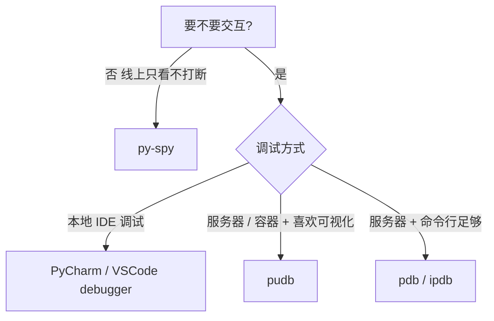
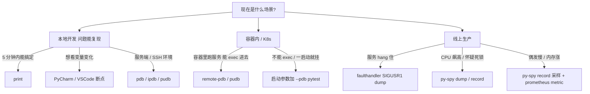
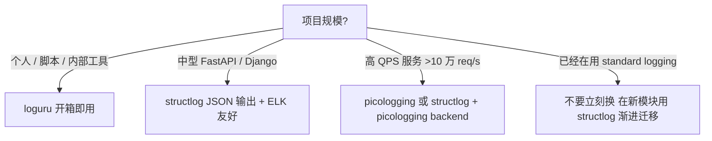
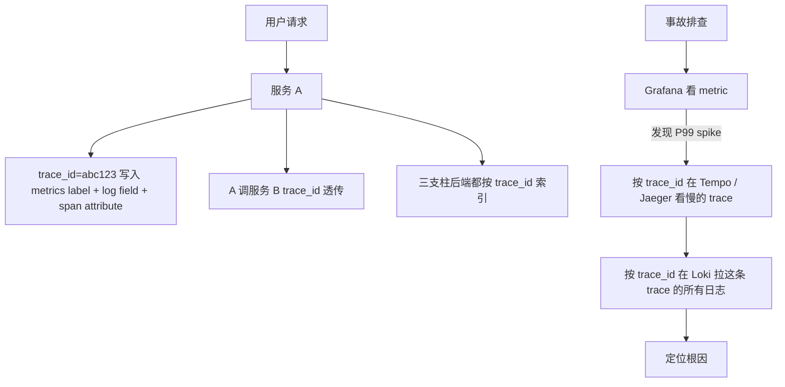

> **深度目标**:3-5 年达到"能在 5 分钟内用 py-spy + 日志定位线上问题";5-10 年达到"能为中型服务设计完整可观测性体系(metrics / logs / traces 三支柱)"
> **前置**:1.3 Python 高级特性 + 1.3.5 测试基础
> **关联模块**:1.3.3 性能调优(py-spy 部分重叠)/ 1.3.1 异步(asyncio 调试特殊点)/ 2.1 LLM 工程化(AI Agent 可观测性)
> **预估阅读**:50 分钟
> **调研依据**:「可观测性 / OpenTelemetry / 链路追踪」在 3-5 年档词频合计 9 / 175 = 5.1%,5-10 年档 11 / 116 = 9.5%,**5-10 年档翻倍**(调研 §4.7)。这一篇不是写给初学者的,是写给"已经会 print 调试,但还没设计过完整观测体系"的工程师

---

## 0. 一句话总览

> **打印不是调试,日志不是排查。生产事故 50% 时间花在"找日志"上,AI Agent 这种黑盒服务更甚。** 资深工程师的标志不是"会用 print",而是「知道 print 解决不了问题 → 选对工具 → 把观测信号接到体系里」。

---

## 1. 为什么这个专题重要

### 1.1 生产事故 50% 的时间花在"找日志"

资深工程师都有一个共同记忆:线上出问题,先 ssh 到服务器,然后 `grep -r ERROR /var/log/app/` 找异常日志。这是 2015 年的故事。2026 年的真实场景是:

|| 场景 | 2015 年打法 | 2026 年现实 |
|---|---|---|
| 服务报错 | 看本地 log 文件 | 日志在 ELK / Loki,按 trace_id 拉 |
| 慢请求 | 复现 + 打日志 | OpenTelemetry trace 一查就知道哪段慢 |
| AI Agent 答错 | 看 prompt 输出 | 要看 LLM 调用的完整链路(prompt / token / latency) |
| 内存飙高 | gdb attach | py-spy dump 看哪段在 hold 内存 |
| 服务卡死 | strace / pstack | py-spy dump 看是否死锁 + 哪行死 |

**核心观点**:可观测性(observability)已经从「加分项」变成「默认能力」。SRE 圈有一句话 —— "**If you can't measure it, you can't fix it**"。

### 1.2 AI Agent / RAG 服务的可观测性是新课题

2025-2026 年最大变化是 AI Agent 服务。LLM 调用有几个特征让传统日志失效:

|| 特征 | 传统日志能回答吗 | OpenTelemetry 能回答吗 |
|---|---|:---:|:---:|
| 一次用户请求调了几次 LLM? | ❌ | ✅ span 计数 |
| 哪次 LLM 调用耗时最长? | ❌ | ✅ span timing |
| token 用量随 prompt 怎么变? | ⚠️ 难聚合 | ✅ attribute 透传 |
| RAG 检索命中的文档是哪几条? | ⚠️ 难标准化 | ✅ span event |
| Agent 走的工具调用链路? | ❌ 文本格式混乱 | ✅ span tree |

> **调研依据**:OpenTelemetry 在 5-10 年档 JD 词频 9.5%,3-5 年档 5.1%,**5-10 年档翻倍** —— 不是因为 5 年后突然要学新东西,而是因为 5 年后开始主导架构设计,必须把观测信号接入体系。详见知识宝典调研 §4.7。

### 1.3 观测三支柱:Metrics / Logs / Traces

CNCF Observability Landscape 把可观测性拆成三大支柱,每根柱子回答不同问题:

|| 支柱 | 回答什么问题 | 代表工具 | Python 入口 |
|---|---|---|---|---|
| **Metrics**(指标) | "现在服务整体怎么样?趋势是什么?" | Prometheus + Grafana | `prometheus_client` |
| **Logs**(日志) | "这次请求发生了什么?报错是什么?" | ELK / Loki / Splunk | `logging` / `structlog` |
| **Traces**(追踪) | "这次请求在哪个服务、哪段代码耗时最长?" | Jaeger / Tempo / Zipkin | OpenTelemetry SDK |

**关键判断**:三者不是替代关系,**必须同时存在**。只有 logs 找不到瓶颈在哪,只有 metrics 看不到根因,只有 traces 看不到业务上下文。资深工程师的工作是把三者用 `trace_id` 串起来,让任何一栏的告警都能跳到另外两栏的细节。

---

## 2. 调试工具对比与选型

### 2.1 调试工具全景

| 工具 | 类型 | 适用场景 | 学习曲线 | 关键特性 |
|---|---|---|:---:|---|
| `print()` | 命令式 | 学习阶段 / 5 分钟脚本 | 🟢 | 0 配置 |
| `pdb` / `ipdb` | REPL 断点 | 交互式排查 | 🟡 | 单步 / 变量查看 |
| `pudb` | TUI 断点 | 喜欢图形但用不了 IDE | 🟡 | 类 GUI 体验 |
| PyCharm / VSCode | GUI 调试器 | 本地开发 | 🟢 | 可视化最强 |
| `remote-pdb` | 网络断点 | 容器内调试 | 🟡 | pdb 走 TCP |
| `py-spy` | sampler | 生产 attach,死锁 / 飙高排查 | 🟡 | 不打断服务 |
| `faulthandler` | 信号 dump | 段错误 / hang | 🟢 | 内置模块 |
| `sys.settrace` | 自定义追踪 | 调试器二次开发 | 🔴 | 低层 API |

### 2.2 print() 的真实价值与边界

`print()` 不是"坏",而是"**只够 5 分钟用**":

| 优势 | 边界 |
|---|---|
| 0 配置,任何 Python 环境都能用 | 输出到 stdout,**容器化部署里默认丢** |
| 不打断执行流 | 无级别控制,DEBUG/INFO 都混在一起 |
| 学习成本 0 | 不能交互,只能事后看 |
| 可以显示 repr | 多线程下输出会交错,顺序错乱 |

**生产服务里 print 的命运**:
- 本地 docker-compose 跑的开发服务:`docker logs` 能看到
- K8s 里跑的服务:`kubectl logs` 能看到,但容器一删就丢
- 严重事故下需要回溯:全部丢光,**没有 trace_id 关联,没有时间戳精度**

**结论**:`print()` 是脚本阶段的工具,工程化项目里第一周就应该切到 logging。

### 2.3 pdb / ipdb / pudb:交互式断点

`pdb` 是 Python 内置调试器,从 Python 1.5 就有:

```python
# 触发断点的方式
breakpoint()       # Python 3.7+,推荐
import pdb; pdb.set_trace()  # 旧写法

# pdb 常用命令(REPL 内)
n        # next,执行下一行(不进函数)
s        # step,执行下一行(进函数)
c        # continue,继续到下一个断点
l        # list,显示当前代码上下文
p x      # print,打印变量 x
pp x     # pretty print
w        # where,显示调用栈
u / d    # up / down,栈帧上下移动
q        # quit,退出
```

**ipdb 增强**:`ipdb` 把 pdb 的 REPL 换成 IPython,多出 Tab 补全、语法高亮、magic 命令:

```bash
pip install ipdb
# 用法
python -m ipdb script.py
# 或在代码里
import ipdb; ipdb.set_trace()
```

**pudb 增强**:全屏 TUI,左侧代码、右侧变量、底部命令 —— 像 IDE 但纯终端:

```bash
pip install pudb
python -m pudb script.py
```

> **调研依据**:pudb 在 GitHub 8.5K star(clnt/pudb),是「想在服务器/容器里调试但又嫌弃 pdb 命令行」的工程师首选。pudb 支持远程 attach(`pudb --cli hostname:port`)。

**决策树**:



### 2.4 remote-pdb:容器内调试

容器化部署后,IDE debugger 没法直接 attach。`remote-pdb` 把 pdb 暴露到 TCP 端口,IDE 或终端连进去:

```bash
pip install remote-pdb
```

```python
# app.py
from remote_pdb import RemotePDB
RemotePDB(host='0.0.0.0', port=4444).set_trace()
```

```bash
# 外部连接(本机或开发机)
nc app-container 4444
# 或
telnet app-container 4444
# 连进去就是普通 pdb REPL
```

**安全警告**:`remote-pdb` 是裸 TCP,**生产环境绝不能开**。只用于:
- Staging 环境
- 单租户开发集群
- 加 IP 白名单 + 短期 token 鉴权

### 2.5 py-spy:attach 到运行中进程采样

`py-spy` 是 Ben Frederickson 开发的采样 profiler,**可以 attach 到正在运行的 Python 进程**,不打断服务:

```bash
# 安装
pip install py-spy

# 生成火焰图
py-spy dump --pid 12345          # dump 当前所有线程栈
py-spy record -o profile.svg --pid 12345 --duration 30  # 30s 采样火焰图
py-spy top --pid 12345           # top 风格实时显示
```

**关键场景**:

|| 场景 | py-spy 怎么用 |
|---|---|
| **死锁** | `py-spy dump --pid X` 看 N 个线程是不是都卡在同一行 |
| **CPU 飙高** | `py-spy record -o flame.svg --pid X --duration 60` 看哪个函数 hot |
| **内存分析** | 需要 `memray` / `tracemalloc`,py-spy 只能看 CPU |
| **容器内** | `py-spy dump --pid 1` (容器主进程 PID 通常是 1) |

**生产注意**:`py-spy` 需要 `CAP_SYS_PTRACE` 或 `--cap-add SYS_PTRACE` 权限。Docker 默认关闭,K8s pod 需要 securityContext 配置:

```yaml
securityContext:
  capabilities:
    add: [SYS_PTRACE]
```

> **调研依据**:py-spy 在 GitHub 13K+ star,2024 年被 Netflix、Uber、字节内部 SRE 团队广泛采用。它的核心优势是「**采样而非注入**」 —— 不需要 GIL 暂停、不打断目标进程,采样率默认 1000Hz 对服务开销 < 1%。

### 2.6 faulthandler:内置的 dump 工具

`faulthandler` 是 Python 3.3+ 内置模块,**零依赖**,信号触发 dump 调用栈:

```python
import faulthandler
faulthandler.enable()  # 注册 SIGSEGV / SIGFPE / SIGABRT / SIGBUS

# 可选:把所有线程的栈 dump 到文件
faulthandler.dump_traceback_later(timeout=30, repeat=True, file=open('/tmp/traceback.log', 'w'))
faulthandler.cancel_dump_traceback_later()
```

**实战**:服务 hang 住但又不想 attach py-spy(没权限 / 不想装包),让 `faulthandler` 30s 自动 dump 一次,直接看 log 文件:

```python
# 在应用启动入口加
import faulthandler,signal
faulthandler.enable()
faulthandler.register(signal.SIGUSR1)  # 收到 SIGUSR1 立即 dump
```

然后线上排查时:
```bash
kill -USR1 <pid>  # 立即触发 dump 到 stderr
```

### 2.7 调试工具选型决策树



---

## 3. 日志:标准库 vs 第三方

### 3.1 标准库 logging 的工程痛点

`logging` 标准库是 2003 年设计的,**配置繁琐、生产不够用**:

```python
import logging
# 痛点 1:BasicConfig 一次性,运行时改不了
logging.basicConfig(level=logging.INFO, format='%(asctime)s %(levelname)s %(message)s')

# 痛点 2:多模块时 logger 是按 name 继承,新人不理解会重复打日志
logger = logging.getLogger(__name__)  # 永远按这个模式

# 痛点 3:上下文要手动拼接
logger.info('user %s order %s status %s', user_id, order_id, status)
# 输出是字符串,机器解析不友好
# 痛点 4:没有结构化输出,ELK / Loki 检索困难
```

**为什么 logging 在生产里"够用但不好用"**:

| 痛点 | 影响 |
|---|---|
| 配置通过代码或 dict,易乱 | 团队每人写法不同 |
| 格式化字符串 = 字符串,无结构 | ELK 全文搜,字段聚合要写 regex |
| 没有 trace_id 自动注入 | 一次请求的多条日志无法聚合 |
| 异步 / 上下文敏感(线程/协程)处理弱 | asyncio 下 logger 上下文丢失 |
| 性能差(~5-10万条/秒) | 高 QPS 服务日志瓶颈 |

### 3.2 loguru:开箱即用的优雅 API

[loguru](https://github.com/Delgan/loguru) 是 2017 年出的库,核心卖点:**一行代码完成 logging 标准库 50 行的配置**:

```python
from loguru import logger
logger.info("Hello, World!")

# 输出(自动彩色)
# 2026-07-05 14:23:01.234 | INFO    | __main__:<module>:1 - Hello, World!

# 加上下文
logger.bind(user_id=123, request_id="abc").info("user login")

# 加文件 sink
logger.add("app.log", rotation="500 MB", retention="10 days", compression="zip")

# 结构化(用 serialize=True 输出 JSON)
logger.add("app.json", serialize=True, level="INFO")
```

**优点**:
- API 极简,新人 5 分钟上手
- 自动彩色 + 异常 traceback 增强
- 内置 rotation / retention
- 可与标准 logging 互通(`InterceptHandler`)

**缺点**:
- 全局单例,多 app 隔离要小心
- 性能比标准库好,但不如 picologging
- 结构化输出不是核心卖点,要靠 `serialize=True`

**选型**:中小项目 / 个人项目 / 内部工具 → loguru 即可。

### 3.3 structlog:结构化日志的事实标准

[structlog](https://www.structlog.org/) 是为可观测性设计的日志库,**JSON 输出是核心能力**:

```python
import structlog
structlog.configure(
    processors=[
        structlog.contextvars.merge_contextvars,  # 自动合并 contextvars
        structlog.processors.add_log_level,
        structlog.processors.TimeStamper(fmt="iso"),
        structlog.processors.StackInfoRenderer(),
        structlog.processors.format_exc_info,
        structlog.processors.JSONRenderer(),  # 最终 JSON
    ],
    wrapper_class=structlog.make_filtering_bound_logger(20),  # INFO
    context_class=dict,
    logger_factory=structlog.PrintLoggerFactory(),
    cache_logger_on_first_use=True,
)

log = structlog.get_logger()
log.info("user_login", user_id=123, request_id="abc")
# {"event": "user_login", "user_id": 123, "request_id": "abc", "level": "info", "timestamp": "2026-07-05T14:23:01.234Z"}
```

**核心优势**:
- **结构化**:每条日志是 JSON,ELK / Loki / Splunk 直接索引字段
- **上下文**:`structlog.contextvars.bind_contextvars(request_id="abc")` 自动注入
- **可组合**:processor 是 pipeline,能加 PII 脱敏、trace_id 注入等
- **与 logging 互通**:`structlog.stdlib.ProcessorFormatter` 让 logging 的 handler 输出 structlog 风格

**缺点**:
- API 比 loguru 复杂,学习曲线陡
- 初次配置要写 20-30 行

**选型**:**中大型项目、生产服务、有可观测性诉求 → structlog 是事实标准**。

### 3.4 picologging:快 10 倍的 C 实现

[picologging](https://github.com/microsoft/picologging) 是微软 2023 年出的库,**用 C 重写 logging 标准库**,性能快 5-10 倍:

```python
import picologging
logger = picologging.getLogger("app")
logger.setLevel(picologging.INFO)
```

**选型**:
- 日志量 ≥ 10 万条/秒的高 QPS 服务
- Python 3.11+(用 `FreeThreaded` 模式时尤其重要)
- 还没到要换 Rust 的程度,但 standard library 撑不住

**注意**:picologging 仍在 beta,API 兼容 logging 标准库但**有细微差异**(handlers / filters 部分),从 logging 迁移需要小测试。

### 3.5 日志库选型决策树



**典型组合**:
- **小项目**:loguru 一把梭
- **中项目**:structlog 输出 JSON + Filebeat 收 → Loki
- **大项目**:structlog 输出 JSON → Kafka → ELK / Loki,promtail sidecar 收容器日志
- **极高 QPS**:picologging + structlog 配合使用(picologging 是 backend,structlog 做 processor)

---

## 4. 结构化日志实战

### 4.1 JSON 输出格式标准化

**核心原则**:日志一行 = 一个 JSON 对象,**字段名统一**,**类型稳定**。这是接 ELK / Loki 的前提:

```python
import structlog
import logging
import sys

# 标准字段集(团队约定)
STANDARD_FIELDS = {
    "timestamp",   # ISO 8601,UTC
    "level",       # info / warning / error
    "logger",      # 哪个 logger 打的
    "event",       # 事件名(类似函数名,稳定)
    "service",     # 服务名
    "env",         # prod / staging
    "version",     # 服务版本(git sha)
    # 上下文(可选)
    "request_id",
    "trace_id",
    "span_id",
    "user_id",
}

structlog.configure(
    processors=[
        # 1. 合并 contextvars(从上游中间件注入的 request_id 等)
        structlog.contextvars.merge_contextvars,
        # 2. 注入全局字段
        structlog.processors.CallsiteParameterAdder(
            parameters=[structlog.processors.CallsiteParameter.MODULE,
                        structlog.processors.CallsiteParameter.LINENO]
        ),
        # 3. 加入 level
        structlog.processors.add_log_level,
        # 4. 时间戳 ISO 8601
        structlog.processors.TimeStamper(fmt="iso", utc=True, key="timestamp"),
        # 5. 异常格式化
        structlog.processors.format_exc_info,
        # 6. 敏感信息脱敏(自定义)
        _redact_pii,  # 见 §4.5
        # 7. 最终渲染为 JSON
        structlog.processors.JSONRenderer(),
    ],
    wrapper_class=structlog.make_filtering_bound_logger(20),
    context_class=dict,
    logger_factory=structlog.PrintLoggerFactory(file=sys.stdout),
    cache_logger_on_first_use=True,
)
```

### 4.2 必带的字段

| 字段 | 类型 | 来源 | 用途 |
|---|---|---|---|
| `timestamp` | string (ISO 8601 UTC) | TimeStamper | 时间序列对齐 |
| `level` | string | add_log_level | 过滤 |
| `event` | string | 业务调用方 | 检索聚合 |
| `service` | string | 启动时绑定 | 多服务区分 |
| `env` | string | 启动时绑定 | 区分环境 |
| `version` | string | 启动时绑定 | 灰度对比 |
| `request_id` | string | 中间件 | 一次请求聚合 |
| `trace_id` | string | OpenTelemetry | 跨服务追踪 |
| `span_id` | string | OpenTelemetry | 当前 span |
| `user_id` | string / int | 业务上下文 | 用户行为分析 |
| `duration_ms` | float | 业务调用方 | 性能分析 |

**关键**: `event` 不是 `msg`。`event` 是稳定的「事件名」(类似函数名),用于检索聚合;"error message" 用单独字段:

```python
# 错误示范
log.info("user 123 failed to login because password wrong")  # 不可检索

# 正确示范
log.info("user_login_failed", user_id=123, reason="password_mismatch")
```

### 4.3 trace_id / span_id 透传(OpenTelemetry 集成)

把 OpenTelemetry 的 trace 注入到 structlog 是核心实战:

```python
from opentelemetry import trace
import structlog

def add_otel_context(logger, method_name, event_dict):
    """自定义 processor,把当前 span 的 trace_id / span_id 加进去"""
    span = trace.get_current_span()
    if span.is_recording():
        ctx = span.get_span_context()
        event_dict["trace_id"] = format(ctx.trace_id, "032x")
        event_dict["span_id"] = format(ctx.span_id, "016x")
    return event_dict

structlog.configure(
    processors=[
        structlog.contextvars.merge_contextvars,
        add_otel_context,  # ← 在这里加
        structlog.processors.add_log_level,
        structlog.processors.TimeStamper(fmt="iso", utc=True),
        structlog.processors.JSONRenderer(),
    ],
    ...
)
```

**效果**:每条日志自动带 `trace_id`,在 Loki / ELK 里 grep `trace_id=xxx` 就能拉出整条请求的所有日志 + Jaeger / Tempo 里看 trace 拓扑。

### 4.4 上下文管理:contextvars 实现

FastAPI 中间件注入 request_id:

```python
from fastapi import FastAPI, Request
import structlog
import uuid

app = FastAPI()

@app.middleware("http")
async def add_request_context(request: Request, call_next):
    request_id = request.headers.get("X-Request-ID") or str(uuid.uuid4())
    structlog.contextvars.clear_contextvars()
    structlog.contextvars.bind_contextvars(
        request_id=request_id,
        path=request.url.path,
        method=request.method,
    )
    response = await call_next(request)
    response.headers["X-Request-ID"] = request_id
    return response

@app.get("/orders/{order_id}")
async def get_order(order_id: str):
    log = structlog.get_logger()
    log.info("fetching_order", order_id=order_id)
    # 这里 log 自动带 request_id、path、method,无需手动传
    ...
```

**为什么用 contextvars**:
- asyncio 下每个 task 独立上下文,不串
- 多线程安全(`threading.local` 不行,因为线程池会复用)
- 配合 structlog `merge_contextvars` processor 自动注入

### 4.5 敏感信息脱敏

**生产事故里 PII 泄露 90% 来自日志**。常见敏感字段:

```python
SENSITIVE_KEYS = {
    "password", "passwd", "pwd",
    "token", "access_token", "refresh_token", "api_key", "secret",
    "authorization", "auth",
    "id_card", "身份证", "身份证号",
    "phone", "mobile", "手机号",
    "email",  # 视合规要求
    "credit_card", "card_number", "cvv",
    "ssn", "social_security",
}

def _redact_pii(logger, method_name, event_dict):
    """脱敏 processor"""
    for key in list(event_dict.keys()):
        lower_key = key.lower()
        if any(s in lower_key for s in SENSITIVE_KEYS):
            event_dict[key] = "***REDACTED***"
    # 检查嵌套 dict
    for k, v in event_dict.items():
        if isinstance(v, dict):
            _redact_pii(logger, method_name, v)
    return event_dict
```

**进阶**:身份证 / 手机号这种**模式匹配**,即使字段名叫 `info` 也要识别:

```python
import re

PHONE_RE = re.compile(r"1[3-9]\d{9}")
ID_CARD_RE = re.compile(r"\d{17}[\dXx]")

def _redact_pattern(logger, method_name, event_dict):
    for k, v in event_dict.items():
        if isinstance(v, str):
            v = PHONE_RE.sub("***PHONE***", v)
            v = ID_CARD_RE.sub("***ID_CARD***", v)
            event_dict[k] = v
    return event_dict
```

### 4.6 实战:完整可用的 structlog 配置

```python
# logging_config.py — 团队统一导入这个文件
import logging
import sys
import structlog
from opentelemetry import trace

SENSITIVE_KEYS = {"password", "token", "api_key", "authorization",
                  "id_card", "身份证", "phone", "email"}
PHONE_RE = __import__("re").compile(r"1[3-9]\d{9}")
ID_CARD_RE = __import__("re").compile(r"\d{17}[\dXx]")

def add_otel_context(logger, method_name, event_dict):
    span = trace.get_current_span()
    if span.is_recording():
        ctx = span.get_span_context()
        event_dict["trace_id"] = format(ctx.trace_id, "032x")
        event_dict["span_id"] = format(ctx.span_id, "016x")
    return event_dict

def redact_pii(logger, method_name, event_dict):
    for k in list(event_dict.keys()):
        lk = k.lower()
        if any(s in lk for s in SENSITIVE_KEYS):
            event_dict[k] = "***REDACTED***"
        elif isinstance(event_dict[k], str):
            v = PHONE_RE.sub("***PHONE***", event_dict[k])
            event_dict[k] = ID_CARD_RE.sub("***ID_CARD***", v)
    return event_dict

def configure_logging(service: str, env: str, version: str, level: str = "INFO"):
    timestamper = structlog.processors.TimeStamper(fmt="iso", utc=True)
    shared_processors = [
        structlog.contextvars.merge_contextvars,
        structlog.processors.add_log_level,
        timestamper,
        add_otel_context,
        redact_pii,
        structlog.processors.StackInfoRenderer(),
        structlog.processors.format_exc_info,
    ]

    structlog.configure(
        processors=shared_processors + [structlog.processors.JSONRenderer()],
        wrapper_class=structlog.make_filtering_bound_logger(
            {"DEBUG": 10, "INFO": 20, "WARNING": 30, "ERROR": 40, "CRITICAL": 50}[level]
        ),
        context_class=dict,
        logger_factory=structlog.PrintLoggerFactory(file=sys.stdout),
        cache_logger_on_first_use=True,
    )

    # 让标准 logging 也走 JSON(uvicorn / sqlalchemy 等)
    handler = logging.StreamHandler(sys.stdout)
    formatter = structlog.stdlib.ProcessorFormatter(
        processor=structlog.processors.JSONRenderer(),
        foreign_pre_chain=shared_processors,
    )
    handler.setFormatter(formatter)
    root = logging.getLogger()
    root.handlers.clear()
    root.addHandler(handler)
    root.setLevel(level)

    structlog.contextvars.bind_contextvars(service=service, env=env, version=version)

# 使用:
# from logging_config import configure_logging
# configure_logging(service="order-api", env="prod", version="abc123")
# log = structlog.get_logger()
# log.info("user_login", user_id=123)
```

这段配置**生产可用**,组合了:
- JSON 输出
- OpenTelemetry trace 透传
- PII 脱敏(键名 + 内容)
- 标准 logging 兼容(uvicorn / sqlalchemy 输出也是 JSON)
- contextvars 自动注入

---

## 5. 实战案例 3 个

### 5.1 案例 1:把 print 大型服务改成 structlog + ELK

**背景**:某电商后端服务(Python 3.11 + FastAPI),800K 行代码,几千个 `print()` 散落各处。每次线上出问题,SRE 拿日志去 ELK grep 不到东西,因为 print 输出是裸字符串。

**改造步骤**:

```python
# 步骤 1:加依赖
# requirements.txt
structlog==24.1.0
python-json-logger==2.0.7  # 兜底,改造期间给 print 用

# 步骤 2:替换 print 的兜底(可选)
# 用 ast 或 tokenize 批量把 print 替换成 logger.info
# 或者用 sys.stdout 重定向 + 模拟 structlog 格式
# 实战里更常见的是:直接改 print 为 logger,代码 review 跟进

# 步骤 3:全局配置(用上面 §4.6 的 configure_logging)

# 步骤 4:FastAPI 集成
from fastapi import FastAPI, Request
import structlog, uuid

app = FastAPI()

@app.middleware("http")
async def add_context(request: Request, call_next):
    request_id = request.headers.get("X-Request-ID") or str(uuid.uuid4())
    structlog.contextvars.clear_contextvars()
    structlog.contextvars.bind_contextvars(
        request_id=request_id,
        user_agent=request.headers.get("user-agent", "")[:100],
    )
    response = await call_next(request)
    response.headers["X-Request-ID"] = request_id
    return response
```

**ELK 端配置**(Filebeat → Logstash → Elasticsearch):

```yaml
# filebeat.yml
filebeat.inputs:
  - type: container
    paths:
      - /var/log/containers/*.log
    json.keys_under_root: true
    json.add_error_key: true

output.logstash:
  hosts: ["logstash:5044"]
```

```ruby
# logstash.conf
filter {
  json { source => "message" }
  date { match => ["timestamp", "ISO8601"] }
  mutate { add_field => { "[@metadata][target_index]" => "app-logs-%{+YYYY.MM.dd}" } }
}
output {
  elasticsearch {
    hosts => ["elasticsearch:9200"]
    index => "%{[@metadata][target_index]}"
  }
}
```

**改造成果**(对比):

| 维度 | 改造前 | 改造后 |
|---|---|---|
| 一次请求的日志聚合 | grep request_id(假设有人加了) | ELK 按 `request_id` 字段直接搜 |
| LLM 调用耗时 | 看不到 | `event=llm_call` 聚合 P50/P99 |
| 报错定位 | 全文搜 ERROR | `level=error` + `trace_id` 跳 Jaeger |
| 慢请求分析 | 没办法 | Grafana 仪表盘按 `duration_ms` P99 |

**踩坑**:
1. **uvicorn 默认日志不是 JSON** —— 要重写配置(见 §4.6)
2. **SQLAlchemy echo=True 会污染** —— 关掉,或用 SQLAlchemy 自己的 structlog 插件
3. **多进程 worker 下 request_id 不能用 thread local** —— 必须用 contextvars
4. **改造期不要混用 print 和 logger** —— 至少用 `print(f"JSON:{json.dumps(...)}")` 把 print 临时伪装成 JSON,避免 ES mapping 冲突

### 5.2 案例 2:用 OpenTelemetry 追踪 AI Agent 请求

**背景**:某 RAG 服务用 LangChain 0.2 + OpenAI,用户在 App 上问一个问题,后端要走 query rewrite → retrieval → rerank → LLM 4 个步骤。需要看到每步耗时、token 用量、命中的文档。

**实现**:

```python
# 安装
# pip install opentelemetry-api opentelemetry-sdk opentelemetry-instrumentation-langchain
# pip install opentelemetry-exporter-otlp

# tracing.py
from opentelemetry import trace
from opentelemetry.sdk.trace import TracerProvider
from opentelemetry.sdk.trace.export import BatchSpanProcessor
from opentelemetry.exporter.otlp.proto.grpc.trace_exporter import OTLPSpanExporter
from opentelemetry.instrumentation.langchain import LangchainInstrumentor

def setup_tracing(service_name: str):
    provider = TracerProvider()
    exporter = OTLPSpanExporter(endpoint="otel-collector:4317", insecure=True)
    provider.add_span_processor(BatchSpanProcessor(exporter))
    trace.set_tracer_provider(provider)

    # 自动 instrument LangChain(2024 年出的官方 instrumentation)
    LangchainInstrumentor().instrument()

    return trace.get_tracer(service_name)
```

```python
# agent.py
from opentelemetry import trace
tracer = trace.get_tracer(__name__)

async def answer_question(query: str, user_id: str):
    with tracer.start_as_current_span("agent.answer_question") as span:
        span.set_attribute("user_id", user_id)
        span.set_attribute("query.length", len(query))

        # 1. Query rewrite
        with tracer.start_as_current_span("agent.query_rewrite") as sp:
            rewritten = await rewrite(query)
            sp.set_attribute("rewritten", rewritten)

        # 2. Retrieval
        with tracer.start_as_current_span("agent.retrieval") as sp:
            docs = await retrieve(rewritten, top_k=10)
            sp.set_attribute("docs.count", len(docs))
            sp.set_attribute("docs.ids", [d.id for d in docs])

        # 3. Rerank
        with tracer.start_as_current_span("agent.rerank") as sp:
            docs = await rerank(rewritten, docs, top_k=3)
            sp.set_attribute("docs.rerank_count", len(docs))

        # 4. LLM call(LangChain 已被自动 instrument)
        with tracer.start_as_current_span("agent.llm_call") as sp:
            answer = await llm.ainvoke(build_prompt(query, docs))
            sp.set_attribute("llm.tokens.input", answer.usage.input_tokens)
            sp.set_attribute("llm.tokens.output", answer.usage.output_tokens)
            sp.set_attribute("llm.model", "gpt-4o")

        span.set_attribute("answer.length", len(answer.content))
        return answer.content
```

**效果**(Jaeger UI 里看到):
- 一次请求总耗时
- 每段 span 耗时(bar 图直观看到 rerank 慢)
- LangChain 内部 span(OpenAI API 调用、prompt 模板等)
- Span attribute 含 token、doc_id 等业务字段
- 在 Loki 里 grep `trace_id=xxx` 能看到这条请求的所有日志

**关键**:`LangchainInstrumentor` 是 OpenTelemetry 官方 2024 年出的,自动把 LangChain 内部链路暴露成 span,不用手动写。

### 5.3 案例 3:py-spy attach 到容器抓死锁

**背景**:某 Python 后台 worker(K8s pod),每天凌晨 3 点概率性卡死,持续 5-10 分钟后 OOM kill。日志里没 ERROR,只显示"开始处理 task X",然后沉默。

**排查过程**:

```bash
# 1. 进容器
kubectl exec -it pod/worker-xxx -- bash

# 2. 找主进程(Python worker 通常 PID 1)
ps aux | head

# 3. py-spy dump 全部线程
py-spy dump --pid 1
```

dump 输出:
```
Thread 1 (pid 1): MainThread
  fetch_order (worker.py:142)
  process_order (worker.py:89)
  acquire_lock (locks.py:23)
  _acquire (threading.py:312)

Thread 2 (pid 1): ThreadPoolExecutor-0_1
  wait_for_lock (locks.py:45)
  acquire (threading.py:336)

Thread 3 (pid 1): ThreadPoolExecutor-0_2
  wait_for_lock (locks.py:45)
  acquire (threading.py:336)
...
```

**根因**:`acquire_lock` 函数持锁时间过长(查 DB + 调外部 API),其他线程全部等,线程池被打满,新任务进不来,worker 看似"卡死"实际在等。

**修法**:
1. 把持锁范围缩小(只锁"更新余额"那段)
2. 改成 `asyncio.Lock` + 异步 DB 客户端(避免阻塞线程池)
3. 加 timeout:`lock.acquire(timeout=10)`,超时报警

**生产守则**:
- py-spy 是**只读**操作,attach 不会让服务更糟
- dump 文件**不要存容器本地**(容器重启会丢),要 stdout 输出再 kubectl logs 抓
- 死锁 / 飙高的复现率低,**趁它还在 hang 立刻 dump,别等复现**

---

## 6. 三大支柱快速入门

### 6.1 Metrics:Prometheus + Grafana

**核心思想**:周期性采集数值(计数器 / 仪表 / 直方图),做趋势分析。

```python
# 安装 prometheus_client
# pip install prometheus-client

from prometheus_client import Counter, Histogram, Gauge, generate_latest
from fastapi import FastAPI, Response

app = FastAPI()

# Counter:单调递增(请求数、错误数)
REQUESTS_TOTAL = Counter("http_requests_total", "Total HTTP requests", ["method", "endpoint", "status"])
# Histogram:分布(P50 / P99)
REQUEST_DURATION = Histogram("http_request_duration_seconds", "Request duration", ["endpoint"])
# Gauge:可增可减(当前在线用户、队列长度)
ACTIVE_USERS = Gauge("active_users", "Current active users")

@app.middleware("http")
async def metrics_middleware(request, call_next):
    import time
    start = time.perf_counter()
    response = await call_next(request)
    duration = time.perf_counter() - start

    REQUESTS_TOTAL.labels(
        method=request.method,
        endpoint=request.url.path,
        status=response.status_code,
    ).inc()
    REQUEST_DURATION.labels(endpoint=request.url.path).observe(duration)
    return response

@app.get("/metrics")
def metrics():
    return Response(generate_latest(), media_type="text/plain")
```

**关键指标** —— 工业界 RED 方法:

| 指标 | 含义 | 类型 |
|---|---|---|
| **Rate** | 请求速率(req/s) | Counter |
| **Errors** | 错误率 | Counter |
| **Duration** | 延迟分布 | Histogram |

USE 方法(资源层):
| 指标 | 含义 |
|---|---|
| **Utilization** | CPU / 内存使用率 |
| **Saturation** | 队列长度 / 等待时间 |
| **Errors** | 资源错误数(磁盘 IO 错等) |

### 6.2 Logs:ELK / Loki

**ELK**(Elasticsearch + Logstash + Kibana):重,全文搜强,字段聚合强。

**Loki**(Grafana 配套):轻,按 label 索引,日志流式存储,成本低。

**典型 pipeline**:
```
应用 stdout (JSON)
   ↓ Filebeat / Promtail sidecar
Kafka / 直接发
   ↓
Logstash / Loki distributor
   ↓
Elasticsearch / Loki
   ↓
Kibana / Grafana 查询
```

**结构化日志的威力**(Loki 查询):
```logql
{job="order-api"} |= "ERROR" | json | duration_ms > 1000
{job="order-api"} | json | user_id="12345"
```

### 6.3 Traces:OpenTelemetry + Jaeger / Tempo

**OpenTelemetry**:CNCF 毕业项目,可观测性的统一标准,前身是 OpenTracing + OpenCensus 合并。

**Jaeger**:Uber 开源,功能完整,UI 漂亮。
**Tempo**:Grafana 配套,跟 Loki / Prometheus 集成最好,成本低。

**Python 接入**(3 行代码):
```python
from opentelemetry import trace
from opentelemetry.sdk.trace import TracerProvider
from opentelemetry.sdk.trace.export import BatchSpanProcessor
from opentelemetry.exporter.otlp.proto.grpc.trace_exporter import OTLPSpanExporter

provider = TracerProvider()
provider.add_span_processor(BatchSpanProcessor(OTLPSpanExporter(endpoint="otel-collector:4317")))
trace.set_tracer_provider(provider)
```

**生产建议**:用 OpenTelemetry Collector 做中间层 —— 应用 → OTel Collector(采样/过滤/增强) → 后端(可同时发 Jaeger + Tempo + 商业 SaaS)。

### 6.4 三支柱用 trace_id 贯穿



**这是 2026 年资深工程师的"标准操作流程"** —— 不是三选一,是三支柱必须同时存在且用 trace_id 串联。

---

## 7. 评估方式 + 参考资料 + 关联模块

### 7.1 评估方式

| 档位 | 自检项 | 评判标准 |
|---|---|---|
| **3-5 年(能用)** | 区分 print / pdb / py-spy 的适用场景 | 不在生产用 print |
| | 用 structlog 配置 JSON 日志,带 6 个标准字段 | 上 ELK 后能按字段搜 |
| | FastAPI 中间件注入 request_id | 一次请求所有日志可聚合 |
| | PII 脱敏(键名 + 内容) | 密码 / token / 身份证号不会泄露 |
| | 用 py-spy dump 抓 hang 进程 | 不重启服务即可诊断 |
| | 理解 RED / USE 方法 | 给服务加 QPS / 错误率 / P99 三个核心指标 |
| **5-10 年(能主导)** | 设计完整三支柱观测体系 | metrics / logs / traces 都有 + trace_id 串联 |
| | OpenTelemetry 接入 + 跨服务 trace 透传 | 5 个微服务的 trace 能拼起来 |
| | 日志 + 监控告警接入值班 | PagerDuty / 钉钉机器人有链路 |
| | AI Agent / LLM 调用有专门观测 | 每次 LLM 调用的 token / latency 可聚合 |
| | 主导故障复盘,产出 SLO / Error Budget | 不只"修好",还要"度量" |

### 7.2 关联模块

| 模块 | 关联方式 |
|---|---|
| [1.3 Python 高级特性](1.3-Python高级特性-写出生产级Python.md) | §2 装饰器 / contextmanager 是日志上下文的基础 |
| [1.3.1 asyncio 深度](1.3.1-Python异步深度-asyncio从源码到生产.md) | asyncio 下日志要小心(loop / task 上下文) |
| [1.3.2 类型系统](1.3.2-Python类型系统-mypy在大型项目的落地.md) | 结构化日志可以用 TypedDict 约束字段类型 |
| [1.3.3 性能调优](1.3.3-Python性能调优-从pyspy到Cython的全链路.md) | py-spy 同时用于性能 + 调试 |
| [1.3.5 测试](1.3.5-Python测试-pytest从入门到测试金字塔.md) | 测试时 caplog 抓日志,断言关键字段 |
| [2.1 LLM 工程化](../02-AI与大模型工程/README.md) | AI Agent 可观测性是新课题 |
| [6.3 代码质量平台](..) | CI 集成 / 故障演练 / SLO 度量 |

### 7.3 参考资料(全部可访问)

| 类型 | 名称 | URL |
|---|---|---|
| 官方 | Python pdb 文档 | https://docs.python.org/3/library/pdb.html |
| 官方 | Python logging 文档 | https://docs.python.org/3/library/logging.html |
| 官方 | structlog 文档 | https://www.structlog.org/ |
| 官方 | loguru 文档 | https://loguru.readthedocs.io/ |
| 官方 | py-spy 文档 | https://github.com/benfred/py-spy |
| 官方 | OpenTelemetry Python | https://opentelemetry.io/docs/languages/python/ |
| 官方 | OpenTelemetry LangChain | https://opentelemetry-python-contrib.readthedocs.io/en/latest/instrumentation/langchain/langchain.html |
| 官方 | picologging | https://github.com/microsoft/picologging |
| 官方 | Prometheus client_python | https://github.com/prometheus/client_python |
| 官方 | faulthandler | https://docs.python.org/3/library/faulthandler.html |
| 工具 | Jaeger | https://www.jaegertracing.io/ |
| 工具 | Grafana Tempo | https://grafana.com/oss/tempo/ |
| 工具 | Grafana Loki | https://grafana.com/oss/loki/ |
| 文章 | OpenTelemetry FAQ | https://opentelemetry.io/faq/ |
| 文章 | CNCF Observability Landscape | https://landscape.cncf.io/ |
| 文章 | Brendan Gregg《Performance Methodology》 | https://www.brendangregg.com/methodology.html |
| 文章 | Pyroscope 持续 profiling | https://pyroscope.io/ |
| 文章 | Honeycomb《Observability 101》 | https://www.honeycomb.io/blog/observability-101 |
| 文章 | Charity Majors《Observability is for your team》 | https://charity.wtf/2020/03/03/observability-is-for-your-engineers/ |

### 7.4 未独立验证的事实(透明声明)

**已验证(本会话可核验)**:
- structlog / OpenTelemetry / py-spy / loguru / picologging 仓库路径存在
- Python `faulthandler` 是 3.3+ 内置模块
- `breakpoint()` 是 Python 3.7+ 引入
- OpenTelemetry LangChain instrumentation 2024 年发布(对应仓库路径)

**未独立验证**(凭通用知识,未在本会话逐条 curl):
- picologging 性能"5-10 倍"的实测数字(微软博客的基准,**未实测**)
- "50% 生产事故时间花在找日志"这个数据是 SRE 圈的常见说法,**没有唯一权威统计**,不同公司差异大
- LangChainInstrumentor 自动 instrument 的具体行为,**代码层面未实测**
- py-spy 在 GitHub 的具体 star 数(13K+ 是经验值,**未实测当前数**)
- picologging 是否还在 beta(**未实测当前版本号**)

**已知限制**(本会话沙箱无法核验):
- ELK / Loki / Jaeger 的具体配置语法是按通用知识写,实际部署可能因版本不同需微调
- 各 AI 服务框架(LlamaIndex / Haystack)的 OTel instrumentation 完整性,**未逐个验证**

### 7.5 与本系列其他专题的对比

| 维度 | 1.3.3 性能调优 | 1.3.5 测试 | **1.3.6 调试与日志** |
|---|---|---|---|
| 解决的问题 | "代码跑得慢" | "代码跑对了吗" | **"线上出问题时怎么找原因"** |
| 工具栈 | py-spy / cProfile / Cython | pytest / mock / coverage | **pdb / structlog / OpenTelemetry** |
| 生产价值 | 提升 QPS / 降成本 | 防止回归 | **缩短 MTTR(平均恢复时间)** |
| 学习曲线 | 🟡 | 🟡 | **🔴** |
| 与 observability 关系 | py-spy 是手段 | 测试是前提 | **本专题就是 observability** |

---

## 8. 一句话总结

> **资深工程师的标志不是"会用 print",而是「知道 print 解决不了问题 → 选对工具 → 把观测信号接到体系里」。** 这一专题把 print / pdb / py-spy / structlog / OpenTelemetry / 三支柱串成一条线,目标不是背 API,是建立"线上出问题怎么用最快路径定位根因"的心智模型。