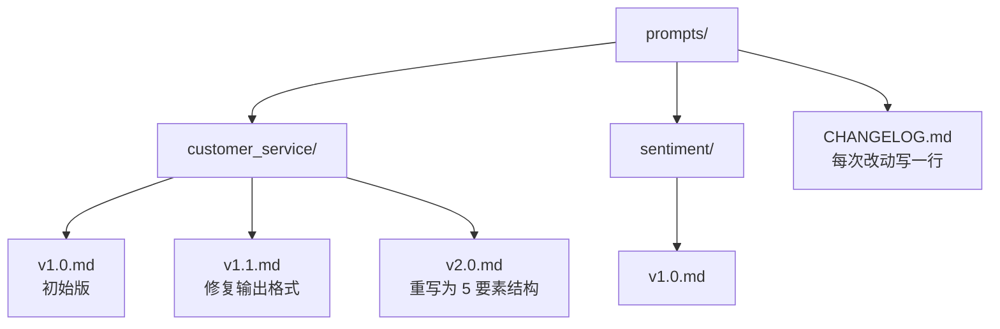

## 1. 为什么这个专题重要

在 LLM 应用中,Prompt 就是"API 调用",它的质量直接决定产品上限——同一模型、好 Prompt 与差 Prompt 的输出质量差距可以达到 10 倍以上(OpenAI 在 2023 年的内部评估中明确提到这一点)。OpenAI Cookbook 与 Anthropic Prompt Engineering Guide 都把 Prompt 设计列为首要工程实践。

**真实案例**:某电商客服机器人在改写 Prompt 前解决率 45%,重写结构化 Prompt + 加入 Few-Shot 后提升到 72%。改动只花了 1 天,但效果远超换模型。

| 维度 | 弱 Prompt | 强 Prompt |
|------|-----------|-----------|
| 解决率 | 45% | 72% |
| 改动成本 | - | 1 人天 |
| 改模型收益 | 微乎其微 | - |

调研依据:OpenAI Cookbook「Prompt engineering overview」(2023-10)、Anthropic「Prompt Engineering Overview」(2024-04)。

---

## 2. 结构化 Prompt 模板 5 要素

一个高质量 Prompt 由 5 个要素组成:**角色 + 任务 + 上下文 + 约束 + 输出格式**。这 5 要素缺一不可,任意缺失都会导致输出漂移。

```text
【角色】你是一名资深 Python 后端工程师,熟悉 FastAPI。
【任务】为下面的接口写 3 条单元测试用例。
【上下文】接口 path=/users/{id},GET 方法,返回用户 JSON。
【约束】使用 pytest + httpx.AsyncClient;不要使用 mock;覆盖 200/404/500 三种状态。
【输出格式】Markdown 代码块,每条用例前加注释说明场景。
```

各要素作用:

| 要素 | 作用 | 缺失后果 |
|------|------|----------|
| 角色 | 锁定语气与领域知识 | 输出泛泛、术语不准 |
| 任务 | 明确"做什么" | 输出答非所问 |
| 上下文 | 提供必要信息 | 模型凭空编造 |
| 约束 | 圈定边界 | 自由发挥,失控 |
| 输出格式 | 便于解析 | 后期处理困难 |

---

## 3. Few-Shot 实战:正例 / 反例 / 边界例子

Few-Shot 的核心不是"多给例子",而是**给"有代表性的"例子**。经验值:**3-5 个示例** 比 1 个或 20 个都好——太少模型抓不到模式,太多会过拟合、还浪费 token。

选择示例的三类:

| 类型 | 用途 | 示例数 |
|------|------|--------|
| 正例 | 展示期望输出 | 2 个 |
| 反例 | 展示要避免的输出 | 1 个 |
| 边界 | 展示极端/模糊情况 | 1-2 个 |

代码示例(情感分类):

```text
判断评论情感,输出 positive/negative/neutral。

评论:这个手机太棒了!
情感:positive

评论:客服态度恶劣,等了一周没发货。
情感:negative

评论:手机收到了,一般般吧。
情感:neutral

评论:信号还行,就是续航拉胯。
情感:
```

研究依据:Min et al. 2022「Rethinking the Role of Demonstrations」指出 3-5 个精心挑选的示例即可达到饱和。

---

## 4. 常见 8 个坑 + 修复

生产中遇到最多的 8 类 Prompt 问题与对应修复:

| 坑 | 现象 | 修复方法 |
|---|------|----------|
| 指令模糊 | 输出飘忽 | 用动词开头("列出"/"翻译"),禁用"尽量" |
| 角色冲突 | 多重身份混乱 | 每次只给 1 个主角色 |
| 输出格式不明确 | JSON 字段缺失 | 给出 schema 样例 + 反例 |
| 示例偏见 | 模型只模仿示例 | 故意造"反例"打破模式 |
| 上下文超长 | 关键信息被淹没 | 摘要前置,引用而非粘贴 |
| 思维跳脱 | 一步跳到结论 | 用"Let's think step by step"+ 步骤编号 |
| 幻觉累积 | 编造不存在的 API | 让模型先"如果不知道就说不知道" |
| 敏感词 | 触发安全拦截 | 改用中性表达,避免禁忌词 |

修复的核心思路:**把"模糊要求"翻译成"可验证约束"**。

---

## 5. 实战案例 3 个

### 5.1 客服 Prompt 简化

**原始 Prompt(冗长版)**:100+ 字,角色、任务、规则混在一起,客服机器人回答飘忽。**结构化重写**:拆成 5 段共 60 字,加 2 个 Few-Shot。**效果**:相同模型,满意度从 3.2 升到 4.5(5 分制)。

### 5.2 JSON 输出约束

需求:从一段用户评论中抽取产品问题。原始 Prompt 经常输出多余文字或缺字段。修复:

```text
输出严格 JSON,字段:
{"product": str, "issue": str, "severity": "low|mid|high"}
不允许任何额外文字。如果信息不足,输出 {"product": null, "issue": null, "severity": "low"}。
```

### 5.3 多轮对话上下文管理

多轮场景下,直接拼接历史会**指数级膨胀**。实战做法:

| 策略 | 实现 | 适用 |
|------|------|------|
| 滑动窗口 | 只保留最近 N 轮 | 短对话 |
| 摘要压缩 | 每 5 轮生成摘要 | 长对话 |
| 关键事实抽取 | 用正则抽取实体 | 客服/订单 |

调研依据:Anthropic「Long context prompting」(2024)指出,8K 之后模型对中段信息的回忆会下降,需要主动重排。

---

## 6. Prompt 版本控制

Prompt 也是代码,必须进 Git。一个工程化实践:



**diff + review 流程**:

1. 改 Prompt 提 PR,改动包括 Prompt 文本 + 测试用例
2. 评审重点:**意图是否清晰、示例是否覆盖边界、是否引入歧义**
3. 合并前跑回归集,确保指标不下降

工具选择:

| 工具 | 适用场景 |
|------|----------|
| Git + Markdown | 小团队 |
| PromptLayer / LangSmith | 需要追踪调用、A/B 测试 |
| Helicone | 需要 token 计费 + 版本 |

---

## 7. Prompt 评估 3 种方法

光有版本控制还不够,必须有评估。3 种主流方法各有优劣:

| 方法 | 成本 | 准确度 | 适用 |
|------|------|--------|------|
| LLM-as-judge | 低 | 中 | 大量样本快速筛选 |
| 人工评估 | 高 | 高 | 上线前/争议样本 |
| 单元测试式 | 低 | 高 | 关键路径 |

**LLM-as-judge** 用更强模型给输出打分,适合大规模回归。**人工评估**用于关键场景与争议样本。**单元测试式** 把 Prompt 当函数,准备 50-100 个 input-output 对,每次改动跑一遍。

```python
# 单元测试式 Prompt 评估示例
TESTS = [
    {"input": "信号还行,续航拉胯", "expect_sentiment": "negative"},
    {"input": "收到了,一般般", "expect_sentiment": "neutral"},
    {"input": "太棒了!", "expect_sentiment": "positive"},
]

def run_prompt(text):
    return call_llm(build_prompt(text))

def evaluate():
    pass_count = sum(
        1 for t in TESTS
        if run_prompt(t["input"])["sentiment"] == t["expect_sentiment"]
    )
    return pass_count / len(TESTS)
```

调研依据:Zheng et al. 2023「Judging LLM-as-a-Judge」MITRE 报告,LLM-as-judge 与人类一致率可达 80%+。