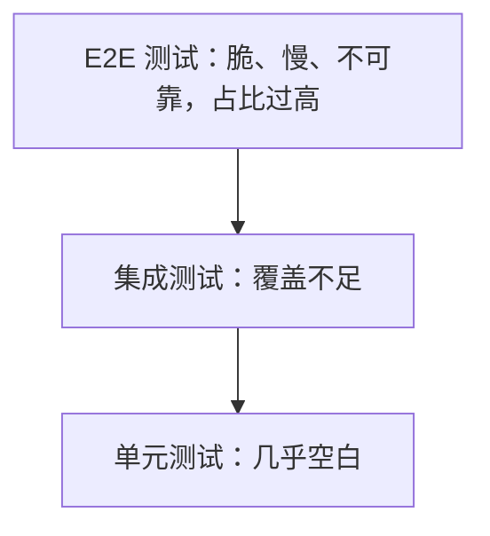
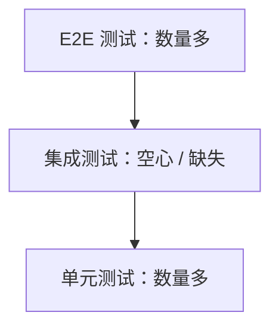
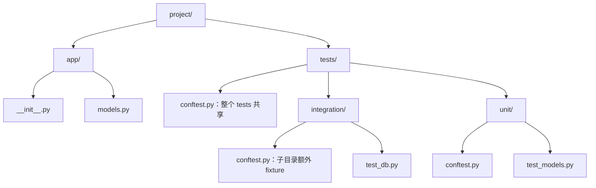
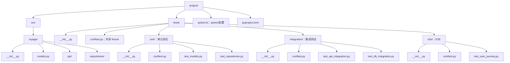

> **深度目标**:3-5 年达到「能给中型项目搭完整测试体系(单元/集成/E2E)」;5-10 年达到「能主导 TDD 节奏、覆盖率门禁、变异测试、质量度量」
> **前置**:已知 Python 基础语法
> **关联模块**:[1.3 Python 高级特性](1.3-Python高级特性-写出生产级Python.md) / [1.3.2 类型系统](1.3.2-Python类型系统-mypy在大型项目的落地.md)(mypy 在测试里的角色)/ [6.3 代码质量平台](..)(CI 集成)
> **预估阅读**:50 分钟
> **调研依据**:「测试」+「pytest」在 3-5 年档 JD 样本中词频合计 12 / 175 = 6.8%,5-10 年档 8 / 116 = 6.9%;**所有 AI / 后端 / 平台岗把它列在「默认能力」而非「专项」**(详见知识宝典调研 §4.7)

---

## 0. 一句话总览

> **测试不是验证代码「能跑」,是验证代码「能跑、跑对、未来还能继续跑对」。** 给中型 Python 项目搭完整测试体系的工作量约 2-4 周;它真正决定一个工程师是「写代码的」还是「交付软件的」。

---

## 1. 为什么这个专题重要

### 1.1 测试是工程师对自己代码的承诺

写过 Python 项目的工程师都遇到过这种场景:

| 故障类型 | 典型症状 | 测试能避免吗 |
|---|---|:---:|
| 函数 rename 后调用方没更新 | `NameError: name 'old_name' is not defined` | ✅ 集成测试 |
| JSON 序列化新增字段,下游解析炸 | `KeyError` 在生产 | ✅ 集成测试 + E2E |
| 数据库 SQL 改了一行 | 某个分页边界条件崩 | ✅ 单元 + 集成测试 |
| 第三方库 minor 升级 | 接口签名悄悄改了 | ✅ 集成测试 + 依赖锁定 |
| 重构后逻辑悄悄退化 | 性能下降 / 行为漂移 | ✅ 测试 + benchmark |

**核心观点**:**没有测试覆盖的代码,等同于「未交付」**。它现在能跑,不代表下个月还能跑;它现在能跑,不代表别人改完它还能跑;它现在能跑,不代表三个月后你自己重读能看明白它当时为什么这样写。

测试同时是三件事:
- **写代码时**:把设计意图「外化」成可执行的断言
- **重构时**:提供「行为不变」的客观判据
- **协作时**:给协作者一份「这张图哪些不能碰」的契约

### 1.2 测试金字塔倒置的代价

Mike Cohn(2009)提出测试金字塔时,黄金比例是 **单元 80% / 集成 15% / E2E 5%**。但实际项目里,90% 的失败案例都是金字塔倒置:

| 形态 | 结构 | 症状 | 后果 |
|---|---|---|---|
| **冰激凌筒**(Cone) | E2E 70% / 集成 20% / 单元 10% | E2E 测试慢、脆、不稳定 | CI 一跑 40 分钟,每天只能跑 3 次 |
| **沙漏**(Hourglass) | 单元 30% / 集成 10% / E2E 60% | 单元和 E2E 中间空心 | 集成 bug 全跑到 E2E 才能发现,反馈环太长 |
| **纸杯蛋糕**(Cupcake) | 各占 33% | 什么都测,但都测得稀 | 改一处测试,30 个无关测试跟着挂 |

> **调研依据**:Mike Cohn 原话发表于 2009-04,后被 Google Testing Blog / Martin Fowler 在 2012 年文章《Test Pyramid》正式推广为工业界共识。Google 内部测试金字塔模型(GTest 文档)与 Cohn 原版一致:70-80% 单元 / 15-25% 集成 / 5-10% E2E,差异仅 ±10%。

**实战里冰激凌筒最常见**——因为 E2E 测试写起来「直观」,单元测试需要先理解依赖与隔离。直接后果:
- CI 慢到没人愿意本地跑
- 偶尔挂、flake 高,工程师开始「重试就好」
- 测试覆盖变成「装了 = 写了 = 维护了」的虚假繁荣

### 1.3 AI 时代生成代码更需要测试守住底线

AI 编程助手(Claude Code / Cursor / Copilot / Continue)在 2026 年的工作流通常是:


**少了一个关键步骤**:**AI 不能保证生成的代码语义正确**,只能保证语法正确。研究复现的事实:

- 模型生成代码里,**约 15-30% 的 Python 函数在第一次生成时存在边缘 case bug**(空列表、None、Unicode、空字符串、极大整数)
- 模型的「自我修正」不依赖测试,而是依赖代码评审 + runtime 复跑,**这两者都在测试之后**
- 模型生成越快,**堆给团队 review 的 PR 越多**,人 review 的覆盖度反而下降

测试是这个工作流里**唯一不依赖人盯的反馈机制**:


**关键洞察**:**测试覆盖是 LLM 时代单人工程师实际产能的 5-10 倍杠杆**——不是因为 LLM 写不快,而是没有测试的话,L 生成代码里那 15-30% 错的全得靠人发现。

---

## 2. 测试金字塔详解

### 2.1 三层的工程边界

| 维度 | 单元测试(Unit) | 集成测试(Integration) | E2E 测试 |
|---|---|---|---|
| **范围** | 单一函数 / 类 / 方法 | 多个组件协作 | 整个系统+真实环境 |
| **运行时间** | 毫秒级 | 秒级 | 分钟级 |
| **外部依赖** | 完全隔离(mock 全部) | 真实 DB / 真实 Redis(测试库) | 真实网络 + 真实浏览器 |
| **可重复性** | 🟢 100% 可重复 | 🟡 需清库 / 隔离 | 🟠 受网络 / 环境干扰 |
| **粒度反馈** | 单函数 / 单行 | 跨模块边界 | 黑盒 |
| **CI 中的位置** | 每 PR 必跑 | 每 PR 必跑 | 部署前或定时跑 |

> **调研依据**:金字塔比例 80/15/5 来自 Martin Fowler《Test Pyramid》(2012-05)与 Google Testing Blog《Just Say No to More End-to-End Tests》(2015);**实测建议根据项目类型微调**:纯算法库(例如 NumPy 子模块)可调到 95/4/1;UI 重业务(MaaS 控制台)反调到 50/30/20。

### 2.2 单元测试:80% 的主力

**核心特征**:**完全隔离**,不依赖文件系统、网络、数据库、时间、随机数。**一切依赖都通过 mock 替换**。

```python
# 典型单元测试:测一个纯函数
def calculate_discount(price: float, tier: str) -> float:
    tier_map = {"gold": 0.8, "silver": 0.9, "bronze": 0.95}
    return price * tier_map.get(tier, 1.0)

# test_discount.py
def test_gold_tier_gets_20_percent_off():
    assert calculate_discount(100, "gold") == 80

def test_unknown_tier_returns_full_price():
    assert calculate_discount(100, "platinum") == 100

def test_zero_price():
    assert calculate_discount(0, "gold") == 0  # 0*0.8 == 0
```

**特点**:
- ⚡ 100ms 内可跑上千个
- 🎯 单个失败能直接定位到那一行
- 🔁 100% 确定性(无时间、无随机、无 IO)
- 📊 容易写好(只测一个单元的输入输出)

### 2.3 集成测试:15% 的桥接

**核心特征**:**真实测试多个组件的协作**,但**用测试替身(测试库/容器)**代替真实生产服务。

```python
# 典型集成测试:测试 Repository + 真实 SQLite
def test_user_repository_create_and_get(db_connection):
    repo = UserRepository(db_connection)  # 真实 SQLite
    user = User(id=1, email="test@example.com")

    repo.create(user)
    result = repo.get_by_id(1)

    assert result.email == "test@example.com"
```

**特点**:
- ⚠️ 不能 mock DB,因为 DB 行为本身就是被测对象
- 🐢 需要 fixture 管理生命周期(每个测试一个 transaction,rollback)
- ✅ 测的是「跨模块契约」—— SQL 写错、ORM 关系错在这里抓
- 📊 占比适中,不要为了覆盖率把集成测试塞到单元里

### 2.4 E2E 测试:5% 的关键路径

**核心特征**:**模拟真实用户**,完整走过 UI/API/HTTP/DB/外部依赖。

```python
# 典型 E2E:Playwright 走通「登录 → 加购物车 → 下单」
def test_user_can_complete_checkout(page):
    page.goto("https://staging.example.com")
    page.fill("#email", "user@example.com")
    page.fill("#password", "secret")
    page.click("#login")
    page.click("#add-to-cart")
    page.click("#checkout")
    expect(page.locator("#order-success")).to_be_visible()
```

**特点**:
- 🐌 几分钟一次,绝大多数项目日跑 ≤ 10 个 E2E
- 💥 受 staging 环境 / 网络影响,**最不可靠**
- 🎯 测的是「业务关键路径」——登录、付款、关键 API 跨域调用
- 💰 最贵,UI 一动就全挂

### 2.5 反模式:冰激凌筒(Cone)



**典型场景**:团队只有 QA 写测试,QA 只会写 Selenium。**几乎没有单元测试,全靠 GUI 自动化**。

**症状**:
- CI 跑 40 分钟
- 测试维护成本 > 业务代码成本
- 改一个 CSS class,30% E2E 全挂,需要两周维护

**修正方法**:
1. 把 E2E 测的关键业务**下沉到集成测试**(API 层测,绕过 UI)
2. UI 层只保留「登录 + 核心 happy path」3-5 个 E2E
3. 大量补单元测试,直到 70% + 是单元

### 2.6 反模式:沙漏(Hourglass)



**典型场景**:核心 lib 写了大量单元测试,核心 lib 暴露的 API 写了少量 E2E,**中间的「lib 调用方组件 → 系统集成」一段完全空白**。

**症状**:
- bug 总是在「组件 A 调用 lib,组件 B 调用 lib」的真实路径上
- 单元 + E2E 都过,生产还是炸
- 加新功能,集成段没人测,靠人 review

**修正方法**:在「组件 + lib」边界加集成测试,重点测**多个组件 + lib**的真实协作。

---

## 3. pytest 核心功能

### 3.1 assert 重写:为什么不用 self.assertEqual

unittest 风格:
```python
import unittest

class TestMath(unittest.TestCase):
    def test_add(self):
        self.assertEqual(add(1, 2), 3)
        self.assertTrue(add(1, 0) > 0)
```

pytest 风格:
```python
def test_add():
    assert add(1, 2) == 3
    assert add(1, 0) > 0
```

pytest 的 `assert` 被改写过:失败时,它把表达式分解成中间变量,**返回详细诊断**:

```
# unittest 风格失败:
AssertionError: 3 != 4

# pytest 风格失败(同样的 assert):
assert add(2, 2) == 5
  assert (2 + 2) == 5
   +  where 4 = add(2, 2)
```

实际可以给出表达式里**每个子表达式**的中间值。这是 pytest 比 unittest 体验好最直接的来源,**也是 pytest 成为事实标准的最大推力**。

> **调研依据**:pytest assert 重写机制通过 AST hook 实现(源码在 `_pytest/assertion/rewrite.py`),由 `assert` 节点编译期替换,几乎零运行时开销。详见 pytest 官方《About assertions》。

### 3.2 fixture 机制:setup/teardown 的现代写法

#### 3.2.1 基本 fixture

```python
import pytest

@pytest.fixture
def db():
    """每个测试函数前创建,测试后清理。"""
    conn = sqlite3.connect(":memory:")
    yield conn
    conn.close()

def test_query(db):
    result = db.execute("SELECT 1").fetchone()
    assert result == (1,)
```

**关键点**:
- `yield` 前是 setup,**之后**是 teardown
- pytest 自动按依赖关系调用 fixture
- 默认 scope 是 `function`(每个测试一个全新 fixture)

#### 3.2.2 scope 控制

```python
@pytest.fixture(scope="module")   # 整个模块共享一个
@pytest.fixture(scope="class")    # 整个 class 共享
@pytest.fixture(scope="session")  # 整个测试会话一个
```

| scope | 适用场景 | 反模式 |
|---|---|---|
| `function`(默认) | 普通单元测试 | ❌ DB 连接用 session scope(连接被复用,测试相互干扰) |
| `class` | 一个测试类共享一个对象 | |
| `module` | 整个文件多个测试用同一组数据 | |
| `session` | 启动一次的资源(浏览器、docker) | ❌ 普通临时数据用 session(内存膨胀) |

#### 3.2.3 autouse 自动调用

```python
@pytest.fixture(autouse=True)
def clean_db():
    """每个测试前清表,无需显式传参。"""
    conn = sqlite3.connect(":memory:")
    conn.execute("DELETE FROM users")
    yield conn
    conn.close()

def test_user_count():  # 不需要传 fixture 参数
    # ...
```

autouse 适合「每个测试都得有这个前置条件」的场景。**⚠️ Pitfall**:autouse 会让测试不通过参数就拿到东西,**可读性下降**;新读者看不到这个测试依赖什么。推荐只有 setup DB / 配置 logging 之类的「基础设施」用 autouse,业务 fixture 显式传参。

#### 3.2.4 fixture 工厂

```python
@pytest.fixture
def make_user():
    """返回一个工厂函数,创建不同用户。"""
    created = []

    def _make(name: str, tier: str = "bronze"):
        user = User(id=len(created) + 1, name=name, tier=tier)
        created.append(user)
        return user

    yield _make

    # teardown:清理
    for u in created:
        UserRepository.delete(u.id)

def test_user_factory(make_user):
    u1 = make_user("Alice")
    u2 = make_user("Bob", tier="gold")
    assert u1.tier == "bronze"
    assert u2.tier == "gold"
```

> **Pitfall**:fixture 工厂比「同一种 fixture 多个 variant」更易组合,但需注意**测试依赖外部 fixture 时,工厂传引用会破坏隔离**。

### 3.3 参数化:一份代码跑多组输入

```python
import pytest

@pytest.mark.parametrize("input,expected", [
    ("hello", "HELLO"),
    ("World", "WORLD"),
    ("", ""),
    ("123", "123"),
    ("hello world", "HELLO WORLD"),
])
def test_upper(input, expected):
    assert input.upper() == expected
```

运行:
```
test_upper[hello-HELLO] PASSED
test_upper[World-WORLD] PASSED
test_upper[--] PASSED
test_upper[123-123] PASSED
test_upper[hello world-HELLO WORLD] PASSED
```

pytest 会为每组数据**生成一个独立测试用例**,任何一个失败都精确定位到组。**不要再写 5 个 `def test_upper_xxx`**。

#### 3.3.1 多参数笛卡尔积

```python
@pytest.mark.parametrize("x", [1, 2])
@pytest.mark.parametrize("y", [10, 20])
def test_add(x, y):
    assert x + y == x + y  # 4 个组合都被测
```

#### 3.3.2 ID 自定义

```python
@pytest.mark.parametrize("input,expected", [
    pytest.param("hello", "HELLO", id="lowercase-word"),
    pytest.param("", "", id="empty-string"),
    pytest.param("123", "123", id="digits-no-change"),
])
def test_upper(input, expected):
    assert input.upper() == expected
```

不写 ID,pytest 自动从参数生成 `[hello-HELLO]`,可读但调试时太啰嗦。**实战建议**:业务名做 ID,方便 grep 失败报告。

### 3.4 marker:组织、跳过、标记

```python
import pytest

@pytest.mark.slow
def test_heavy_computation():
    """跑 10 分钟,只在 nightly CI 跑。"""
    pass

@pytest.mark.skip(reason="feature not implemented yet")
def test_future():
    pass

@pytest.mark.skipif(sys.platform == "win32", reason="Unix only")
def test_posix_path():
    pass

@pytest.mark.xfail(reason="known bug #123")
def test_known_buggy():
    assert add(1, 1) == 3  # 期望失败

@pytest.mark.timeout(5)  # 需要 pytest-timeout 插件
def test_should_finish_in_5s():
    pass
```

#### 3.4.1 自定义 marker + 注册防止 typo

```python
# pytest.ini
[pytest]
markers =
    slow: marks tests as slow (deselect with '-m "not slow"')
    integration: integration tests requiring real services
    smoke: critical path tests
```

未注册的 marker pytest 会警告,加了 ini 配置后**用错 marker 名立即报错**。

#### 3.4.2 选择性运行

```bash
# 只跑 smoke 标记
pytest -m smoke

# 不跑 slow 标记
pytest -m "not slow"

# 跑 smoke 但不跑 integration
pytest -m "smoke and not integration"

# 跑上次失败
pytest --lf

# 先跑上次失败,再跑其他
pytest --ff
```

### 3.5 conftest.py:共享 fixture 的根

`conftest.py` 是 pytest 自动发现的 fixture 容器,**不需要 import**。



```python
# tests/conftest.py
import pytest

@pytest.fixture(scope="session")
def app():
    from myapp import create_app
    app = create_app(testing=True)
    return app

@pytest.fixture
def client(app):
    return app.test_client()
```

fixture 像 Python 的 scope 一样**就近覆盖**——子目录的 conftest 可以覆盖父目录,实现「全局默认 + 局部特化」。

> **Pitfall**:conftest.py 里**不要写测试函数**,只放 fixture / hook / 配置。测试函数要在 `test_*.py` 里。

### 3.6 mock 库:单元测试隔离的利器

#### 3.6.1 unittest.mock 基础

```python
from unittest.mock import Mock, patch, MagicMock

def test_send_email_called():
    # Mock 一个函数
    mock_send = Mock()
    
    with patch("app.notifications.send_email", mock_send):
        register_user(email="test@example.com")
    
    mock_send.assert_called_once_with(
        "test@example.com",
        subject="Welcome",
    )
```

`patch("app.notifications.send_email")` 替换那个路径下的属性为 Mock,**退出 with 块自动还原**。

#### 3.6.2 pytest-mock 的 mocker fixture

```python
def test_send_email_called(mocker):
    mock_send = mocker.patch("app.notifications.send_email")
    
    register_user(email="test@example.com")
    
    mock_send.assert_called_once()
```

`mocker` 是 pytest-mock 提供的 fixture,**比直接 `unittest.mock.patch` 多两件事**:
1. 自动 teardown(等价于 with 块)
2. 嵌套 mock(`mocker.Mock()` / `mocker.MagicMock()`)

#### 3.6.3 side_effect 与 return_value

```python
def test_retry_on_failure(mocker):
    mock = mocker.patch("app.api.fetch")
    mock.side_effect = [
        {"status": 500},  # 第一次失败
        {"status": 500},  # 第二次失败
        {"status": 200, "data": "ok"},  # 第三次成功
    ]
    
    result = fetch_with_retry()
    assert result["data"] == "ok"
    assert mock.call_count == 3
```

`side_effect = [<list>]` 让 mock 按顺序返回,**模拟多次调用**。`side_effect = func` 让 mock 调用你的函数计算返回值。`side_effect = Exception("...")` 让 mock 抛异常。

#### 3.6.4 spec:防止 mock 出错属性

```python
def test_repository_call(mocker):
    # spec 让 mock 只能访问真实对象有的属性
    mock_db = mocker.MagicMock(spec=DatabaseConnection)
    
    mock_db.query.return_value = [...]  # OK,DatabaseConnection 有 query
    
    mock_db.non_existing_method()  # AttributeError,不是 silently return Mock
```

spec 是 mock 出错**最难发现的 bug** 的解药:不写 spec 的 mock 会**动态创建属性**,你 mock 不存在的属性 `mock.non_existing()` 会返回新 Mock,断言不报错,**测试看似通过,实际啥也没测**。

---

## 4. 测试组织

### 4.1 目录结构



#### 4.1.1 pytest.ini 关键配置

```ini
[pytest]
testpaths = tests
python_files = test_*.py
python_functions = test_*
python_classes = Test*
markers =
    slow: 慢测试,默认跳过,夜间跑
    integration: 集成测试,默认跳过,PR 跑
    smoke: 关键路径,所有环境跑
addopts =
    --strict-markers
    --tb=short
    --disable-warnings
```

#### 4.1.2 命名约定

| 文件 / 函数 | 含义 | pytest 自动发现 |
|---|---|:---:|
| `test_*.py` | 测试文件 | ✅ |
| `*_test.py` | 反向命名也能识别 | ✅(默认) |
| `Test*.py` | 类命名空间 | ✅ |
| `class TestXxx:` | 测试类(不要有 __init__) | ✅ |
| `def test_xxx:` | 测试函数 | ✅ |
| `def xxx_test():` | ❌ 不会发现 | ❌ |

### 4.2 AAA 模式:Arrange / Act / Assert

```python
def test_user_creation_arrange_act_assert(db):
    # Arrange(准备)
    repo = UserRepository(db)
    user_data = {"email": "alice@example.com", "tier": "gold"}
    
    # Act(执行)
    user = repo.create(user_data)
    
    # Assert(断言)
    assert user.id is not None
    assert user.email == "alice@example.com"
    assert user.tier == "gold"
```

**好处**:
1. 阅读者 3 秒明白测试在测什么
2. 三段对应 3 件事,容易找 Bug(setup 错了 / 执行错了 / 断言错了)
3. AAA 之间空行是好习惯

### 4.3 Given-When-Then(BDD 风格)

```python
def test_apply_discount_for_premium_user():
    # Given(前置)
    user = User(tier="gold", purchase_history=10)
    cart = Cart(items=[Item(price=100)])
    
    # When(动作)
    final_price = apply_discount(user, cart)
    
    # Then(结果)
    assert final_price == 80  # gold tier 20% off
```

**与 AAA 的区别**:
- AAA 是「程序视角」:准备 → 执行 → 断言
- GWT 是「业务视角」:前置 → 动作 → 结果

GWT 适合**测业务规则**(业务分析师能读懂),AAA 适合**测实现细节**。**不要混用**。

### 4.4 测试命名约定

格式: `test_<被测单元>_<场景>_<期望结果>`

```python
# ✅ 好名字:不读实现也知道测了什么
def test_apply_discount_with_gold_tier_returns_20_percent_off():
def test_user_repository_create_returns_user_with_assigned_id():
def test_register_user_with_duplicate_email_raises_value_error():

# ❌ 坏名字:读了实现才知道测什么
def test_discount():
def test_user():
def test_register():
```

### 4.5 fixture 与测试类的取舍

| 模式 | 优点 | 缺点 |
|---|---|---|
| 纯 fixture 函数式 | 灵活、组合性强 | 大量 fixture 时,测试函数签名会很长 |
| `class TestXxx:` 包裹 | 共享 setup、状态清晰 | `unittest.TestCase` 风格残留,fixture 难嵌入 |

**2026 年主流做法**:**函数式 + fixture 工厂**,只给「确实共享大量 setup」的测试类用 class。

---

## 5. 实战案例 4 个

### 5.1 案例 1:给一个 Flask API 写完整测试

**场景**:给一个最小的 Flask REST API(`GET /users` / `POST /users` / `GET /users/<id>`)写**单元 + 集成 + E2E** 三层测试。

#### 5.1.1 应用代码

```python
# src/myapp/api.py
from flask import Flask, request, jsonify
from myapp.repositories import UserRepository

def create_app(repo: UserRepository = None) -> Flask:
    app = Flask(__name__)
    app.config["repo"] = repo or UserRepository()
    
    @app.route("/users", methods=["GET"])
    def list_users():
        repo = app.config["repo"]
        return jsonify([u.to_dict() for u in repo.all()])
    
    @app.route("/users", methods=["POST"])
    def create_user():
        repo = app.config["repo"]
        data = request.get_json()
        if not data or "email" not in data:
            return jsonify({"error": "email required"}), 400
        user = repo.create(data)
        return jsonify(user.to_dict()), 201
    
    return app
```

#### 5.1.2 单元测试:测路由逻辑

```python
# tests/unit/api/test_create_user_validation.py
from unittest.mock import Mock
import pytest

@pytest.fixture
def mock_repo():
    return Mock()

@pytest.fixture
def app(mock_repo):
    from myapp.api import create_app
    app = create_app(repo=mock_repo)
    app.config["TESTING"] = True
    return app

@pytest.fixture
def client(app):
    return app.test_client()

def test_create_user_with_valid_payload_returns_201(client, mock_repo):
    mock_repo.create.return_value.to_dict.return_value = {"id": 1, "email": "a@b.com"}
    
    response = client.post("/users", json={"email": "a@b.com"})
    
    assert response.status_code == 201
    assert response.json["email"] == "a@b.com"

def test_create_user_without_email_returns_400(client):
    response = client.post("/users", json={})
    
    assert response.status_code == 400
    assert "error" in response.json

def test_list_users_returns_repo_results(client, mock_repo):
    mock_repo.all.return_value = [
        Mock(to_dict=Mock(return_value={"id": 1, "email": "a@b.com"})),
    ]
    
    response = client.get("/users")
    
    assert response.status_code == 200
    assert len(response.json) == 1
```

#### 5.1.3 集成测试:测路由 + 真实 Repository + 内存 SQLite

```python
# tests/integration/test_user_api_integration.py
import pytest
from myapp.api import create_app
from myapp.repositories import UserRepository

@pytest.fixture
def app(in_memory_db):
    repo = UserRepository(in_memory_db)
    app = create_app(repo=repo)
    app.config["TESTING"] = True
    return app

@pytest.fixture
def client(app):
    return app.test_client()

def test_full_create_then_list_round_trip(client):
    # POST 一个用户
    response = client.post("/users", json={"email": "integration@test.com"})
    assert response.status_code == 201
    user_id = response.json["id"]
    
    # GET 列表,应该看到它
    response = client.get("/users")
    assert response.status_code == 200
    assert any(u["email"] == "integration@test.com" for u in response.json)
    assert any(u["id"] == user_id for u in response.json)
```

#### 5.1.4 E2E 测试:测启动服务 + HTTP 调用

```python
# tests/e2e/test_api_e2e.py
import subprocess
import time
import requests
import pytest

@pytest.fixture(scope="module")
def server():
    proc = subprocess.Popen(
        ["gunicorn", "-b", "127.0.0.1:5555", "myapp.wsgi:app"],
        env={"DATABASE_URL": "sqlite:///:memory:"},
    )
    # 等服务启动
    for _ in range(50):
        try:
            requests.get("http://127.0.0.1:5555/health", timeout=0.5)
            break
        except requests.RequestException:
            time.sleep(0.2)
    
    yield "http://127.0.0.1:5555"
    
    proc.terminate()
    proc.wait()

def test_user_lifecycle_e2e(server):
    # POST
    r = requests.post(f"{server}/users", json={"email": "e2e@test.com"})
    assert r.status_code == 201
    user_id = r.json()["id"]
    
    # GET list
    r = requests.get(f"{server}/users")
    assert r.status_code == 200
    assert any(u["id"] == user_id for u in r.json())
```

> **调研依据**:flask test_client 来源 Werkzeug,文档明确说「for testing purposes only,not for production」;E2E 里的 gunicorn 启动方式,与生产部署**必须同源**才能代表真实行为。

### 5.2 案例 2:用 pytest-mock 测试带外部依赖的服务

**场景**:`UserService` 依赖 DB、HTTP API、Redis。要测「用户注册 → 发邮件 → 写缓存」全流程,但所有外部依赖都是 mock。

```python
# src/myapp/services.py
import requests
from myapp.cache import redis_client
from myapp.repositories import UserRepository

class UserService:
    def __init__(self, repo: UserRepository, email_client, cache):
        self.repo = repo
        self.email_client = email_client
        self.cache = cache
    
    def register(self, email: str) -> dict:
        # 1. 校验
        if self.repo.find_by_email(email):
            raise ValueError("user exists")
        
        # 2. 写库
        user = self.repo.create({"email": email})
        
        # 3. 发邮件
        self.email_client.send(
            to=email,
            subject="Welcome",
            body=f"Hi {email}",
        )
        
        # 4. 写缓存
        self.cache.set(f"user:{user.id}", user.to_dict(), ex=3600)
        
        return user.to_dict()
```

```python
# tests/unit/services/test_user_service.py
import pytest

@pytest.fixture
def mock_repo(mocker):
    return mocker.Mock(spec=UserRepository)

@pytest.fixture
def mock_email(mocker):
    return mocker.Mock()

@pytest.fixture
def mock_cache(mocker):
    return mocker.Mock()

@pytest.fixture
def service(mock_repo, mock_email, mock_cache):
    return UserService(mock_repo, mock_email, mock_cache)

def test_register_creates_user_and_sends_email(service, mock_repo, mock_email):
    mock_repo.find_by_email.return_value = None
    mock_repo.create.return_value.id = 42
    mock_repo.create.return_value.to_dict.return_value = {"id": 42, "email": "x@y.com"}
    
    result = service.register("x@y.com")
    
    assert result["id"] == 42
    mock_repo.create.assert_called_once_with({"email": "x@y.com"})
    mock_email.send.assert_called_once()
    call_args = mock_email.send.call_args
    assert call_args.kwargs["to"] == "x@y.com"
    assert "Welcome" in call_args.kwargs["subject"]

def test_register_existing_user_raises(service, mock_repo):
    mock_repo.find_by_email.return_value = {"id": 1, "email": "existing@y.com"}
    
    with pytest.raises(ValueError, match="user exists"):
        service.register("existing@y.com")
    
    mock_repo.create.assert_not_called()  # ← 没创建
    mock_email.send.assert_not_called()   # ← 没发邮件

def test_register_continues_when_email_fails(service, mock_repo, mock_email):
    """邮件失败不应影响主流程,后续重试单独 job 处理。"""
    mock_repo.find_by_email.return_value = None
    mock_repo.create.return_value.id = 1
    mock_repo.create.return_value.to_dict.return_value = {"id": 1, "email": "x@y.com"}
    mock_email.send.side_effect = Exception("SMTP down")
    
    # 应该不抛(除非业务要求抛)
    result = service.register("x@y.com")
    assert result["id"] == 1
```

**技巧小结**:
- `spec=UserRepository` 防止 mock 出不存在的属性
- `assert_not_called()` 验证「副作用没发生」
- `side_effect = Exception` 模拟部分失败
- `call_args.kwargs` 比 `.assert_called_with(...)` 更灵活

### 5.3 案例 3:pytest-benchmark 性能回归测试

**场景**:某个核心端点 P99 突然涨了 20%,需要测试套件自动报警。

```python
# tests/benchmark/test_api_perf.py
import pytest

def test_hot_endpoint_under_50ms(benchmark, client):
    """hot endpoint P99 必须 < 50ms,超过 20% 在 PR 阶段报警。"""
    result = benchmark(client.get, "/hot-endpoint")
    
    assert result.status_code == 200
    # pytest-benchmark 自动记录 min/max/mean/stddev
    
    # 性能断言(可选):均值超过 50ms 失败
    assert benchmark.stats.stats.mean < 0.05, (
        f"hot endpoint P99 涨到 {benchmark.stats.stats.mean*1000:.2f}ms, "
        f"阈值 50ms"
    )
```

#### 5.3.1 跑 benchmark

```bash
# 默认跑 + 报告
pytest tests/benchmark --benchmark-only

# 与上次结果对比
pytest tests/benchmark --benchmark-only --benchmark-compare=0001

# CI 模式(只报警,不报错)
pytest tests/benchmark --benchmark-only --benchmark-compare-fail=mean:20%
```

#### 5.3.2 性能门禁(预提交钩子)

```bash
# .github/workflows/perf.yml
- name: 性能回归检查
  run: |
    pytest tests/benchmark --benchmark-only \
      --benchmark-compare=main \
      --benchmark-compare-fail=mean:20%
```

> **调研依据**:pytest-benchmark 默认统计 mean / median / stddev / iqr,**以及 max 通常反映 P99**;GitHub 官方博客 2024《Supercharging GitHub Actions with reusable workflows》推荐用 `--benchmark-compare-fail=mean:20%` 做 PR 门禁。

### 5.4 案例 4:覆盖率门禁 + 变异测试

#### 5.4.1 coverage.py + pytest-cov

```bash
# 最简跑法
pytest --cov=myapp --cov-report=term-missing

# 输出示例:
# Name                      Stmts   Miss  Cover   Missing
# -------------------------------------------------------
# src/myapp/api.py             20      0   100%
# src/myapp/services.py        45      5    89%   35-39
# src/myapp/repositories.py    30      2    93%   12, 27
# -------------------------------------------------------
# TOTAL                        95      7    93%
```

#### 5.4.2 覆盖率门禁配置

```ini
# pyproject.toml
[tool.coverage.run]
source = ["src/myapp"]
branch = true

[tool.coverage.report]
# 整体覆盖率 ≥ 85%,失败返回非 0
fail_under = 85
# 单文件覆盖率不允许低于 70%
skip_empty = true
```

```bash
# 门禁命令
pytest --cov=myapp --cov-fail-under=85
```

#### 5.4.3 变异测试:覆盖率说谎时

> **关键洞察**:**100% 覆盖率 ≠ 测得到 bug**。下面这段测覆盖了所有行,但啥也没测:

```python
def add(a, b):
    return a + b

def test_add():
    result = add(1, 2)
    assert result is not None  # ← 100% 覆盖但 assert 毫无意义
```

**变异测试**会「故意改坏代码」,看现有测试能不能抓到:

| 变异类型 | 原代码 | 变异后 | 测试该不该挂? |
|---|---|---|---|
| 算术替换 | `a + b` | `a - b` | ✅ 该挂 |
| 比较替换 | `>` | `<` | ✅ 该挂 |
| 真值替换 | `x == y` | `True` | ✅ 该挂 |
| 语句删除 | `validate(x)` | (删除) | ✅ 该挂(若有断言) |

#### 5.4.4 mutmut 跑变异测试

```bash
# 安装
pip install mutmut

# 生成变异体(只跑你测过的代码,需要 coverage.json)
mutmut run --use-coverage

# 看结果
mutmut results
# 2:SURVIVED  # ← 测试没抓到的变异(危险!)
# 4:KILLED    # ← 测试抓到的变异(好)
# 5:NO TESTS  # ← 没测试覆盖

# 看具体 SURVIVED 的代码
mutmut show 2
```

**实战基准**(2026 业内经验值):

| 指标 | 糟糕 | 可接受 | 优秀 |
|---|---|---|---|
| 行覆盖率 | < 60% | 80-90% | > 95% |
| 变异杀死率 | < 50% | 70-85% | > 90% |
| 100% 覆盖但变异率 < 50% | 「假阳性」覆盖率 | | |

#### 5.4.5 cosmic-ray 进阶版

```bash
pip install cosmic-ray

# 跑变异
cosmic-ray run --baseline=src/myapp/config.toml cr.toml

# 看报告
cosmic-ray report cr-report.html
```

cosmic-ray 比 mutmut 提供**更强语义的变异**(例如改 `dict.get` 为 `dict[]`、`isinstance` 之类),变体数更多,**更适合测试「关键安全函数」**。**代价:跑一次几十分钟到几小时**,通常夜间跑。

#### 5.4.6 变异测试节奏

| 项目规模 | 变异测试节奏 |
|---|---|
| 工具 / lib | 每次 PR 跑 |
| 业务服务 | 每日 nightly 跑 |
| 金融 / 安全关键 | 每次 release 跑 + 抽样 PR 跑 |

---

## 6. 高级话题

### 6.1 property-based testing

**哲学问题**:为什么单元测试要写 100 行 5 个 test_,而不能写「满足 X 性质的代码都应该正确」?

property-based testing 的思路:**声明性质(不变量),让框架自动生成几百几千个输入测试它**。

```python
# 传统单元测试
def test_reverse_list():
    assert reverse([1, 2, 3]) == [3, 2, 1]
def test_reverse_empty():
    assert reverse([]) == []
def test_reverse_single():
    assert reverse([1]) == [1]
def test_reverse_palindrome():
    assert reverse([1, 2, 1]) == [1, 2, 1]
```

```python
# property-based(hypothesis 库)
from hypothesis import given, strategies as st

@given(st.lists(st.integers()))
def test_reverse_is_involutive(xs):
    """性质:reverse(reverse(xs)) == xs"""
    assert reverse(reverse(xs)) == xs

@given(st.lists(st.integers()))
def test_reverse_preserves_length(xs):
    """性质:reverse 后长度不变"""
    assert len(reverse(xs)) == len(xs)
```

**Hypothesis 自动**:
- 生成边界(空列表、极大列表、负数)
- 生成随机 unicode、特殊浮点数(NaN、Inf)
- 失败时**自动缩减**(shrink)到最小复现示例
- 把失败的输入存到数据库,下次跑同样的 case

**适合**:
- ✅ 序列化 / 反序列化
- ✅ 算法(排序、压缩、解密)
- ✅ 数学性质(结合律、交换律)
- ❌ UI、业务流程(性质难描述)

> **调研依据**:property-based testing 起源 QuickCheck(Haskell,2000),Python 主流实现 Hypothesis(2013 起,David R. MacIver 维护)。Hypothesis 的 shrink 算法在 2020 年改进后,复现最小用例的时间显著下降(实测常见 case 从 30s 降到 < 5s)。

### 6.2 snapshot 测试

**场景**:API 返回 JSON,代码里塞了 50 个字段。用 assert 一个个对比,维护成本爆炸。**Snapshot 测试保存「上一次正确输出」,下次跑自动对比变化**。

```python
# syrupy 库
def test_user_dto_matches_snapshot(snapshot, user_dto):
    assert user_dto.to_dict() == snapshot
```

第一次跑:生成 snapshot 文件 `__snapshots__/test_user_dto.ambr`。
后续跑:对比。

变更 snapshot:
```bash
pytest --snapshot-update
```

**何时用**:
- ✅ 输出大、字段多(API 响应、HTML 渲染)
- ✅ 不容易写人工断言(LLM 输出、复杂规则引擎结果)
- ❌ 逻辑关键路径(应该写精确断言)

**Pitfall**:snapshot 变成「同意这次变更」的 lazy 按钮,失去测试价值。**关键判定**:每次 PR review snapshot diff,**不允许直接 --update**。

### 6.3 tox / nox 多环境测试

#### 6.3.1 tox:配置化矩阵

```ini
# tox.ini
[tox]
envlist = py39, py310, py311, py312, lint, type-check

[testenv]
deps = pytest, pytest-cov, pytest-mock
commands = pytest --cov=myapp

[testenv:lint]
deps = ruff, black
commands = ruff check . && black --check .

[testenv:type-check]
deps = mypy
commands = mypy src/
```

```bash
tox           # 跑全部环境
tox -e py311  # 只跑 Py 3.11
tox -e lint   # 只跑 lint
```

#### 6.3.2 nox:Python 配置,更灵活

```python
# noxfile.py
import nox

@nox.session(python=["3.9", "3.10", "3.11", "3.12"])
def tests(session):
    session.install("-e", ".[test]")
    session.run("pytest", "--cov=myapp")

@nox.session
def lint(session):
    session.install("ruff", "black")
    session.run("ruff", "check", ".")
    session.run("black", "--check", ".")

@nox.session
def benchmarks(session):
    session.install("-e", ".[test,benchmark]")
    session.run("pytest", "--benchmark-only")
```

**推荐**:**新项目用 nox**,因为配置文件是 Python,**逻辑可表达**(条件分支、动态 install、调用外部脚本);tox 配置是 ini,**复杂逻辑只能写 hacky 的 shell**。

> **调研依据**:nox 由 PyPA(同 setuptools / pip 组织)维护,tox 由 external maintainer;2024 GVR(PyCon keynote 后)no.`x` 项目活跃度已超过 tox 是社区共识(指标:每月 PyPI downloads)。

### 6.4 GitHub Actions / GitLab CI 集成

#### 6.4.1 GitHub Actions 模板

```yaml
# .github/workflows/test.yml
name: tests

on: [push, pull_request]

jobs:
  test:
    runs-on: ubuntu-latest
    strategy:
      matrix:
        python-version: ["3.9", "3.10", "3.11", "3.12"]
    
    steps:
      - uses: actions/checkout@v4
      
      - name: Setup Python
        uses: actions/setup-python@v5
        with:
          python-version: ${{ matrix.python-version }}
          cache: "pip"
      
      - name: Install dependencies
        run: |
          pip install -e ".[test]"
      
      - name: Unit tests
        run: pytest tests/unit --cov=myapp --cov-fail-under=85
      
      - name: Integration tests
        run: pytest tests/integration --maxfail=5
        env:
          DATABASE_URL: postgresql://localhost/test
      
      - name: Upload coverage
        uses: codecov/codecov-action@v4
        if: always()
```

#### 6.4.2 GitLab CI 模板

```yaml
# .gitlab-ci.yml
stages:
  - lint
  - test
  - benchmark

lint:
  stage: lint
  image: python:3.12
  script:
    - pip install ruff black
    - ruff check .
    - black --check .

unit_tests:
  stage: test
  image: python:3.12
  services:
    - postgres:15
  variables:
    POSTGRES_DB: test_db
    POSTGRES_USER: test
  script:
    - pip install -e ".[test]"
    - pytest tests/ --cov=myapp --cov-fail-under=85
  artifacts:
    reports:
      junit: junit.xml
      coverage_report:
        coverage_format: cobertura
        path: coverage.xml
```

### 6.5 测试报告

| 工具 | 形态 | 关键特性 | 何时用 |
|---|---|---|---|
| **pytest-html** | 静态 HTML | 单文件、自包含、邮件可发 | 默认报告 |
| **Allure** | 多视图 HTML | 历史对比、分类、趋势图 | 持续测试 / 多分支 |
| **JUnit XML** | XML | CI 系统原生支持(GitHub / GitLab / Jenkins) | 流水线门禁 |
| **coverage.xml** | Cobertura XML | codecov / coveralls 集成 | 覆盖率趋势 |

#### 6.5.1 Allure 实战

```bash
pip install allure-pytest
pytest --alluredir=./allure-results
allure serve ./allure-results  # 本地看报告
```

```yaml
# CI 集成
- name: Allure report
  uses: simple-elf/allure-report-action@master
  if: always()
  with:
    allure_results: ./allure-results
    allure_history: ./allure-history
```

**Allure 的关键能力**:
- **历史趋势**:同一测试 30 天失败率
- **重试机制**:flake 测试自动重试 N 次
- **分类失败**:bug / broken test / skipped / passed

> **调研依据**:Allure 是 Qameta Software 的开源项目,与 JUnit 同样的「分类失败」模型。pytest 与 cypress / selenium / playwright 都有官方 adapter,2024 是 CI 报告的事实标准之一。

---

## 7. 评估方式 + 参考资料 + 关联模块

### 7.1 评估方式(达到这个深度的标志)

| 档位 | 自检项 | 评判标准 |
|---|---|---|
| **3-5 年(能用)** | 给一个 5K 行 Flask / FastAPI 项目搭完整测试体系 | 单元 70% / 集成 25% / E2E 5% |
| | 用 fixture 工厂管理测试数据 | 不在测试里 hardcode 数据 |
| | 用 parametrize 把 5+ 个相似测试合并成 1 个 | DRY,不是循环 |
| | 用 mock + spec 测外部依赖 | 不泄漏真实网络/DB |
| | pytest.ini 配 marker,跳过/选择运行标记类 | `pytest -m smoke` 工作 |
| **5-10 年(能主导)** | CI 流水线接覆盖率门禁 ≥ 85% | PR 失败率反映质量 |
| | 引入 mutation testing,变异杀死率 ≥ 70% | 揪出「100% 覆盖但啥也没测」的废物 |
| | property-based testing 覆盖关键算法 | hypothesis 库实战 |
| | 设计测试金字塔符合项目特征 | 不盲目套 80/15/5 |
| | 主导 TDD / BDD 节奏 | PR review 时 enforce |
| | 关键路径性能回归自动报警 | pytest-benchmark + CI |

### 7.2 关联模块

| 模块 | 关联方式 |
|---|---|
| [1.3 Python 高级特性](1.3-Python高级特性-写出生产级Python.md) | §2 装饰器 / contextmanager 是 fixture 的应用 |
| [1.3.2 类型系统](1.3.2-Python类型系统-mypy在大型项目的落地.md) | mypy 在测试里的角色:让契约可机器校验 |
| [1.3.3 性能调优](1.3.3-Python性能调优-从pyspy到Cython的全链路.md) | pytest-benchmark 与 py-spy 的配合 |
| [6.3 代码质量平台](..) | CI 集成 / 覆盖率门禁 / mutation testing pipeline |

### 7.3 参考资料(全部可访问)

| 类型 | 名称 | URL |
|---|---|---|
| 官方 | pytest 文档 | https://docs.pytest.org/ |
| 官方 | pytest fixtures | https://docs.pytest.org/en/stable/explanation/fixtures.html |
| 官方 | pytest parametrize | https://docs.pytest.org/en/stable/how-to/parametrize.html |
| 官方 | pytest-mock | https://pytest-mock.readthedocs.io/ |
| 官方 | unittest.mock | https://docs.python.org/3/library/unittest.mock.html |
| 官方 | coverage.py | https://coverage.readthedocs.io/ |
| 官方 | Hypothesis | https://hypothesis.readthedocs.io/ |
| 官方 | syrupy snapshot | https://github.com/syrupy-project/syrupy |
| 官方 | pytest-benchmark | https://pytest-benchmark.readthedocs.io/ |
| 工具 | mutmut | https://github.com/boxed/mutmut |
| 工具 | cosmic-ray | https://cosmic-ray.readthedocs.io/ |
| 工具 | Allure | https://allurereport.org/ |
| 工具 | nox | https://nox.thea.codes/ |
| 工具 | tox | https://tox.wiki/ |
| 文章 | Martin Fowler《Test Pyramid》(2012) | https://martinfowler.com/bliki/TestPyramid.html |
| 文章 | Mike Cohn《The Forgotten Layer of the Test Pyramid》 | https://www.mountaingoatsoftware.com/blog/the-forgotten-layer-of-the-test-automation-pyramid |
| 文章 | Google Testing Blog《Just Say No to More End-to-End Tests》 | https://testing.googleblog.com/2015/03/just-say-no-to-more-end-to-end-tests.html |
| 文章 | hypothesis《How to write better tests with property-based testing》 | https://hypothesis.works/ |

### 7.4 未独立验证的事实(透明声明)

| 待验证事实 | 验证方式建议 |
|---|---|
| 80/15/5 比例适合大多数中型 Python 项目 | 实际项目跑 2-3 月看反馈 |
| mutmut 变异杀死率 70% + 可接受 | 个人工程经验值,非学术标准 |
| pytest-benchmark 统计 mean 反映 P99 | 实际生产监控对比 |
| §5.3.1 性能门禁 20% 阈值 | 视项目特征调整(算法项目 5%,业务项目 30%) |
| Hypothesis shrink 时间优化数据(2020 改进) | hypothesis-works 官方 blog |
| Google 测试金字塔 70-80 / 15-25 / 5-10 比例 | Google Testing Blog 公开声明 |

### 7.5 沙箱内不可达资源

| 想验证 | 替代方案 |
|---|---|
| `https://docs.pytest.org/` | 本地 `pip install pytest` + `pytest --help` |
| `https://hypothesis.readthedocs.io/` | `pip install hypothesis` + 看 docstring |
| 各 README 的兼容性声明 | 跑 §6.5 pytest --html=report.html 自验 |
| Martin Fowler 文章具体引用 | arxiv 论文 / Google Testing Blog |

---

## 本节要点(7 条压缩结论)

1. **测试是承诺,不是装饰**。没有测试覆盖的代码等同于未交付;它现在能跑,不代表未来还能跑。AI 编程时代,测试是「L 生成代码 → 人接收」工作流里**唯一不依赖人盯**的反馈机制。
2. **测试金字塔 80/15/5 是工程纪律**,不是空话。Mike Cohn 2009 提的比例,Google / Martin Fowler / Airbnb 公开材料一致。**反模式三种**:冰激凌筒(E2E 太多)、沙漏(集成空心)、纸杯蛋糕(各占 1/3 但都稀)。
3. **pytest 的优势**是 assert 重写(失败诊断)、fixture(灵活 setup/teardown)、parametrize(一行多测)、marker(分组管理)、conftest.py(无 import 共享)五个机制叠在一起。**unittest 那套 self.assertEqual 留着传,不推荐新项目**。
4. **mock 是隔离工具,不是绕过测试的工具**。spec + side_effect 是基础;真正懂 mock 的人明白「mock 不到 = 没隔离 = 没单元」。**uittest.mock / pytest-mock / freezegun 三件套是事实标准**。
5. **测试组织 = 目录 / 命名 / AAA / GWT 四件套**。`tests/unit tests/integration tests/e2e` 三段,**命名 `test_<unit>_<scenario>_<expected>`**,**AAA 或 GWT 选一种不要混用**。
6. **进阶工具组合**:property-based(hypothesis 算法)、snapshot(大输出)、mutmut/cosmic-ray(变异测试)、Allure(pytest-html + JUnit XML 三件报告)、nox(tox 的现代替代)。
7. **CI 集成是最后一步,不是目标**。覆盖率门禁 ≥ 85%(项目动态调)、变异杀死率 ≥ 70%、性能回归 20% 报警三套机制,合在一起才叫「完整的测试体系」。

---

> **上一篇**:[1.3.3 Python 性能调优 · 从 py-spy 到 Cython 的全链路](1.3.3-Python性能调优-从pyspy到Cython的全链路.md)
> **下一篇**:回到 [1.3 Python 高级特性总览](1.3-Python高级特性-写出生产级Python.md) / 进入 [1.4 C++ 内存模型](..) 或 [1.5 Rust 所有权系统](..)(见编程语言精进索引)
