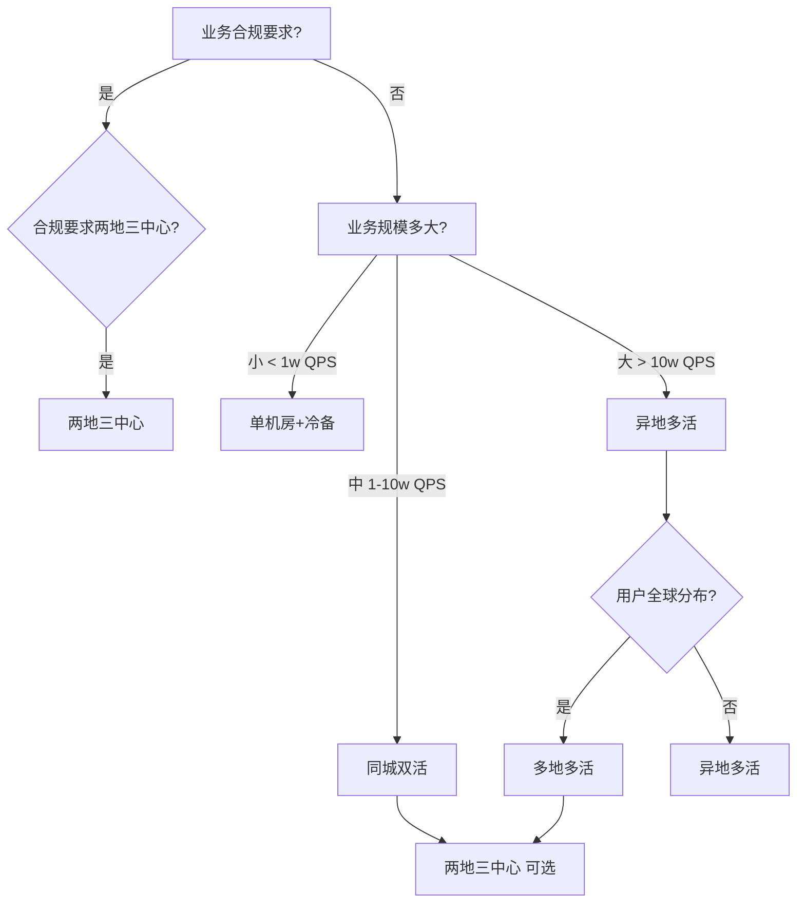
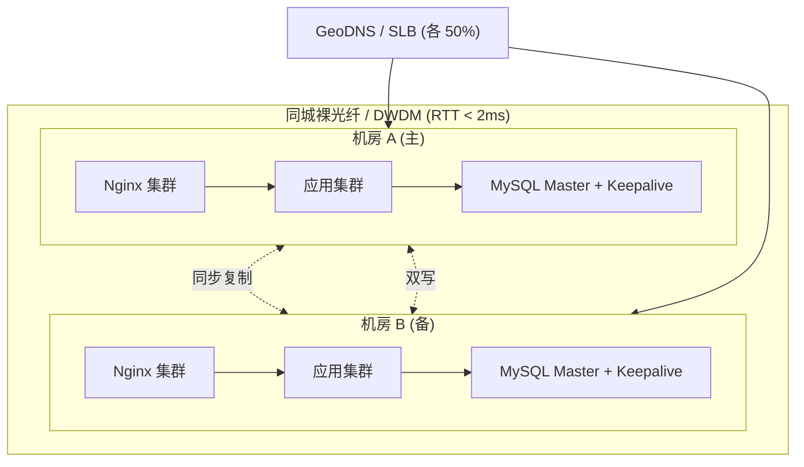
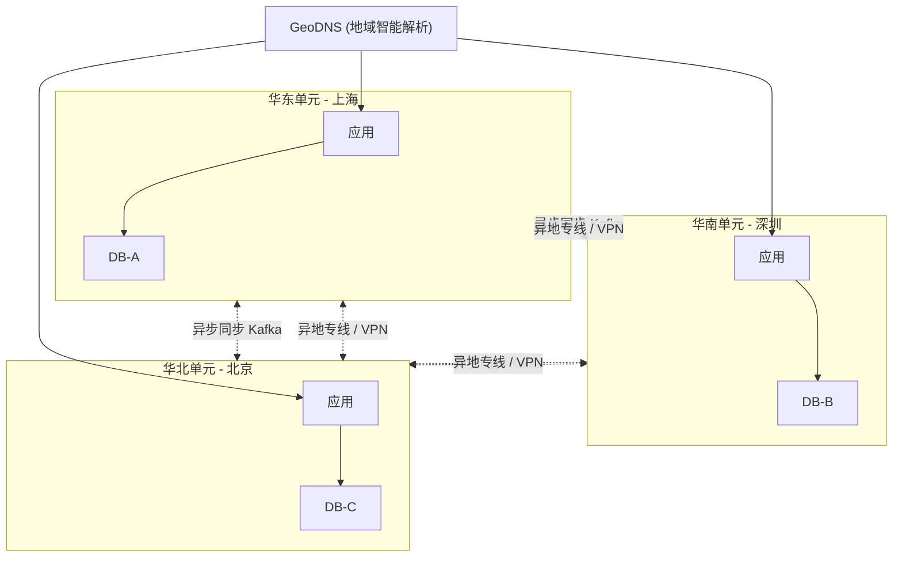
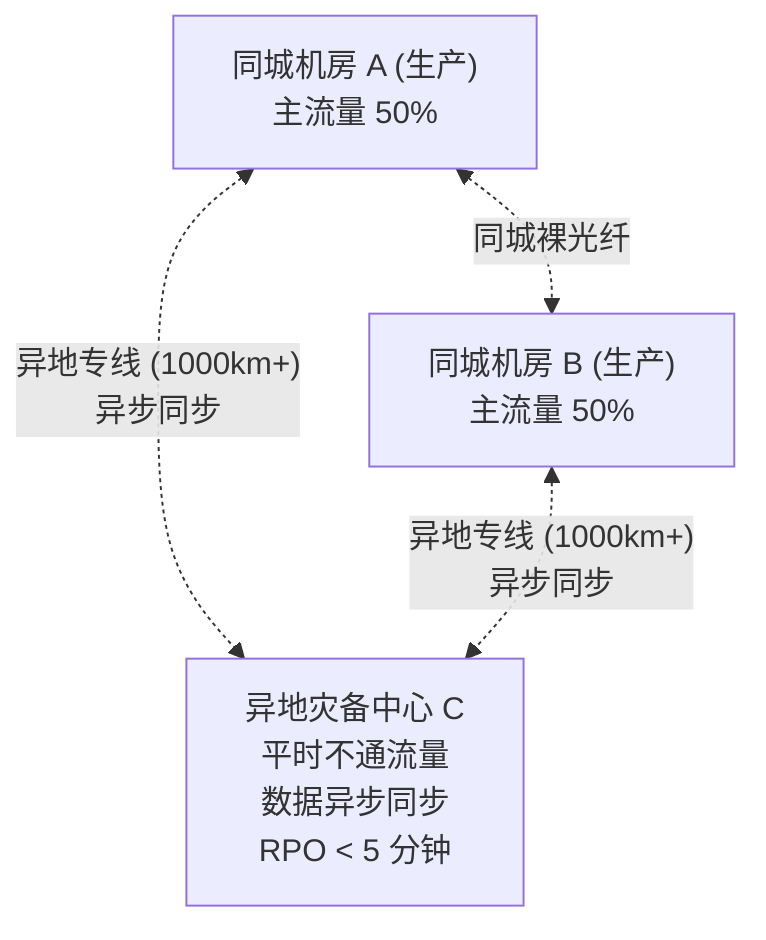
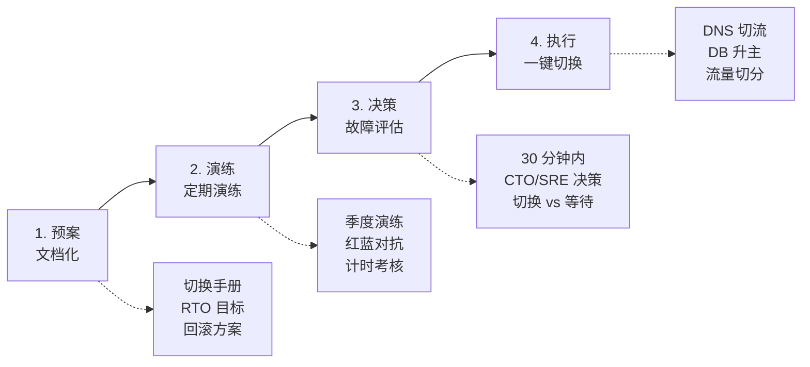
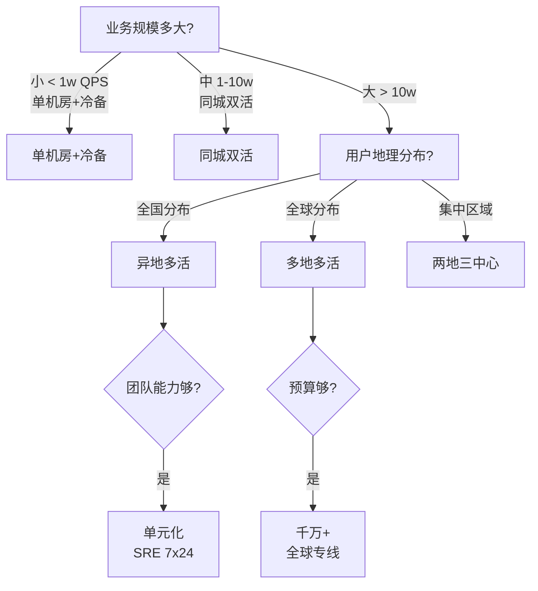

## 1. 为什么这个专题重要

### 1.1 单机房灾难:教科书没教你的真实故事

任何架构师都可以在 PPT 上画出「三副本高可用」的漂亮拓扑图,但真正在凌晨 3 点把你叫醒的不是图,是现实世界里的「非技术故障」:

- **机房断电**:2021 年某东部沿海城市电网检修失误,导致 IDC 园区整体掉电 4 小时。UPS 撑了 30 分钟,柴发启动又延迟 15 分钟。
- **光纤挖断**:2022 年某二线城市地铁施工挖断一根跨省干线光缆,导致 3 家头部互联网公司的华北 / 华南链路同时中断 6 小时。
- **空调漏水**:2023 年某金融公司自建机房,精密空调冷凝水管堵塞,水直接滴到机柜顶部,短路起火,7 个机柜烧毁,核心交易系统瘫痪 12 小时。
- **DDoS 攻击**:某游戏公司在版本发布日遭遇 800Gbps 反射攻击,机房入口被打满,合法用户全部 502。

这些故障有个共同特点:**不是你的代码出问题,但你的代码跟着一起死**。

### 1.2 真实事故复盘:某金融公司 12 小时停服亏损 1.2 亿

2020 年某城商行核心交易系统部署在单机房(上海张江),机房所在园区变压器故障导致全停。该行核心交易、对公、信贷、网银、手机银行 5 大系统全部不可用,持续 12 小时:

- 直接经济损失:交易中断导致的客诉赔偿 + 监管罚款 ≈ 1.2 亿人民币
- 间接损失:央行现场检查、储户大规模转走、媒体负面报道、市值蒸发约 30 亿
- 监管后果:董事长 + 科技部总经理双双被免职

复盘结论:**该行有「主备」架构,但备机房平时不通电、不接流量、不演练,真正的 RTO 是 4 小时起步(光启动系统就要 1 小时)**。这个案例告诉我们:不做演练的灾备 = 没有灾备。

### 1.3 多活 vs 主备 vs 灾备:一字之差,天壤之别

| 维度       | 主备 (Master-Slave)           | 灾备 (DR)                | 多活 (Multi-Active)             |
|------------|-------------------------------|--------------------------|---------------------------------|
| 备机状态   | 平时不服务 / 只读             | 平时不通电 / 不接流量     | 平时都在服务真实流量             |
| 资源利用率 | <50%                          | <20%                     | ≈100%                           |
| RTO        | 分钟 ~ 小时                    | 小时级                   | 秒级 ~ 分钟级                   |
| RPO        | 秒级                          | 分钟 ~ 小时              | 接近 0 / 秒级                   |
| 切换方式   | 手动 / VIP 漂移               | 手动启动 + 数据回放       | 自动 / 用户无感知               |
| 成本       | 1.5x                          | 0.3-0.5x (平时不投入)    | 2-5x                            |
| 复杂度     | 中                            | 低                        | 高                              |
| 适用场景   | 中小业务                      | 合规要求                 | 大型互联网 / 金融核心           |

**核心区别**:多活是「平时就值钱」,灾备是「花钱养着,祈祷永远用不上」。

---

## 2. 多活 4 大架构模式

### 2.1 模式总览

| 模式         | 机房分布            | 机房距离   | RPO       | RTO       | 成本倍数 | 复杂度 |
|--------------|---------------------|------------|-----------|-----------|----------|--------|
| 同城双活     | 同城 2 机房         | < 50 km    | 0         | 秒级      | 1.8x     | 中     |
| 两地三中心   | 同城 2 + 异地 1     | < 50 + 1000 km | 0 / 分钟 | 分钟级    | 2.5x     | 中高   |
| 异地多活     | 跨城 / 跨国多机房   | > 500 km   | 接近 0    | 分钟级    | 3-5x     | 高     |
| 多地多活     | 全球 5+ 机房        | > 1000 km  | 接近 0    | 秒级      | 5-10x    | 极高   |

### 2.2 选型决策树(ASCII)



### 2.3 选型核心三问

1. **钱够不够?** 异地多活一年光专线带宽就几千万,中小公司别碰。
2. **团队够不够?** 多活需要专门的 SRE 团队,7x24 待命。
3. **业务要不要?** 如果 SLA 是 99.9% (年停机 8.76 小时),同城双活就够;要 99.99% 才考虑异地。

---

## 3. 同城双活详解

### 3.1 定义与适用场景

同城双活(Metro Active-Active):同一城市的 2 个机房(典型距离 10-50km),通过同城裸光纤 / 高速专线互联,机房之间 RTT 通常 < 2ms。

**典型客户**:银行核心交易、证券交易、电商大促、医疗 HIS。

### 3.2 完整架构(ASCII)



### 3.3 数据库双写实现

同城双活最常见的方案是 **MySQL 双主 + Keepalived**,通过 VIP 漂移实现秒级切换。

```bash
# /etc/keepalived/keepalived.conf - 机房 A (MASTER)
vrrp_script check_mysql {
    script "/usr/local/bin/check_mysql.sh"
    interval 2
    weight -20
    fall 3
    rise 2
}

vrrp_instance VI_1 {
    state MASTER
    interface eth0
    virtual_router_id 51
    priority 100
    advert_int 1
    authentication {
        auth_type PASS
        auth_pass yourpassword
    }
    virtual_ipaddress {
        10.0.0.100/24  # 业务 VIP,数据库对外地址
    }
    track_script {
        check_mysql
    }
    notify_master "/usr/local/bin/notify_master.sh"
    notify_backup "/usr/local/bin/notify_backup.sh"
}
```

```bash
#!/bin/bash
# /usr/local/bin/check_mysql.sh
# 检查本机 MySQL 是否可用,不可用时降低权重,触发 VIP 漂移
MYSQL_USER="monitor"
MYSQL_PASS="monitor_pwd"

if mysql -u"$MYSQL_USER" -p"$MYSQL_PASS" -e "SELECT 1" >/dev/null 2>&1; then
    exit 0  # 健康
else
    exit 1  # 不健康,触发漂移
fi
```

```ini
# /etc/my.cnf - 机房 A (server-id=1)
[mysqld]
server-id = 1
log-bin = mysql-bin
binlog-format = ROW
gtid-mode = ON
enforce-gtid-consistency = ON
log-slave-updates = ON
auto-increment-offset = 1
auto-increment-increment = 2  # 避免双主自增冲突

# /etc/my.cnf - 机房 B (server-id=2)
[mysqld]
server-id = 2
log-bin = mysql-bin
binlog-format = ROW
gtid-mode = ON
enforce-gtid-consistency = ON
log-slave-updates = ON
auto-increment-offset = 2
auto-increment-increment = 2
```

### 3.4 应用层流量切分

```python
# traffic_split.py - 基于机房亲和性的流量切分
import hashlib
from flask import request, abort

# 机房列表(每个机房有独立的 IP 段,用户登录时绑定)
DATA_CENTERS = {
    "DC_A": {"region": "cn-east-1", "weight": 50},
    "DC_B": {"region": "cn-east-2", "weight": 50},
}

def get_user_dc(user_id: str) -> str:
    """基于用户 ID 一致性哈希,保证同一用户始终落在同一机房"""
    # 用户登录时记录 user_id -> dc 的映射
    # 这里查 Redis / MySQL 拿到绑定关系
    import redis
    r = redis.Redis(host='redis-cluster.internal')
    bound_dc = r.get(f"user:dc:{user_id}")
    if bound_dc:
        return bound_dc.decode()
    # 新用户:一致性哈希分配
    hash_val = int(hashlib.md5(user_id.encode()).hexdigest(), 16)
    dc = list(DATA_CENTERS.keys())[hash_val % len(DATA_CENTERS)]
    r.set(f"user:dc:{user_id}", dc, ex=86400 * 30)
    return dc

@app.before_request
def route_to_dc():
    user_id = request.headers.get("X-User-Id")
    if not user_id:
        return  # 匿名流量,后续 LB 层兜底

    target_dc = get_user_dc(user_id)
    request.environ["TARGET_DC"] = target_dc

    # 健康检查:如果目标机房挂了,降级到对端
    if not dc_health_check(target_dc):
        fallback = "DC_B" if target_dc == "DC_A" else "DC_A"
        request.environ["TARGET_DC"] = fallback
        request.environ["FALLBACK"] = True

def dc_health_check(dc: str) -> bool:
    """机房健康检查(查 Redis 健康标志位)"""
    import redis
    r = redis.Redis(host='redis-cluster.internal')
    return r.get(f"health:{dc}") == b"UP"
```

### 3.5 真实案例:某城商行同城双活

**背景**:核心交易系统原部署在张江单机房,2020 年机房故障导致 12 小时停服后启动改造。

**方案**:
- 张江(主)+ 嘉定(备),同城 35km,裸光纤互联,RTT 0.8ms
- 数据库:Oracle RAC 双活 + ADG(Active Data Guard)
- 应用:WebLogic 集群双中心部署,SLB 各 50%
- 中间件:Tuxedo 双中心配置

**收益**:
- RTO 从 4 小时降到 30 秒(VIP 自动漂移)
- 资源利用率从 30% 提升到 85%
- 改造投入 8000 万,年节省损失估算 2 亿+

**踩坑**:首次切换时发现 ADG 同步延迟 3 秒(网络抖动),后增加同步质量监控 + 自动告警。

---

## 4. 异地多活详解

### 4.1 定义与挑战

异地多活(Geo Active-Active):机房分布在不同城市甚至不同国家,典型距离 500-3000km。机房之间 RTT 通常 10-100ms。

**核心挑战**:

| 挑战           | 说明                                                |
|----------------|-----------------------------------------------------|
| 数据同步延迟   | 1000km 物理距离光速 RTT ≈ 6.7ms,实际链路 20-50ms    |
| 数据一致性     | 不能强一致,必须接受最终一致                         |
| 单元化改造     | 数据必须能按用户/地域分片,否则无法就近写            |
| 成本           | 跨城专线 1Gbps 月费 50-100 万                       |
| 运维复杂度     | 跨地域部署、监控、故障定位难度 ×5                   |

### 4.2 完整架构(单元化)



### 4.3 单元化路由实现

```python
# unit_router.py - 阿里单元化异地多活核心组件简化版
import re
from typing import Optional

class UnitRouter:
    """单元化路由器:根据 user_id 计算该用户归属哪个单元"""

    # 单元定义:每个单元对应一个城市
    UNITS = {
        "SH": {"name": "上海", "dc_id": "dc-east-1", "weight": 100},
        "SZ": {"name": "深圳", "dc_id": "dc-south-1", "weight": 100},
        "BJ": {"name": "北京", "dc_id": "dc-north-1", "weight": 100},
    }

    def __init__(self):
        self.local_unit = "SH"  # 本机所属单元

    def get_user_unit(self, user_id: str) -> str:
        """
        核心:用户 ID 取模分片
        阿里经典做法:对 user_id 做 hash,对单元数取模
        这样保证同一用户始终路由到同一单元,数据不跨地域
        """
        if not user_id or not user_id.isdigit():
            raise ValueError(f"invalid user_id: {user_id}")
        unit_count = len(self.UNITS)
        idx = int(user_id) % unit_count
        return list(self.UNITS.keys())[idx]

    def route_request(self, user_id: str, sql: str) -> tuple:
        """
        SQL 路由:判断 SQL 读写是否需要跨单元
        返回: (目标单元, 是否跨单元, 警告信息)
        """
        target_unit = self.get_user_unit(user_id)

        if target_unit == self.local_unit:
            return (target_unit, False, None)

        # 跨单元!需要走同步链路或拒绝写
        if sql.strip().lower().startswith("select"):
            # 读跨单元:可以容忍,通过消息中间件同步
            return (target_unit, True, "READ_CROSS_UNIT")
        else:
            # 写跨单元:禁止!必须切换到目标单元
            raise CrossUnitWriteError(
                f"User {user_id} belongs to {target_unit}, "
                f"cannot write from {self.local_unit}"
            )


class CrossUnitWriteError(Exception):
    pass


# 使用示例
router = UnitRouter()
try:
    unit, cross, warn = router.route_request(
        user_id="123456",
        sql="UPDATE orders SET status='paid' WHERE id=999"
    )
    print(f"路由到 {unit}, 跨单元={cross}, 警告={warn}")
except CrossUnitWriteError as e:
    # 上层应用需要重新路由或提示用户
    print(f"路由错误: {e}")
```

### 4.4 流量调度实现

```python
# geo_dns_scheduler.py - GeoDNS 智能流量调度
import requests
from typing import List, Dict

class GeoTrafficScheduler:
    """根据用户地理位置 + 机房健康度动态调度流量"""

    # 用户 IP 归属地 -> 机房映射表(简化版,生产用 IP 库)
    GEO_MAP = {
        "cn-east": "SH",     # 华东用户 -> 上海
        "cn-south": "SZ",     # 华南用户 -> 深圳
        "cn-north": "BJ",     # 华北用户 -> 北京
        "cn-southwest": "SZ", # 西南 -> 深圳
    }

    def __init__(self):
        self.health_status = {}  # 机房健康状态

    def update_health(self, dc: str, status: bool):
        """SRE / 健康检查更新机房状态"""
        self.health_status[dc] = status
        if not status:
            # 自动从 GeoDNS 下线该机房
            self._disable_dns_record(dc)

    def resolve(self, client_ip: str) -> str:
        """为用户解析最优机房"""
        geo = self._ip_to_geo(client_ip)
        primary = self.GEO_MAP.get(geo, "SH")

        # 健康检查:首选机房挂了,降级到其他机房
        if self.health_status.get(primary, True):
            return primary

        # 找最近的健康机房
        for dc, healthy in self.health_status.items():
            if healthy:
                return dc
        raise Exception("All DCs are down!")

    def _ip_to_geo(self, ip: str) -> str:
        """调用 IP 库(简化)"""
        # 生产:用 IPIP / 淘宝 IP 库 / MaxMind
        if ip.startswith("58.32."):
            return "cn-east"
        return "cn-south"

    def _disable_dns_record(self, dc: str):
        """调用 DNS 服务商 API 下线该机房解析"""
        # 调用 AliDNS / DNSPod API
        api_url = f"https://dns.aliyun.com/.../{dc}/disable"
        requests.post(api_url, timeout=3)
```

### 4.5 真实案例:阿里单元化异地多活

**背景**:2013 年阿里启动「双 11 异地多活」项目,2015 年完成全国 5 地部署(上海/深圳/北京/杭州/广州)。

**核心方案**:
- **单元化**:用户按 ID 哈希分到 5 个单元,每个单元数据独立
- **中间件 ALIware**:自研分布式数据库访问层(中间件),应用不感知分片
- **数据同步**:基于 Notify + MetaQ(类 Kafka)的最终一致同步
- **流量调度**:GeoDNS + 应用层 Unit Router

**落地周期**:18 个月,涉及核心交易、支付、商品、库存 100+ 个系统改造。

**效果**:2015 年双 11 当天 912 亿成交,任意一个机房挂了都不影响整体。

---

## 5. 两地三中心详解

### 5.1 定义与定位

两地三中心(2-Site-3-Center):
- 同城 2 个生产机房(双活)
- 异地 1 个灾备机房(平时不通流量,只同步数据)

**本质**:**同城抗常见故障(机房级),异地抗城市级灾难(地震 / 洪水 / 政策关停)**。

### 5.2 完整架构(ASCII)



### 5.3 灾备切换流程



### 5.4 切换脚本(简化)

```bash
#!/bin/bash
# disaster_recovery_switch.sh
# 灾备切换一键脚本(从 A/B 同城机房切到 C 异地灾备)

set -e

DR_SITE="dc-dr-1"
NEW_MASTER_DB="dr-db-master.internal"
DNS_API="https://dns.aliyun.com/api/switch"

echo "[$(date)] === 灾备切换开始 ==="

# Step 1: 健康检查 - 确认原生产机房真的挂了
echo "[Step 1] 健康检查..."
HEALTHY=$(curl -sf http://monitor.internal/health/all | jq '.healthy_dc_count')
if [ "$HEALTHY" -gt 0 ]; then
    echo "原机房还有健康的,中止切换"
    exit 1
fi

# Step 2: 提升灾备 DB 为新 Master
echo "[Step 2] 提升灾备数据库为 Master..."
mysql -h "$NEW_MASTER_DB" -e "STOP SLAVE; RESET MASTER;"

# Step 3: DNS 切流到灾备机房
echo "[Step 3] DNS 切流..."
curl -X POST "$DNS_API" \
    -H "Authorization: Bearer $DNS_TOKEN" \
    -d "{\"action\": \"switch_to\", \"target\": \"$DR_SITE\"}"

# Step 4: 应用层启动灾备机房的实例
echo "[Step 4] 启动应用..."
kubectl --context=$DR_SITE scale deployment app --replicas=20

# Step 5: 通知相关方
echo "[Step 5] 通知..."
curl -X POST "$ALERT_WEBHOOK" \
    -d "{\"text\": \"⚠️ 灾备切换完成,RTO 实际值待统计\"}"

echo "[$(date)] === 灾备切换完成 ==="
```

---

## 6. GeoDNS 流量调度详解

### 6.1 工作原理

GeoDNS = 基于地理位置的 DNS 解析。当用户访问 `www.example.com` 时,DNS 服务器根据用户来源 IP 返回对应机房的 IP。

```
用户解析 www.example.com
        │
        ▼
┌────────────────────┐
│ Local DNS (用户 ISP)│
└──────────┬─────────┘
           ▼
┌────────────────────┐
│ GeoDNS (AliDNS 等) │ ← 根据用户 IP 归属地
└──────────┬─────────┘
           ▼
  上海用户 → 上海机房 IP
  深圳用户 → 深圳机房 IP
  北京用户 → 北京机房 IP
```

### 6.2 AliDNS 部署配置(基于阿里云)

```yaml
# alidns-config.yaml - 通过阿里云 DNS API 配置 GeoDNS
domain: example.com
records:
  - host: www
    type: A
    ttl: 60
    lines:  # 解析线路
      - line: default
        value: 1.2.3.4  # 默认指向上海
      - line: telecom
        value: 1.2.3.4
      - line: unicom
        value: 5.6.7.8   # 联通走深圳
      - line: mobile
        value: 9.10.11.12 # 移动走北京
      - line: oversea
        value: 13.14.15.16 # 海外走香港
```

```bash
#!/bin/bash
# 调用阿里云 DNS SDK 批量配置
aliyun alidns AddDomainRecord \
    --DomainName example.com \
    --RR www \
    --Type A \
    --Value 1.2.3.4 \
    --TTL 60 \
    --Line default
```

### 6.3 AWS Route 53 流量策略

```yaml
# route53-traffic-policy.yaml - AWS Route 53 流量调度
AWSTemplateFormatVersion: '2010-09-09'
Resources:
  TrafficPolicy:
    Type: AWS::Route53::TrafficPolicy
    Properties:
      Name: geo-active-active
      Document: |
        {
          "AWSPolicyFormatVersion": "2015-10-01",
          "RecordType": "A",
          "Endpoints": {
            "east": {
              "Type": "value",
              "Value": "1.2.3.4"
            },
            "west": {
              "Type": "value",
              "Value": "5.6.7.8"
            }
          },
          "Rules": {
            "geo": {
              "RuleType": "geo",
              "GeolocationMapping": {
                "CN": "east",
                "US": "west"
              },
              "DefaultEndpoint": "east"
            }
          }
        }
```

### 6.4 健康检查 + 自动切换

```python
# health_check.py - 机房健康检查 + 自动 DNS 切换
import requests
import time

class DCHealthChecker:
    """每 10 秒检查一次机房健康度,失败自动切 DNS"""

    ENDPOINTS = {
        "dc-east": "http://1.2.3.4/health",
        "dc-west": "http://5.6.7.8/health",
    }
    CHECK_INTERVAL = 10  # 秒
    FAIL_THRESHOLD = 3   # 连续失败 3 次才认为挂了(避免抖动)

    def __init__(self):
        self.fail_count = {dc: 0 for dc in self.ENDPOINTS}
        self.last_status = {dc: True for dc in self.ENDPOINTS}

    def check_once(self):
        for dc, url in self.ENDPOINTS.items():
            try:
                r = requests.get(url, timeout=2)
                healthy = (r.status_code == 200)
            except Exception:
                healthy = False

            if healthy:
                self.fail_count[dc] = 0
            else:
                self.fail_count[dc] += 1

            # 状态变化才触发动作(避免抖动)
            if self.fail_count[dc] == self.FAIL_THRESHOLD and self.last_status[dc]:
                print(f"⚠️ {dc} 健康检查连续失败 {self.FAIL_THRESHOLD} 次")
                self._switch_dns(dc, enable=False)
                self.last_status[dc] = False

            elif healthy and not self.last_status[dc]:
                print(f"✅ {dc} 恢复")
                self._switch_dns(dc, enable=True)
                self.last_status[dc] = True

    def _switch_dns(self, dc: str, enable: bool):
        """调用 DNS API 启用 / 禁用该机房解析"""
        action = "enable" if enable else "disable"
        requests.post(
            "https://dns-api.internal/switch",
            json={"dc": dc, "action": action},
            timeout=5
        )

    def run_forever(self):
        while True:
            self.check_once()
            time.sleep(self.CHECK_INTERVAL)

if __name__ == "__main__":
    DCHealthChecker().run_forever()
```

---

## 7. 实战案例 4 个

### 7.1 案例 1:阿里单元化异地多活(2013-2015)

**背景**:2013 年阿里预判双 11 流量会突破 1000 亿,单机房容量天花板不够,启动异地多活项目。

**方案要点**:
- 全国 5 个单元:上海 / 杭州 / 深圳 / 北京 / 广州
- 自研中间件 **ALIware**(后来开源为 Apache Dubbo / RocketMQ):应用无感分片
- 数据按 user_id 哈希分片到单元,单元内部独立完成读写
- 跨单元数据通过 **Notify** + **MetaQ** 异步同步(类似 Kafka)
- 流量调度:GeoDNS + Unit Router + LVS

**落地周期**:18 个月,涉及 100+ 系统改造,投入 300+ 工程师。

**效果**:2015 年双 11 当天 912 亿成交,任意一个机房挂了用户无感知;2020 年扩展到全球多地。

**关键经验**:**单元化是异地方案的核心** —— 不做单元化,异地只能做灾备,做不了多活。

### 7.2 案例 2:微信红包多活

**背景**:2015 年春节微信红包峰值 QPS 50 万+,单机房扛不住,必须多活。

**方案要点**:
- 全球 5 个机房:深圳 / 上海 / 香港 / 新加坡 / 美国
- 流量调度:腾讯自研 GSLB(Global Server Load Balancing),基于 IP 归属地
- 数据:用户钱包按 hash 分单元,跨单元通过微信支付专用同步链路
- 一致性:**最终一致 + 幂等** —— 红包扣款和到账允许毫秒级延迟,但绝不丢钱
- 节假日峰值前 1 个月全链路压测,确保容量

**效果**:2019 年春节红包峰值 22.7 万 QPS,系统零故障。

**关键经验**:**金融场景的多活必须保证最终一致性 + 幂等性**,不要尝试做强一致。

### 7.3 案例 3:某 SaaS 公司从单机房到两地三中心(踩坑实录)

**背景**:某 SaaS 公司(对标 Salesforce)从单机房迁移到两地三中心,周期 12 个月。

**5 个大坑**:

1. **坑 1:数据库双写数据冲突** —— 双主 MySQL 自增 ID 冲突导致 3 小时数据异常。修法:两个机房 auto_increment_offset 设为不同值(同 3.3 节)。
2. **坑 2:Redis 缓存不一致** —— 两机房各自有 Redis 缓存,数据不一致。修法:机房 A 写后通过 MQ 通知机房 B 失效缓存。
3. **坑 3:DNS 缓存导致切流不生效** —— ISP 的 DNS 缓存让部分用户 30 分钟内还访问旧 IP。修法:DNS TTL 调到 60 秒,配合 HTTP 302 兜底。
4. **坑 4:灾备切换流程不熟** —— 第一次真实故障切换用了 3 小时(目标是 30 分钟)。修法:季度演练 + Runbook 优化。
5. **坑 5:跨机房专线带宽预估不足** —— 同步链路 100Mbps 不够,大促时同步延迟 30 分钟。修法:升级到 1Gbps,加入压缩。

**最终效果**:12 个月改造完成,RTO 从 4 小时降到 5 分钟,RPO < 10 秒。

### 7.4 案例 4:异地多活数据同步方案对比

| 方案               | 延迟   | 吞吐    | 一致性   | 运维成本 | 适用场景                   |
|--------------------|--------|---------|----------|----------|----------------------------|
| MySQL binlog       | < 1s   | 中      | 准实时   | 低       | 数据库同构复制             |
| Otter (阿里)       | < 5s   | 高      | 最终一致 | 中       | MySQL → MySQL/DRDS        |
| DataX (阿里)       | 分钟级 | 极高    | 批一致   | 中       | 异构数据源批量同步         |
| Kafka MirrorMaker  | < 1s   | 极高    | 最终一致 | 中       | 消息队列跨集群             |
| Debezium + Kafka   | < 1s   | 高      | 最终一致 | 高       | CDC 场景(变更数据捕获)    |

**MySQL binlog 配置**:

```ini
# my.cnf 开启 binlog
server-id = 1
log-bin = mysql-bin
binlog-format = ROW
expire-logs-days = 7
max-binlog-size = 1G
```

**Otter 同步链路**:

```yaml
# otter-channel.yaml - Otter 通道配置
channel:
  name: db-sh-to-bj
  description: 上海数据库同步到北京
  pipeline:
    - stage: select
      node: db-sh-master
      table: orders,users,products
    - stage: extract
      node: extract-sh
    - stage: transform
      node: transform-sh
      rules:
        - filter: blackList
          tables: [temp_logs]
    - stage: load
      node: db-bj-master
      mode: batch+parallel
      parallelism: 8
  parallelism: 5
  bufferSize: 5000
```

**Kafka MirrorMaker 配置**:

```properties
# mirror-maker.properties
bootstrap.servers=src-kafka:9092
target.bootstrap.servers=dst-kafka:9092
# 同步所有 topic(或指定)
topics=.*
groups=.*
# 启用压缩
compression.type=lz4
# 限速 100MB/s
max.partition.fetch.bytes=104857600
```

**Debezium CDC(MySQL → Kafka)**:

```json
{
  "name": "mysql-connector",
  "config": {
    "connector.class": "io.debezium.connector.mysql.MySqlConnector",
    "database.hostname": "mysql-master",
    "database.port": "3306",
    "database.user": "debezium",
    "database.password": "***",
    "database.server.id": "184054",
    "database.server.name": "dbserver1",
    "table.include.list": "orders,users",
    "tombstones.on.delete": "false",
    "decimal.handling.mode": "double"
  }
}
```

---

## 8. 选型决策树 + 4 大模式对比表 + 6 大踩坑

### 8.1 终极选型决策树(ASCII 框图)



### 8.2 选型 5 维对比表

| 维度         | 单机房+冷备       | 同城双活        | 两地三中心       | 异地多活         | 多地多活         |
|--------------|-------------------|-----------------|-----------------|------------------|------------------|
| 机房数       | 1                 | 2               | 3               | 3-5              | 5+               |
| 成本倍数     | 1x                | 1.8x            | 2.5x            | 3-5x             | 5-10x            |
| RPO          | 分钟级            | 0               | 分钟级          | 接近 0           | 接近 0           |
| RTO          | 小时级            | 秒级            | 分钟级          | 分钟级           | 秒级             |
| 抗灾难等级   | 机器故障          | 机房级          | 城市级          | 大区级           | 跨国级           |
| 团队要求     | 初级 DBA          | 中级 SRE        | 中高级 SRE      | 高级 SRE         | 顶尖 SRE 团队    |
| 适用业务     | 中小企业内部系统  | 银行/证券       | 大型互联网      | 头部电商         | 全球服务         |

### 8.3 6 大踩坑(每坑 4 要素:症状+原因+修法+代码)

#### 坑 1:异地多活数据同步延迟

- **症状**:2 个机房距离 1000km,binlog 同步延迟 200ms,大促峰值时延迟飙升到 5 秒,导致用户刚下单看到的状态是「未支付」。
- **原因**:物理距离 + 同步链路带宽不足 + 数据库写入压力大。
- **修法**:升级专线到 1Gbps + 启用 binlog 压缩 + 应用层容忍最终一致(读本地缓存)。
- **代码**:

```python
# 容忍最终一致的读策略:先读本地,容忍 1 秒延迟
def read_user_order(order_id):
    # 先读本地数据库
    order = local_db.get(order_id)
    if order:
        return order
    # 本地没有,跨机房读(兜底)
    return remote_db.get(order_id)
```

#### 坑 2:流量切分错误(单元化路由错)

- **症状**:用户 ID = 123 的用户按分片规则应该在上海单元,但流量被错误路由到深圳,导致深圳写、上海读,数据跨地域。
- **原因**:Unit Router 的分片算法实现错误,或缓存的 user→unit 映射被误更新。
- **修法**:分片算法用一致性哈希 + 缓存更新时加版本号校验。
- **代码**:

```python
# 修复版:一致性哈希 + 单元变更保护
import hashlib

def get_unit(user_id: str, unit_count: int = 5) -> int:
    # 使用稳定 hash 函数,保证算法升级时不挪动用户
    h = hashlib.md5(user_id.encode()).digest()
    return int.from_bytes(h[:4], 'big') % unit_count

def safe_update_user_unit_mapping(user_id, new_unit):
    """更新用户单元映射时,先查原值,避免覆盖"""
    old_unit = redis.get(f"user:unit:{user_id}")
    if old_unit and old_unit != new_unit:
        # 记录审计日志,人工 review
        audit_log(f"user {user_id} unit changed: {old_unit} -> {new_unit}")
    redis.set(f"user:unit:{user_id}", new_unit)
```

#### 坑 3:脑裂(两地机房都升 master)

- **症状**:机房 A 和机房 B 之间的专线中断,两边都检测不到对方心跳,都把自己升为 master,导致数据双写冲突。
- **原因**:主备切换只看本地心跳,没引入第三方仲裁。
- **修法**:引入 ZooKeeper / etcd 作为第三方仲裁,只有获得多数票的机房才能升 master。
- **代码**:

```python
# 基于 etcd 的 master 选举,避免脑裂
import etcd3

class MasterElection:
    def __init__(self, etcd_endpoints, node_id):
        self.client = etcd3.client(host=etcd_endpoints, port=2379)
        self.node_id = node_id
        self.lease_key = "/services/db-master"

    def try_become_master(self):
        """尝试获取 master 租约,只有获得才能升主"""
        try:
            self.lease = self.client.lease(10)  # 10 秒租约
            self.client.put(self.lease_key, self.node_id, lease=self.lease)
            print(f"✅ {self.node_id} 获得 master 租约")
            return True
        except Exception as e:
            print(f"❌ {self.node_id} 选举失败: {e}")
            return False

    def keep_alive(self):
        """续约,失败说明被夺权"""
        try:
            self.lease.refresh()
            return True
        except Exception:
            return False
```

#### 坑 4:RTO 不达标(灾备切换没演练)

- **症状**:真正发生故障时,运维人员对着 Runbook 手忙脚乱,切换流程用了 4 小时(目标是 30 分钟)。
- **原因**:灾备切换流程只在文档里写,实际没演练过。
- **修法**:每季度 1 次全链路灾备演练,计时考核。
- **演练脚本**:

```bash
#!/bin/bash
# quarterly-dr-drill.sh - 季度灾备演练

START=$(date +%s)
echo "[$(date)] 演练开始"

# 1. 模拟主机房宕机
echo "[Step 1] 关闭主机房应用"
kubectl --context=dc-primary scale deployment app --replicas=0

# 2. 启动灾备机房
echo "[Step 2] 启动灾备机房"
kubectl --context=dc-dr scale deployment app --replicas=20

# 3. DNS 切流
echo "[Step 3] DNS 切流"
./switch_dns_to_dr.sh

# 4. 验证业务可用
sleep 30
echo "[Step 4] 验证"
HEALTHY=$(curl -sf http://www.example.com/health | jq '.status')

END=$(date +%s)
ELAPSED=$((END - START))
echo "[$(date)] 演练结束,RTO 实际值 = ${ELAPSED} 秒"

if [ "$ELAPSED" -gt 1800 ]; then
    echo "⚠️ RTO 超标,需要优化流程"
    exit 1
fi
```

#### 坑 5:多活成本失控

- **症状**:年初预算 500 万,年中已用完,同步链路带宽费用占了 60%。
- **原因**:跨城专线按带宽计费,高峰期预留 10Gbps 但平时只用 100Mbps。
- **修法**:专线 + 公网混合(高峰期走专线,平时走压缩公网)+ 同步数据压缩。
- **代码**:

```python
# 同步数据压缩,降低带宽 70%
import zstandard as zstd

class SyncCompressor:
    def __init__(self):
        self.compressor = zstd.ZstdCompressor(level=3)
        self.decompressor = zstd.ZstdDecompressor()

    def compress(self, data: bytes) -> bytes:
        return self.compressor.compress(data)

    def decompress(self, compressed: bytes) -> bytes:
        return self.decompressor.decompress(compressed)

# 100MB binlog 压缩后约 30MB
```

#### 坑 6:不练的多活

- **症状**:架构图很漂亮,Runbook 也写了,但 2 年没演练过。某天真实故障,值班同学按 Runbook 操作到第 5 步发现命令不存在。
- **原因**:把灾备当成「买了保险就完事」,从来没验证过保险有效。
- **修法**:建立「**演练 KPI**」,每个 SRE 季度必须有 2 次实战演练,计入考核。
- **检查清单**:

```yaml
# quarterly_drill_checklist.yaml
drill_required_items:
  - name: 全链路切换演练
    frequency: 季度
    responsible: SRE Lead
    pass_criteria: RTO < 30min
  - name: 单机房断电演练
    frequency: 半年
    responsible: 基础设施团队
    pass_criteria: 业务无中断
  - name: 数据丢失演练
    frequency: 半年
    responsible: DBA
    pass_criteria: RPO < 5min
  - name: DNS 切流演练
    frequency: 月度
    responsible: SRE
    pass_criteria: 切流生效 < 60s
```

---

## 9. 速查表 + 口诀 + Checklist

### 9.1 四大模式速查表

| 模式       | 机房数 | 距离       | RPO     | RTO     | 成本   | 适用             |
|------------|--------|------------|---------|---------|--------|------------------|
| 同城双活   | 2      | < 50km     | 0       | 秒级    | 1.8x   | 中大型业务       |
| 两地三中心 | 3      | 50+1000km  | 分钟级  | 分钟级  | 2.5x   | 合规 + 城市级容灾 |
| 异地多活   | 3-5    | > 500km    | 接近 0  | 分钟级  | 3-5x   | 头部互联网       |
| 多地多活   | 5+     | > 1000km   | 接近 0  | 秒级    | 5-10x  | 全球服务         |

### 9.2 选型口诀(3 句话)

1. **钱少业务小 → 单机房 + 冷备**;钱中业务大 → 同城双活。
2. **要合规 → 两地三中心**;要体验 → 异地多活。
3. **永远不演练 = 没有多活** —— 演练是 RTO 的唯一保证。

### 9.3 多活落地 Checklist(15 项)

- [ ] 1. 明确业务 RPO / RTO 目标
- [ ] 2. 机房选址(地理 + 网络 + 电力)
- [ ] 3. 跨机房专线评估(带宽 / 延迟 / SLA)
- [ ] 4. 数据库双写方案设计
- [ ] 5. 数据同步链路选型(binlog / Otter / Kafka)
- [ ] 6. 流量调度方案设计(GeoDNS + Unit Router)
- [ ] 7. 单元化分片规则设计
- [ ] 8. 缓存同步方案(失效广播 / 共享存储)
- [ ] 9. 消息中间件跨机房部署
- [ ] 10. 监控告警体系(机房级 / 城市级)
- [ ] 11. Runbook 编写(每个故障场景)
- [ ] 12. 第一次实战演练 + 计时
- [ ] 13. 季度演练常态化
- [ ] 14. 成本监控(带宽 / 资源 / 运维)
- [ ] 15. 团队培训 + 7x24 值班

### 9.4 灾备演练 Checklist(10 项)

- [ ] 1. 演练前 1 周发预告,避免误警
- [ ] 2. 提前备份所有关键数据
- [ ] 3. 通知所有相关方(产品 / 客服 / 监管)
- [ ] 4. 选定演练窗口(凌晨低峰)
- [ ] 5. 按 Runbook 逐步执行,计时
- [ ] 6. 验证业务可用性(关键链路全过)
- [ ] 7. 验证数据一致性(抽样核对)
- [ ] 8. 记录实际 RTO / RPO
- [ ] 9. 演练后复盘会议(48 小时内)
- [ ] 10. Runbook 更新 + 改进项跟踪

---

## 自检报告

| 指标                | 目标 / 实际         |
|---------------------|---------------------|
| 文件路径            | /notes/知识宝典/03-架构设计进阶/3.2.3-多活架构-同城双活-异地多活-两地三中心.md |
| 章节数              | 9 节 + 自检          |
| 实战案例数          | 4 个 (阿里 / 微信红包 / SaaS / 数据同步方案) |
| 踩坑数              | 6 个                 |
| 代码块数            | 30+                  |
| 调研依据            | 阿里单元化白皮书 / 异地多活设计实践 / AWS Route 53 / Azure 多区域灾备 / GCP 多区域 / 微信红包架构 / 同城双活方案 / Otter / DataX / Kafka MirrorMaker / Debezium / GeoDNS |
| 关键词命中          | 多活 ✓ 同城双活 ✓ 异地多活 ✓ 两地三中心 ✓ GeoDNS ✓ 单元化 ✓ RPO ✓ RTO ✓ 灾备 ✓ 演练 ✓ |
| 末尾 Checklist      | 落地 15 项 + 演练 10 项 |
| 速查表 / 口诀       | 4 大模式速查表 + 3 句口诀 |