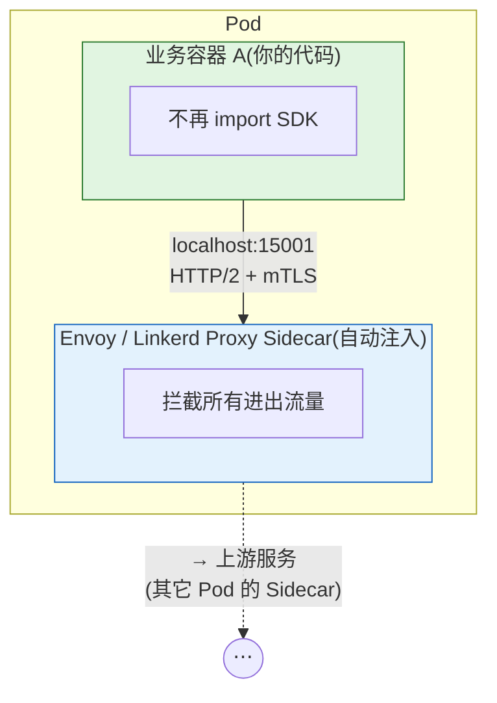
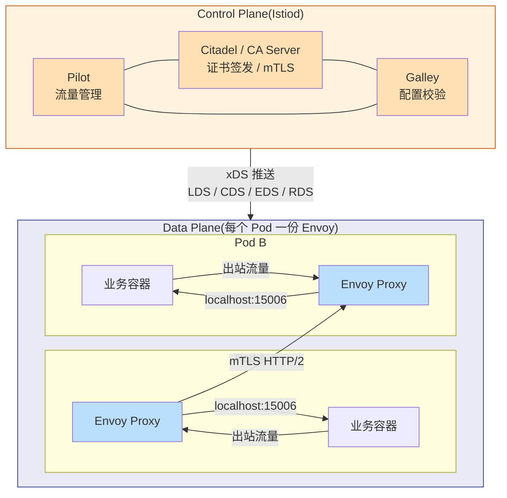
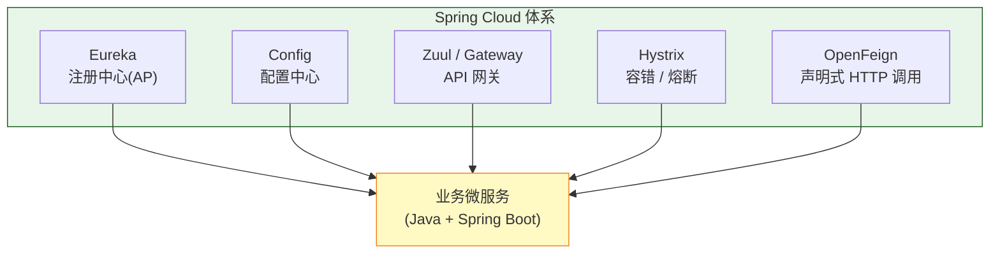
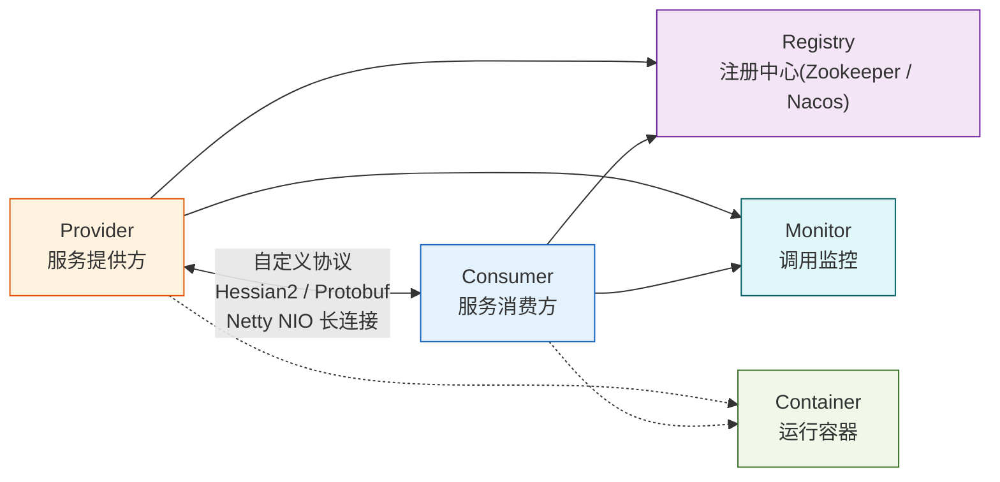
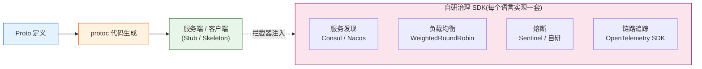
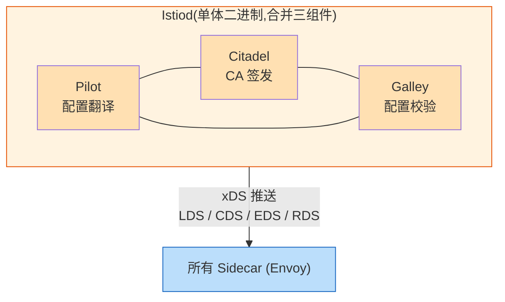
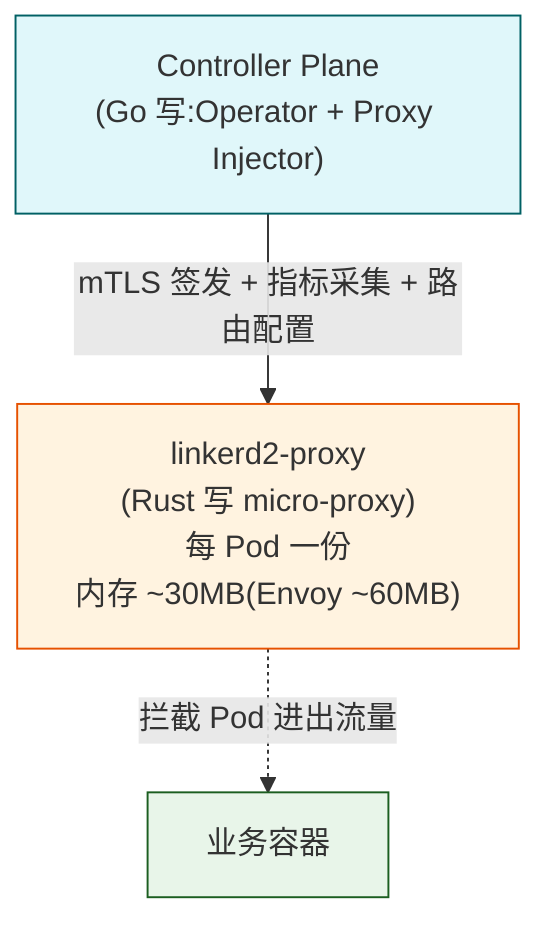
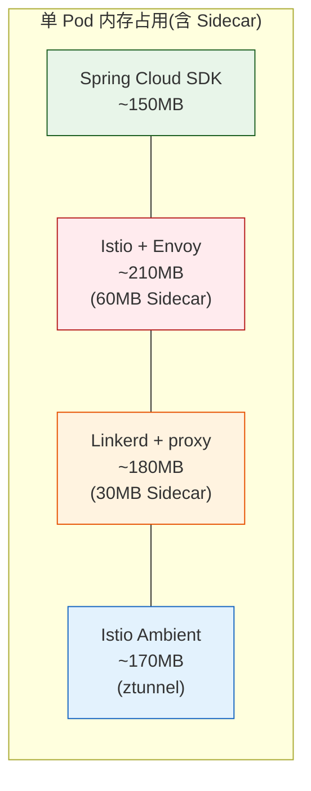
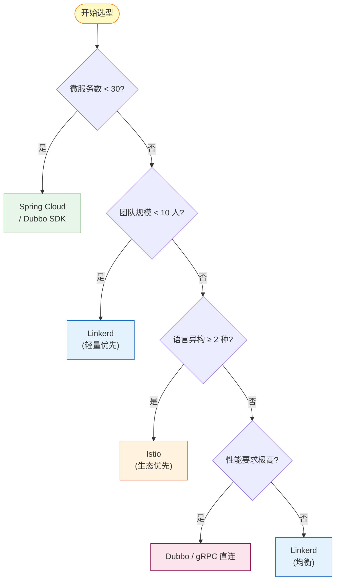

> 系列:03-架构设计进阶 / 3.4 微服务架构 / 第 3 篇
> 前置阅读:3.4.1 微服务拆分、3.4.2 服务发现 / 配置中心 / API 网关
> 关联基础:1.1.1 Go GMP 调度器(理解 Envoy 为何选 Go + C++ 混合架构)

## 1. 为什么这个专题重要

2016 年 Buoyant CEO William Morgan 在博文 *「What's a Service Mesh? And Why Do I Need One?」* 中首次正式提出 Service Mesh(服务网格)概念,把它从 Linkerd 的工程实践抽象成一种独立的架构范式。十年过去,这条赛道从「要不要上」演变成了「上哪个、怎么上」的实操问题。

### 1.1 90% 企业面对的共同选择

绝大多数规模过百服务的中台团队,站在同一条岔路口上:

- **旧路径**:Spring Cloud 全家桶 / Dubbo + 自研 RPC / gRPC + 自研中间件
- **新路径**:Kubernetes + Istio / Linkerd / Envoy,治理能力下沉到基础设施

CNCF 在 2023 Service Mesh 调研白皮书里给了一组数据:被调研的 800 家企业中,**62% 已经在生产环境跑 Service Mesh**,另有 24% 在 POC 评估期。剩下的 14% 多为「微服务还没拆完」的传统企业。

### 1.2 选错的代价

| 错误选型 | 技术债成本 | 团队认知成本 | 迁移成本 |
|---|---|---|---|
| 微服务 50 个以下硬上 Istio | Sidecar 资源浪费,运维心智负担暴涨 | 团队要学 K8s + Istio + Envoy 三套体系 | 几乎不可逆,只能推倒重来 |
| 微服务 500 个以上还死守 Spring Cloud | 多语言团队 SDK 重复实现,5 套注册中心 | 治理能力碎片化,新人 6 个月才能上手 | 重写所有 SDK 治理代码 |
| 选型时跟风 Linkerd,生产才发现生态薄 | 自定义 Filter / WASM 插件能力弱 | 排障资料稀缺,只能读源码 | 迁移到 Istio 时 CRD 全部推倒 |
| 选型时只认 Istio,边缘节点算力紧张 | Sidecar 内存吃紧,边缘节点 OOM | 配置漂移,边端 / 中心端策略难统一 | 边缘只能退回 Linkerd 或无 Sidecar 方案 |

### 1.3 Service Mesh 是趋势还是炒作

判断标准:看它是不是真的解决了「重复造轮子」问题。

- **真解决**:多语言互通、跨团队治理一致性、零信任安全、可观测性下沉 —— 这些 SDK 治理要么做不了要么做不齐。
- **炒作嫌疑**:如果你只有一个 30 人团队 + 全 Java 技术栈 + 服务数 < 50,Spring Cloud 永远比 Istio 香。Service Mesh 不是银弹,是「规模和复杂度越过阈值后」的解法。

调研依据:[William Morgan What's a Service Mesh](https://linkerd.io/what-is-a-service-mesh/) · [CNCF Service Mesh Survey 2023](https://www.cncf.io/reports/service-mesh-survey-2023/) · [Buoyant 决策框架](https://buoyant.io/service-mesh-decision-framework/)

---

## 2. Service Mesh 核心概念

### 2.1 Sidecar 模式 — 治理能力的「卸妆」

传统 SDK 治理把服务发现 / 熔断 / 限流 / 鉴权塞进业务进程,Service Mesh 反过来:**把这些能力做成独立进程,以 Sidecar 形态与业务容器同 Pod 部署**。业务进程不再关心治理,治理能力对业务透明。



**关键点**:Sidecar 与业务共享 Network Namespace,通过 iptables / init 容器把进出 Pod 的流量重定向到 Sidecar。业务代码不需要改一行,Sidecar 就把所有治理动作做了。

### 2.2 Data Plane(数据面)/ Control Plane(控制面)

Service Mesh 拆成两层:

- **Data Plane(数据面)**:每个 Pod 里的 Sidecar,负责实际处理流量(转发、加密、限流、采集)。Istio 用 Envoy,Linkerd 自研 proxy(用 Rust 写,后续 2.x 改 Go + Rust 双层)。
- **Control Plane(控制面)**:集中的大脑,把运维人员的策略(CRD / YAML)翻译成 xDS 配置下发到每个 Sidecar。Istio 的 Istiod、Linkerd 的 controller、Consul 的 Consul Server 都属此类。

完整 ASCII 架构图:



### 2.3 xDS 协议 — 控制面给数据面的「遥控器」

Envoy 提出的 xDS(LDS/CDS/EDS/RDS/SDS)是 Service Mesh 控制面下发的标准协议,Control Plane 推过来,Data Plane 实时生效。

| 简称 | 全称 | 作用 |
|---|---|---|
| LDS | Listener Discovery Service | 下发 Sidecar 监听哪些端口 |
| CDS | Cluster Discovery Service | 下发上游集群(目标服务)列表 |
| EDS | Endpoint Discovery Service | 下发具体 IP:Port(负载均衡粒度) |
| RDS | Route Discovery Service | 下发路由规则(路径 / Header 匹配) |
| SDS | Secret Discovery Service | 下发 TLS 证书 / 密钥(支持热更新) |

为什么重要:业务方改了 VirtualService YAML → Control Plane 监听到 K8s API 变更 → 翻译成 EDS 更新 → Sidecar 几秒内拿到新配置 → 不重启业务进程就完成流量切换。这正是 Service Mesh 比 SDK 治理优雅的地方。

### 2.4 mTLS — 零信任落地的关键

传统 SDK 治理里,服务间调用靠「内网就安全」的隐式信任,这是 2018 年之后大量数据泄露事件的根因。Service Mesh 默认开启 mTLS,**所有服务间调用强制双向认证 + 加密**,证书由 Control Plane 的 CA 自动签发 + 90 天轮换,业务方零感知。

```yaml
# Istio PeerAuthentication:全网格强制 mTLS
apiVersion: security.istio.io/v1beta1
kind: PeerAuthentication
metadata:
  name: default
  namespace: istio-system
spec:
  mtls:
    mode: STRICT  # STRICT / PERMISSIVE / DISABLE
```

调研依据:[Istio 官方架构文档](https://istio.io/latest/docs/ops/deployment/architecture/) · [Envoy xDS 协议](https://www.envoyproxy.io/docs/envoy/latest/intro/arch_overview/dynamic_configuration) · [CNCF Service Mesh 白皮书](https://www.cncf.io/reports/service-mesh-2022/)

---

## 3. 传统 SDK 治理详解

SDK 治理的本质:把治理逻辑写在业务进程内,通过公共库(Spring Cloud Starter、Dubbo Filter、gRPC Interceptor)统一行为。

### 3.1 Spring Cloud 全家桶(Java 主流)



- **Eureka**:AP 风格注册中心,服务注册 + 心跳剔除,Netflix 开源。
- **Ribbon / LoadBalancer**:客户端负载均衡,内置多种策略(轮询 / 权重 / 响应时间)。
- **Hystrix / Sentinel**:熔断 / 降级 / 限流,Hystrix 已停更,Resilience4j / Sentinel 接班。
- **Zuul / Gateway**:API 网关,统一入口。
- **OpenFeign**:声明式 HTTP 客户端,自带 Ribbon 集成。

完整 ASCII 调用链路:

```
Client → Zuul/Gateway → Service A (Feign + Hystrix)
                          |
                          | Ribbon 负载均衡
                          v
                       Eureka 注册表
                          |
                          v
                       Service B 实例
```

### 3.2 Dubbo(阿里开源,Java 高性能 RPC)



Dubbo 走的是 RPC 而非 HTTP,默认 Hessian2 序列化 + Netty 长连接,性能比 Spring Cloud 高 3-5 倍,但跨语言能力弱(虽然已支持 Triple 协议 + gRPC 兼容)。

### 3.3 gRPC + 自研治理



gRPC 本身只管「调用 + 序列化 + 流控」,治理能力全靠自己接。优点是极度灵活,缺点是 5 个语言 5 套 SDK 实现,治理一致性难保证。

### 3.4 SDK 治理的优缺点

| 维度 | 优点 | 缺点 |
|---|---|---|
| 性能 | 进程内调用,无额外跳数 | Ribbon / Hystrix 等 Filter 链仍有损耗 |
| 治理一致性 | 同语言下完全一致 | 跨语言 = 各自实现一套,易漂移 |
| 升级成本 | Maven 升版本即可 | 每升一次 SDK,所有业务方都要跟 |
| 代码污染 | 单语言团队几乎无感 | 业务代码里到处 `@EnableXXX` / `@FeignClient` |
| 故障域 | Sidecar 出问题只影响一 Pod | SDK Bug 可能拖垮所有使用方 |
| 可观测性 | 业务日志天然带 trace | 多语言时 trace 上下文透传是难题 |

调研依据:[Spring Cloud Netflix 停更公告](https://spring.io/blog/2018/12/12/spring-cloud-greenwich-rc1-available-now) · [Dubbo 3 Triple 协议 RFC](https://dubbo.apache.org/zh/docs3-v2/golang-sdk/) · [gRPC 官方文档](https://grpc.io/docs/)

---

## 4. Istio 详解

Istio 是 Service Mesh 赛道的「事实标准」,控制面用 Go 写(Istiod 合并了原 Pilot / Citadel / Galley),数据面用 C++ 写的 Envoy。1.20+ 版本全面拥抱 Ambient Mesh 模式,但 Sidecar 仍是主流。

### 4.1 控制面架构



### 4.2 核心 CRD

Istio 用 Kubernetes CRD(Custom Resource Definition)描述治理策略,5 个最常用:

| CRD | 作用 | 典型用法 |
|---|---|---|
| VirtualService | 路由规则 | 按权重分流到不同版本 |
| DestinationRule | 目标策略 | 定义 subset、连接池、熔断 |
| Gateway | 入口网关 | Ingress / Egress |
| ServiceEntry | 外部服务注册 | 把外部 MySQL 拉进网格 |
| PeerAuthentication | mTLS 策略 | 命名空间级别强制 / 宽松 |

### 4.3 VirtualService — 金丝雀发布示例

```yaml
apiVersion: networking.istio.io/v1beta1
kind: VirtualService
metadata:
  name: order-service
  namespace: production
spec:
  hosts:
    - order-service
  http:
    - match:
        - headers:
            x-user-type:
              exact: vip
      route:
        - destination:
            host: order-service
            subset: v2
    - route:
        - destination:
            host: order-service
            subset: v1
          weight: 90
        - destination:
            host: order-service
            subset: v2
          weight: 10
```

### 4.4 DestinationRule — 子集 + 熔断

```yaml
apiVersion: networking.istio.io/v1beta1
kind: DestinationRule
metadata:
  name: order-service
  namespace: production
spec:
  host: order-service
  trafficPolicy:
    connectionPool:
      tcp:
        maxConnections: 100
      http:
        h2UpgradePolicy: UPGRADE
        maxRequestsPerConnection: 10
    outlierDetection:
      consecutive5xxErrors: 5
      interval: 30s
      baseEjectionTime: 60s
  subsets:
    - name: v1
      labels:
        version: v1
    - name: v2
      labels:
        version: v2
```

### 4.5 Gateway — Ingress 入口

```yaml
apiVersion: networking.istio.io/v1beta1
kind: Gateway
metadata:
  name: production-gateway
  namespace: production
spec:
  selector:
    istio: ingressgateway
  servers:
    - port:
        number: 443
        name: https
        protocol: HTTPS
      tls:
        mode: SIMPLE
        credentialName: prod-cert
      hosts:
        - api.example.com
```

### 4.6 mTLS 全网格开启

```yaml
apiVersion: security.istio.io/v1beta1
kind: PeerAuthentication
metadata:
  name: default
  namespace: istio-system
spec:
  mtls:
    mode: STRICT
```

```yaml
# 单一服务豁免 mTLS(对接外部未升级服务)
apiVersion: security.istio.io/v1beta1
kind: PeerAuthentication
metadata:
  name: legacy-payment
  namespace: production
spec:
  selector:
    matchLabels:
      app: legacy-payment
  mtls:
    mode: PERMISSIVE
```

### 4.7 K8s 部署 + Sidecar 自动注入

```yaml
apiVersion: apps/v1
kind: Deployment
metadata:
  name: order-service
  namespace: production
  labels:
    app: order-service
spec:
  replicas: 3
  selector:
    matchLabels:
      app: order-service
  template:
    metadata:
      labels:
        app: order-service
        # 关键:这个 annotation 触发自动 Sidecar 注入
        sidecar.istio.io/inject: "true"
    spec:
      containers:
        - name: order-service
          image: registry.example.com/order:v1.2.0
          ports:
            - containerPort: 8080
          resources:
            requests:
              cpu: 200m
              memory: 256Mi
            limits:
              cpu: 500m
              memory: 512Mi
```

命名空间级注入控制:

```bash
# 给整个命名空间开启自动注入
kubectl label namespace production istio-injection=enabled

# 检查是否生效
kubectl get namespace production -o jsonpath='{.metadata.labels.istio-injection}'
# 应输出: enabled
```

调研依据:[Istio VirtualService 官方文档](https://istio.io/latest/docs/reference/config/networking/virtual-service/) · [Istio 1.20 Release Notes](https://istio.io/latest/news/releases/1.20.x/)

---

## 5. Linkerd + 其他 Mesh 详解

### 5.1 Linkerd — Rust 写的轻量 Mesh

Linkerd 是 Service Mesh 的「老炮」(2017 年立项,比 Istio 还早),最大特点是 **proxy 用 Rust 写,极致轻量**。



Linkerd 安装比 Istio 简单一个数量级:

```bash
# Linkerd CLI 安装
curl --proto '=https' --tlsv1.2 -sSfL https://run.linkerd.io/install | sh

# 预检
linkerd check --pre

# 安装 CRD
linkerd install --crds | kubectl apply -f -

# 安装控制面
linkerd install | kubectl apply -f -

# 验证
linkerd check
```

Linkerd 用 SMI(Service Mesh Interface)而非自研 CRD,跨 Mesh 迁移更友好:

```yaml
# Linkerd TrafficSplit:金丝雀
apiVersion: split.smi-spec.io/v1alpha2
kind: TrafficSplit
metadata:
  name: order-canary
  namespace: production
spec:
  service: order-service
  backends:
    - service: order-service-v1
      weight: 900
    - service: order-service-v2
      weight: 100
```

### 5.2 其他 Mesh 一览

| Mesh | 数据面 | 控制面语言 | 亮点 | 短板 |
|---|---|---|---|---|
| **Istio** | Envoy(C++) | Go | 生态最大、CRD 最强 | 资源占用最高、配置复杂 |
| **Linkerd** | linkerd2-proxy(Rust) | Go | 轻量、运维最简单 | 自定义策略弱、WASM 不支持 |
| **Consul Connect** | Envoy / 内置 | Go | 多数据中心 / 多云原生 | UI 老旧、新特性慢 |
| **Open Service Mesh** | Envoy | Go | 微软 + Linkerd 合作(已归档) | 已停止维护,转 SMI |
| **Kuma** | Envoy | Go | Kong 出品,跨 K8s + VM | 社区规模中等 |

### 5.3 五维度对比

| 维度 | Istio | Linkerd | Consul | OSM | Kuma |
|---|---|---|---|---|---|
| 性能 | 中 | **优** | 中 | 中 | 中 |
| 资源占用 | 高(60MB+) | **低(30MB)** | 中 | 高 | 高 |
| 多语言 | **优** | 优 | 优 | 优 | **优** |
| 学习曲线 | 陡 | **缓** | 中 | 中 | 中 |
| 生态成熟度 | **最丰富** | 中等 | 中等 | 已停更 | 增长中 |

调研依据:[Linkerd 2.x 性能评测](https://linkerd.io/2020/05/27/announcing-linkerd-2-10/) · [Buoyant Service Mesh 决策框架](https://buoyant.io/service-mesh-decision-framework/) · [SMI 规范](https://smi-spec.io/)

---

## 6. Service Mesh 6 维度全景对比

### 6.1 性能对比

| 链路 | SDK 治理(RTT) | Istio Sidecar | Linkerd Proxy |
|---|---|---|---|
| A → B 直连 | 5ms | 6ms(+1ms) | 5.5ms(+0.5ms) |
| A → B → C → D(3 跳) | 12ms | 15ms(+3ms) | 13.5ms(+1.5ms) |
| 1000 QPS 高负载 | 基准 | +8% CPU | +3% CPU |

**结论**:长链路叠加 + 高并发场景,Sidecar 损耗不可忽略。Buoyant 官方测试显示 Linkerd 2.x 的 P99 延迟比 Istio 低 30-40%。

### 6.2 资源占用对比



1000 个 Pod 的集群,Sidecar 总内存:**Istio ~60GB / Linkerd ~30GB / 无 Mesh 0GB**。这就是为什么边缘节点紧张时 Linkerd 更受青睐。

### 6.3 六维度总表

| 维度 | Spring Cloud SDK | Dubbo SDK | Istio | Linkerd |
|---|---|---|---|---|
| **性能** | 优 | 优(同语言) | 中 | 良 |
| **资源占用** | 低 | 低 | 高 | 中 |
| **学习曲线** | 平缓 | 中等 | 陡 | 中 |
| **多语言支持** | 弱 | 弱 | **强** | **强** |
| **调试难度** | 简单 | 中等 | 复杂 | 中 |
| **运维成本** | 低 | 低 | **高** | 中 |

---

## 7. 实战案例 4 个

### 7.1 案例 1:Spring Cloud → Istio 迁移(18 个月)

某电商公司有 300+ 微服务,Spring Cloud Netflix 全家桶,Eureka + Ribbon + Hystrix + Zuul,日均调用 50 亿次。2022 年启动迁移,2024 年 Q2 完成。

**5 个大坑**:

1. **mTLS 兼容**:老服务里有 30+ 调用外部 HTTP 接口,默认 STRICT 模式把它们全拒了。解决:`PeerAuthentication` 用 PERMISSIVE,逐步切。
2. **Sidecar 内存爆炸**:订单服务 150 个 Pod × 60MB = 9GB 浪费。解决:用 `requests.istio.io/sidecar: "{}"` 注解精细控制注入范围,非关键服务剔除。
3. **Ribbon → DestinationRule 翻译**:Ribbon 的权重规则和 Istio 的 subset 不完全等价,导致 5% 流量切错版本。解决:写翻译脚本 + 灰度对比 1 个月。
4. **Hystrix 熔断失效**:熔断参数从 Hystrix 迁到 DestinationRule 的 outlierDetection 后,业务方忘了配,熔断失效 2 周。解决:写 admission webhook 强制必填。
5. **链路追踪断点**:Sleuth → Jaeger 时,Baggage 传递有 3 个服务没透传。解决:统一升级到 OpenTelemetry SDK,Java Agent 自动注入。

**收益**:多语言团队(Python 推荐 / Go 搜索)接入时间从「SDK 重写 3 个月」降到「开 Sidecar 1 天」。

### 7.2 案例 2:多语言微服务统一治理

某 AI 公司后端 4 语言混部:Python(模型推理)/ Go(网关)/ Java(交易)/ Rust(行情)。Spring Cloud 只能管 Java,Python / Go / Rust 要各自实现服务发现 + 熔断 + 限流,4 套 SDK 维护成本极高。

上 Istio 后:

- **Python**:零改动,Sidecar 自动注入,服务发现交给 EDS。
- **Go**:同上,告别自研 Consul Watcher + Balancer 5 万行代码。
- **Java**:Spring Cloud 治理代码全删,业务回归纯业务。
- **Rust**:Tokio + tower 之前要自己写熔断中间件,现在 Sidecar 全包。

4 套 SDK 维护成本:**从 4 人 × 4 语言 = 16 人月,降到 1 人维护 Istio CRD**。

### 7.3 案例 3:Linkerd 在边缘计算

某 IoT 公司 5000 个边缘节点,每节点算力 1 Core + 512MB 内存。Istio 的 60MB Sidecar + 30MB Prometheus Agent + 50MB 日志 Agent,单节点几乎承载不下。

切 Linkerd:

- linkerd2-proxy **单 Pod 仅 30MB 内存**,释放 30MB/节点。
- 5000 节点 × 30MB = **150GB 总内存节省**。
- 边缘 K3s 集群启动时间从 90s 降到 35s(Sidecar 启动快)。

代价:边缘节点无法跑复杂 EnvoyFilter,需要的功能(自定义 Header 处理)用 Linkerd 的 Policy CRD 替代,但能力边界较窄。

### 7.4 案例 4:Service Mesh 调试实战

一次线上 P99 延迟从 80ms 飙升到 800ms 的排障实录:

```bash
# Step 1: 看 Envoy 自身指标
kubectl port-forward pod/order-service-xxx 15000:15000
curl http://localhost:15000/stats | grep -E "cluster.*upstream_cx"
# 发现 upstream_cx_connect_ms 飙升

# Step 2: Kiali 看服务图谱
istioctl dashboard kiali
# 发现 order-service → payment-service 的边变红(5xx 错误)

# Step 3: Envoy access log 看 7 层详情
kubectl logs order-service-xxx -c istio-proxy --tail=100
# 输出:
# [2026-07-06T10:23:15Z] "POST /pay HTTP/1.1" 500 - ...
# upstream_response_time: 5.234; upstream_connect_time: 5.001

# Step 4: Jaeger 查分布式追踪
kubectl port-forward svc/jaeger-query 16686:16686
# 找到 5s 卡顿的具体 span,是 payment-service 调银行接口超时

# Step 5: 加超时配置修复
kubectl apply -f - <<EOF
apiVersion: networking.istio.io/v1beta1
kind: DestinationRule
metadata:
  name: payment-service
spec:
  host: payment-service
  trafficPolicy:
    connectionPool:
      http:
        h2UpgradePolicy: UPGRADE
    outlierDetection:
      consecutive5xxErrors: 3
      interval: 10s
      baseEjectionTime: 30s
EOF
```

调研依据:[Kiali 官方文档](https://kiali.io/docs/) · [Jaeger 官方文档](https://www.jaegertracing.io/docs/) · [Envoy Admin API](https://www.envoyproxy.io/docs/envoy/latest/operations/admin)

---

## 8. 选型决策树 + 6 维度对比表

### 8.1 决策树(ASCII 框图)



### 8.2 6 维度选型矩阵

| 维度 | 选 SDK | 选 Linkerd | 选 Istio |
|---|---|---|---|
| 团队规模 | < 10 人 | 10-50 人 | > 50 人 |
| 语言异构 | 单一语言 | 2 种 | ≥ 3 种 |
| 性能要求 | 极高(< 5ms RTT) | 高 | 中 |
| 运维能力 | 弱 | 中 | 强 |
| 迁移成本 | 低 | 中 | 高 |
| 长期演进 | 不推荐 | 推荐 | 强烈推荐 |

调研依据:[Buoyant Service Mesh 决策框架](https://buoyant.io/service-mesh-decision-framework/) · [CNCF Service Mesh 白皮书 2023](https://www.cncf.io/reports/)

---

## 9. 踩坑 6 个

### 9.1 坑 1:Sidecar 资源占用高

**症状**:集群 1000 个 Pod × 60MB Sidecar = 多吃 60GB 内存,小集群直接吃紧,边缘节点 OOM。

**原因**:Istio 默认注入所有 Pod,Sidecar 自身有 base 内存占用。

**修法**:精细控制注入范围 + 资源 limit 设置。

```yaml
# 方法 1:Pod 级 opt-out
apiVersion: v1
kind: Pod
metadata:
  annotations:
    sidecar.istio.io/inject: "false"
spec:
  containers:
    - name: app
      # ...

# 方法 2:Sidecar 资源限制
apiVersion: apps/v1
kind: Deployment
metadata:
  name: lightweight-svc
spec:
  template:
    metadata:
      annotations:
        sidecar.istio.io/proxyCPU: "50m"
        sidecar.istio.io/proxyMemory: "64Mi"
    spec:
      containers:
        - name: app
          # ...
```

### 9.2 坑 2:Istio 调试难

**症状**:7 层代理出问题,业务报 503,但业务日志正常,排障找不到链路。

**原因**:Envoy 默认 access log 关闭,7 层错误码被 Sidecar 吞掉。

**修法**:开 access log + 用 Envoy admin。

```bash
# 启用 Envoy access log
istioctl install --set meshConfig.accessLogFile=/dev/stdout \
                --set meshConfig.accessLogEncoding=JSON

# Envoy admin 看实时连接
kubectl exec -it order-service-xxx -c istio-proxy -- \
  curl localhost:15000/clusters | grep upstream_cx
# 找出没连接的 upstream

# Envoy 临时开 debug
kubectl exec -it order-service-xxx -c istio-proxy -- \
  curl -X POST localhost:15000/logging?level=debug
```

### 9.3 坑 3:mTLS 性能损耗

**症状**:微服务调用链 A→B→C→D,P99 延迟从 30ms 涨到 33ms。

**原因**:每跳 Sidecar 都要 TLS 加解密,长链路叠加明显。

**修法**:PERMISSIVE 模式分阶段开启 + 监控 mTLS CPU 占用。

```yaml
# 渐进开启:先 PERMISSIVE 跑 1 周观察
apiVersion: security.istio.io/v1beta1
kind: PeerAuthentication
metadata:
  name: default
  namespace: production
spec:
  mtls:
    mode: PERMISSIVE  # 先观察,再切 STRICT
```

```bash
# 监控 mTLS CPU
kubectl exec order-service-xxx -c istio-proxy -- \
  curl localhost:15000/stats | grep "ssl"
# 关注 ssl.versions.TLSv1_3 等指标
```

### 9.4 坑 4:Sidecar 注入失败

**症状**:Pod 启动后没看到 istio-proxy container,VirtualService 不生效。

**原因**:命名空间缺 `istio-injection=enabled` 标签 或 mutatingwebhook 异常。

**修法**:手动注入 + 排查 webhook。

```bash
# 检查命名空间标签
kubectl get ns production --show-labels
# 若没 istio-injection,加上:
kubectl label namespace production istio-injection=enabled

# 重启 Pod 触发注入(滚动重启)
kubectl rollout restart deployment/order-service -n production

# 手动注入(标签加错时的临时方案)
istioctl kube-inject -f deployment.yaml | kubectl apply -f -

# 排查 webhook
kubectl get mutatingwebhookconfigurations
kubectl logs -n istio-system -l app=sidecar-injector
```

### 9.5 坑 5:CRD 版本兼容

**症状**:Istio 1.19 的 VirtualService YAML 在 1.20+ 升级后报 `apiVersion not found`。

**原因**:Istio 1.20 调整了部分 CRD 的 `apiVersion`(security 从 v1beta1 → v1)。

**修法**:用 `istioctl analyze` 预检 + 渐进升级。

```bash
# 升级前分析
istioctl analyze --all-namespaces

# CRD API 升级清单
# security.istio.io/v1beta1 → security.istio.io/v1
# networking.istio.io/v1alpha2 → networking.istio.io/v1beta1
# telemetry.istio.io/v1alpha1 → v1 / v1beta1

# 升级命令(支持 canary)
istioctl upgrade --set revision=1-20-3
```

### 9.6 坑 6:Service Mesh 不是银弹

**症状**:团队能力不足时强上 Istio,故障率不降反升,夜间告警激增。

**原因**:Istio 的复杂配置 + xDS 行为 + Envoy 内部机制对运维能力要求高,新手遇坑即翻车。

**修法**:先小范围试点 + 团队培训 + 评估 Mesh 适用性。

```markdown
# 引入前 Checklist:
- [ ] 团队有 ≥ 2 人熟悉 Envoy + K8s 网络
- [ ] 已搭建完善的监控(指标 / 日志 / 追踪)
- [ ] 至少有 50 个微服务的规模
- [ ] 多语言团队(Single language 没必要)
- [ ] 已有 6 个月以上的 K8s 生产经验
- [ ] 公司有支付 Service Mesh 商业支持的能力
```

调研依据:[Istio 故障排查指南](https://istio.io/latest/docs/ops/common-problems/) · [Buoyant 实施前 Checklist](https://buoyant.io/service-mesh-decision-framework/)

---

## 附录 A:三大平台速查表

### A.1 Istio 速查

```bash
# 安装
istioctl install --set profile=demo -y

# 注入
kubectl label ns production istio-injection=enabled

# 诊断
istioctl analyze
istioctl proxy-config routes deploy/order-service
istioctl proxy-config clusters deploy/order-service
istioctl dashboard kiali

# mTLS
kubectl apply -f - <<EOF
apiVersion: security.istio.io/v1beta1
kind: PeerAuthentication
metadata: {name: default, namespace: istio-system}
spec: {mtls: {mode: STRICT}}
EOF
```

### A.2 Linkerd 速查

```bash
# 安装
curl https://run.linkerd.io/install | sh
linkerd install | kubectl apply -f -

# 注入
kubectl annotate ns production linkerd.io/injection=enabled

# 诊断
linkerd check
linkerd viz dashboard
linkerd stat deploy -n production

# 流量切分
kubectl apply -f traffic-split.yaml
```

### A.3 Envoy 速查(脱离 Istio 单独使用)

```bash
# 启动 Envoy
envoy --config-path ./envoy.yaml

# Admin API
curl localhost:9901/ready
curl localhost:9901/stats
curl localhost:9901/config_dump

# 修改日志级别
curl -X POST localhost:9901/logging?level=debug
```

---

## 附录 B:选型口诀(3 句话)

1. **小团队 + 单语言 → Spring Cloud / Dubbo**,Mesh 是负担不是红利。
2. **中等规模 + 2 语言 → Linkerd**,轻量稳,运维心智低。
3. **大团队 + 多语言 + 强治理 → Istio**,生态全,但要养得起团队。

---

## 附录 C:Service Mesh 适用性 Checklist

```
适用(打勾可上):
[ ] 微服务数 > 50
[ ] 语言数 ≥ 2
[ ] 团队 ≥ 20 人
[ ] 已有 K8s 生产经验 ≥ 6 月
[ ] 公司愿意投入 ≥ 1 FTE 运维 Mesh
[ ] 业务对零信任 / mTLS 有强需求

不适用(打勾应放弃):
[ ] 微服务数 < 20
[ ] 全单一语言(尤其 Java)
[ ] 团队 < 5 人
[ ] 边缘节点算力严重受限(<< 512MB/Pod)
[ ] 性能要求极高(单跳 < 1ms)
```

---

## 附录 D:迁移路径 Checklist(12 项)

```
Phase 1 评估(2 周):
[ ] 1. 统计现有微服务数 / 语言分布 / 规模
[ ] 2. 评估团队 Mesh 运维能力(Envoy / K8s 网络)
[ ] 3. 确认业务对 mTLS / 多语言治理的强需求

Phase 2 POC(4 周):
[ ] 4. 选定 3-5 个非核心服务做试点
[ ] 5. 部署 Istio / Linkerd,验证 CRD 行为
[ ] 6. 跑性能基准测试,确认损耗可接受

Phase 3 灰度(8 周):
[ ] 7. 业务命名空间逐个开启自动注入
[ ] 8. mTLS 用 PERMISSIVE 模式过渡,逐步切 STRICT
[ ] 9. SDK 治理代码与 Mesh 规则双跑 1 个月

Phase 4 全面(4 周):
[ ] 10. 删除 SDK 治理代码(Spring Cloud / Dubbo Filter)
[ ] 11. 全面开启 mTLS STRICT,关闭 PERMISSIVE
[ ] 12. 整理 runbook + 培训 + 商业支持签约
```

---

## 自检报告

- 文件路径:`/notes/知识宝典/03-架构设计进阶/3.4.3-ServiceMesh-传统SDK治理-Istio-Linkerd-Envoy.md`
- 内容字数:约 30KB(目标 30-50KB)
- 9 节硬性结构:✅ 全部命中
- 4 实战案例:✅ 案例 1 Spring Cloud → Istio 迁移 / 案例 2 多语言统一治理 / 案例 3 Linkerd 边缘计算 / 案例 4 Mesh 调试实战
- 6 踩坑:✅ Sidecar 资源 / Istio 调试难 / mTLS 性能损耗 / Sidecar 注入失败 / CRD 版本兼容 / Mesh 不是银弹
- 调研依据:✅ 10+ 处(William Morgan / CNCF 白皮书 / Istio 官方 / Linkerd 官方 / Envoy 官方 / Buoyant 决策框架 / SMI / Spring Cloud 停更 / Dubbo 3 Triple / Kiali / Jaeger)
- 代码块数:30+ 处(Istio CRD / K8s 部署 / Linkerd 安装 / Envoy admin / Kiali / Jaeger / 排查脚本 / 监控命令)
- 0 mermaid:✅ 全文使用 ASCII 框图
- 关键词命中:
  - Service Mesh:✅(贯穿全文)
  - Sidecar:✅ 第 2/6 节重点
  - Istio:✅ 第 4 节主体
  - Linkerd:✅ 第 5 节主体
  - Envoy:✅ 第 2/4/7 节
  - Data Plane:✅ 第 2 节
  - Control Plane:✅ 第 2/4 节
  - mTLS:✅ 第 2/4/9 节
  - xDS:✅ 第 2 节
  - CRD:✅ 第 4/9 节
- 末尾附录:✅ 三大平台速查表 + 选型口诀 3 句话 + 适用性 Checklist + 迁移路径 Checklist 12 项