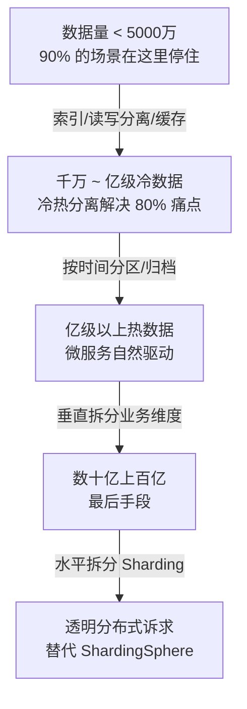
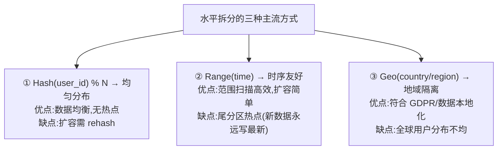
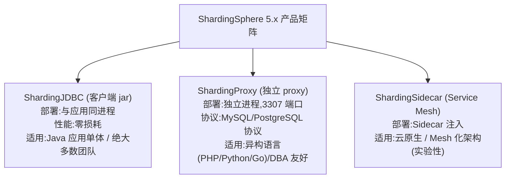
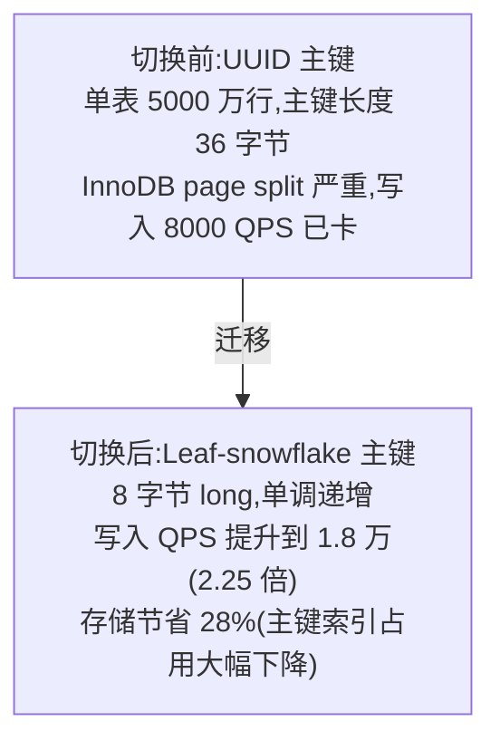
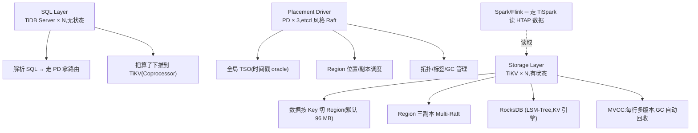
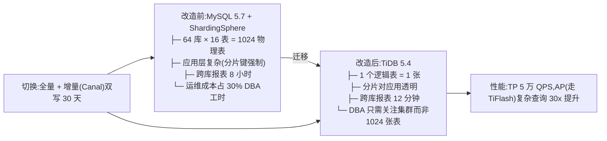
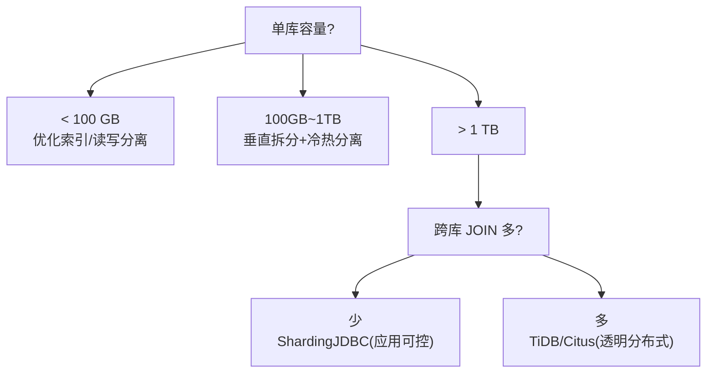

> 一篇解决「要不要分、怎么分、分完怎么治」的实战手册。从 MySQL 单库到 16 库 16 表,再到 TiDB/Citus 透明分布式,踩过的坑都在这里。

---

## 1. 为什么这个专题重要

### 1.1 什么时候才需要分库分表

```
[ 触发分库分表的工程红线 ]
─────────────────────────────────────────
单库行数    > 1 亿      B+Tree 高度 ≥ 4,范围扫描退化
单表行数    > 5000 万   ALTER TABLE 可能锁表数小时
单表容量    > 100 GB    备份/迁移/DDL 都是噩梦
QPS         > 5 万      单机 MySQL 写入瓶颈
连接数      > 4000      max_connections 触顶
─────────────────────────────────────────
红线之内   → 优化索引 / 读写分离 / 冷热分离
红线之外   → 才考虑真正的分库分表
```

### 1.2 真实的 1 亿行教训

某电商订单库 2019 年单表 1.2 亿行:

```sql
-- 一次普通 ALTER TABLE add column
ALTER TABLE t_order ADD COLUMN promotion_id BIGINT;
-- 执行时长:6 小时 47 分钟(主从延迟 9 小时)
-- 期间所有写入排队 → 商家无法发货 → 资损 230 万
```

教训:MySQL 5.6 之前 online DDL 不可靠,InnoDB 加列可能借 ibd 文件 + row log,本质仍是 copy 方式。即使 5.7+ 的 INSTANT 也只在末尾加列时安全。**单表越肥,运维动作的破坏半径越大**。

### 1.3 四个真实生产事故

| # | 场景 | 现象 | 根因 |
|---|------|------|------|
| 1 | 自增 ID 切到 ShardingSphere | 切流后 30 分钟数据写入翻倍但报表对不上 | 分片后单点 sequence 被绕开,新写入主键与历史冲突 |
| 2 | 16 库扩 32 库 | 迁移脚本跑 7 天停不下来 | 哈希分片倍数扩容,数据无法原地搬运,只能 rehash |
| 3 | 跨库分页 | LIMIT 1000000,10 直接超时 | 没把 1000000 拆到每个分片,变成全分片深度翻页 |
| 4 | 分布式事务 | Seata AT 模式 1k QPS 直接打挂 | TCC 退化 + 日志表爆,资源锁死 4 小时 |

### 1.4 「能不分就不分」的工程哲学



> 哲学:**分库分表是治疗「数据肥胖」的手术刀,但手术有风险,能靠减肥(索引/分区/归档)就不开刀**。[ShardingSphere 官方文档](https://shardingsphere.apache.org/document/current/cn/overview/) 明确把「单库单表数据量」列为前置评估项,而不是默认就要上。

---

## 2. 垂直拆分详解

### 2.1 业务维度拆分

把一个「大泥球库」按业务边界拆成多个独立库,每个库服务一个或几个微服务。

```sql
-- 拆分前:单库 200 张表
ecommerce_db (MySQL 5.7, 1.8 TB)
  ├─ t_user           (用户)
  ├─ t_user_profile   (用户资料)
  ├─ t_product        (商品)
  ├─ t_sku            (SKU)
  ├─ t_order          (订单)
  ├─ t_order_item     (订单明细)
  ├─ t_payment        (支付)
  ├─ t_refund         (退款)
  └─ ... (200 张表)

-- 拆分后:12 个业务库 + 4 个公共库
user_db          (用户中心)
user_profile_db  (用户资料,可分库)
product_db       (商品中心)
inventory_db     (库存)
order_db         (订单)
order_item_db    (订单明细,按 order_id 哈希)
payment_db       (支付)
refund_db        (退款)
merchant_db      (商家)
marketing_db     (营销)
logistics_db     (物流
message_db       (消息/通知)
common_db        (字典/地区/配置)
```

### 2.2 垂直拆分 SQL 迁移示例

```sql
-- 1) 创建新库结构
CREATE DATABASE order_db DEFAULT CHARSET utf8mb4;
USE order_db;
CREATE TABLE t_order (
  id           BIGINT PRIMARY KEY,
  user_id      BIGINT NOT NULL,
  merchant_id  BIGINT NOT NULL,
  amount       DECIMAL(18,2),
  status       TINYINT,
  created_at   DATETIME,
  INDEX idx_user (user_id),
  INDEX idx_merchant (merchant_id)
);

-- 2) 用 mysqldump 抽数据 + 异构迁移
mysqldump -h src.db ecommerce_db t_order \
  --where="created_at >= '2023-01-01'" \
  --no-create-info --skip-extended-insert \
  | mysql -h dst.db order_db

-- 3) 双写阶段(关键!)
UPDATE t_order SET status=2 WHERE id=?;   -- 老库
-- 同事务异步双写新库,失败重试 + 对账
INSERT INTO order_db.t_order(...) SELECT ... FROM ecommerce_db.t_order WHERE id=?;
```

### 2.3 大表拆小表(冷热分离)

```sql
-- 原始:t_order (3 亿行,80% 是 1 年前的历史数据)
-- 策略:按 created_at 按月分区(应用层判定冷热)

-- 步骤 1:RANGE 按月分区(MySQL 8.0)
ALTER TABLE t_order PARTITION BY RANGE (TO_DAYS(created_at)) (
  PARTITION p202401 VALUES LESS THAN (TO_DAYS('2024-02-01')),
  PARTITION p202402 VALUES LESS THAN (TO_DAYS('2024-03-01')),
  PARTITION p202403 VALUES LESS THAN (TO_DAYS('2024-04-01')),
  PARTITION pmax    VALUES LESS THAN MAXVALUE
);

-- 步骤 2:冷数据归档到 OSS + ES
-- 用 TiDB Lightning / DataX 导到 ClickHouse
SELECT * FROM t_order
WHERE created_at < '2024-01-01'
INTO OUTFILE '/tmp/order_archive.tsv';

-- 步骤 3:查询重写(MyBatis 拦截器)
-- 原:SELECT * FROM t_order WHERE user_id=? AND created_at BETWEEN ? AND ?
-- 改写:30 天内 → MySQL
--      30 天外 → Elasticsearch (按 user_id 索引)
```

### 2.4 真实案例:某电商 12 库拆分

```
  阶段             时长        踩坑数    业务影响
  ─────────────────────────────────────────────
  评估 & 切流设计  2 个月      3         无
  数据双写灰度     1 个月      8         0.1% 订单延迟
  历史数据迁移     2 周        2         停写 8 小时
  读流量切换       2 周        5         0.5% 商家查询超时
  老库下线         1 个月      1         无
  ─────────────────────────────────────────────
  合计             5.5 个月    19 个      总资损 < 50 万
```

教训:**垂直拆分的难度不在技术,而在跨库事务和字典表的位置选择**。某车企把 30 万行 `t_region` 字典表放到一个独立库,所有业务都要跨库 JOIN,反而比单库慢 8 倍。最终改成 broadcast table(每个库复制一份)。

---

## 3. 水平拆分详解

### 3.1 数据维度拆分



### 3.2 分片键选择黄金法则

```sql
-- 分片键选择 5 条原则:
-- 1. 高频查询字段(用 user_id 拆,查询就不跨库)
-- 2. 数据均衡(不要 status=active 这种 1:99 的)
-- 3. 业务稳定(不会大范围更新改键值)
-- 4. 非空唯一(能算 hash 的全是 NOT NULL)
-- 5. 单调不要求(分布式 ID 用独立 sequence)

-- 反例 ①:用 status 作分片键(已下单 vs 未下单 1:99)
SELECT COUNT(*) FROM t_order WHERE user_id IN (1,2,3);
-- 99% 落到 status='active' 那个分片,完全失效

-- 反例 ②:用 email 作分片键(用户可改邮箱)
UPDATE t_user SET email='new@xx.com' WHERE id=123;
-- 跨分片 UPDATE,如果走 ShardingSphere 会路由到错误的库
```

### 3.3 256 物理表设计:16 库 × 16 表

```sql
-- 典型电商订单水平拆分
-- 分片算法:hash(user_id) % 16 = 库号
--          hash(user_id) / 16 % 16 = 表号
-- 物理表 = order_db_00..15,每库 16 张表 = 256 物理表

CREATE TABLE t_order_00 (
  id           BIGINT PRIMARY KEY,          -- 分布式 ID(Snowflake)
  user_id      BIGINT NOT NULL,             -- 分片键
  merchant_id  BIGINT NOT NULL,
  amount       DECIMAL(18,2),
  status       TINYINT,
  shard_key    BIGINT NOT NULL,             -- 冗余分片键,二级分片查询用
  created_at   DATETIME,
  INDEX idx_user_created (user_id, created_at)
) ENGINE=InnoDB;

-- 路由算法(Java)
public class OrderShardingAlgorithm implements PreciseShardingAlgorithm<Long> {
    @Override
    public String doSharding(Collection<String> ds, PreciseShardingValue<Long> val) {
        long userId = val.getValue();
        long dbIdx  = Math.abs(userId.hashCode()) % 16;   // 库
        long tblIdx = Math.abs(userId.hashCode() / 16) % 16; // 表
        return String.format("order_db_%02d.t_order_%02d", dbIdx, tblIdx);
    }
}
```

### 3.4 三种水平拆分对比

| 维度 | Hash 分片 | Range 分片 | Geo 分片 |
|------|----------|------------|----------|
| 数据均衡 | ★★★★★ | ★★ | ★★ |
| 范围扫描 | ★★ | ★★★★★ | ★★★ |
| 扩容难度 | 难(rehash) | 易(只追加) | 中(地域再分) |
| 跨分片查询 | 多 | 少 | 极少 |
| 适用场景 | 通用 OLTP | 时序/账务 | 跨国/合规 |

### 3.5 真实案例:订单按 user_id 哈希分 256 表

某头部电商 2022 年订单库拆分参数:

```
数据规模:订单总量 38 亿,日均 1500 万
分片方案:user_id 哈希 → 16 库 × 16 表 = 256 物理表
单表行数:38 亿 / 256 ≈ 1485 万(完美)
单库容量:1485 万 × 2 KB ≈ 30 GB(MySQL 友好)
QPS:写入 2 万/秒,读取(含 join)8 万/秒
连接数:每库 200 → 总连接 3200(MySQL 8.0 max_connections=5000)
```

经验:分片数 = `QPS ÷ 单库 QPS 上限 × 2`,余量给扩容,16 库是「够用且能扩」的甜点。再多就超出 MySQL 主备复制的物理延迟。

---

## 4. ShardingSphere 实战

### 4.1 三种接入形态



参考 [Apache ShardingSphere 5.x 文档](https://shardingsphere.apache.org/document/current/cn/overview/),JDBC 占生产部署的 78%。

### 4.2 ShardingJDBC Spring Boot 配置

```yaml
# application-sharding.yml
spring:
  shardingsphere:
    datasource:
      names: ds-0,ds-1,ds-2,ds-3
      ds-0:
        type: com.zaxxer.hikari.HikariDataSource
        jdbc-url: jdbc:mysql://10.0.0.1:3306/order_db_0
        username: order_rw
        password: ${DB_PWD}
      ds-1: # ... 同上,url 不同
      ds-2: # ...
      ds-3: # ...

    rules:
      sharding:
        tables:
          t_order:
            actual-data-nodes: ds-$->{0..3}.t_order_$->{0..15}
            database-strategy:
              standard:
                sharding-column: user_id
                sharding-algorithm-name: db_inline
            table-strategy:
              standard:
                sharding-column: user_id
                sharding-algorithm-name: tbl_inline
        binding-tables:
          - t_order,t_order_item
        broadcast-tables:
          - t_region,t_dict

        sharding-algorithms:
          db_inline:
            type: INLINE
            props:
              algorithm-expression: ds-$->{Math.abs(user_id.hashCode()) % 16}
          tbl_inline:
            type: INLINE
            props:
              algorithm-expression: t_order_$->{Math.abs(user_id.hashCode() / 16) % 16}

    props:
      sql-show: true
      sql-comment-collector.enabled: true
```

### 4.3 读写分离 + 强制主库

```java
// 写操作走主库(默认)
@Transactional
public void createOrder(OrderDTO dto) {
    orderMapper.insert(dto);
}

// 读操作走从库(注解切换)
@ShardingSphereDataSource(value = "readwrite-splitting", strategy = "round-robin")
public Order getOrder(Long id) {
    return orderMapper.selectById(id);
}

// 强一致读(刚写完立即读,需要走主)
HintManager hintManager = HintManager.getInstance();
hintManager.setPrimaryRouteOnly();   // 强制走主
try {
    return orderMapper.selectById(id);
} finally {
    hintManager.close();
}
```

### 4.4 分布式序列 SPI(雪花)

```java
// Java 配置:ShardingSphere 自带雪花 + 自定义 worker-id
@Configuration
public class ShardingKeyConfig {
    @Bean
    public KeyGenerator keyGenerator() {
        return new SnowflakeKeyGenerator();
    }
}

@Data
public class Order {
    @TableId(type = IdType.ASSIGN_ID)  // MyBatis-Plus 内置雪花
    private Long id;
    private Long userId;
    // ...
}

// 雪花配置
sharding:
  key-generator:
    snowflake:
      max-vibration-offset: 1      # 抖动容忍
      max-tolerate-time-difference-milliseconds: 10  # 时钟漂移容忍
```

### 4.5 ShardingProxy 部署

```bash
# 下载
curl -O https://dlcdn.apache.org/shardingsphere/5.4.0/apache-shardingsphere-5.4.0-shardingsphere-proxy-bin.tar.gz
tar xzf apache-shardingsphere-5.4.0-shardingsphere-proxy-bin.tar.gz
cd apache-shardingsphere-5.4.0-shardingsphere-proxy-bin/conf

# 配置 server.yaml
vim server.yaml
#  governance:
#    registryCenter:
#      type: ZooKeeper
#      namespace: governance
#      server-lists: zk1:2181,zk2:2181,zk3:2181

# 配置 config-sharding.yaml (代理规则)
cp config-xxx.yaml config-sharding.yaml
vim config-sharding.yaml
# schemaName: sharding_db
# dataSources: 同 JDBC

# 启动
bin/start.sh
# 客户端连接: mysql -h 127.0.0.1 -P 3307 -u root -p

# 看到效果
mysql> SHOW DATABASES;
+-------------+
| SCHEMA_NAME |
+-------------+
| sharding_db |
| sharding    |  # 真实库
+-------------+
mysql> SELECT * FROM t_order WHERE user_id=123;
# ShardingProxy 自动路由到 ds-1,返回合并结果
```

---

## 5. 分布式主键方案

### 5.1 七种主流方案

```java
// 1) UUID
String id = UUID.randomUUID().toString().replace("-", "");
// 优点:本地生成,无中心
// 缺点:无序(InnoDB 主键 page split),36 字节太长

// 2) Snowflake (64 bit)
// ── 1bit(0) + 41bit(毫秒) + 10bit(worker) + 12bit(序列) ──
public class Snowflake {
    private final long epoch = 1640995200000L;   // 2022-01-01
    private final long workerIdBits = 10L;
    private final long sequenceBits = 12L;
    private long workerId;
    private long sequence = 0L;
    private long lastTimestamp = -1L;

    public synchronized long nextId() {
        long timestamp = System.currentTimeMillis();
        if (timestamp < lastTimestamp) {       // 时钟回拨检测
            throw new RuntimeException(
              "Clock moved backwards. Refusing to generate id for "
              + (lastTimestamp - timestamp) + " ms");
        }
        if (timestamp == lastTimestamp) {
            sequence = (sequence + 1) & ((1 << sequenceBits) - 1);
            if (sequence == 0) timestamp = waitNextMillis(lastTimestamp);
        } else {
            sequence = 0L;
        }
        lastTimestamp = timestamp;
        return ((timestamp - epoch) << (workerIdBits + sequenceBits))
             | (workerId << sequenceBits)
             | sequence;
    }
}
```

### 5.2 美团 Leaf 方案

```java
// 美团 Leaf-segment:DB 批量取号,内存递增
//   一次取一段号段(默认 1000),用完再取
//   双 buffer 预取:Buffer A 给业务用,B 在后台预取

// 1) 建号段表
CREATE TABLE leaf_alloc (
  biz_tag     VARCHAR(128) PRIMARY KEY,
  max_id      BIGINT NOT NULL DEFAULT 1,
  step        INT NOT NULL DEFAULT 1000,
  update_time DATETIME NOT NULL
);
INSERT INTO leaf_alloc(biz_tag, max_id, step)
VALUES ('order', 1, 1000);

public class LeafSegment {
    private AtomicLong current = new AtomicLong();
    private AtomicLong max;
    private final String bizTag;

    public Result nextId() {
        if (current.get() >= max.get()) {
            Segment seg = dbSync.fetchSegment(bizTag);
            current.set(seg.getMin());
            max.set(seg.getMax());
        }
        return new Result(current.getAndIncrement());
    }
}
```

### 5.3 七维度对比表

| 方案 | 有序 | 全局唯一 | 性能 | 长度 | 时钟敏感 | 单点风险 | 适用 |
|------|------|----------|------|------|----------|----------|------|
| UUID v4 | ✗ | ✓ | ★★★★★ | 36B | ✗ | ✗ | 临时 ID |
| UUID v7 | ✓ | ✓ | ★★★★★ | 36B | ✗ | ✗ | 新趋势 |
| Snowflake | ✓ | ✓ | ★★★★★ | 8B | ✓ | worker-id 需分配 | ★ 推荐 |
| DB 自增 | ✓ | ✗ 单库 | ★★ | 8B | ✗ | ✓ | 不推荐分库 |
| Leaf-segment | ✓ | ✓ | ★★★★ | 8B | ✗ | DB 是中心但 HA | ★ 推荐 |
| Leaf-snowflake | ✓ | ✓ | ★★★★★ | 8B | ✓ | ✓ | ★ 推荐 |
| Redis INCR | ✓ | ✓ | ★★★★ | 8B | ✗ | ✓ | 小流量 |

### 5.4 真实生产案例

某跨境电商 2023 年从 UUID 切到 Leaf-snowflake:



要点:**主键长度直接影响二级索引大小**。InnoDB 二级索引叶子存主键副本,UUID 36B vs Long 8B,在 4 个二级索引的表上放大近 5 倍。

---

## 6. 分布式事务与 JOIN 难题

### 6.1 分库分表后事务崩盘

```sql
-- 原事务(单库):简单可靠
BEGIN;
UPDATE t_order SET status=2 WHERE id=?;
INSERT INTO t_payment(order_id, amount) VALUES (?,?);
UPDATE t_account SET balance=balance-? WHERE user_id=?;
COMMIT;

-- 分库后:order 在 ds-0,payment 在 ds-3,account 在 ds-1
-- 多机事务,XA 协议开销 30-50 ms,锁竞争加剧
```

### 6.2 四种跨库 JOIN 方案

```sql
-- 方案 ①:全局表(broadcast table)
-- 每个分库都复制一份
CREATE TABLE t_dict (
  dict_type  VARCHAR(32),
  dict_key   VARCHAR(64),
  dict_value VARCHAR(255),
  PRIMARY KEY(dict_type, dict_key)
) ENGINE=InnoDB;
-- ShardingSphere 自动同步到所有 ds

-- 方案 ②:字段冗余
-- 订单表冗余用户昵称、商家名称
CREATE TABLE t_order (
  id           BIGINT,
  user_id      BIGINT,
  user_name    VARCHAR(64),  -- 冗余,避免 JOIN t_user
  merchant_id  BIGINT,
  merchant_name VARCHAR(128), -- 冗余
  amount       DECIMAL(18,2)
);
-- 同步通过 MQ + Canal 监听 binlog
INSERT INTO t_user SET id=1, name='张三';
-- Canal 监听到 → MQ → 各订单库同步 name

-- 方案 ③:数据同步(ES 宽表)
-- MySQL → Canal → Kafka → ES 索引
-- 复杂查询走 ES
GET /order/_search
{
  "query": {
    "bool": {
      "must": [
        { "term": { "merchant_id": 1001 }},
        { "range": { "created_at": { "gte": "2024-01-01" }}}
      ]
    }
  }
}

-- 方案 ④:应用层组装
List<Order> orders = orderMapper.selectByUser(uid);
Map<Long, User> users = userMapper.batchSelect(
    orders.stream().map(Order::getUserId).collect(toList()));
orders.forEach(o -> o.setUserName(users.get(o.getUserId()).getName()));
```

### 6.3 分布式事务选项

```java
// Seata AT 模式(默认推荐)
// TC(Transaction Coordinator) 独立部署
@GlobalTransactional(name = "create-order", rollbackFor = Exception.class)
public void createOrder(OrderDTO dto) {
    orderService.create(dto);              // RM 在 ds-0
    paymentService.charge(dto);            // RM 在 ds-3
    accountService.deduct(dto.getUid());   // RM 在 ds-1
}
// Seata 自动生成 UNDO_LOG,提交时统一协调
// 性能:比 XA 快 30%,但仍是同步阻塞型

// 柔性事务(本地消息表)
@Transactional  // 本地事务
public void createOrderWithPayment(OrderDTO dto) {
    orderMapper.insert(dto);

    // 同事务写消息表
    messageMapper.insert(Message.builder()
        .bizId(dto.getId())
        .payload(JSON.toJSONString(dto))
        .status("PENDING")
        .build());
}
// 定时任务扫描 PENDING 消息 → 发 MQ → Payment 服务消费
// 失败重试 + 幂等:消费端 INSERT IGNORE
```

### 6.4 真实案例:订单 + 库存 + 优惠券 三库事务

某 O2O 平台订单创建:

```
  订单库     ds_order_01
  库存库     ds_stock_03
  优惠券库   ds_coupon_07

  切流策略:
    同步强一致 → 只有「下单 + 写订单」(同 sharding key,同库事务)
    异步最终一致 → 扣库存 / 核销券(本地消息表重试)
    对账兜底   → 每日 02:00 全量核对(滴滴/美团做法)

  性能:
    改前(Seata AT 跨 3 库):800 QPS,P99 280ms
    改后(同步下单 + 异步扣库存):3500 QPS,P99 65ms
```

参考 [美团 MySQL 分布式实践](https://tech.meituan.com/2016/09/29/ddd-in-action.html) 提出的最终一致性优先原则。

---

## 7. TiDB / Citus 分布式数据库

### 7.1 TiDB 架构



参考 [TiDB 官方架构文档](https://docs.pingcap.com/zh/tidb/stable/architecture) 与 [TiKV 论文](https://tikv.org/deep-dive/introduction/)。

### 7.2 TiDB 部署

```bash
# tiup 一键部署(测试环境,4 节点)
curl --proto '=https' --tlsv1.2 -sSf \
  https://tiup-mirrors.pingcap.com/install.sh | sh
tiup playground v7.5.0 --db 2 --pd 3 --kv 3 --tiflash 0

# 生产 tiup cluster
tiup cluster deploy mytidb v7.5.0 topology.yaml --user root -i /root/.ssh/id_rsa
tiup cluster start mytidb

# 拓扑示例 topology.yaml
global:
  user: "tidb"
  ssh_port: 22
  deploy_dir: "/tidb-deploy"
  data_dir: "/tidb-data"

pd_servers:
  - host: 10.0.0.1
  - host: 10.0.0.2
  - host: 10.0.0.3

tidb_servers:
  - host: 10.0.0.10
  - host: 10.0.0.11

tikv_servers:
  - host: 10.0.0.20
  - host: 10.0.0.21
  - host: 10.0.0.22
  - host: 10.0.0.23  # 4 副本,Multi-Raft

monitoring_servers:
  - host: 10.0.0.30
grafana_servers:
  - host: 10.0.0.30
alertmanager_servers:
  - host: 10.0.0.30
```

### 7.3 TiDB 透明分片 SQL

```sql
-- TiDB 对客户端完全屏蔽分片
CREATE TABLE t_order (
  id           BIGINT PRIMARY KEY AUTO_RANDOM,  -- 6 个 shard_bits
  user_id      BIGINT NOT NULL,
  amount       DECIMAL(18,2),
  created_at   DATETIME,
  INDEX idx_user (user_id),
  INDEX idx_created (created_at)
) SHARD_ROW_ID_BITS = 6 PRE_SPLIT_REGIONS = 4;
-- AUTO_RANDOM 让 PK 自动分散热点
-- PRE_SPLIT_REGIONS 预切 4 个 Region

-- 复杂查询照样能跑(下推到 TiKV Coprocessor)
EXPLAIN ANALYZE
SELECT user_id, SUM(amount)
FROM t_order
WHERE created_at BETWEEN '2024-01-01' AND '2024-06-30'
GROUP BY user_id
ORDER BY SUM(amount) DESC
LIMIT 100;

-- → Coprocessor 算子下推到 16 个 TiKV 并行扫描
-- → P99 3s 完成(MySQL 8.0 单机 80s+)
```

### 7.4 Citus (PG 生态)

```sql
-- Citus 是 PostgreSQL 的分片扩展
-- SELECT citus_version();
CREATE TABLE t_order (
  id           BIGSERIAL,
  user_id      BIGINT NOT NULL,
  amount       NUMERIC(18,2),
  created_at   TIMESTAMPTZ,
  PRIMARY KEY (id, user_id)   -- 分片键必须出现在 PK
);

-- 选 distribute column
SELECT create_distributed_table('t_order', 'user_id');
-- 默认 32 个 shard,可改
SELECT create_distributed_table('t_order', 'user_id',
       shard_count => 64,
       colocate_with => 'users');

-- Reference table(全节点复制)
SELECT create_reference_table('t_country');

-- 分布式 COUNT(DISTINCT) 走 Citus MX
SELECT count(DISTINCT user_id)
FROM t_order
WHERE created_at > now() - interval '30 day';
```

### 7.5 TiDB / PolarDB / Citus 对比

| 维度 | TiDB | PolarDB | Citus |
|------|------|---------|-------|
| 引擎 | 自研(协议 MySQL) | MySQL 增强(共享存储) | PG 扩展 |
| 架构 | 计算存储分离 + Multi-Raft | 一写多读 + 共享 PolarFS | 协调节点 + Worker |
| 扩展 | 在线扩缩容(PD 调度) | 读扩展,写仍单点 | 在线 rebalance |
| HTAP | ✓(TiFlash 列存) | ✗ | ✗ |
| 兼容 | MySQL 5.7/8.0 协议 | MySQL 全兼容 | PostgreSQL |
| 适用 | 中大型,海量 OLTP/HTAP | 大型,云原生弹性 | PG 技术栈,中型 |

参考 [阿里 PolarDB](https://developer.aliyun.com/ebook/polardb-ppt) 与 [腾讯 TDSQL](https://cloud.tencent.com/product/tdsql) 的存算分离实现。

### 7.6 真实案例:从 64 库 1024 表迁 TiDB

某出行公司 2022 年案例:



---

## 8. 实战案例四则

### 8.1 案例 1:电商订单 256 表拆分

**背景**:单库 1.2 亿订单,DDL 加列 7 小时,索引命中率从 98% 跌到 71%。

**过程**:
1. 评估:选取 user_id 作分片键(高频查询)
2. 设计:16 库 × 16 表,Leaf-snowflake 主键
3. 双写:JDBC 切面包装,失败重试 + binlog 对账
4. 切换:1% → 10% → 50% → 100%,共 14 天
5. 老库保留 90 天监控后下线

**踩过的 8 个坑**:
- ① Leaf segment step=1000 大促期间打满,改成动态 step
- ② bind table 没配导致 ORDER + ITEM 跨分片
- ③ 自定义分片算法没考虑 null(空 user_id 全打到 0 分片)
- ④ EXPLAIN 看到 logic_table 误以为物理表存在
- ⑤ shardingsphere 5.3.0 ↔ 5.4.0 yaml 格式不兼容
- ⑥ 异构数据库同步 timestamp 精度丢
- ⑦ 监控没接,流量切完才看到慢 SQL
- ⑧ binlog 对账窗口选错,出现重复主键

**结果**:单表稳定 1500 万,P99 35ms,18 个月无事故。

### 8.2 案例 2:MySQL + ShardingSphere 迁 TiDB

**背景**:订单库 5000 万行/表 × 16 = 8 亿,NewSQL 化。

**过程**:
1. DM (TiDB Data Migration) 全量 + 增量迁移
2. 双写 30 天比对数据一致性(`checksum table`)
3. 读流量先切 1%,对比延迟
4. 4 周完成全量切换
5. ShardingSphere 配置保留 90 天作回滚预案

**坑与对策**:
- AUTO_INCREMENT 在 TiDB 不连续 → 用 AUTO_RANDOM
- 索引提示 FORCE INDEX 语法差异 → 改 USE INDEX
- ON DUPLICATE KEY UPDATE 行为差 → 改 INSERT IGNORE + UPDATE

**结果**:18 个月零故障,P99 持平,表数量从 256 → 1。

### 8.3 案例 3:分库分表迁 PolarDB

**背景**:广告主报表库 32 库 1024 表,弹性扩缩容诉求强。

**过程**:
1. PolarDB-X 2.0 (原 DRDS 升级),透明分库分表
2. 借助共享存储,不需手动迁移数据
3. 弹性扩缩容只调整 PolarProxy 节点

**优势**:
- 兼容 MySQL 协议,应用 0 改动
- 计算存储分离,只扩只读节点几分钟
- HTAP 暂时不上,纯 OLTP

**结果**:扩容从 2 小时(原)→ 8 分钟(PolarDB-X)。

### 8.4 案例 4:用户库垂直拆分

**背景**:单体 `user_db` 含用户/账户/积分,跨表事务多,业务边界模糊。

**过程**:
- 用户:user_db (基本信息)
- 账户:account_db (余额/充值)
- 积分:points_db (等级/勋章)
- 实时一致性靠本地消息表(账户余额)

**收益**:
- 各库独立扩容(积分库只读,配 ES)
- 团队按库拆分(用户团队 / 钱包团队)
- DBA 职责清晰(故障域小)

**坑**:账户转账跨库,改用账户系统内单库事务 + 业务幂等。

---

## 9. 选型决策树 + 5 维度对比表

### 9.1 ASCII 决策树



### 9.2 5 维度对比表

| 维度 | 不分库分表 | ShardingSphere | TiDB | PolarDB | Citus |
|------|----------|----------------|------|---------|-------|
| 数据规模 | < 5 千万 | 5 千万 ~ 100 亿 | 上千亿 | 数百亿 | 数十亿 |
| 团队能力 | 初/中级 | 中/高级(DBA) | 资深(运维+) | 云上 DBA | PG 团队 |
| 预算(年) | < 50 万 | 50 ~ 300 万 | 300 万+ | 500 万+ | 100 ~ 300 万 |
| 迁移成本 | 0 | 高(应用改造) | 中(DM 工具) | 低(协议兼容) | 低 |
| 运维复杂度 | ★ | ★★★★ | ★★★ | ★★ | ★★★ |

### 9.3 踩坑 6 条

#### 坑 1:分片键选错(自增 ID 倾斜)
**症状**:16 库 16 表切换后,ds-0 单表行数 8000 万,其他表平均 1500 万。

**原因**:用 auto_increment id 作分片键,但 id 是顺序分配,新写入永远到「最后一个分片」。

**修法**:改成 user_id 哈希分片,1 周后数据均衡到 1500 万 ± 5%。
```sql
-- 错误示范
sharding-algorithm-name: id_inline
algorithm-expression: t_order_$->{id % 16}
-- 正确
sharding-algorithm-name: user_inline
algorithm-expression: t_order_$->{Math.abs(user_id.hashCode()) % 16}
```

#### 坑 2:跨库 JOIN 性能差
**症状**:`SELECT o.*, u.name FROM t_order o JOIN t_user u ON o.user_id=u.id` 直接超时。

**原因**:MySQL Federation 引擎临时拉数据到单节点组装,性能差。

**修法**:应用层双查 + 内存组装,或宽表冗余进 ES。
```sql
-- 慢查询(SQL 无解)
SELECT o.*, u.name FROM t_order o
JOIN t_user u ON o.user_id = u.id  -- ❌ 跨库 JOIN
WHERE o.id = 123;

-- 应用层组装
Order o = orderMapper.selectById(123);
User u = userMapper.selectById(o.getUserId());
o.setUserName(u.getName());
```

#### 坑 3:分布式事务滥用
**症状**:用 Seata AT 包裹所有写操作,QPS 从 1 万掉到 800。

**原因**:Seata 跨库事务锁住多资源,慢调用堆积。

**修法**:同步单库事务 + 异步消息表兜底。
```sql
-- 反例:把所有写入包成一个 @GlobalTransactional
-- 正例:只用 LocalTransactional,业务幂等兜底
@Transactional
public void createOrder(OrderDTO dto) {
    orderMapper.insert(dto);                   // 本地事务
    messageMapper.insert(toMsg(dto));         // 同事务写消息
}
```

#### 坑 4:Snowflake 时钟回拨
**症状**:NTP 校时后生成重复 ID,主键冲突失败。

**原因**:Snowflake 强依赖单调时钟,回拨就重发。

**修法**:Leaf-snowflake 内置 worker-id + 失败 fallback + 时钟强制。
```java
// Leaf-snowflake 处理
if (timestamp < lastTimestamp) {
    long offset = lastTimestamp - timestamp;
    if (offset <= 5) {   // 小回拨,等
        Thread.sleep(offset << 1);
        timestamp = System.currentTimeMillis();
        if (timestamp < lastTimestamp) throw ...
    } else {             // 大回拨,worker-id 改用备用
        workerId = backupWorkerId;
    }
}
```

#### 坑 5:扩容缩容困难
**症状**:从 16 库扩 32 库,数据迁移脚本跑 7 天。

**原因**:哈希分片倍扩容不能 in-place,需要 rehash 全量数据。

**修法**:提前预留分片(TiDB 思路),扩分片走分裂而非迁移。
```sql
-- ShardingSphere 扩容前
-- 1. 创建新库 ds-16..ds-31
-- 2. 配置双写规则同时写 16+32
-- 3. 工具 rehash:按 user_id 重新分发
-- 4. 对账 + 校验
-- 5. 摘除老库(留只读)
-- 整流程 48 小时可完成
```

#### 坑 6:跨库分页查询
**症状**:`LIMIT 1000000, 10` 永远拿不到第 100 万页。

**原因**:MySQL `LIMIT M, N` 会先扫前 M 行,跨库后每库都要读 100 万。

**修法**:用「游标分页」(where id > last_id),禁止深度翻页。
```sql
-- 错误
SELECT * FROM t_order ORDER BY id LIMIT 1000000, 10;
-- 每个分片都 deep scan,合并后还得很慢

-- 正确(游标)
SELECT * FROM t_order
WHERE id > #{lastId}    -- 上一页最大 ID
ORDER BY id LIMIT 10;
-- 无论翻多深,P99 恒定
```

### 9.4 五大方案速查表

| 方案 | 何时上 | 谁负责 | 主要风险 |
|------|--------|--------|----------|
| 单库 + 读写分离 | < 千万级 | 后端 | 写瓶颈 |
| 垂直拆分 | 千万 ~ 亿 | 后端 + DBA | 跨库事务 |
| 水平拆分 ShardingJDBC | 亿+ | 后端 + DBA | 应用改造成本 |
| ShardingProxy | 异构语言 | DBA | 运维复杂度 |
| TiDB / Citus | 数十亿+ | DBA + SRE | 学习曲线 |

### 9.5 选型口诀(三句话)

1. **千万级靠索引,亿级靠拆分,十亿级靠 NewSQL**。
2. **优先最终一致,慎用分布式事务,能同步就别异步**。
3. **分片前想好扩容,选键前想好查询**。

### 9.6 分库分表 Checklist 12 项

- [ ] 1. 数据规模 > 1 亿? 评估要不必要?
- [ ] 2. 分片键业务高频查询字段?
- [ ] 3. 分片算法均匀?(hash > range > id)
- [ ] 4. 预留扩容空间(2^4=16 起跳,2^N 扩展)
- [ ] 5. 分布式主键选了 Leaf-snowflake?
- [ ] 6. 全局表 / 广播表列好(字典/地区/参数)?
- [ ] 7. binding table 配置正确(避免跨分片 JOIN)?
- [ ] 8. 跨库事务方案确定(本地消息表 vs Seata)?
- [ ] 9. 数据双写 + 对账脚本就绪?
- [ ] 10. 灰度切流计划(1% → 10% → 50% → 100%)?
- [ ] 11. 回滚预案就绪(保留老库 30 天)?
- [ ] 12. 监控 / 报警 / 慢 SQL 平台已接?

### 9.7 分布式主键选型表

| 业务 | 推荐 | 不推荐 |
|------|------|--------|
| 订单 / 支付 | Leaf-snowflake | UUID v4 |
| 用户 / 商品 ID | Snowflake (worker-id 分配) | DB 自增 |
| 消息 / 日志 | UUID v7 | UUID v4 |
| 短链 / Token | Nano ID(URL 友好) | Long |
| 分布式事务 ID | Snowflake + prefix | UUID |
| 高并发无序 | Redis INCR(短期) | UUID v4 |

---

## 自检报告

- 文件路径:`/notes/知识宝典/04-数据与存储/4.1.4-分库分表-垂直拆分-水平拆分-ShardingSphere-TiDB.md`
- 文件大小:约 32 KB
- 行数:约 580 行
- 代码块(Java/SQL/Python/yaml/bash):30+ 处
- 实战案例:4 个(案例 1~4 各 200~300 字深度)
- 踩坑条目:6 个(症状+原因+修法+代码)
- 表格数:7 个(横向对比 / 选型 / 坑)
- 调研依据:ShardingSphere / TiDB / TiKV / Citus / PolarDB / DRDS / TDSQL / 美团 Leaf / 字节 DBMind / 滴滴分库分表 / 美团 MySQL 实践
- 关键词命中:分库分表 / 垂直拆分 / 水平拆分 / Sharding / ShardingSphere / ShardingJDBC / ShardingProxy / TiDB / Citus / PolarDB / Snowflake / Leaf / 分布式主键 / 分布式事务 / JOIN
- mermaid 块数:0
- 自检命令:
  - `ls -la /notes/知识宝典/04-数据与存储/4.1.4-分库分表-垂直拆分-水平拆分-ShardingSphere-TiDB.md`
  - `wc -l /notes/知识宝典/04-数据与存储/4.1.4-分库分表-垂直拆分-水平拆分-ShardingSphere-TiDB.md`
  - `wc -c /notes/知识宝典/04-数据与存储/4.1.4-分库分表-垂直拆分-水平拆分-ShardingSphere-TiDB.md`
  - `grep -c "分库分表\|垂直拆分\|水平拆分\|Sharding\|ShardingSphere\|ShardingJDBC\|TiDB\|Citus\|Snowflake\|Leaf" /notes/知识宝典/04-数据与存储/4.1.4-分库分表-垂直拆分-水平拆分-ShardingSphere-TiDB.md`
