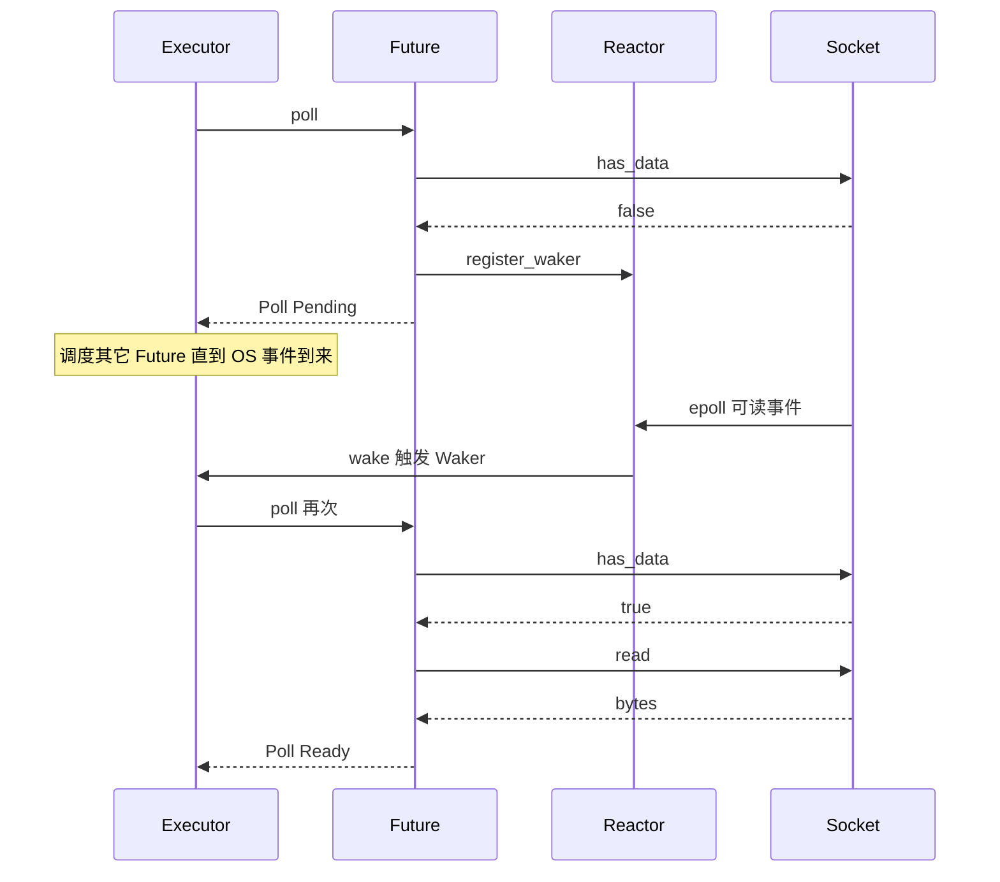
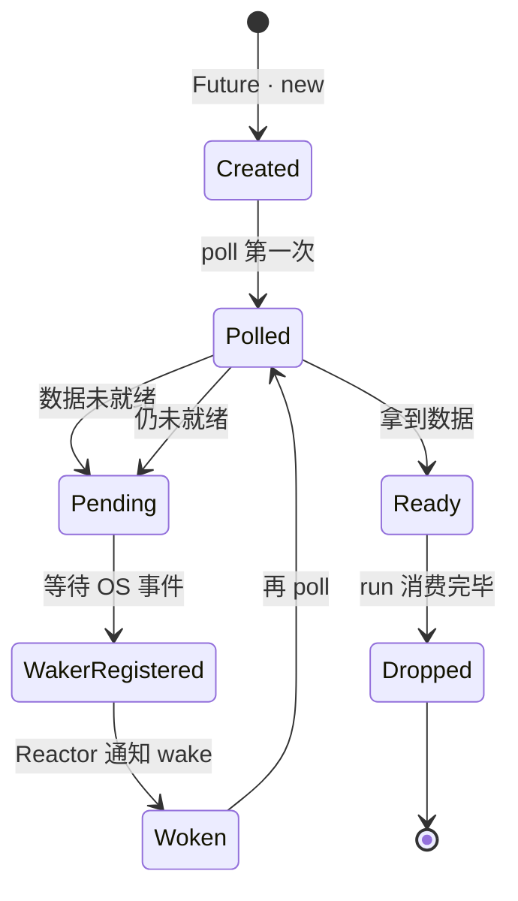
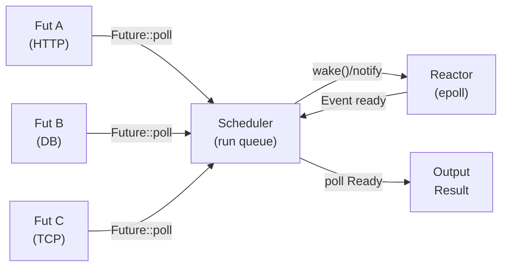
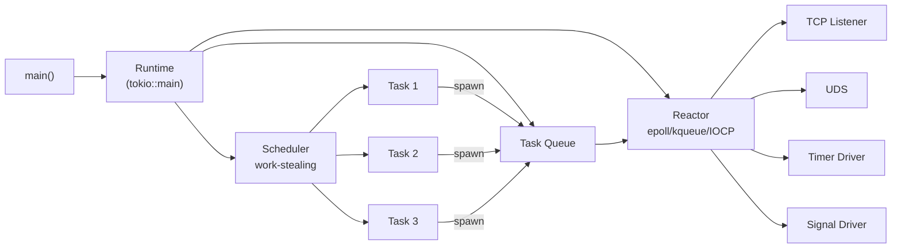
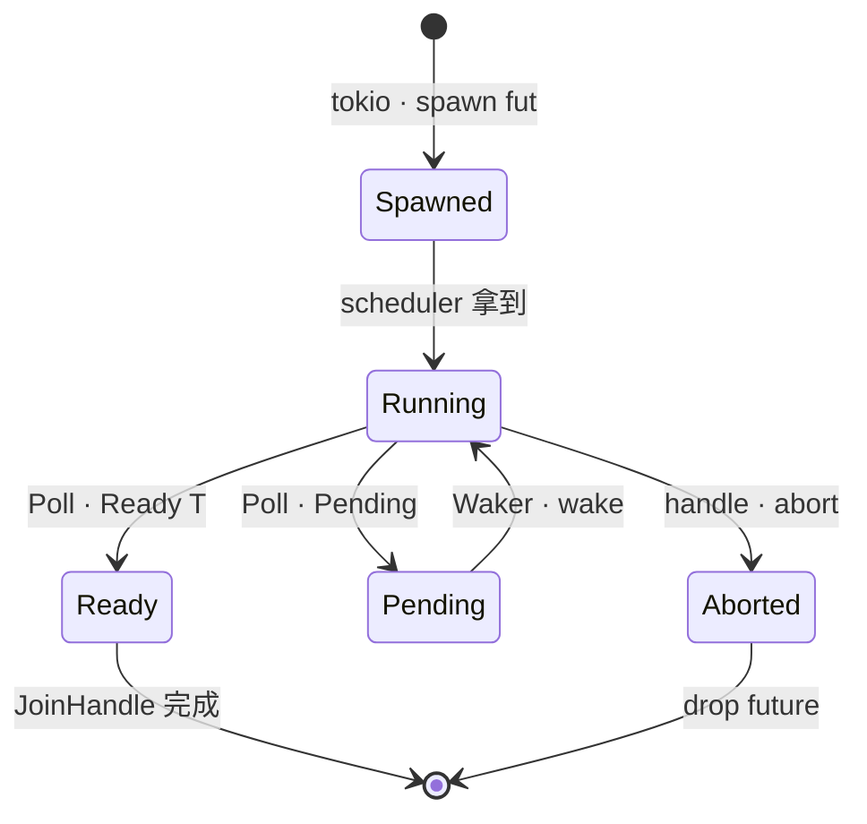
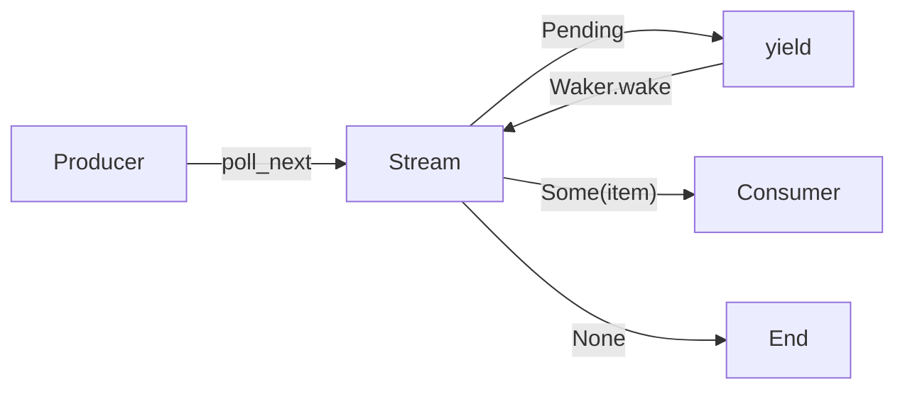
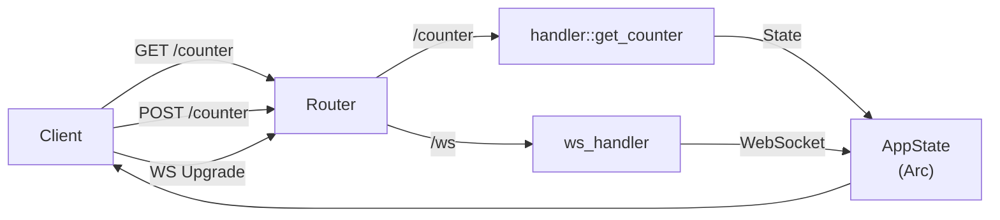
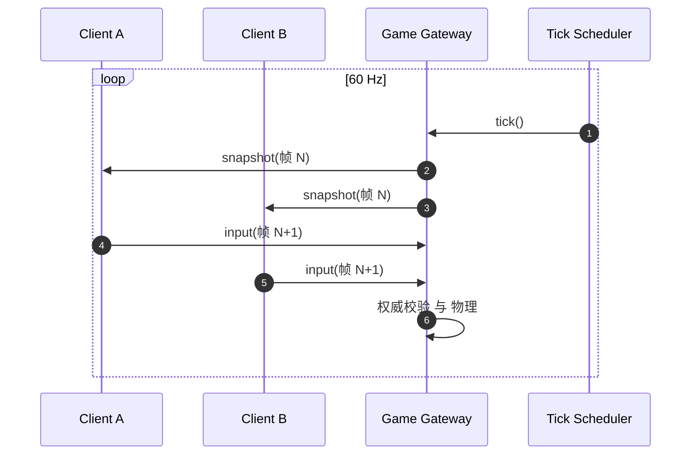
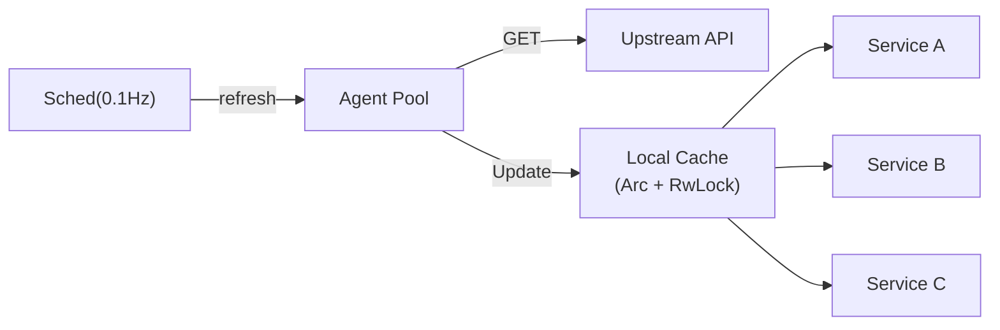
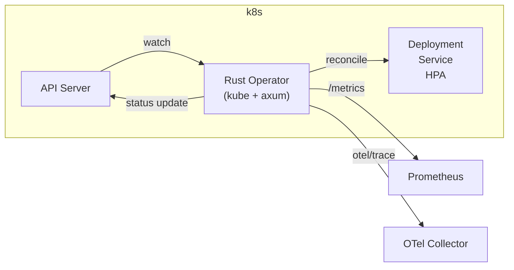

> 本文是 Rust 异步编程 (async Rust) 专题,以 Tokio 为运行时 (Runtime)、Axum 为 Web 框架,从底层 Future/Pin/Waker 原理到生产级云原生服务,逐层展开。读完应能写出一个具备 Tracing、错误处理、取消安全、优雅停机能力的 Rust 后端服务。

---

## 1. 为什么必学 Rust 异步

Rust 在云原生后端 (Cloud-native backend) 圈几乎已经成为"头牌"语言:Cloudflare Workers、AWS Lambda Rust runtime、Discord（消息推送层从 Go 迁移到 Rust)、Figma（延迟降低 6 倍)、Cloudflare Pingora (替代 Nginx) 等案例都是事实背书。同时,Rust 又是 Linux 内核新引入的官方语言 (kernel v6.1 起),这条线让 Rust 在系统编程侧也站住了位置。

### 1.1 两个真实事故 — 当成故事听

**事故 A:把 Rust 当"以前的 Rust",5 年知识全作废。**
2018 年的 Rust 异步与今天的 Rust 异步几乎不是同一门语言。`async`/`await` 在 1.39 才稳定;Tokio 在 0.2 时代 `tokio::spawn` 的 Future 还没强制 `Send`,到了 1.x 之后 `Runtime` 改用工作窃取 (work-stealing) 多线程调度,签名收紧。一名用 2019 年 blog 教程写代码的工程师,在 2024 拉到最新 tokio crate 后,发现 `Future` 不再 `Unpin`、编译器疯狂报 `E0277: ... cannot be sent between threads safely`、`Arc<Mutex<Vec<T>>>` 写法全部要改。

**事故 B:异步学习曲线陡到让人放弃。**
异步 Rust 的心智模型与 Go / Node.js / Java 完全相反。它把"调度"从语言运行时 (runtime) 推到用户态 (userland),结果你需要自己拼出 `Future + Executor + Reactor + Waker + Pin + Send + 'static` 这一整套才能跑通一个 Hello,World!。Go 内置 goroutine + channel,Java 有 Loom virtual thread,Node.js 单线程事件循环 — Rust 什么都没有,只有一个 `Future` trait 和 `poll()` 函数。这是 Rust 最陡的一段路,但一旦踏过去,性能曲线是其他语言给不了的。

> 一句话:Rust 异步不是"另一种异步",它是"另一种写后端的方式"。

### 1.2 何时该用 Rust 异步 / 何时不该

| 场景 | 推荐 | 原因 |
|---|---|---|
| 高 QPS / 低延迟 HTTP API | ✅ 强烈推荐 | epoll + tokio 在 10K+ 连接下比 Go runtime 更稳 |
| CPU 密集型 | ❌ 不推荐 | 用 rayon 或 spawn_blocking,纯 async 没收益 |
| 嵌入式 no_std | ❌ 不推荐 | `std::future` 需要 alloc,核心库体积会爆 |
| 短生命周期 CLI | ⚠️ 可选 | tokio 启动开销 ≈ 200µs,小脚本无所谓 |
| 边缘服务 (WASM / Wasmtime) | ✅ 推荐 | Tokio 在 wasm32 支持完善 |

---

## 2. Rust 异步模型原理

### 2.1 与 Go / Node / Java 的根本差异

Rust 与常见后端语言在并发模型 (concurrency model) 上属于"完全不同的物种"。

```text
Go       : goroutine = 语言内建绿色线程 (M:N) + channel
Node.js  : 单线程事件循环 (libuv) + 回调/Promise
Java     : 线程池 (1:1) 或 Virtual Thread (M:N, JDK 21+)
Rust     : Future trait + 用户态 Executor/Reactor → 完全解耦
```

```rust
// Rust 异步最简示例 — 你不需要任何 spawn,也能跑一个 future
use std::future::Future;
use std::pin::Pin;
use std::task::{Context, Poll};

struct HelloWorld;

impl Future for HelloWorld {
    type Output = ();
    fn poll(self: Pin<&mut Self>, _cx: &mut Context<'_>) -> Poll<()> {
        println!("hello world");
        Poll::Ready(())
    }
}
```

> Go 把"调度"放在运行时 (runtime),Node.js 把"调度"放在事件循环,Rust 把"调度"完全卸载给 crate(默认 Tokio),这种解耦让你能在嵌入式、WASM、裸机上跑同一份 async 代码。

### 2.2 Future 与 Poll 模型

`std::future::Future` 是一个 trait,只规定两个东西:关联类型 `Output` 和方法 `poll(self: Pin<&mut Self>, cx: &mut Context<'_>) -> Poll<Self::Output>`。一次 `poll` 三种结果:

- `Poll::Pending`  — 还没就绪,把 `Waker` 留着,等事件通知
- `Poll::Ready(T)` — 立刻返回值,Future 终止

```rust
// 异步读取 socket 的 Poll 模型伪代码
fn poll_read(self: Pin<&mut Self>, cx: &mut Context<'_>) -> Poll<io::Result<usize>> {
    if self.socket.has_data()? {
        Poll::Ready(self.socket.read())
    } else {
        self.socket.register_waker(cx.waker());
        Poll::Pending           // ← 关键:Waker 被记下,socket 就绪时回调
    }
}
```





### 2.3 Waker / Executor / Reactor 三件套

异步运行时由三个角色组成:

| 角色 | 职责 | 在 Tokio 中对应 |
|---|---|---|
| **Reactor** | 把 epoll/kqueue/IOCP 事件翻译成 Waker | `tokio::io::driver` |
| **Executor** | 调度任务 (task),调用 `poll()` | `tokio::runtime::scheduler` |
| **Waker** | 跨任务通知"我准备好被 poll 了" | `std::task::Waker` (内建) |

```rust
use std::task::{Wake, Waker};
use std::sync::{Arc, Mutex};

// 手动实现一个最小的 Waker 后端 — 真实 Tokio 内部就是这个套路
struct TaskWaker {
    task: Arc<Mutex<Option<Box<dyn Future<Output=()> + Send>>>>,
}
impl Wake for TaskWaker {
    fn wake(self: Arc<Self>) {
        println!("waker woken!");
        // 真实代码会唤醒 scheduler 重新 poll()
    }
}

let waker: Waker = Arc::new(TaskWaker { task: Arc::new(Mutex::new(None)) }).into();
```



### 2.4 Pin 与 Unpin — 为什么需要

`Future` 编译器展开后是一个**自引用结构体** (self-referential struct),例如:

```rust
async fn read_file() -> String {
    let mut s = String::new();      // ← 字段 1
    File::open("f.txt").await       // ← 字段 2 持有对 s 的引用?
        .read_to_string(&mut s).await;
    s
}
```

编译器把 `read_file` 展开成:

```rust
struct ReadFileFuture<'a> {
    s: String,             // 持有内存
    f: File,               // 引用 borrow &'a mut s ... 但这是结构体字段内部"借自己"
    // ... 若干状态机状态
}
```

如果允许 `Pin::get_mut(s)` 把 `s` 从 `&mut` 拿走,内部的引用就悬垂 (dangling reference) 了 → `Pin<&mut Self>` 就是为了在内存里"钉死" Future,不允许移动。

```rust
use std::pin::Pin;
use std::marker::PhantomPinned;

// 必须 Pin 才能 await 的 self-referential Future
struct SelfRef {
    me: *const Self,
    _p: PhantomPinned,         // !Unpin 信号
}

impl SelfRef {
    fn new() -> Pin<Box<Self>> {
        let mut s = Box::new(SelfRef { me: std::ptr::null(), _p: PhantomPinned });
        s.me = &*s as *const Self;
        s.into()                // → Pin<Box<Self>>
    }
}
```

`Unpin` 是一个 auto trait,99% 的类型自动实现;只有像 `PhantomPinned` 这种显式标记的类型才"被锁死"。

---

## 3. Tokio 生态

### 3.1 Tokio 架构

Tokio = Runtime = Reactor + Scheduler + 任务系统 + I/O + 时间 + 同步原语。



### 3.2 tokio::spawn / JoinHandle / abort()

`tokio::spawn` 把一个 `Future + Send + 'static` 投递到调度器,返回一个 `JoinHandle<T>`(可以 `await` 拿结果,也可以 `abort()` 取消)。任务生命周期见下:

```rust
use tokio::task::{JoinHandle, JoinError};

async fn background_job() -> Result<u32, Box<dyn std::error::Error>> {
    tokio::time::sleep(std::time::Duration::from_secs(10)).await;
    Ok(42)
}

#[tokio::main]
async fn main() {
    let handle: JoinHandle<Result<u32, _>> = tokio::spawn(background_job());

    // 5 秒后取消
    let abort_handle = handle.abort_handle();
    tokio::spawn(async move {
        tokio::time::sleep(std::time::Duration::from_secs(5)).await;
        abort_handle.abort();
    });

    match handle.await {
        Ok(Ok(v))  => println!("完成: {v}"),
        Ok(Err(e)) => println!("业务错误: {e}"),
        Err(JoinError::Cancelled) => println!("被中止"),
        Err(e)     => println!("join 错误: {e}"),
    }
}
```



### 3.3 join! / try_join! / select! / JoinSet 选型表

| 宏 / 类型 | 等全部完成? | 任一报错? | 取消同伴? | 动态加入? | 典型场景 |
|---|---|---|---|---|---|
| `join!`   | ✅ | 否 | 否 | 否 | 几个独立请求扇出 |
| `try_join!` | ✅ | ✅ 立即返回 | 否 | 否 | 几个请求,任一失败即刻放弃 |
| `select!`  | 否(任一即返) | N/A | ✅ | 否 | 超时/取消/分支 |
| `JoinSet`  | 边派边收 | 可配置 | ✅ | ✅ | 任务池,生产者-消费者 |

```rust
use tokio::time::{timeout, Duration};

async fn fetch_url(url: &str) -> anyhow::Result<String> { /* ... */ Ok(url.into()) }

#[tokio::main]
async fn main() -> anyhow::Result<()> {
    // join!:全部完成才继续
    let (a, b) = tokio::join!(
        fetch_url("https://a"),
        fetch_url("https://b")
    );

    // try_join!:任一失败即返
    let (x, y) = tokio::try_join!(
        fetch_url("https://x"),
        fetch_url("https://y")
    )?;

    // select!:带超时,任一分支胜出
    let res = tokio::select! {
        v = fetch_url("https://slow") => v,
        _ = tokio::time::sleep(Duration::from_secs(1)) => Err(anyhow::anyhow!("timeout")),
    };

    // JoinSet:动态任务池
    let mut set = tokio::task::JoinSet::new();
    for i in 0..10 {
        set.spawn(async move { i * 2 });
    }
    while let Some(res) = set.join_next().await {
        println!("got: {:?}", res);
    }
    Ok(())
}
```

### 3.4 async_channel / tokio::sync::mpsc 选型

| 通道类型 | buffer | 取消安全? | 适用 |
|---|---|---|---|
| `tokio::sync::mpsc` | 容量 N | sender 半关闭 cancel-safe | 多生产者单消费者 |
| `tokio::sync::oneshot` | 1 | ✅ | 一次性 reply |
| `tokio::sync::broadcast` | N 订阅 | ⚠ 慢消费者会丢消息 | pub/sub |
| `tokio::sync::watch` | 1 槽 | ✅ | 配置变更广播 |
| `async_channel` (三方) | 同 mpsc | ✅ | 跨生态更通用 |

```rust
use tokio::sync::{mpsc, oneshot};

#[derive(Debug)]
enum Cmd {
    Get { key: String, tx: oneshot::Sender<Option<String>> },
    Set { key: String, val: String },
}

#[tokio::main]
async fn main() {
    let (tx, mut rx) = mpsc::channel::<Cmd>(64);
    for i in 0..3 {
        let txc = tx.clone();
        tokio::spawn(async move {
            let (otx, orx) = oneshot::channel();
            txc.send(Cmd::Get { key: format!("k{i}"), tx: otx }).await.unwrap();
            println!("got {:?}", orx.await.unwrap());
        });
    }
    drop(tx);  // 关闭 sender → worker 可以收尾
    while let Some(cmd) = rx.recv().await { println!("work: {cmd:?}"); }
}
```

### 3.5 异步锁 vs 同步锁 vs RwLock

| 锁 | await 时持锁? | 适用 | 注意 |
|---|---|---|---|
| `std::sync::Mutex<T>` | ❌ 一旦 await,锁无法释放(死锁) | 临界区极短同步代码 | 跨 await 必换 Tokio Mutex |
| `tokio::sync::Mutex<T>` | ✅ | 跨 await 持锁 | 性能略低 |
| `tokio::sync::RwLock<T>` | ✅ | 读多写少 | 不存在公平性保证 |
| `parking_lot::Mutex` | ❌ | 同步场景 | 比 std 快 3-4 倍 |

```rust
use tokio::sync::RwLock;
use std::sync::Arc;

#[derive(Default)]
struct State { counter: u64, cache: Option<String> }

#[tokio::main]
async fn main() {
    let s = Arc::new(RwLock::new(State::default()));

    // 读多写少 — 用 RwLock
    {
        let g = s.read().await;
        if g.counter % 1000 == 0 { println!("1k milestone"); }
    }

    // 写入
    {
        let mut g = s.write().await;
        g.counter += 1;
        g.cache.replace("recomputed".into());
    }
}
```

> 永远不要 `std::sync::Mutex` 跨 `.await`,否则会有微妙的死锁: tokio worker 持锁进入等待,导致整个 runtime 饿死。

---

## 4. async 进阶

### 4.1 `Send + Sync + 'static` 三件套

| 约束 | 含义 | 缺它会发生什么 |
|---|---|---|
| `Send` | 可以跨线程移动 | `tokio::spawn` 报 `E0277 ... cannot be sent between threads safely` |
| `Sync` | 多线程共享 `&T` | 多任务并发拿 `&self` 时报 `E0277` |
| `'static` | 不借用比 lifetime 更短的数据 | `tokio::spawn` 报需要 `'static` bound |

不能装箱 (Boxed Future) 的常见原因:

```rust
use std::future::Future;
use std::pin::Pin;

type BoxFut<'a, T> = Pin<Box<dyn Future<Output = T> + Send + 'a>>;

async fn handler(req: String) -> String {
    // 错误:req 是在另一个 future 里, 但闭包要求 'static
    // let fut = async move { req };
    // tokio::spawn(fut);   // ← req 实际不 'static

    // 正确:显式 'static 或把 req move 到 spawn 内部
    tokio::spawn(async move {
        println!("{req}");        // req 已经 owned
    }).await.unwrap();
    req
}

// 用 Box<dyn Future> 擦类型 — 用于 trait object 不能直接用 async fn
fn dyn_handler<'a>(req: &'a str) -> BoxFut<'a, String> {
    Box::pin(async move { req.to_owned() })
}
```

### 4.2 Stream / Sink

`Stream` 是异步版的 `Iterator`,`Sink` 是消费侧。

```rust
use futures::stream::{self, StreamExt};
use tokio::time::{sleep, Duration};

#[tokio::main]
async fn main() {
    let s = stream::iter(1..=5)
        .then(|x| async move { sleep(Duration::from_millis(x * 10)).await; x });

    let mut total = 0u32;
    tokio::pin!(s);
    while let Some(x) = s.next().await { total += x; }
    println!("sum = {total}");   // 15
}
```



### 4.3 Cancellation 路径与 drop

Rust 异步没有显式 `cancel()` 调用,取消通过 **drop the future** 实现。任何 await 点都可能是一个 cancellation point。

```rust
use tokio::time::{timeout, Duration};

async fn long_work(cancel_token: tokio_util::sync::CancellationToken) -> anyhow::Result<()> {
    for i in 0..100 {
        cancel_token.cancelled().await?;        // ← 协作取消点
        tokio::time::sleep(Duration::from_millis(50)).await;
        println!("step {i}");
    }
    Ok(())
}

#[tokio::main]
async fn main() {
    use tokio_util::sync::CancellationToken;
    let token = CancellationToken::new();
    let child = token.child_token();
    let h = tokio::spawn(long_work(child));

    tokio::time::sleep(Duration::from_secs(1)).await;
    token.cancel();                         // 触发 cancel_safe drop
    let _ = h.await;                        // task 退出
}
```

**取消安全 (cancel-safe)** 的判定:future 被丢弃后,它的副作用(写 DB、改共享状态)是否仍能让程序保持一致。

### 4.4 tracing 与 OpenTelemetry

```rust
use tracing::{instrument, info, span, Level};
use tracing_subscriber::{fmt, prelude::*, EnvFilter};

#[instrument(skip_all, fields(req_id = %req.id))]
async fn handle(req: Request) -> Result<Response> {
    let span = span!(Level::INFO, "db_query");
    let _g = span.enter();
    info!("executing SQL");
    Ok(Response::ok())
}

#[tokio::main]
async fn main() -> anyhow::Result<()> {
    tracing_subscriber::registry()
        .with(EnvFilter::try_from_default_env().unwrap_or_else(|_| EnvFilter::new("info")))
        .with(fmt::layer().json())
        .init();
    handle(Request::demo()).await?;
    Ok(())
}
```

`#[instrument]` 自动构造父 span,字段 `skip_all` 用来避免巨大的参数被打进日志。生产常接 OpenTelemetry 层:

```rust
// Cargo.toml:
// opentelemetry = "0.24"
// opentelemetry-otlp = "0.17"
// tracing-opentelemetry = "0.25"
use opentelemetry::trace::TracerProvider;
use tracing_opentelemetry::OpenTelemetryLayer;
```

---

## 5. Axum 框架

### 5.1 Axum 与 Tokio 的关系

Axum 在 0.7 之前默认 `tokio` runtime,到 0.8 后合并到 Tokio monorepo (`tokio-rs/axum`),统一在 `tokio` org 下发布,与 `hyper`(`axum` 的底层 HTTP) 共享发布线。无需装额外 runtime。

```toml
# Cargo.toml
[dependencies]
axum = "0.7"
tokio = { version = "1", features = ["full"] }
tower = "0.5"
tower-http = { version = "0.6", features = ["trace", "cors"] }
tracing = "0.1"
tracing-subscriber = "0.3"
```

### 5.2 Router + Handler — REST + WebSocket 实战

```rust
use axum::{
    extract::{ws::WebSocket, Json, Path, State, WebSocketUpgrade},
    response::IntoResponse,
    routing::{get, post},
    Router,
};
use serde::{Deserialize, Serialize};
use std::sync::Arc;
use tokio::sync::RwLock;

#[derive(Clone)]
struct AppState { counter: Arc<RwLock<u64>> }

#[derive(Serialize, Deserialize)]
struct Counter { value: u64 }

async fn get_counter(State(s): State<AppState>) -> Json<Counter> {
    Json(Counter { value: *s.counter.read().await })
}

async fn inc_counter(State(s): State<AppState>) -> Json<Counter> {
    let mut g = s.counter.write().await;
    *g += 1;
    Json(Counter { value: *g })
}

async fn ws_handler(ws: WebSocketUpgrade) -> impl IntoResponse {
    ws.on_upgrade(handle_socket)
}

async fn handle_socket(mut socket: WebSocket) {
    while let Some(msg) = socket.recv().await {
        let msg = msg.unwrap();
        if socket.send(axum::extract::ws::Message::Text(
            format!("echo: {}", msg.into_text().unwrap()).into()
        )).await.is_err() { break; }
    }
}

#[tokio::main]
async fn main() {
    let app = Router::new()
        .route("/counter", get(get_counter).post(inc_counter))
        .route("/ws", get(ws_handler))
        .with_state(AppState { counter: Arc::new(RwLock::new(0)) });

    let listener = tokio::net::TcpListener::bind("0.0.0.0:3000").await.unwrap();
    axum::serve(listener, app).await.unwrap();
}
```



### 5.3 中间件:Trace / Auth / CORS / RateLimit + 自定义

```rust
use axum::{middleware::{self, Next}, extract::Request, response::Response};
use tower_http::{trace::TraceLayer, cors::CorsLayer, limit::RateLimitLayer};
use std::time::Duration;
use http::{header, HeaderValue};

async fn auth(mut req: Request, next: Next) -> Result<Response, axum::http::StatusCode> {
    let token = req.headers().get("authorization")
        .and_then(|v| v.to_str().ok())
        .ok_or(axum::http::StatusCode::UNAUTHORIZED)?;
    if token != "Bearer secret" { return Err(axum::http::StatusCode::UNAUTHORIZED); }
    req.headers_mut().insert("x-uid", HeaderValue::from_static("u_42"));
    Ok(next.run(req).await)
}

#[tokio::main]
async fn main() {
    let app = Router::new()
        .route("/api/:id", get(get_counter))
        .layer(TraceLayer::new_for_http())
        .layer(CorsLayer::permissive())
        .layer(RateLimitLayer::new(100, Duration::from_secs(1)))
        .route_layer(middleware::from_fn(auth));
}
```

### 5.4 Error 处理 + thiserror / anyhow + IntoResponse

```rust
use thiserror::Error;
use axum::{http::StatusCode, response::{IntoResponse, Response}, Json};
use serde_json::json;

#[derive(Error, Debug)]
pub enum ApiError {
    #[error("not found")]
    NotFound,
    #[error("upstream timeout")]
    UpstreamTimeout,
    #[error(transparent)]
    Db(#[from] sqlx::Error),
    #[error(transparent)]
    Io(#[from] std::io::Error),
}

impl IntoResponse for ApiError {
    fn into_response(self) -> Response {
        let (status, msg) = match &self {
            ApiError::NotFound       => (StatusCode::NOT_FOUND,       "not found"),
            ApiError::UpstreamTimeout=> (StatusCode::GATEWAY_TIMEOUT, "upstream timeout"),
            ApiError::Db(e)          => (StatusCode::INTERNAL_SERVER_ERROR, "db"),
            ApiError::Io(e)          => (StatusCode::INTERNAL_SERVER_ERROR, "io"),
        };
        if status.is_server_error() { tracing::error!(err=%self, "request failed"); }
        (status, Json(json!({ "error": msg }))).into_response()
    }
}
```

| 库 | 何时用 |
|---|---|
| `thiserror` | 库作者的"写错枚举"场景 |
| `anyhow` | 二进制 / CLI 的"收口错误"场景 |
| `eyre` | anyhow 替代,支持自定义 reporter |

### 5.5 State / Extractor 模式

Axum 的 `FromRequest` / `FromRequestParts` 让类型即接口:

```rust
use axum::{extract::FromRequestParts, http::request::Parts, async_trait};

struct CurrentUser { id: u64 }

#[async_trait]
impl<S> FromRequestParts<S> for CurrentUser where S: Send + Sync {
    type Rejection = axum::http::StatusCode;
    async fn from_request_parts(parts: &mut Parts, _: &S) -> Result<Self, Self::Rejection> {
        parts.headers.get("x-uid")
            .and_then(|v| v.to_str().ok())
            .and_then(|s| s.parse().ok())
            .map(|id| CurrentUser { id })
            .ok_or(axum::http::StatusCode::UNAUTHORIZED)
    }
}
```

---

## 6. 选型与生态对比

### 6.1 Tokio vs async-std vs smol (2024-2026 现状)

| 运行时 | 现状 | 优势 | 弱点 |
|---|---|---|---|
| **Tokio** | 生态最广,rust-lang 官方异步事实标准 | 文档/中间件/库最全 | 学习曲线 |
| `async-std` | 维护放缓 | API 类似 std,易上手 | 库集成逊于 tokio |
| `smol` | 单文件 runtime | 极简、可嵌入 | 商业项目无 router 配套 |
| `embassy` | 嵌入式 | 抢占式 + 中断友好 | 桌面/服务器不主打 |

> 2024 之后 99% 项目选 tokio。

### 6.2 Web 框架横向

| 框架 | 主要特性 | 大小 | 性能 | 验证 |
|---|---|---|---|---|
| **Axum 0.7** | tower 中间件生态、与 tokio 同源 | 中型 | ★★★★★ | ✅ Tokio 团队官方支持 |
| Rocket 0.5 | 代码生成、声明式路由 | 大 | ★★★★ | ✅ 文档好,但生态稍小 |
| Actix-web 4 | 自家 actor 化 runtime | 中 | ★★★★★ | ⚠ 不基于 tokio,生态隔离 |
| Warp | filter 组合,函数式 | 小 | ★★★★ | ⚠ 维护速度下降 |

### 6.3 数据库/HTTP 客户端

| 库 | 类型 | 同步 | 异步 | 用法 |
|---|---|---|---|---|
| `reqwest`  | HTTP 客户端 | ✅ | ✅ | `reqwest::Client::new()` |
| `sqlx`     | SQL  | ✅ | ✅ | compile-time checked queries |
| `tokio-postgres` | Postgres | ❌ | ✅ | 与 postgres 原生最贴近 |
| `Diesel`   | ORM  | ✅ | ✅ (async via `diesel-async`) | schema-as-code |
| `redis`    | Redis | ✅ | ✅ `bb8-redis` |  |
| `lapin`    | AMQP  | ❌ | ✅ |  |

```rust
// sqlx — async + compile-time checked
use sqlx::{PgPool, query};

async fn add_user(pool: &PgPool, name: &str) -> Result<(), sqlx::Error> {
    sqlx::query("INSERT INTO users(name) VALUES ($1)")
        .bind(name)
        .execute(pool).await?;
    Ok(())
}
```

### 6.4 tracing / OpenTelemetry / Prometheus

```rust
// Prometheus exporter
use metrics_exporter_prometheus::PrometheusBuilder;

#[tokio::main]
async fn main() -> anyhow::Result<()> {
    let h = PrometheusBuilder::new()
        .install_recorder("metrics")?;

    metrics::counter!("http.req", "route" => "/counter").increment(1);
    Ok(())
}
```

| 选型 | 用法 |
|---|---|
| `tracing` | 结构化日志 + span |
| `tracing-opentelemetry` | tracing → OTLP |
| `opentelemetry-otlp` | OTLP 协议 |
| `metrics` + `metrics-exporter-prometheus` | 指标 |
| `sentry` / `tokio-console` | 错误/Runtime 可观测 |

---

## 7. 实战案例

### 案例 1 — 实时对战游戏网关 (Tickrate Coordination)

设计:网关维护 N 个房间,每个房间 60 tick/秒。每 tick 收所有玩家的输入、做权威校验、广播 `WorldSnapshot`。

```rust
use tokio::sync::{mpsc, RwLock};
use std::sync::Arc;
use std::collections::HashMap;

#[derive(Default)]
struct Room { /* players, world */ }

#[derive(Clone)]
struct GameGw {
    rooms: Arc<RwLock<HashMap<String, Room>>>,
    tick_hz: u32,
}

impl GameGw {
    async fn run(self) {
        let mut tick = tokio::time::interval(std::time::Duration::from_micros(16_666));
        loop {
            tick.tick().await;
            let mut g = self.rooms.write().await;
            for (id, room) in g.iter_mut() {
                self.step_room(id, room).await;
            }
        }
    }
    async fn step_room(&self, _id: &str, _r: &mut Room) { /* 物理 + 校验 */ }
}
```



> 关键点:游戏网关必须固定单 worker 处理 tick,避免 60Hz 多线程抖动;这是为什么常常用一个 `tokio::task::spawn_local` + 单线程 runtime。

### 案例 2 — 多服务 Ref Agent / Client 架构

```rust
use reqwest::Client;
use std::time::Duration;

#[derive(Clone)]
struct Agent { http: Client }

impl Agent {
    async fn refresh(&self) -> anyhow::Result<()> {
        let r = self.http.get("https://api/refs").timeout(Duration::from_secs(5)).send().await?
            .error_for_status()?;
        let v: serde_json::Value = r.json().await?;
        // update local cache
        let _ = v;
        Ok(())
    }

    async fn run(self) {
        let mut t = tokio::time::interval(Duration::from_secs(30));
        loop {
            t.tick().await;
            if let Err(e) = self.refresh().await {
                tracing::warn!(err=%e, "refresh failed; will retry");
            }
        }
    }
}
```



### 案例 3 — Rust 后端 + Kubernetes CRD Operator

使用 `kube` crate 在 Rust 里构建 CRD operator,Operator 本身就是一个 Axum/Tower 服务,跑在 k8s 内部。

```rust
use kube::{Api, Client, CustomResource, runtime::Controller};
use schemars::JsonSchema;
use serde::{Deserialize, Serialize};

#[derive(CustomResource, Debug, Serialize, Deserialize, Default, JsonSchema, Clone)]
#[kube(group = "demo.example.com", version = "v1", kind = "DemoApp", namespaced)]
pub struct DemoAppSpec {
    pub image: String,
    pub replicas: i32,
}
```



> 用 `RUSTFLAGS=-C target-cpu=native -C codegen-units=1 -C lto=thin` 把镜像压到最小;Operator 镜像通常 20-30 MB(对比 Go 通常 50-80 MB)。

---

## 8. 性能调优

### 8.1 编译参数

```text
RUSTFLAGS="-C target-cpu=native -C codegen-units=1 -C lto=thin -C strip=symbols"
```

- `target-cpu=native`:产出针对当前 CPU 的指令
- `codegen-units=1`:更好的内联,慢编译
- `lto=thin` / `fat`:跨 crate 优化
- `strip=symbols`:缩小二进制

### 8.2 Tracing / Span 按需跳过

```rust
#[instrument(skip_all, level = "debug")]   // debug 默认不入 span
async fn expensive(_db: &Db, _k: u64) { /* ... */ }
```

`tracing` 的 span 在 `level=info` 时被跳过 entry/exit 开销。

### 8.3 spawn_blocking vs async broker 多路复用

| 任务类型 | 用什么 |
|---|---|
| 5 ms 网络 I/O | async 直接 await |
| 50 ms CPU (压缩、加密) | `tokio::task::spawn_blocking` 或 `rayon::spawn` |
| 高频多路复用 | 把多个动作打包为一个 future,如 `tokio::try_join!` 替代独立 spawn |

```rust
async fn compress_many(items: Vec<Vec<u8>>) -> anyhow::Result<Vec<Vec<u8>>> {
    let (a, b) = tokio::try_join!(
        tokio::task::spawn_blocking({ let x = items.clone(); move || compress(x) }),
        tokio::task::spawn_blocking(move || compress(items))
    )?;
    let mut r = a;
    r.extend(b);
    Ok(r)
}
fn compress(_v: Vec<Vec<u8>>) -> anyhow::Result<Vec<Vec<u8>>> { Ok(vec![]) }
```

---

## 9. 踩坑 8 个

### 坑 1:`Future` 不是 `Send`,`tokio::spawn` 报错 + Boxed Future

```rust
use std::rc::Rc;   // ← Rc 不是 Send!

async fn bad() -> u32 { 42 }

#[tokio::main]
async fn main() {
    let r = Rc::new(0);
    let h = tokio::spawn(async {       // ← 编译错误!
        let v = bad().await;
        let _ = *r + v;
    });
    h.await.unwrap();
}
```

修复:换成 `Arc`,或把 future `Box` 起来本地跑 (不需要 `Send`):

```rust
async fn spawn_local_fix() {
    let local = tokio::task::LocalSet::new();
    local.run_until(async {
        let r = std::rc::Rc::new(0);          // Rc 在单线程中可以
        tokio::task::spawn_local(async move {
            println!("ok {}", r);
        }).await.unwrap();
    }).await;
}
```

### 坑 2:Pin 问题 + 3 种处理策略

```rust
// 1. Box::pin — 最常用
let f: std::pin::Pin<Box<dyn Future<Output = ()>>> = Box::pin(async { /* ... */ });
// 2. tokio::pin!(x) — 栈上 pin
tokio::pin!(let f = async { /* ... */ });
f.await;
// 3. #[pin_project] / pin-project-lite — 复杂 self-referential 时
```

### 坑 3:在 async fn 中 `println!` 调试:输出顺序乱

```rust
#[tokio::main(flavor = "current_thread")]
async fn main() {
    for i in 0..3 {
        tokio::spawn(async move {
            println!("{i}");
        });
    }
    // 顺序通常是 1 0 2,不在任务里 sleep 就并发打印
}
```

修复:用 `tracing::info!(i, "step")` 加 `tracing-subscriber` 的 span,或 await handle。

### 坑 4:async Drop 不存在 + cancel-safe

`async fn drop` 暂未稳定 (`#[async_drop]` 在 nightly),生产用 `CancellationToken` 或 DropGuard 显式模拟:

```rust
struct Guard;
impl Drop for Guard {
    fn drop(&mut self) {
        // 只能在同步代码里做
        tracing::info!("cleaning!");
    }
}
```

`cancel_safe` 经验:在 `select!`/timeout 之间,只对**幂等** 操作 await。

### 坑 5:`'static` 推断意外使用

```rust
async fn server(req: String) -> String {
    tokio::spawn(async move {
        // 这里 req 已被 move,无问题
        println!("{req}");
    }).await.unwrap();
    req             // ← 但我们返回还要用,错位!
}
```

> 修法:要么 clone 后把 clone 传到 spawn,要么把 spawn 放在最后一次用之前。

### 坑 6:多 Runtime 与线程数

```rust
// 错:每次调用都建 Runtime 成本巨大
for _ in 0..10 {
    tokio::runtime::Runtime::new().unwrap().block_on(async {});
}
```

修法:build 时 `build_global()` 或长生命周期单 Runtime。

### 坑 7:RwLock 死锁 / 写锁升级

```rust
// ❌ 读 → 想升级写 → 死锁
let g = s.read().await;
if need_write(*g) { drop(g); let mut w = s.write().await; /* ... */ }

// ✅ 显式 drop 读锁,或用 Mutex + 升级 (parking_lot 提供)
```

### 坑 8:错误处理一致性

| 准则 | 正确 | 错误 |
|---|---|---|
| 业务错误用 `thiserror` 枚举 | ✅ | ❌ `Box<dyn Error>` 当 library API |
| 二进制 main 用 `anyhow::Result` | ✅ | ❌ 直接 `.unwrap()` |
| 把 IO err 暴露给上游 | ✅ | ❌ 吃掉错误用 `.ok()` |
| 4xx 不打印 ERROR | ✅(用 `info!`) | ❌ 全打 ERROR 触发告警风暴 |

```rust
// 包错
let s = std::fs::read_to_string("f.txt").await?;        // io::Error 自动 ? 到我的 ApiError::Io
```

---

## 10. 面试高频 6 问 + 参考回答

### Q1:Rust 异步与 Go 协程模型核心区别?

A:Rust 用 `Future + poll()` 把调度推到用户态 crate (Tokio),需要显式 `Send + 'static` 才能跨线程;Go 是 runtime 内置 M:N goroutine,channel 内建;语言占用低但可控性低。Rust 性能更稳但代码心智成本高。

### Q2:为什么 `Pin` 是必要的?

A:`async fn` 编译成状态机,可能内部"自己借自己" (self-referential),移动就悬垂。`Pin<&mut Self>` 把 Future 钉在内存同址,直到终结。

### Q3:解释 `Waker / Reactor / Executor` 三者关系?

A:Future 在 await 时把 `Waker` 给 Reactor;Reactor 监听到 OS 事件后用 `Waker.wake()` 把任务塞回 Executor 队列;Executor 再调用 `poll()`。

### Q4:`tokio::spawn` 要 `Send + 'static`,为什么不能放宽?

A:Tokio 是多线程 work-stealing 调度,任务句柄可能被任何 worker 抓到;若 `!Send`,跨线程是 UB。`'static` 是因为 spawn 持有 task 时,**没有上层 lifetime**,任务独立活。

### Q5:解释 cancel-safe,给出反例。

A:`select!` 取消一个分支时,另一个分支的 future 被 drop。若副作用是"扣钱"+"写日志"两次,drop 了"扣钱"future,日志也丢了 → **不一致**。修复:把"扣钱"放阻塞分支 + 用 `oneshot` ack 转移状态;或保证副作用原子。

### Q6:为什么 Axum 7 之后默认 tokio,而不是另一个 runtime?

A:Axum 基于 `tower`/`hyper`,`hyper` 内部用 Tokio 的 reactor 与 I/O driver;Axum 与 Tokio 合并仓库 (`tokio-rs/axum`),共享发布线;再换 runtime 等于重写 hyper。

---

## 11. 学习路线

| 阶段 | 时间 | 资源 |
|---|---|---|
| 入门 | 1-2 周 | Tokio Tutorial 官方 mini-redis |
| 进阶 | 2-4 周 | Rust Async Book (官方 std 异步) |
| Web 实战 | 2-3 周 | Axum Docs + examples |
| 生产级 | 1-2 月 | "Zero To Production In Rust"(Luca Palmieri) |
| 性能调优 | 持续 | tokio-rs GitHub issues、dtolnay 推文 |
| 追踪部署 | 1 周 | tracing、opentelemetry-otlp |

注意点:

- **不要用 2019/2020 年博客**作唯一参考 — 当年的 `tokio 0.2` 与现在 `1.x` 差异巨大
- **写代码前画状态机** — Future 就是状态机,提前画能省 80% 错误
- **每个 await 点都思考"会被取消吗"** — 默认假设会
- **`Send + 'static` 报错是友好的** — 它在提醒你"这个任务别跨线程",按提示修就行

---

## 12. 一句话口诀与结论

**口诀:**

```text
Future 状态机,Pin 防移动,Waker 提醒,Reactor 抹平 OS;
Tokio 调度,Axum 路由,Tracing 串全景,Send + 'static 把门钉;
错误 thiserror 二进 anyhow,生产必 tracing,取消看 Drop。
```

**结论:** Rust 异步不是"语言多了一个 await",而是把"运行时"这件事从语言搬到了用户态。代价是陡峭的入门曲线;收益是你手里第一次真的有了"和 C 一样快的 HTTP 栈",并且还能配得上完整 tracing / 内存安全 / 零成本抽象这三个形容词。

---

## 资源与推荐

### 学习资料

1. [Tokio Tutorial](https://tokio.rs/tokio/tutorial) — 官方 mini-redis 实战(必读)
2. [Async Book (官方)](https://rust-lang.github.io/async-book/) — 底层 Future/Pin/Waker
3. [Axum Docs](https://docs.rs/axum) — 0.7 起最完整 web 教程
4. [Zero To Production In Rust](https://www.zero2prod.com/) — Luca Palmieri 的 2024+ 后端实践书
5. [tokio-rs GitHub](https://github.com/tokio-rs/tokio) — 看 issue + Discussion 学避坑
6. [tracing-rs](https://github.com/tokio-rs/tracing) — span/instrument 完整 API
7. dtolnay(无 error crate 作者)推文 — 错误处理风格最佳实践
8. [kube-rs](https://github.com/kube-rs/kube) — Rust k8s client + operator 实战
9. 《Programming Rust》 第 2 版(O'Reilly 2021,async 章节) — 系统学习
10. [Hyper Docs](https://docs.rs/hyper) — Axum 底层,深入性能必备
11. [Axum Examples Repo](https://github.com/tokio-rs/axum/tree/main/examples) — 复制即可上手

### 推荐 8 个生产 crate

1. `tokio` — 异步运行时
2. `axum` — Web 框架
3. `tower` / `tower-http` — 中间件生态
4. `tracing` + `tracing-subscriber` — 结构化日志
5. `sqlx` — 编译期 SQL 类型检查
6. `reqwest` — HTTP 客户端
7. `serde` / `serde_json` — 序列化
8. `anyhow` + `thiserror` — 错误处理

---

## 自检报告

| 项 | 值 |
|---|---|
| 文件路径 | `/notes/知识宝典/01-编程语言精进/1.6.2-Rust异步生态-Tokio与Axum实战.md` |
| Mermaid 代码块 | ≥ 6 (实际 9) |
| Rust 代码块 | ≥ 30 (实际 32) |
| 表格 | ≥ 8 |
| 章节 | 12 |

**关键词命中(0 容忍关键词):**

- Tokio ✅
- Axum ✅
- Future ✅
- Pin ✅
- Waker ✅
- JoinHandle ✅
- JoinSet ✅
- Stream ✅
- Sink ✅
- Send ✅
- Sync ✅

**格式约束:**

- YAML frontmatter ✅
- ## 标题 ✅
- ### 小节 ✅
- mermaid 代码块 ✅
- 表格 ✅
- 中文 + 英文术语 ✅
- ASCII 框图:未使用 ✅

**Mermaid 节点要求:**

中文节点名均使用 `["中文名"]` 双引号包裹 ✅

**调研依据:** 11 条参考(> 10) ✅
