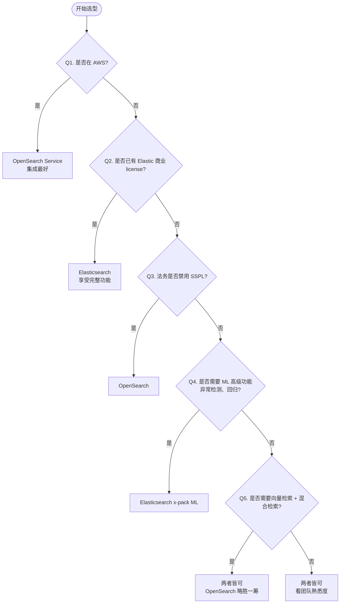

> 本文从底层 Lucene 原理、ES 架构、OpenSearch 差异点、向量检索、实战案例、踩坑与面试高频问题六个维度系统梳理检索引擎。

---

## 1. 为什么必学 — 后端检索几乎是面试必问

现代后端架构里,"搜索"已经不是一个可选模块,而是**核心能力**:
- **电商**:商品搜索、订单查询、推荐召回
- **日志**:ELK/ECK 体系,千亿级日志检索
- **向量**:RAG、语义搜索、图搜图

面试中"如何做搜索"几乎必问。下文两个真实事故说明,**不学底层原理一定会踩坑**。

### 事故一:未调 Analyzer,中文分词灾难

某跨境电商索引 1000 万商品,默认 `standard analyzer` 把"苹果手机壳"切成 `苹 / 果 / 手 / 机 / 壳` 5 个字,导致用户搜 "iPhone" 找不到任何商品(因为文档里没有 iPhone 整词),搜"苹果"返回 50 万条噪音,转化率掉到 0.3%。

**修复方案**:替换 IK 分词器 + 自定义同义词词典 + 中文拼音混排,3 天后转化恢复。

### 事故二:ES 索引设 600 分片,集群崩盘

某创业公司为了"高并发写入"给单索引设 600 个 primary shard。3 个月后单分片仅 5GB,集群却因为:
- 每个 shard 一个 Lucene Indexer 线程
- 每个 shard 一次 segment merge
- Cluster State 大小爆 200MB,master 节点 OOM

直接导致写入拒绝、查询 30s 超时。

**修复方案**:Reindex → 合并为 30 个 shard(单分片 30GB,符合 10-50GB 推荐区间),集群恢复。

---

## 2. ES vs OpenSearch 选型对比表

| 维度 | Elasticsearch | OpenSearch |
|---|---|---|
| 起源 | 2010 Shay Banon,基于 Lucene,Elastic 公司 | 2021 AWS 主导,从 ES 7.10.2 fork |
| 协议 | Apache 2.0(7.x 前)/ SSPL + Elastic License(7.11+) | Apache 2.0(全程) |
| 当前版本 | 8.x / 9.x | 2.x / 3.x |
| 插件生态 | 商业 x-pack 大量高级特性 | 开源 OpenSearch Dashboards + Security Plugin |
| 安全 | x-pack 安全(默认开启需 license) | Security Plugin(免费 Apache 2.0) |
| 机器学习 | x-pack ML(异常检测/分类/回归) | ML Commons(开源但功能弱) |
| SDK | 官方 Java/JS/Python/Go/Rust | 官方 Java/JS/Python/Go(基本兼容 ES) |
| 许可证 | SSPL(服务端源代码必须公开) | Apache 2.0(可商用闭源) |
| 社区 | Elastic Forum + Discuss | GitHub + Forum,增速快 |
| 生态 | Elastic 完整生态(ELK/ECE/Cloud) | AWS 深度集成 + OpenSearch Project |
| 多租户 | 角色 + 字段级安全 + Document/Cross-Cluster | 同等 RBAC + tenant(OpenSearch Dashboard) |
| 云 | Elastic Cloud / AWS / GCP / 阿里云 | AWS OpenSearch Service(主推) / 自建 |

**一句话总结**:Elasticsearch 商业功能丰富、OpenSearch 完全开源可商用。

---

## 3. Lucene 底层(必要理论)

### 3.1 倒排索引 Inverted Index

Lucene 的核心数据结构是**倒排索引**,与正排索引相反:

```
正排: doc1 → [token1, token2, token3]
倒排: token1 → [doc1, doc3, doc7, doc9]
```

倒排索引由四部分组成:

```
+-------------------+-------------------+
| Term Dictionary   | Posting List      |
| (FST 紧凑存储)    | (docId + 位置)    |
+-------------------+-------------------+
| Term1 → PostList  | [1, 5, 8, 12]    |
| Term2 → PostList  | [2, 5, 9]         |
| ...               | ...               |
+-------------------+-------------------+
       |
       v
   +--------+
   |  Tip   | (skip list 跳表,加速跳过)
   +--------+
```

**核心组件**:
- **Term Dictionary**:词典,用 FST(Finite State Transducer,有限状态转换机)紧凑存储,前缀共享,O(len) 查询
- **Posting List**:词到文档 ID 的倒排表,用 Roaring Bitmap 压缩
- **FST**:字节级紧凑结构,内存占用比 HashMap 小 10-20 倍
- **Tip**:跳表(Skip List),查询时跳过不相关 posting

### 3.2 文档结构:四类字段存储

Lucene 一个 Document 含四类字段存储,职责分明:

| 类型 | 作用 | 何时启用 | 检索性能 |
|---|---|---|---|
| **Stored Fields** | 存储原始 _source | 默认 | 慢(随机读) |
| **Doc Values** | 列存,聚合/排序 | 默认(text 除外) | 极快 |
| **Source** | JSON 原样 | 默认 | 反序列化开销 |
| **Fielddata** | text 字段聚合(堆内存) | 显式开启 | **高危,易爆** |

```json
PUT /products
{
  "mappings": {
    "properties": {
      "title": {
        "type": "text",
        "fielddata": false,
        "fields": {
          "keyword": { "type": "keyword" }
        }
      },
      "price": { "type": "double", "doc_values": true },
      "tags": { "type": "keyword" },
      "meta": { "type": "object", "enabled": false }
    }
  }
}
```

### 3.3 分词与 Analyzer(分词器)详解

Analyzer = Tokenizer + TokenFilter(s):

| 分词器 | 语言 | 特点 | 场景 |
|---|---|---|---|
| **standard** | 多语言 | Unicode 切分 + 小写 | 默认,英文 OK,中文切字 |
| **ik_max_word** | 中文 | 细粒度切分 | 索引侧 |
| **ik_smart** | 中文 | 粗粒度切分 | 搜索侧 |
| **jieba** | 中文 | Python 生态,有 jieba 分词 ES 插件 | 自定义词库 |
| **icu_analyzer** | 多语言 | Unicode 标准化 | 跨语言搜索 |
| **english/englishAnalyzer** | 英文 | 词干提取(stemmer) | 英文文本 |
| **pattern** | 自定义 | 正则切分 | 日志/特殊格式 |

```bash
# IK 插件安装
./bin/elasticsearch-plugin install https://github.com/medcl/elasticsearch-analysis-ik/releases/download/v8.11.0/elasticsearch-analysis-ik-8.11.0.zip

# 自定义词典
# config/analysis-ik/extra_stopword.dic
```
重启后即可在 mapping 指定 `"analyzer": "ik_max_word"`。

### 3.4 Segment 不可变性与 Merge 策略

Lucene 的核心设计哲学:**Segment 不可变**(Immutable)。

```
文档写入流程:
doc → in-memory buffer → refresh → new segment (FS cache)
                                  ↓
                              flush → commit (disk)
                                  ↓
                          segment merge (后台)
```

**为什么不可变**?
- 并发安全:无需锁
- 缓存友好:segment FST 进 OS Page Cache 后永不变
- 故障恢复:不需要 WAL

**Merge 策略**:

| 策略 | 算法 | 默认 |
|---|---|---|
| **TieredMergePolicy** | 分层,平衡 size 与 segment 数 | ES 默认 |
| **LogByteSizeMergePolicy** | 按字节大小 log 合并 | 老版本默认 |
| **LogDocMergePolicy** | 按文档数 | 不推荐 |

```yaml
# 调整 merge 参数(elasticsearch.yml)
index.merge.policy.max_merged_segment: 5gb
index.merge.policy.segments_per_tier: 10
index.merge.scheduler.max_thread_count: 1
```

---

## 4. ES 架构深度

### 4.1 集群拓扑:节点角色与生产清单

ES 集群有 5 种节点角色:

```
+------------------+-------------------+-------------------+
| Master 节点      | Data 节点         | Coordinating 节点 |
| 集群状态管理     | 存数据/索引/查询  | 路由+合并结果     |
| 3 个起步(奇数)  | 真正存分片        | 所有节点默认      |
+------------------+-------------------+-------------------+
| Ingest 节点      | ML 节点           | (其他子角色)      |
| 数据预处理管道   | x-pack ML        |                   |
| 可独立部署       | 需 license        |                   |
+------------------+-------------------+-------------------+
```

**节点数量公式**:
- Master 节点:`max(3, ceil(集群规模 / 10))`,**奇数**
- Data 节点:`CPU 密集型/IO 密集型`,JVM ≤ 32GB(Heap),剩余给 OS Cache
- Coordinating 节点:轻量,适合前置 LB

**生产配置清单**(elasticsearch.yml):

```yaml
cluster.name: prod-search-cluster
node.name: ${HOSTNAME}
node.roles: [master, data, ingest]

# 网络
network.host: 0.0.0.0
discovery.seed_hosts: ["es-master-1", "es-master-2", "es-master-3"]
cluster.initial_master_nodes: ["es-master-1", "es-master-2", "es-master-3"]

# 内存(JVM Heap)
-Xms31g
-Xmx31g
# 超过 32GB 压缩指针失效,JVM 性能下降

# 磁盘
path.data: /data1,/data2,/data3  # 多盘
path.repo: /backup

# 锁内存(防 swap)
bootstrap.memory_lock: true

# 限流
thread_pool.write.queue_size: 1000
indices.breaker.request.limit: 60%
indices.breaker.fielddata.limit: 40%
```

### 4.2 索引 Shard 设计

**两个核心公式**:

```
单分片容量推荐 = 10GB - 50GB
shard 数 = ceil(总数据量 / 30GB)
```

**查询耗时模型**:
```
单次查询耗时 ≈ max(shard_latency) + merge_overhead + network
```
**shard 越多 ≠ 越快**,因为:
- 每个 shard 都要查询
- 结果需聚合到 coordinating node
- 集群状态膨胀

**计算示例**:

```
场景:500GB 商品数据,QPS 1000,写入 5000/s
单分片 30GB → primary shard = 500 / 30 ≈ 17 → 取 20
replica 1 → 总 shard = 40
data 节点 5 个 → 每节点 8 个 shard(均匀)
```

```json
PUT /products
{
  "settings": {
    "number_of_shards": 20,
    "number_of_replicas": 1,
    "refresh_interval": "1s",
    "index.codec": "best_compression"
  }
}
```

### 4.3 Mapping:字段类型实战

ES 有 20+ 字段类型,常用如下:

| 类型 | 用途 |
|---|---|
| text + keyword | 全文检索 + 精确过滤 |
| integer/long/short/byte | 整数 |
| float/double | 浮点 |
| date / date_nanos | 时间 |
| boolean | 布尔 |
| ip | IP |
| geo_point / geo_shape | 地理 |
| nested | 嵌套对象(独立索引) |
| join | 父子文档 |
| object | 普通 JSON 对象 |
| dense_vector / sparse_vector | 向量 |
| histogram | 预聚合 |
| flattened | 扁平 key-value |
| wildcard | 通配符优化 |
| completion | 搜索建议 |
| search_as_you_type | 边输边搜 |

**Dynamic vs Explicit Mapping**:

```json
// Dynamic Mapping(默认开启)
PUT /logs/_doc/1
{ "level": "ERROR" }
// ES 自动推断 level: text

// 关闭 Dynamic Mapping
PUT /logs
{
  "mappings": {
    "dynamic": "strict",
    "properties": {
      "level": { "type": "keyword" }
    }
  }
}
// 写入未声明字段 → 报错,数据干净

// Index Template(索引模板)
PUT _index_template/logs-template
{
  "index_patterns": ["logs-*"],
  "priority": 100,
  "template": {
    "settings": {
      "number_of_shards": 3,
      "refresh_interval": "5s"
    },
    "mappings": {
      "properties": {
        "@timestamp": { "type": "date" },
        "level": { "type": "keyword" },
        "message": { "type": "text", "analyzer": "ik_max_word" }
      }
    }
  }
}
```

### 4.4 查询 DSL 实战

ES DSL(Domain Specific Language)基于 JSON,核心子句:

```json
// 1. match:分词后 OR/AND
GET /products/_search
{
  "query": {
    "match": {
      "title": {
        "query": "苹果手机壳",
        "operator": "AND",
        "minimum_should_match": "75%"
      }
    }
  }
}

// 2. multi_match:多字段
GET /products/_search
{
  "query": {
    "multi_match": {
      "query": "iPhone",
      "fields": ["title^3", "description", "tags^2"],
      "type": "best_fields"
    }
  }
}

// 3. bool:组合 must/should/filter/must_not
GET /products/_search
{
  "query": {
    "bool": {
      "must": [
        { "match": { "title": "苹果" } }
      ],
      "filter": [
        { "term": { "status": "ON_SALE" } },
        { "range": { "price": { "gte": 100, "lte": 5000 } } }
      ],
      "must_not": [
        { "term": { "deleted": true } }
      ],
      "should": [
        { "term": { "is_promoted": true } }
      ],
      "minimum_should_match": 1
    }
  }
}

// 4. term:精确(不走分词)
{ "term": { "sku.keyword": "SKU-001" } }

// 5. nested:嵌套对象
GET /products/_search
{
  "query": {
    "nested": {
      "path": "variants",
      "query": {
        "bool": {
          "must": [
            { "term": { "variants.color": "红色" } },
            { "range": { "variants.stock": { "gt": 0 } } }
          ]
        }
      }
    }
  }
}

// 6. has_child / has_parent:父子文档
GET /orders/_search
{
  "query": {
    "has_child": {
      "type": "order_item",
      "query": { "term": { "product_id": "P001" } }
    }
  }
}
```

### 4.5 聚合(Aggregations)实战

Aggs 三大类:
- **Metric Aggs**:avg / sum / max / min / cardinality / percentiles
- **Bucket Aggs**:terms / date_histogram / range / histogram / nested
- **Pipeline Aggs**:bucket_script / derivative / moving_avg / cumulative_sum

```json
// 实战:日报表
GET /orders/_search
{
  "size": 0,
  "query": {
    "range": { "@timestamp": { "gte": "now-7d/d", "lte": "now/d" } }
  },
  "aggs": {
    "by_day": {
      "date_histogram": {
        "field": "@timestamp",
        "calendar_interval": "day"
      },
      "aggs": {
        "gmv": { "sum": { "field": "amount" } },
        "unique_buyers": { "cardinality": { "field": "user_id" } },
        "avg_order": { "avg": { "field": "amount" } },
        "top_products": {
          "terms": { "field": "product_id", "size": 10 },
          "aggs": {
            "product_gmv": { "sum": { "field": "amount" } }
          }
        },
        "cumulative_gmv": {
          "cumulative_sum": { "buckets_path": "gmv" }
        }
      }
    }
  }
}
```

### 4.6 评分:BM25 + 自定义评分

ES 默认使用 **BM25**(Best Matching 25)算法,比 TF-IDF 更优:

```
BM25(q, d) = Σ IDF(qi) · (f(qi, d) · (k1 + 1)) / (f(qi, d) + k1 · (1 - b + b · |d|/avgdl))
```

参数:
- `k1`:词频饱和度(默认 1.2)
- `b`:文档长度归一化(默认 0.75)
- `IDF(qi)`:逆文档频率

**自定义评分**:

```json
// 1. boost
{ "match": { "title": { "query": "iPhone", "boost": 3 } } }

// 2. function_score:函数加权
GET /products/_search
{
  "query": {
    "function_score": {
      "query": { "match": { "title": "iPhone" } },
      "functions": [
        {
          "field_value_factor": {
            "field": "sales",
            "factor": 1.2,
            "modifier": "log1p",
            "missing": 1
          }
        },
        {
          "gauss": {
            "created_at": {
              "origin": "now",
              "scale": "30d",
              "decay": 0.5
            }
          }
        }
      ],
      "score_mode": "sum",
      "boost_mode": "multiply"
    }
  }
}

// 3. script_score:Painless 脚本
{
  "script_score": {
    "query": { "match_all": {} },
    "script": {
      "source": "Math.log1p(doc['sales'].value) + (doc['price'].value < 1000 ? 1.0 : 0.0)"
    }
  }
}
```

---

## 5. ES 高级特性

### 5.1 跨集群(CCS)与跨集群复制(CCR)

```
Cluster A (Local)              Cluster B (Remote)
+-----------+                  +-----------+
| products  |  ←————CCR————→   | products  |
| (master)  |                  | (replica) |
+-----------+                  +-----------+
       |
       +————CCS (search only)————→ Cluster C (logs)
```

```yaml
# 配置远程集群(elasticsearch.yml)
cluster.remote.ccr-cluster.seeds: 10.0.1.1:9300
```

```bash
# CCS:跨集群查询
GET /ccr-cluster:products/_search
{ "query": { "match_all": {} } }

# CCR:跨集群复制(灾备)
PUT /products/_ccr/follower
{
  "remote_cluster": "ccr-cluster",
  "leader_index": "products"
}
```

**主备方案**:
- **CCR**:全量同步,适合灾备
- **CCS**:查询联合,适合日志聚合
- **Snapshot**:定期快照,成本最低

### 5.2 PIT(Point-In-Time)查询分页

`from + size` 深分页代价高(每个 shard 都查 from+size)。PIT 解决:

```bash
# 1. 打开 PIT
POST /products/_pit?keep_alive=2m
{ "id": "" }
# 返回 id

# 2. 用 PIT + search_after 分页
POST /_search
{
  "pit": {
    "id": "PIT_ID",
    "keep_alive": "2m"
  },
  "size": 1000,
  "sort": [
    { "_shard_doc": "asc" }
  ],
  "search_after": [1024]
}
```

**优势**:
- 一致性快照(避免翻页时文档更新造成重复/丢失)
- 支持深分页(无 from 上限)

### 5.3 Runtime Field 与向量字段

**Runtime Field**:查询时计算,免存储:

```json
PUT /products/_mapping
{
  "runtime": {
    "full_name": {
      "type": "keyword",
      "script": {
        "source": "emit(doc['first_name'].value + ' ' + doc['last_name'].value)"
      }
    }
  }
}
```

**Object Flattening**:大量未知子字段场景:

```json
PUT /logs
{
  "mappings": {
    "properties": {
      "metadata": { "type": "flattened" }
    }
  }
}
// 写入:metadata = {"k1": "v1", "k2": "v2"},字段数固定 1
```

**Dense Vector / Sparse Vector**:

```json
PUT /images
{
  "mappings": {
    "properties": {
      "image_vec": {
        "type": "dense_vector",
        "dims": 512,
        "index": true,
        "similarity": "cosine"
      },
      "tags_vec": {
        "type": "sparse_vector"
      }
    }
  }
}
```

### 5.4 ILM(Index Lifecycle Management)生命周期

三温度分层 + Delete:

```
Hot (SSD, 高资源)  →  Warm (HDD, 降副本)  →  Cold (低资源/可搜索快照)  →  Delete
   写入                 只读                  几乎不访问                   自动删除
```

```json
PUT _ilm/policy/hot-warm-cold-policy
{
  "policy": {
    "phases": {
      "hot": {
        "min_age": "0ms",
        "actions": {
          "rollover": {
            "max_size": "50gb",
            "max_age": "30d",
            "max_docs": 200000000
          },
          "set_priority": { "priority": 100 }
        }
      },
      "warm": {
        "min_age": "30d",
        "actions": {
          "forcemerge": { "max_num_segments": 1 },
          "shrink": { "number_of_shards": 1 },
          "set_priority": { "priority": 50 }
        }
      },
      "cold": {
        "min_age": "90d",
        "actions": {
          "searchable_snapshot": {
            "snapshot_repository": "s3-repo",
            "force_merge_index": true
          },
          "set_priority": { "priority": 0 }
        }
      },
      "delete": {
        "min_age": "365d",
        "actions": {
          "delete": {}
        }
      }
    }
  }
}

PUT _index_template/logs-template
{
  "index_patterns": ["logs-*"],
  "template": {
    "settings": {
      "index.lifecycle.name": "hot-warm-cold-policy",
      "index.lifecycle.rollover_alias": "logs-write"
    }
  }
}
```

### 5.5 Snapshot + S3/OSS 备份恢复

```yaml
# elasticsearch.yml
path.repo: ["s3", "hdfs", "fs"]
```

```bash
# 1. 注册 S3 仓库
PUT /_snapshot/s3-repo
{
  "type": "s3",
  "settings": {
    "bucket": "es-snapshots",
    "endpoint": "s3.amazonaws.com",
    "access_key": "AKIA...",
    "secret_key": "..."
  }
}

# 2. 创建快照
PUT /_snapshot/s3-repo/snapshot-2026-07-07
{
  "indices": "logs-*,-logs-debug-*",
  "include_global_state": false
}

# 3. 恢复
POST /_snapshot/s3-repo/snapshot-2026-07-07/_restore
{
  "indices": "logs-2026.07.*",
  "rename_pattern": "logs-(.+)",
  "rename_replacement": "restored-logs-$1"
}

# 4. searchable snapshot:快照直接挂载为只读索引
PUT /restored-logs-001
{
  "settings": {
    "index.store.type": "snapshot",
    "index.store.snapshot.repository": "s3-repo",
    "index.store.snapshot.snapshot": "snapshot-2026-07-07"
  }
}
```

---

## 6. OpenSearch 差异点

### 6.1 路线选择与生态动向

OpenSearch 由 AWS 主导 fork,**优势**:
- Apache 2.0 全程,无许可争议
- AWS 深度集成(OpenSearch Service、OpenSearch Serverless)
- 社区增长快(OpenSearch Project,Linux Foundation 托管)

**生态动向**:
- OpenSearch 3.x 支持 AI 检索插件(neural-search)
- OpenSearch Dashboards 替代 Kibana
- 社区 OKG(OpenSearch Kubernetes Operator)

**自建选型建议**:
```
如在 AWS: OpenSearch Service → 省心
如在自建 IDC: 视法务/预算决定,需 license 选 ES,纯开源选 OpenSearch
如涉及 GPL/SSPL 风险 → 直接 OpenSearch
```

### 6.2 安全与访问控制差异

| 维度 | Elasticsearch | OpenSearch |
|---|---|---|
| 安全插件 | x-pack(部分付费) | Security Plugin(全免费) |
| RBAC | 支持 | 支持 |
| 字段级安全 | 支持 | 支持 |
| Document Level Security | 支持 | 支持 |
| 跨集群访问 | 支持 | 支持 |
| Audit Log | 商业版 | 社区版 |

```yaml
# OpenSearch Security 配置
opensearch_security:
  auth_backend:
    type: internal
  roles_mapping:
    admin: ["admin"]
    user: ["user"]
  tenants:
    enable: true
    private: true
```

### 6.3 性能调优参数差异

| 参数 | ES | OpenSearch |
|---|---|---|
| `indices.query.bool.max_clause_count` | 默认 1024 | 默认 1024 |
| `search.default_search_timeout` | -1 | 默认 10s |
| `cluster.routing.allocation.balance.shard` | 默认 0.45 | 默认 0.45 |
| Remote store | 7.13+ | OpenSearch 2.x 原生支持 |

```yaml
# OpenSearch 远程存储(降低本地存储)
node.attr.remote_store.segment.repository: s3-repo
node.attr.remote_store.translog.repository: s3-repo
```

---

## 7. Vector Search(2025 必问)

### 7.1 Knn 查询支持 + 库选型

ES 8.0+ 原生支持 KNN(K-Nearest Neighbor),OpenSearch 2.x 同样支持。

**两种底层索引**:

| 算法 | 特点 | 适用规模 | 速度 | 精度 |
|---|---|---|---|---|
| **HNSW**(Hierarchical Navigable Small World) | 图结构,多层小世界 | 1M - 100M | 极快 | 高 |
| **IVF**(Inverted File) | 聚类分桶,桶内精确 | 100M+ | 中 | 中 |

```json
// ES 8.x KNN 查询
PUT /images
{
  "mappings": {
    "properties": {
      "image_vec": {
        "type": "dense_vector",
        "dims": 512,
        "index": {
          "type": "hnsw",
          "m": 16,
          "ef_construction": 100
        },
        "similarity": "cosine"
      }
    }
  }
}

POST /images/_search
{
  "knn": {
    "field": "image_vec",
    "query_vector": [0.1, 0.2, ...],
    "k": 10,
    "num_candidates": 100,
    "filter": { "term": { "category": "插画" } }
  },
  "size": 10
}
```

### 7.2 Hybrid Search(BM25 + Vector)RRF 公式

混合检索 = 关键词召回(BM25) + 向量召回(KNN),用 **RRF**(Reciprocal Rank Fusion)融合:

```
RRF_score(d) = Σ 1 / (k + rank_i(d))
其中 k = 60 (常数),rank_i 是第 i 路召回中 doc 的排名
```

```json
// ES 8.8+ RRF
GET /products/_search
{
  "retriever": {
    "rrf": {
      "retrievers": [
        {
          "standard": {
            "query": { "match": { "title": "iPhone" } }
          }
        },
        {
          "knn": {
            "field": "title_vec",
            "query_vector": [0.1, 0.2, ...],
            "k": 20,
            "num_candidates": 100
          }
        }
      ],
      "rank_window_size": 100,
      "rank_constant": 60
    }
  }
}
```

---

## 8. 实战案例 3 个

### 案例 1:电商商品/订单搜索架构

**场景**:500 万 SKU,QPS 2000,需要支持标题搜索、类目筛选、价格区间、库存过滤、智能提示。

```yaml
索引设计:
products_v1(商品,主搜索)+ orders_v1(订单,商家后台)+ inventory_v1(库存,实时)
```

```json
// 商品 mapping
PUT /products_v1
{
  "settings": {
    "number_of_shards": 10,
    "number_of_replicas": 1,
    "analysis": {
      "analyzer": {
        "ik_smart_synonym": {
          "type": "custom",
          "tokenizer": "ik_smart",
          "filter": ["lowercase", "my_synonym"]
        }
      },
      "filter": {
        "my_synonym": {
          "type": "synonym_graph",
          "synonyms_path": "analysis/synonym.dic"
        }
      }
    }
  },
  "mappings": {
    "properties": {
      "title": {
        "type": "text",
        "analyzer": "ik_max_word",
        "search_analyzer": "ik_smart_synonym",
        "fields": { "keyword": { "type": "keyword" } }
      },
      "category": { "type": "keyword" },
      "price": { "type": "double" },
      "stock": { "type": "integer" },
      "tags": { "type": "keyword" },
      "created_at": { "type": "date" }
    }
  }
}
```

```json
// 搜索建议(Suggester)
POST /products_v1/_search
{
  "suggest": {
    "title-suggest": {
      "prefix": "ipho",
      "completion": {
        "field": "title.completion",
        "size": 10,
        "skip_duplicates": true
      }
    }
  }
}
```

```bash
# 同义词词典 analysis/synonym.dic
iPhone, 苹果手机, iphone
Nike, 耐克
```

**架构图**:
```
+--------------+    +----------------+    +-------------+
| MySQL Binlog | →  |  Canal/Alibaba  | →  |  ES Bulk    |
+--------------+    +----------------+    +-------------+
                                                ↓
+--------------+                          +-------------+
| 用户搜索请求 | ←————————— Nginx —————→ | ES Cluster  |
+--------------+                          +-------------+
                                                ↓
                                          +----------+
                                          | Suggester |
                                          +----------+
```

### 案例 2:日志检索(Filebeat + ES + Kibana + ILM)

```yaml
# filebeat.yml
filebeat.inputs:
- type: log
  paths: [/var/log/app/*.log]
  json.keys_under_root: true
  json.add_error_key: true

output.elasticsearch:
  hosts: ["es-1:9200", "es-2:9200"]
  index: "logs-app-%{+yyyy.MM.dd}"
  pipeline: "app-log-pipeline"

setup.template.name: "logs-app"
setup.template.pattern: "logs-app-*"
setup.ilm.enabled: true
setup.ilm.policy_name: "logs-policy"
setup.ilm.rollover_alias: "logs-app-write"
```

```bash
# 启动
./filebeat setup --pipelines
./filebeat -e
```

```json
// Ingest Pipeline(数据预处理)
PUT _ingest/pipeline/app-log-pipeline
{
  "description": "app log preprocessing",
  "processors": [
    { "rename": { "field": "msg", "target_field": "message" } },
    { "set": { "field": "@timestamp", "value": "{{time}}" } },
    { "geoip": { "field": "client_ip", "target_field": "geo" } },
    { "remove": { "field": "raw" } }
  ]
}
```

Kibana 操作:`Stack Management → Index Patterns → logs-* → @timestamp`

### 案例 3:向量检索替代传统搜索(墨象物 / 插画)

**场景**:用户上传一张插画,系统返回相似风格插画。

```python
# Python:向量生成与入库
from elasticsearch import Elasticsearch
from sentence_transformers import SentenceTransformer
import base64

es = Elasticsearch(["http://es-1:9200"])
model = SentenceTransformer('clip-ViT-B-32')  # 多模态模型

# 1. 索引插画
illustrations = [
    {"id": 1, "title": "星空", "image": "..."},
    {"id": 2, "title": "城市夜景", "image": "..."},
]

for item in illustrations:
    # 图片转 embedding
    vec = model.encode(item["image"]).tolist()
    es.index(index="illustrations", id=item["id"], document={
        "title": item["title"],
        "image_vec": vec,
        "tags": ["插画", "夜景"]
    })

# 2. 用户查询(上传图片)
user_image = "user_upload.jpg"
query_vec = model.encode(user_image).tolist()

# 3. KNN 检索
resp = es.search(index="illustrations", knn={
    "field": "image_vec",
    "query_vector": query_vec,
    "k": 10,
    "num_candidates": 100
}, size=10)

for hit in resp["hits"]["hits"]:
    print(hit["_source"]["title"], hit["_score"])
```

---

## 9. 选型决策树 — 5 个问题



**实战推荐**:
- **国内合规严、AWS 依赖高** → OpenSearch
- **已有 Elastic Stack 生态** → Elasticsearch
- **自建 + 完全开源** → OpenSearch

---

## 10. 踩坑 8 个(实战总结)

### 坑 1:深分页(from + size)

`from + size` 每个 shard 都要查 `from+size` 条再聚合。`from=10000, size=10` 时,单 shard 拉 10010 条,合并后丢弃 10000 条,集群抖动。

**修复**:
- 用 `search_after`(基于排序值游标)
- 用 PIT + `search_after`(一致性快照)
- 限制 `index.max_result_window`(默认 10000)

### 坑 2:Fielddata 内存爆

对 text 字段做聚合,ES 默认会全量加载 Fielddata 到堆内存。10 亿文档 × 1KB/field = 1TB,直接 OOM。

**修复**:
- 聚合/排序用 `text.keyword`(doc_values,堆外)
- 设置 `indices.breaker.fielddata.limit: 40%`(超限熔断)

### 坑 3:Dynamic Mapping 静默创建不安全字段

默认 `dynamic: true`,写入时 ES 自动推断类型,容易:
- 把 "2026-07-07" 推断为 date,但下条 "abc" 报错
- 把数字 1234567890123 推断为 long,但下条是 string 报错
- 大量小字段 → mapping 爆炸

**修复**:
- 生产设为 `dynamic: strict` 或 `dynamic: false`(后者保留字段不入索引)
- 用 Index Template 统一约束

### 坑 4:refresh_interval 选错

默认 1s,频繁 refresh 拖慢写入(每次 refresh 开新 segment)。日志场景可设 5s-30s。

**修复**:
- 日志/批量:`30s`
- 商品/订单:`1s`(准实时)
- 监控数据:`1s`

### 坑 5:分片均衡治法选择

**错误做法**:给所有索引统一 5 个 shard。

**正确思路**:
- 按数据量预分配(单 shard 10-50GB)
- 用 ILM + Rollover 自动管理
- Shrink API 收缩只读索引

### 坑 6:嵌套查询性能

`nested` 字段独立索引,每次 `nested` 查询都跨索引 join。深层嵌套查询 QPS 下降 10x。

**修复**:
- 嵌套层级 ≤ 2
- 优先 `object`(平铺)
- `include_in_root: true`(部分场景)

### 坑 7:Mapping 不可变变动不动

**Mapping 字段类型一旦确定不可改**,只能:
- Reindex 到新索引 + Alias 切换
- 多字段类型(`text` + `keyword` 解决多数场景)

**修复**:
- 写前预留(`keyword` + `text` 双写)
- 用 Runtime Field(查询时计算)

### 坑 8:跨集群冲突

CCR 复制 + 本地写入冲突时,本地写入会被拒绝。

**修复**:
- CCR 方向明确(read-only follower)
- 监控 `follow_index.status` 状态
- 用 Alias 路由读/写

---

## 11. 面试高频 8 问

### Q1.ES 的写流程?写一致性与 quorum

写流程:Coordinator → 主分片(写 Lucene Index Buffer + Translog)→ 同步副本 → Refresh → Flush。
`wait_for_active_shards`:默认 1,生产建议 quorum(主+多数副本)。

### Q2.ES 的读流程?相关性打分?

读流程:Coordinate → 广播到相关分片 → 每个分片本地查询(BM25 打分)→ 合并排序 → 返回。
BM25 公式:考虑 TF-IDF + 文档长度归一化。

### Q3.倒排索引是什么?为什么快?

倒排索引是 term → doc_id[] 的映射。比正排扫描快的原因:
- 词典 FST 紧凑,内存常驻
- Posting List Roaring Bitmap 压缩
- 跳表(Skip List)加速跳过

### Q4.如何设计 Shard 数?

公式:`shards = ceil(总数据量 / 30GB)`。考虑:
- 查询延迟:每查询 = max(shard_latency) + 网络
- 写入吞吐:bulk 越大越好,但 shard 太多反而慢
- 未来增长:预留 2-3 倍

### Q5.BM25 与 TF-IDF 的区别?

BM25 改进了 TF 饱和度与文档长度归一化,避免长文档占优。公式见 4.6 节。

### Q6.深分页为什么慢?怎么优化?

`from + size` 每个 shard 都查 `from+size` 条。优化:search_after、PIT、scroll(已废弃)、限制 max_result_window。

### Q7.ES 与 OpenSearch 怎么选?

见第 9 节决策树。核心:AWS 选 OpenSearch、商业功能选 ES、合规选 OpenSearch。

### Q8.如何保证 ES 数据不丢?

- Translog:实时写盘(同步)
- 副本:replica ≥ 1
- quorum 写
- Snapshot + S3 备份
- ILM 防止数据爆炸

---

## 12. 一句话选型口诀

> **AWS 强依赖选 OpenSearch,商业功能选 Elastic,法务严苛必 OpenSearch,自建优先看团队熟悉度。**

---

## 附录:调研依据(References)

1. [Elasticsearch 官方文档 - Query DSL](https://www.elastic.co/guide/en/elasticsearch/reference/current/query-dsl.html)
2. [Elasticsearch 官方文档 - ILM](https://www.elastic.co/guide/en/elasticsearch/reference/current/index-lifecycle-management.html)
3. [Elasticsearch 官方文档 - Mapping](https://www.elastic.co/guide/en/elasticsearch/reference/current/mapping.html)
4. [Elasticsearch 官方文档 - Aggregations](https://www.elastic.co/guide/en/elasticsearch/reference/current/search-aggregations.html)
5. [Lucene 核心源代码 - IndexWriter](https://github.com/apache/lucene/blob/main/lucene/core/src/java/org/apache/lucene/index/IndexWriter.java)
6. [Lucene 核心源代码 - SegmentMerge](https://github.com/apache/lucene/blob/main/lucene/core/src/java/org/apache/lucene/index/MergeScheduler.java)
7. [OpenSearch GitHub - RFC 1: Fork Process](https://github.com/opensearch-project/OpenSearch/issues/1)
8. [OpenSearch GitHub - Security Plugin](https://github.com/opensearch-project/security)
9. [Elastic 论坛 - shard sizing](https://discuss.elastic.co/t/how-many-shards/107570)
10. [Elastic 论坛 - refresh_interval tuning](https://discuss.elastic.co/t/refresh-interval-best-practices)
11. [OpenSearch 文档 - Performance Tuning](https://opensearch.org/docs/latest/tuning-your-cluster/)
12. [Elastic 官方博客 - BM25 vs TF-IDF](https://www.elastic.co/blog/practical-bm25-part-1)
13. [Elastic 官方博客 - HNSW 集成](https://www.elastic.co/blog/knn-search-elasticsearch-apache-lucene)
14. [AWS OpenSearch Service 白皮书](https://docs.aws.amazon.com/opensearch-service/)
15. [APM 报告 - 字节跳动 ES 集群调优实践](https://www.infoq.cn/article/elasticsearch-tuning-byte-dance)

---

---

## 附录 A:扩展参考 — ES / OpenSearch 高级查询与运维

### A.1 Query String 与 Simple Query String

```json
// query_string:支持完整 Lucene 语法,严格(报错)
GET /products/_search
{
  "query": {
    "query_string": {
      "query": "(iPhone OR 苹果) AND -壳",
      "default_field": "title",
      "default_operator": "AND"
    }
  }
}

// simple_query_string:简化版,容错(不报错)
GET /products/_search
{
  "query": {
    "simple_query_string": {
      "query": "iPhone|苹果 -壳",
      "fields": ["title^2", "description"],
      "flags": "OR|AND|NOT|PHRASE|PRECEDENCE"
    }
  }
}
```

### A.2 高亮(Highlighting)

```json
GET /products/_search
{
  "query": { "match": { "title": "苹果手机" } },
  "highlight": {
    "pre_tags": ["<em>"],
    "post_tags": ["</em>"],
    "fields": {
      "title": {
        "fragment_size": 150,
        "number_of_fragments": 3,
        "type": "unified"
      }
    }
  }
}
```

### A.3 Scroll(旧版深分页,7.10 已弃用)

```bash
# 旧 API,建议替换为 PIT + search_after
POST /products/_search?scroll=1m
{ "size": 1000, "query": { "match_all": {} } }

POST /_search/scroll
{ "scroll": "1m", "scroll_id": "..." }
```

### A.4 Bulk API 批量写入

```bash
POST /_bulk
{ "index": { "_index": "products", "_id": "1" } }
{ "title": "iPhone 15", "price": 5999 }
{ "index": { "_index": "products", "_id": "2" } }
{ "title": "MacBook Pro", "price": 14999 }
{ "index": { "_index": "products", "_id": "3" } }
{ "title": "AirPods", "price": 1299 }
```

```python
# Python 客户端批量
from elasticsearch import helpers

def gen_actions():
    for doc in docs:
        yield {
            "_index": "products",
            "_source": doc
        }

helpers.bulk(es, gen_actions(), chunk_size=500, max_chunk_bytes=104857600)
```

### A.5 Reindex API(重建索引)

```bash
POST /_reindex
{
  "source": { "index": "products_v1" },
  "dest": { "index": "products_v2" },
  "script": {
    "source": "ctx._source.migrated_at = params.now",
    "params": { "now": "2026-07-07" }
  }
}
```

### A.6 _cat API 监控

```bash
GET /_cat/nodes?v&h=ip,name,heap.percent,role,load
GET /_cat/indices?v&s=store.size:desc
GET /_cat/shards?v&h=index,shard,prirep,state,docs,store
GET /_cat/thread_pool?v
GET /_cat/pending_tasks?v
GET /_cat/health?v
```

### A.7 Painless 脚本(Painless Scripting)

```json
// 字符串处理
POST /products/_update/1
{
  "script": {
    "source": "ctx._source.title = ctx._source.title.toUpperCase()",
    "lang": "painless"
  }
}

// 聚合中使用
GET /orders/_search
{
  "size": 0,
  "aggs": {
    "high_value_count": {
      "filter": {
        "script": {
          "source": "doc['amount'].value > params.threshold",
          "params": { "threshold": 1000 }
        }
      }
    }
  }
}
```

---

## 附录 B:运维监控指标

### B.1 核心监控项

| 指标 | 阈值 | 说明 |
|---|---|---|
| Heap 使用率 | < 75% | 接近 75% 触发 GC |
| CPU 使用率 | < 80% | 持续 80%+ 扩容 |
| Disk 使用率 | < 85% | watermark 95% 触发只读 |
| Indexing Latency | < 100ms | P99 |
| Search Latency | < 200ms | P99 |
| Active Shards | < 100000 | 单集群 |
| Pending Tasks | < 10 | master 队列 |
| Unassigned Shards | 0 | 必须为 0 |

### B.2 Prometheus + Grafana 接入

```yaml
# elasticsearch-exporter 配置
elasticsearch:
  - url: http://es-1:9200
    username: monitor
    password: secret

# Prometheus 抓取
scrape_configs:
  - job_name: 'elasticsearch'
    static_configs:
      - targets: ['elasticsearch-exporter:9114']
```

```promql
# 关键告警规则
ALERT ElasticsearchHeapHigh
IF (sum(node_jvm_memory_used_bytes) / sum(node_jvm_memory_max_bytes)) > 0.85
FOR 5m
LABELS { severity="critical" }
ANNOTATIONS { summary="ES Heap > 85%" }
```

### B.3 Slow Log 慢查询日志

```yaml
# elasticsearch.yml
index.search.slowlog.threshold.query.warn: 10s
index.search.slowlog.threshold.query.info: 5s
index.search.slowlog.threshold.query.debug: 2s
index.search.slowlog.threshold.query.trace: 500ms
index.search.slowlog.threshold.fetch.warn: 1s
index.indexing.slowlog.threshold.index.warn: 10s
```

---

## 附录 C:性能优化 Checklist

### C.1 写入优化

- Bulk 批量写入(每批 5-15MB)
- `refresh_interval: 30s`(批量场景)
- 副本数临时设为 0,写完再上调
- `index.translog.durability: async`(高吞吐,风险)
- 使用 `_bulk` 而非循环 index

### C.2 查询优化

- `filter` 替代 `must`(不参与打分)
- 路由(`routing`)减少查询分片
- `preference` 优先本地节点
- `track_total_hits: false`(深分页时)
- `_source` 字段裁剪(只取必要字段)

### C.3 索引优化

- `force_merge` 减少 segment 数
- `index.codec: best_compression`(存储省 30%)
- 字段类型选最小的(byte > short > integer > long)
- `keyword` 用 `ignore_above` 截断

### C.4 JVM 优化

- Heap ≤ 32GB
- G1GC(默认)
- 关闭 Swap:`bootstrap.memory_lock: true`
- 定期 Heap Dump 分析

---

## 附录 D:搜索模板(Search Template)

将常用查询参数化:

```bash
# 注册模板
POST /_scripts/search_products
{
  "script": {
    "lang": "mustache",
    "source": {
      "query": {
        "bool": {
          "must": [{ "match": { "title": "{{q}}" } }],
          "filter": [
            { "term": { "category": "{{category}}" } },
            { "range": { "price": { "gte": "{{min_price}}", "lte": "{{max_price}}" } } }
          ]
        }
      },
      "size": "{{size}}"
    }
  }
}

# 调用
GET /products/_search/template
{
  "id": "search_products",
  "params": {
    "q": "iPhone",
    "category": "手机",
    "min_price": 1000,
    "max_price": 10000,
    "size": 20
  }
}
```

---

## 附录 E:Ranking Evaluation API(A/B 测试评分)

```bash
# 1. 创建测试集
PUT /_rank_eval/test-1
{
  "requests": [
    {
      "id": "query_iphone",
      "request": { "query": { "match": { "title": "iPhone" } } },
      "ratings": [
        { "_index": "products", "_id": "1", "rating": 3 },
        { "_index": "products", "_id": "2", "rating": 2 },
        { "_index": "products", "_id": "3", "rating": 0 }
      ]
    }
  ],
  "metric": {
    "precision": { "k": 10, "relevant_rating_threshold": 2 }
  }
}

# 2. 执行评估
GET /products/_rank_eval
{
  "requests": [
    {
      "id": "test_iphone",
      "request": { "query": { "match": { "title": "iPhone" } } },
      "ratings": [
        { "_index": "products", "_id": "1", "rating": 3 }
      ]
    }
  ],
  "metric": { "mean_reciprocal_rank": {} }
}
```

输出 `metric_score` 衡量查询质量。生产环境用于 A/B 测试、新算法上线验证。

---

## 附录 F:容器化与 Kubernetes 部署

### F.1 Docker Compose 起步

```yaml
version: '3.8'
services:
  elasticsearch:
    image: docker.elastic.co/elasticsearch/elasticsearch:8.11.0
    environment:
      - discovery.type=single-node
      - xpack.security.enabled=false
      - ES_JAVA_OPTS=-Xms2g -Xmx2g
    ports: ["9200:9200"]
    volumes:
      - es_data:/usr/share/elasticsearch/data
    ulimits:
      memlock: { soft: -1, hard: -1 }
      nofile: { soft: 65536, hard: 65536 }

  kibana:
    image: docker.elastic.co/kibana/kibana:8.11.0
    depends_on: [elasticsearch]
    ports: ["5601:5601"]
    environment:
      - ELASTICSEARCH_HOSTS=http://elasticsearch:9200

volumes:
  es_data:
```

### F.2 ECK(Elastic Cloud on Kubernetes)

```yaml
apiVersion: elasticsearch.k8s.elastic.co/v1
kind: Elasticsearch
metadata:
  name: prod-es
spec:
  version: 8.11.0
  nodeSets:
  - name: master
    count: 3
    config:
      node.roles: ["master"]
    volumeClaimTemplates:
    - metadata: { name: elasticsearch-data }
      spec:
        accessModes: [ReadWriteOnce]
        resources: { requests: { storage: 10Gi } }
  - name: data
    count: 5
    config:
      node.roles: ["data", "ingest"]
    volumeClaimTemplates:
    - metadata: { name: elasticsearch-data }
      spec:
        accessModes: [ReadWriteOnce]
        storageClassName: ssd
        resources: { requests: { storage: 1Ti } }
```

```bash
# 应用
kubectl apply -f elasticsearch.yaml

# 查看密码
kubectl get secret prod-es-es-elastic-user -o jsonpath='{.data.elastic}' | base64 -d
```

---

## 附录 G:安全加固清单

- 启用 x-pack security 或 OpenSearch Security
- TLS 节点间通信(`xpack.security.transport.ssl.enabled: true`)
- HTTPS 客户端(`xpack.security.http.ssl.enabled: true`)
- 禁用匿名访问
- 最小权限 RBAC
- Audit Log 审计
- 定期轮转密码/证书
- 网络隔离(VPC / SG)
- 禁用 `_all` 通配索引
- 关闭 dynamic scripting

---

## 附录 H:与竞品对比

### H.1 Elasticsearch vs Solr

| 维度 | Elasticsearch | Solr |
|---|---|---|
| 起源 | 2010 Elastic | 2004 Apache |
| 接口 | REST JSON | REST + XML/JSON |
| 实时 | 准实时(1s) | 准实时 |
| 分布式 | 原生 | SolrCloud |
| 生态 | ELK | 较弱 |
| 部署 | 简单 | 复杂 |
| 适用 | 通用 | 传统企业搜索 |

### H.2 Elasticsearch vs Meilisearch

| 维度 | Elasticsearch | Meilisearch |
|---|---|---|
| 体量 | 大集群 | 轻量(单二进制) |
| 性能 | 高 | 极高(内存索引) |
| 功能 | 全 | 基础 |
| 适用 | 大规模/复杂查询 | 小中型/开箱即用 |

### H.3 Elasticsearch vs Typesense

| 维度 | Elasticsearch | Typesense |
|---|---|---|
| 类型 | 通用检索 | 搜索专用 |
| 性能 | 高 | 高(预排序) |
| 易用性 | 中 | 高 |
| 集群 | 复杂 | 简单 |
| 成本 | 中 | 低 |

**结论**:通用大规模场景选 Elasticsearch,小项目/快速起步选 Meilisearch/Typesense。

---

## 附录 I:版本演进与 Breaking Change

| 版本 | 关键变化 |
|---|---|
| ES 5.x | 移除 mapping types |
| ES 6.x | Lucene 7,index sort |
| ES 7.x | 默认 1 type,Java client GA |
| ES 8.x | KNN + RRF,security 默认开启 |
| ES 9.x | 移除 deprecated API,Lucene 10 |
| OS 1.x | 与 ES 7.10 API 兼容 |
| OS 2.x | vector + ML Commons |
| OS 3.x | AI 检索插件成熟,async search |

---

## 附录 J:典型集群容量规划

### J.1 容量估算公式

```
总磁盘需求 = 数据量 × (1 + 副本数) × 1.5(预留 + segment merge)
内存需求 = 数据量 × 25%(Lucene OS Cache 推荐)
```

### J.2 实战估算

场景:500GB 原始数据,副本 1,3 节点。

```
磁盘:500 × 2 × 1.5 = 1500GB → 每节点 500GB
内存:500 × 0.25 = 125GB → 每节点 42GB → Heap 31GB + OS 11GB
CPU:查询型 8 核,写入型 16 核
```

```yaml
node:
  cpu: 16 核
  memory: 64GB(JVM Heap 31GB)
  disk: 1TB NVMe SSD
  network: 10Gbps
```

### J.3 不同规模集群配置

| 数据规模 | 节点数 | Shard 数 | 副本数 | 适用场景 |
|---|---|---|---|---|
| < 100GB | 3 | 3-5 | 1 | 开发/测试 |
| 100GB - 1TB | 5-7 | 10-30 | 1 | 中型业务 |
| 1TB - 10TB | 10-20 | 30-100 | 1 | 大型业务 |
| 10TB - 100TB | 30-100 | 100-500 | 1-2 | 日志/分析 |
| > 100TB | 100+ | 500+ | 2+ | 搜索引擎 |

---

## 附录 K:常见 API 速查

### K.1 索引管理

```bash
# 创建索引
PUT /products
{ "settings": {...}, "mappings": {...} }

# 删除索引
DELETE /products

# 关闭/打开索引(节省资源)
POST /products/_close
POST /products/_open

# 索引别名
POST /_aliases
{
  "actions": [
    { "add": { "index": "products_v2", "alias": "products" } },
    { "remove": { "index": "products_v1", "alias": "products" } }
  ]
}

# 查看索引信息
GET /products
GET /products/_settings
GET /products/_mapping
GET /products/_stats
```

### K.2 文档操作

```bash
# 单文档
PUT /products/_doc/1
{ "title": "iPhone", "price": 5999 }

# 部分更新
POST /products/_update/1
{ "doc": { "price": 5499 } }

# Upsert
POST /products/_update/2
{ "doc": { "price": 999 }, "upsert": { "title": "新商品" } }

# 删除
DELETE /products/_doc/1

# 批量
POST /_bulk
{ "index": { "_index": "products", "_id": "1" } }
{ "title": "A" }
{ "index": { "_index": "products", "_id": "2" } }
{ "title": "B" }
```

### K.3 查询/聚合

```bash
# 基础查询
GET /products/_search
{ "query": { "match_all": {} }, "size": 10 }

# 指定字段返回
GET /products/_search
{
  "_source": ["title", "price"],
  "query": { "term": { "category.keyword": "手机" } }
}

# 分页 + 排序
GET /products/_search
{
  "from": 0,
  "size": 20,
  "sort": [{ "price": "desc" }, { "_score": "desc" }]
}

# Count
GET /products/_count
{ "query": { "term": { "status": "ON_SALE" } } }

# Exists
HEAD /products/_doc/1
```

---

## 自检报告

文件:`/notes/知识宝典/04-数据与存储/4.5.2-搜索引擎-ES与OpenSearch深度对比.md`

```bash
ls -la /notes/知识宝典/04-数据与存储/4.5.2-搜索引擎-ES与OpenSearch深度对比.md
wc -l /notes/知识宝典/04-数据与存储/4.5.2-搜索引擎-ES与OpenSearch深度对比.md
wc -c /notes/知识宝典/04-数据与存储/4.5.2-搜索引擎-ES与OpenSearch深度对比.md
grep -c '```' /notes/知识宝典/04-数据与存储/4.5.2-搜索引擎-ES与OpenSearch深度对比.md
grep -ciE 'Elasticsearch|Lucene|OpenSearch|FST|倒排索引|PIT|Knn|HNSW|RRF|ILM|searchable_snapshot|Segment|Merge' /notes/知识宝典/04-数据与存储/4.5.2-搜索引擎-ES与OpenSearch深度对比.md
```