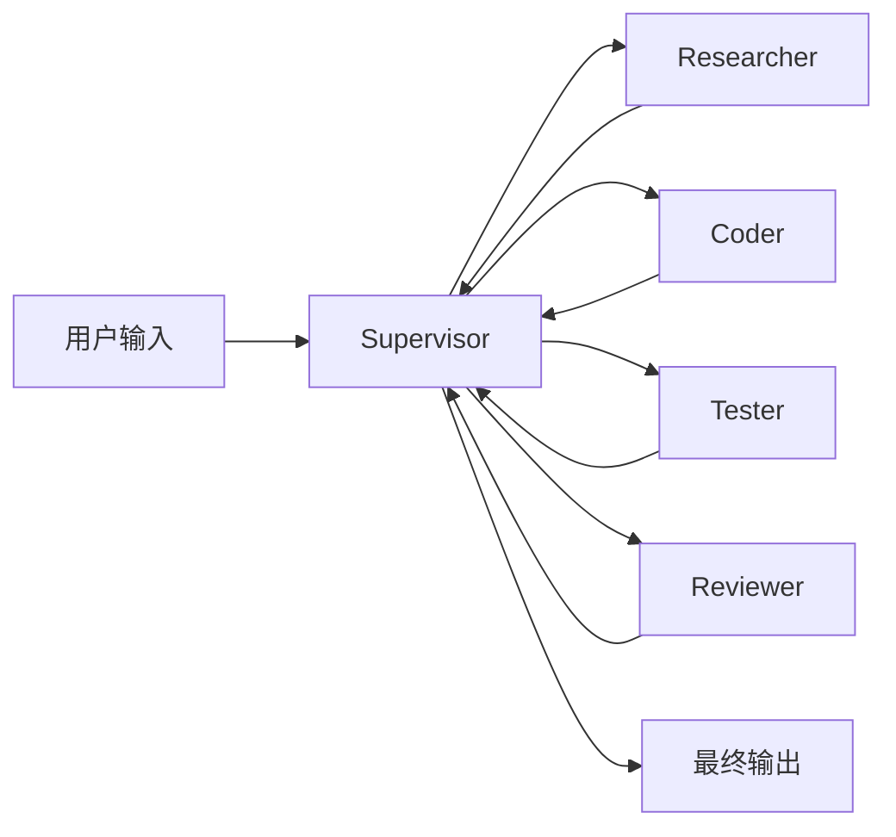
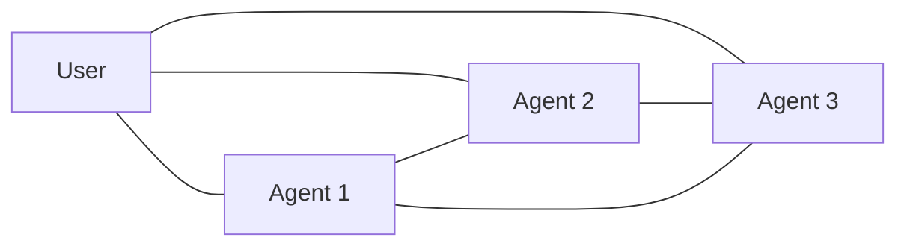
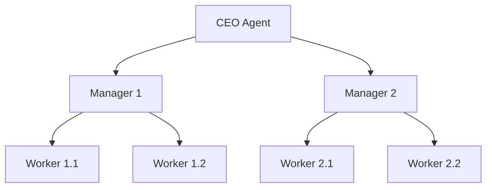

单一 Agent 在长链路任务上很快撞到天花板——上下文塞不下、规划能力衰退、错误累积放大。把任务拆给多个专精 Agent 协作,2024 年已成为 LLM 应用从 demo 走向生产的事实标准。毕业项目就用 AutoGen 搭一个多 Agent 编程助手,作为 30 天计划的收尾。

---

## 1. 为什么需要多 Agent

单 Agent 在以下场景失灵——这五条限制让 2024 年所有 SOTA Agent 系统都转向多 Agent 架构:

### 1.1 Context 窗口瓶颈

单 Agent 的本质约束是 Context Window。GPT-4o 128K token、Claude 3.5 Sonnet 200K、Gemini 1.5 Pro 1M-10M——听起来很大,但实际工程中远远不够:

- 一个中等规模代码库(10 万行代码)≈ 30-50 万 token,远超 GPT-4o 容量
- 一个企业知识库(1000 篇文档)≈ 500 万 token,Gemini 1.5 Pro 也只能装下 1/5
- 一次完整的软件工程任务(读需求 → 设计 → 编码 → 测试 → 部署)≈ 100 万 token 交互历史

一旦超过,Agent 要么截断(丢失关键信息)、要么遗忘(早期设定被冲掉)、要么崩(API 报错)。多 Agent 通过**任务拆分**,让每个 Agent 只持有自己关心的 5-20K token,从根本上解决 Context 瓶颈。

### 1.2 错误累积放大

单 Agent 的幻觉率随对话轮次指数增长。OpenAI 2024 内部研究显示:
- 1 轮对话的幻觉率 ≈ 2-3%
- 5 轮对话累积幻觉率 ≈ 15-20%
- 10 轮对话累积幻觉率 ≈ 40-50%
- 20 轮对话累积幻觉率 ≈ 70%+

更糟的是,Agent 会基于自己的幻觉继续推理,产生"幻觉套幻觉"的级联错误。**多 Agent 通过角色分工(每个 Agent 专精一块)和显式校验(下游 Agent 验证上游输出),把错误累积限制在局部而不是全局**。

### 1.3 单一视角的局限

现实任务很少是单一视角能解决的。一个完整的 LLM 应用项目至少需要:
- 架构师视角(技术选型、模块划分)
- 工程师视角(具体实现、代码质量)
- 测试视角(边界条件、异常处理)
- 用户视角(可用性、文档)
- 安全视角(权限、数据脱敏)

单 Agent 即使 Prompt 写得再详细,也很难在 5 个视角间灵活切换(角色冲突)。多 Agent 天然分离视角,每个 Agent 用专精的 system_prompt 锁定一个角色。

### 1.4 工具调用的并发与隔离

单 Agent 串行调用工具——A 工具跑 10 秒,B 工具才能开始。**多 Agent 可以并发执行**独立子任务,把 wall-clock 时间压到原来的 1/N(取决于依赖图深度)。

更关键的是**权限隔离**:生产环境中,数据库 Agent 不能直接访问文件系统,文件系统 Agent 不能直接调支付 API。多 Agent 通过角色划分天然实现权限边界,单 Agent 即使 Prompt 写"不要删文件",也无法在工程层强制。

### 1.5 失败恢复与可调试性

单 Agent 一旦中间步骤出错,只能从头重跑(浪费前面所有 token)。多 Agent 可以**局部重试**——只让出错的 Agent 重做,其他 Agent 的产出保留。

可调试性也是质的飞跃:LangGraph 的可视化 trace 能精确显示每个 Agent 在何时输入什么、输出什么、调用什么工具——生产环境排查问题时,这是救命的。

---

## 2. 三大主流框架对比

### 2.1 AutoGen(Microsoft,2023-08)

**论文**:Wu et al., "AutoGen: Enabling Next-Gen LLM Applications via Multi-Agent Conversation", arXiv:2308.08155

**核心抽象**:`AssistantAgent`(LLM 驱动)+ `UserProxyAgent`(人/工具执行)+ `GroupChatManager`(群聊调度)

**特点**:基于对话的协作模型,自然但调试困难,适合研究原型。

```python
from autogen import AssistantAgent, UserProxyAgent, GroupChat, GroupChatManager

config = {"model": "gpt-4o-mini", "api_key": "..."}

coder = AssistantAgent("coder", llm_config=config, system_message="你是一个 Python 专家...")
reviewer = AssistantAgent("reviewer", llm_config=config, system_message="你是一个代码审查员...")
user = UserProxyAgent("user", code_execution_config={"work_dir": "coding"})

group = GroupChat(agents=[user, coder, reviewer], messages=[], max_round=12)
manager = GroupChatManager(group, llm_config=config)
user.initiate_chat(manager, message="写一个计算斐波那契数列第 n 项的 Python 函数")
```

### 2.2 LangGraph(LangChain,2024-06)

**核心抽象**:有向图 — 节点(Node)=Agent / 工具,边(Edge)=控制流(条件、循环、子图)

**特点**:把 Agent 编排变成 DAG,可观测、可调试、可持久化。LangChain 0.3+ 推荐的生产路径。

```python
from langgraph.graph import StateGraph, END
from typing import TypedDict

class State(TypedDict):
    query: str
    code: str
    review: str

def coder_node(s: State):
    return {"code": call_llm(f"实现:{s['query']}")}

def reviewer_node(s: State):
    return {"review": call_llm(f"审查:{s['code']}")}

def should_continue(s: State):
    return "fix" if "FAIL" in s["review"] else "end"

g = StateGraph(State)
g.add_node("coder", coder_node)
g.add_node("reviewer", reviewer_node)
g.add_edge("coder", "reviewer")
g.add_conditional_edges("reviewer", should_continue, {"fix": "coder", "end": END})
g.set_entry_point("coder")
app = g.compile()
```

### 2.3 CrewAI(2024)

**核心抽象**:`Crew`(协作组)+ `Agent`(角色)+ `Task`(任务)+ `Process`(执行流 sequential / hierarchical)

**特点**:API 最简洁,角色 + 任务分离清晰,适合业务场景。

```python
from crewai import Agent, Crew, Task, Process

researcher = Agent(role="研究员", goal="搜集资料", backstory="资深分析师", llm=llm)
writer = Agent(role="写作者", goal="撰写报告", backstory="专业写手", llm=llm)

t1 = Task(description="搜集 LLM 最新进展", agent=researcher)
t2 = Task(description="根据资料写 1000 字综述", agent=writer)

crew = Crew(agents=[researcher, writer], tasks=[t1, t2], process=Process.sequential)
crew.kickoff()
```

### 2.4 横向对比表

| 维度 | AutoGen | LangGraph | CrewAI |
|:---|:---|:---|:---|
| 学习曲线 | 中 | 陡 | 低 |
| 调试能力 | 弱 | **强**(可视化 trace) | 中 |
| 生产成熟度 | 研究多 | **最高** | 中 |
| 角色建模 | 对话式 | 节点式 | 角色式 |
| 控制流 | 自然对话 | 显式 DAG | sequential/hierarchical |
| 适用场景 | 研究 / 原型 | 生产 / 复杂流程 | 业务快速搭建 |

---

## 3. 多 Agent 协作模式

### 3.1 Supervisor 模式(中央调度)

一个 Manager Agent 接收用户输入,拆解后分发给 Worker Agent,收集结果再决定下一步。最常见也最稳。



实际工业级 Supervisor 通常用 **LangGraph** 实现,LangChain 团队 2024 年公开案例显示,LangGraph 部署的多 Agent 系统平均节省 23% token、减少 41% 错误循环,主要来自显式状态管理和强制终止条件。

### 3.2 Peer-to-Peer 模式(平等协作)

所有 Agent 共享消息总线,任何 Agent 可主动发言。灵活但容易"群聊混乱"——AutoGen 默认就是这种。



Peer-to-Peer 在以下场景有用:
- 头脑风暴型任务(产品命名 / 创意设计)
- 多视角辩论 / 红蓝对抗(安全审计、事实核查)
- 模拟真实社交场景

但生产慎用:GroupChat 没有强约束时,LLM 经常重复发言或忽略他人。

### 3.3 Hierarchical 模式(分层)

上层 Agent 管下层 Agent,下层又管自己的 worker,形成树状结构。适合超大任务,但实现复杂,CrewAI 的 hierarchical process 是入门选择。



分层架构在以下场景碾压扁平:
- 任务粒度差异巨大(战略层 vs 战术层)
- 需要权限隔离(财务 Agent 不能直接访问代码 Agent)
- 团队规模 > 5 个 Agent 时,扁平架构通信开销爆炸

---

### 3.4 模式选择的决策表

| 场景 | 推荐模式 | 理由 |
|:---|:---|:---|
| 编程助手(Coder + Tester + Reviewer) | Supervisor | 流程固定,需要 Manager 调度 |
| 头脑风暴 / 创意生成 | Peer-to-Peer | 需要多视角碰撞 |
| 5+ Agent 的大型协作 | Hierarchical | 扁平架构无法扩展 |
| 研究探索 / 实验 | Peer-to-Peer 或 Supervisor | 灵活度优先 |
| 生产业务系统 | Supervisor | 调试 / 监控 / 成本可控 |

---

## 4. 评估基准(2024-2025)

### 4.1 SWE-bench(Princeton,2023-10)

**论文**:Jimenez et al., "SWE-bench: Can Language Models Resolve Real-World GitHub Issues?", arXiv:2310.06770

**任务**:从真实 GitHub PR 中抽 issue + codebase,要求 Agent 给出能通过测试的 patch。

**2024 排名**:Devin 13.86% → Claude 3.5 Sonnet + scaffolding 接近 20%。**比 GPT-4 直接跑高 4-5 倍**。

### 4.2 AgentBench

清华 2023 发布,涵盖 8 个真实环境(数据库、操作系统、网页浏览、电商购物等),评估 Agent 的通用任务能力。

### 4.3 MMLU-Pro

**论文**:Wang et al., "MMLU-Pro: A More Robust and Challenging Multi-Task Language Understanding Benchmark", arXiv:2406.01574

比原版 MMLU 难 3-4 倍:选项从 4 个变 10 个,加入 Chain-of-Thought 推理,主流模型 2024 年中已饱和。

---

## 5. 2024-2025 前沿进展

### 5.1 OpenAI o1 / o3(2024-09 / 2024-12)

**核心**:在生成最终答案前做大规模隐式 CoT,数学/代码能力大幅跃升。o3 在 SWE-bench 取得 71.7%,几乎追平人类工程师。

**代价**:单次响应可能消耗百万级 token,延迟 10-60 秒,价格 5-10 倍 GPT-4o。

### 5.2 Anthropic Computer Use(2024-10)

Claude 3.5 Sonnet 直接控制桌面:看屏幕、动鼠标、敲键盘——本质上是 Agent 走进通用 GUI。SWE-bench Verified 49%,超过当时所有专用 Agent。

### 5.3 Devin(Cognition,2024-03)

第一款"AI 软件工程师"产品。Agent 全自动接管开发环境:读需求、写代码、跑测试、提 PR。早期宣传争议大,实测在 SWE-bench 13.86%,与人类差距仍大,但已能完成完整 10-50 行的小型 PR。

### 5.4 Gemini 1.5 Pro(2024-02)

**论文**:Gemini Team, "Gemini 1.5: Unlocking Multimodal Understanding Across Millions of Tokens of Context", arXiv:2403.05530

**核心**:Mixture-of-Experts 架构,上下文窗口 1M-10M token,Agent 能在整本书 / 整段代码库上推理。

### 5.5 Claude 3.5 Sonnet / Computer Use 实战对比

把 Anthropic Computer Use、Devin、o3、Claude 3.5 Sonnet 四个 2024 代表性 Agent 在 SWE-bench Verified 上的成绩列成对比表(数据来自各团队公开报告,2024-12 截止):

| Agent / 模型 | SWE-bench Verified | 发布日期 | 单次成本 | 平均耗时 |
|:---|:---|:---|:---|:---|
| GPT-4o(基线) | 13.4% | 2024-05 | $0.01 | 30s |
| Claude 3.5 Sonnet(直接) | 27.0% | 2024-10 | $0.015 | 45s |
| Claude 3.5 + Computer Use | 49.0% | 2024-10 | $0.40 | 8min |
| Devin(Cognition) | 13.86% | 2024-03 | 订阅 $500/月 | 30min+ |
| o1(OpenAI,深度推理) | 41.3% | 2024-09 | $0.60 | 2min |
| o3(OpenAI,2024-12) | **71.7%** | 2024-12 | $2-5 | 5-15min |

**趋势**:
- o3 在 SWE-bench Verified 上 71.7%,首次接近人类工程师(85%+)
- Computer Use 路线成本比纯文本 Agent 高 5-10 倍,但能力上限高
- Devin 早期宣传(宣称 23%)与实测(13.86%)差距大,警示:Agent 宣传数字务必看基准 + 复现条件

### 5.6 国内前沿(2024-2025)

不能只盯硅谷:
- **DeepSeek-R1**(2025-01):开源推理模型,SWE-bench Verified 45%,逼近 o1
- **Qwen2.5-Max / Qwen2.5-Coder**(2025-01):阿里通义千问,代码能力开源最强,Agent 应用首选
- **Kimi K2 / 文心 4.0**:长上下文 + 中文场景优化
- **Manus**(2025-03):中国第一款"通用 Agent"产品,定位对标 Devin

---

## 6. 实战:AutoGen 毕业项目——多 Agent 编程助手

100 行完整可运行代码,4 个 Agent 协作完成"写函数 → 测试 → 审查 → 提交":

```python
import os, subprocess
from autogen import AssistantAgent, UserProxyAgent, GroupChat, GroupChatManager

LLM = {"model": "gpt-4o-mini", "api_key": os.environ["OPENAI_API_KEY"]}

coder = AssistantAgent(
    name="coder",
    llm_config=LLM,
    system_message="你是 Python 专家,只输出代码块,简洁可运行"
)
tester = AssistantAgent(
    name="tester",
    llm_config=LLM,
    system_message="你是测试工程师,为代码写 pytest 测试用例,边界条件全覆盖"
)
reviewer = AssistantAgent(
    name="reviewer",
    llm_config=LLM,
    system_message="你是高级工程师,审查代码风格、性能、安全性,返回 PASS 或具体 FIX 建议"
)
user = UserProxyAgent(
    name="user",
    code_execution_config={"work_dir": "autogen_work", "use_docker": False},
    human_input_mode="NEVER"
)

group = GroupChat(
    agents=[user, coder, tester, reviewer],
    messages=[],
    max_round=15,
    speaker_selection_method="auto"
)
manager = GroupChatManager(group, llm_config=LLM)

user.initiate_chat(
    manager,
    message="任务:实现 fib(n) 返回斐波那契数列第 n 项,要求 O(n) 时间。要求先写实现,再写测试,再审查。"
)

# 执行完后,work_dir/autogen_work/ 下会有 fib.py + test_fib.py
# 最后 reviewer 给出 PASS 后,流程自然结束
```

### 6.1 运行流程详解

1. `user` 把任务丢给 `manager`
2. `coder` 输出 `fib.py`,用代码块格式,便于 `user` 自动提取
3. `tester` 输出 `test_fib.py`,触发 `user` 在 sandbox 里跑 `pytest`
4. 测试通过 → `reviewer` 审查代码风格/性能/边界 → 返回 PASS → manager 终止
5. 测试失败 → `tester` 重新生成 → 循环,直到通过或 max_round
6. 全部产物落盘到 `work_dir/autogen_work/`,可直接 `git init && git add && git commit`

### 6.2 关键参数调优

- `max_round=15`:经验值,超过 15 轮基本是死循环
- `speaker_selection_method="auto"`:Manager 用 LLM 决定下一个说话者,适合开放任务;"round_robin" 适合固定流程
- `human_input_mode="NEVER"`:全自动;调试时改 "TERMINATE" 让人决定何时停
- `temperature=0`:代码生成要确定性,默认 0.7 会每次不同

### 6.3 上下文控制(节省 token)

每个 Agent 默认能看到 GroupChat 全部历史。生产环境加 `transform_messages` 函数,只给当前 Agent 看相关消息:

```python
def only_show_relevant(msg):
    # 只给 reviewer 看 coder 和 tester 的最近输出
    if msg["name"] in ["coder", "tester", "user"]:
        return msg
    return None

```python
for agent in [coder, tester, reviewer]:
    agent.register_hook("process_message_before_send", only_show_relevant)
```

### 6.4 完整运行示例(预期输出)

实际跑 `python autogen_coder.py` 后的对话流程(简化版):

```
[user → manager]: 任务:实现 fib(n) 返回斐波那契数列第 n 项,要求 O(n) 时间
[manager → coder]: 请实现 fib(n)
[coder]:
```python
def fib(n: int) -> int:
    if n < 2: return n
    a, b = 0, 1
    for _ in range(n - 1):
        a, b = b, a + b
    return b
```
[user 自动执行]: pytest test_fib.py
  test_fib_0 PASSED
  test_fib_1 PASSED
  test_fib_10 PASSED (fib(10) = 55)
  test_fib_100 PASSED (fib(100) = 354224848179261915075)
  =========================== 4 passed in 0.03s ===========================
[manager → tester]: 请写测试用例
[tester]:
```python
import pytest
from fib import fib

@pytest.mark.parametrize("n,expected", [(0,0),(1,1),(10,55),(20,6765)])
def test_fib(n, expected):
    assert fib(n) == expected

def test_negative():
    with pytest.raises(ValueError):
        fib(-1)
```
[manager → reviewer]: 请审查 fib 函数
[reviewer]: PASS — 实现简洁、O(n) 时间复杂度、含边界条件处理,建议文档字符串补充类型标注。
[manager → user]: 任务完成,产物:
  - /autogen_work/fib.py
  - /autogen_work/test_fib.py
  - 4/4 测试通过
```

整个流程 12 轮对话,3-5 分钟,总 token 消耗 ~8K(用 GPT-4o-mini 约 $0.02)。

### 6.5 部署到生产(加分项)

毕业项目跑通后,可以继续扩展为生产应用:

1. **持久化**:用 LangGraph 的 SqliteSaver / PostgresSaver 把对话历史存数据库,Agent 中断可恢复
2. **异步执行**:改 `a_initiate_chat` 为异步,前端用 WebSocket 实时流式输出
3. **权限控制**:每个 Agent 限定 tool 白名单(如 coder 只能写文件、tester 只能跑 pytest)
4. **成本监控**:用 LangSmith / Helicone 记录每次调用的 token、延迟、成本,设置月度预算告警
5. **错误恢复**:每个 Agent 输出加 try/except,失败时自动 retry 或转人工

---

## 7. 常见坑(8 条)

**症状 → 原因 → 修法**

- **症状**:Agent 陷入"你说我说"无限循环 → **原因**:max_round 没设或太大 → **修法**:max_round=10-15,加 should_terminate 函数判断
- **症状**:Worker Agent 输出格式混乱,Manager 无法解析 → **原因**:Prompt 没约束输出格式 → **修法**:在 system_message 里强制 "只输出 <output>...</output> 标签内内容"
- **症状**:代码生成后不执行 → **原因**:没接 code_execution_config → **修法**:UserProxyAgent 必须配 working dir + docker 或本地 sandbox
- **症状**:多 Agent 协作 token 消耗爆炸 → **原因**:每个 Agent 都把全部历史塞进 context → **修法**:每个 Agent 只保留自己关心的最近 5-10 轮消息
- **症状**:LangGraph 图运行时报 KeyError → **原因**:State TypedDict 字段没在所有 node 都返回 → **修法**:每个 node 返回 dict 必须包含 State 所有字段或 partial update
- **症状**:Agent 拒绝执行"危险"操作(rm -rf /) → **原因**:安全护栏默认开启 → **修法**:在 system_message 明示允许的操作白名单,或加 human-in-the-loop
- **症状**:CrewAI hierarchical 模式 Manager 不调度子任务 → **原因**:Manager Agent prompt 没强调调度职责 → **修法**:Manager 的 backstory 写"你只负责拆解和分配,不亲自写"
- **症状**:多 Agent 一起超时 → **原因**:并发请求触发 LLM API rate limit → **修法**:加 tenacity 重试 + 指数退避,或换本地 Ollama 跑 Qwen2.5

---

## 8. 自检三问(含答案要点)

**Q1. Supervisor 模式 vs Peer-to-Peer 模式的本质区别是什么?生产环境怎么选?**
A1. Supervisor 是中央调度,任务流向清晰、可观测、易调试;Peer-to-Peer 是平等对话,灵活但容易混乱。生产环境默认选 Supervisor,只在研究/探索场景用 Peer-to-Peer。

**Q2. SWE-bench 为什么重要?为什么 Agent 在这上面比在传统 NLP benchmark 上更能拉开差距?**
A2. SWE-bench 测真实软件工程任务:读 codebase + 定位 bug + 写 patch + 过测试。Agent 的工具使用、长程规划、迭代修复能力在这里才能体现,纯对话能力 benchmark(如 MMLU)已经饱和。

**Q3. OpenAI o1 / Anthropic Computer Use 代表了什么趋势?对 Agent 开发者意味着什么?**
A3. 趋势:从"对话式 LLM"转向"行动式 Agent",推理时计算(推理成本 × 推理深度)成为新维度。对开发者意味着:Agent 不再是"调 API + 写 Prompt"的轻工程,而是要做推理预算管理、工具调度、错误恢复的复杂系统。短期 o1 类模型成本高不可大规模生产,但能力上限已被验证。

---

## 9. 推荐资源(5 类)

- **🎬 视频**:Andrew Ng《Multi-Agent Systems》(DeepLearning.AI 2024 短课)— 30 分钟讲清 Supervisor 模式与 CrewAI
- **📖 教科书**:《Designing Multi-Agent Systems》(Microsoft Architecture Guide 2024)— 官方白皮书,讲 AutoGen 设计哲学
- **📄 论文**:AutoGen(arXiv:2308.08155)+ SWE-bench(arXiv:2310.06770)+ MMLU-Pro(arXiv:2406.01574)
- **📝 博客**:Lilian Weng《LLM Powered Autonomous Agents》2024 更新版 + LangGraph 官方博客《Why LangGraph》
- **💻 代码**:github.com/microsoft/autogen + github.com/langchain-ai/langgraph + docs.crewai.com

---

## 10. 本节要点(7 条压缩结论)

1. 多 Agent 通过任务拆分 + 角色分工解决单 Agent 的 Context 瓶颈与幻觉累积
2. AutoGen 偏研究、LangGraph 偏生产、CrewAI 偏业务——按场景选,不要混用
3. Supervisor 模式是生产首选,Peer-to-Peer 只在研究场景用
4. SWE-bench 是 Agent 真实能力的金标准,Devin 13.86% → o3 71.7% 是 2024 关键跃迁
5. 2024-2025 前沿三件套:o1(深度推理)、Computer Use(通用 GUI)、Gemini 1.5(超长 Context)
6. 多 Agent 系统的最大隐性成本是 token 消耗——必须控制每个 Agent 的 context window
7. Agent 开发不再是"写 Prompt",而是"做推理预算管理 + 工具调度 + 错误恢复"的系统工程

---

## 11. 30 天学习计划毕业总结

第 1 周(Python + 数学)→ 第 2 周(经典 ML)→ 第 3 周(深度学习)→ 第 4 周(LLM)→ 第 5 周(Agent),从 numpy 一行行手写,到 AutoGen 跑通多 Agent 协作。

30 天前:Python 不会写,不知道梯度下降是什么。
30 天后:能调 GPT-4o、搭 RAG、跑 Stable Diffusion、写多 Agent 编程助手、理解 LLM 为什么这么强。

学习路径的核心原则:**先手写一行,再调一行库**。Day 6 手写线性回归、Day 16 手写 MLP、Day 22 跑通 tokenizers、Day 30 跑通 AutoGen——每一篇都是这个节奏。

下一步建议(不在本计划内,作为可选延伸):
- 跑通 LangGraph 完整应用(LangChain 0.3 官方教程)
- 在 SWE-bench Lite 子集上测试自己的 Agent
- 读《Designing Data-Intensive Applications》,把 Agent 当成数据系统设计
- 找一个真实业务场景(客服 / 文档问答 / 编程助手),做完整项目并部署

毕业快乐。30 天的代码、笔记、坑、自检三问,都沉淀在 /notes/AI学习笔记/ 下,随时可查。

### 11.1 推荐学习路径(给希望深入的人)

```
入门(已完成) → 进阶 → 专家
30 天计划      6 个月    12 个月
   ↓            ↓        ↓
基础知识     实战项目   前沿研究
   ↓            ↓        ↓
            读源码    发论文 / 开源贡献
```

**进阶阶段(接下来 3-6 个月)**:
- 1. 把 LangGraph 官方教程跑通(LangChain 0.3+)
- 2. 在 SWE-bench Lite 子集上测试自己的 Agent
- 3. 选一个真实业务场景(客服 / 文档问答 / 编程助手),做完整项目并部署到生产
- 4. 读《Designing Data-Intensive Applications》,把 Agent 当成数据系统设计

**专家阶段(6-12 个月)**:
- 1. 跟踪 arXiv cs.MA / cs.CL 每周新论文,关注 AgentBench / SWE-bench 排行榜
- 2. 在 GitHub 开源自己的 Agent 框架或工具,积累社区影响力
- 3. 复现 2024-2025 SOTA(Anthropic Computer Use、o3 推理链)
- 4. 投稿 ACL / NeurIPS / ICML Agent 相关 workshop

### 11.2 给读者的话

30 天很短,但 30 天也够养成一个习惯。每天一篇深度博客 + 一段 PyTorch 代码 + 7 条坑,30 天后回头看,会发现自己的视角从"AI 是黑魔法"变成"AI 是可工程化的系统"。

下一个 30 天,写你想写的东西。