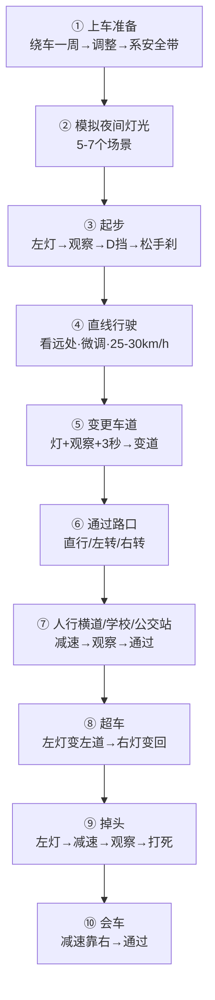
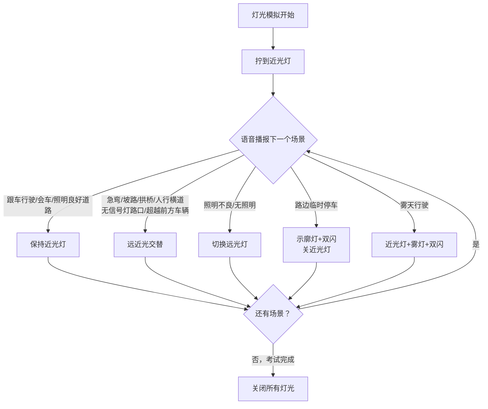

---

## 科目三 vs 科目二的区别

```
科目二 = 场地内低速考点位记忆
科目三 = 实际道路考安全意识 + 操作规范性
```

| 对比 | 科目二 | 科目三 |
|:---:|:-----:|:------:|
| 场地 | 封闭场地 | **实际道路**（有社会车辆） |
| 速度 | 怠速蠕动 | **需要加油**，最高约40-50km/h |
| 方向盘 | 大幅快打 | **小幅慢打**，不能猛打 |
| 看点 | 靠点位记忆 | **靠观察判断**（后视镜+周围环境） |
| 扣分 | 压线直接挂 | 细节扣分多（灯·观察·速度） |
| 时间 | 每个项目限时 | 不限时，但要在规定距离内完成 |

**C2自动挡 vs C1手动挡 科目三的区别**：
- C2**不用换挡**（没有加减挡操作），全程D挡走
- C2**不会熄火**，停车起步比C1简单得多
- C2**不需要配合离合**，只需控制刹车和油门
- 考试项目相同，但C2不用做加减挡

---



## 通用原理

### 油门和刹车的配合（科目三核心技能）

科目三需要**油门和刹车都用**，跟科目二只用刹车完全不同：

```
正常行驶：轻踩油门保持速度（约20-30km/h）
需要减速：松油门 → 轻踩刹车
需要停车：松油门 → 踩刹车 → 停稳
需要加速：轻踩油门 → 速度上来后稳住
```

**脚的位置**（自动挡只用右脚操作）：
```
右脚脚后跟放在刹车踏板正下方
需要加油时：以脚后跟为轴，脚掌向右转到油门踏板上
需要刹车时：脚掌向左转回刹车踏板上

记住：不加油时脚一定要放在刹车上（备刹车）
```


### 转向灯使用规则

科目三**转向灯极其重要**，忘打或打错直接扣100分（不合格）。

```
打灯时机：操作前至少3秒打灯
关灯时机：操作完成后自动或手动关闭

▸ 起步 → 左灯
▸ 变道 → 左灯（向左变）/ 右灯（向右变）
▸ 超车 → 先左灯（变左道）→ 再右灯（回右道）
▸ 掉头 → 左灯
▸ 左转 → 左灯
▸ 右转 → 右灯
▸ 靠边停车 → 右灯
```

**打灯3秒怎么判断**：
- 灯闪3-5下大约就是3秒
- 心里默念"1001、1002、1003"再动方向

### 观察习惯（科目三最重要的安全意识）

每个操作前必须做的三件事：

```
1. 打灯（告知别人你的意图）
2. 看后视镜（确认安全）
3. 转头观察（左/右回头，补盲区）
```

**必须转头观察的情况**：
- 起步前 → 看左后方（回头）
- 变道前 → 看对应方向后视镜 + 转头
- 超车前 → 看左后视镜 + 转头
- 掉头前 → 看左右 + 回头
- 靠边停车前 → 看右后视镜 + 转头
- 通过路口 → 左右摆头观察

> 注意：**转头动作要做明显**，不要只是眼睛瞟一下。安全员/考官看你有没有转头，动作不到位会被记录"未按规定观察"。

---

## 考试全程流程（16项）

### 第一阶段：上车准备

```
上车前绕车一周 → 开门上车 → 调整 → 系安全带 → 等待指令
```

**① 绕车一周检查**（从副驾侧开始绕）：
```
通常你从副驾（右前门）下车 → 走向车尾后方
→ 触摸右后方感应器（或走到右后侧）→ 继续绕到车头
→ 触摸左前方感应器（或走到左前侧）→ 回到左前门上车
```
注：具体绕行方向和感应器位置以当地考场为准，有的是逆时针绕（先车头→后车尾），有的是顺时针（先车尾→后车头）。关键是**四个角都要检查到**。
- 绕行时要**走慢一点**，让感应器有时间识别
- 观察车辆周围有没有障碍物、轮胎状况
- 有的考场是触摸感应器，有的是摄像头识别

**② 上车后调整（同科目二）**：
- 调座椅 → 调后视镜（三镜：左中右）→ 系安全带
- 检查：挡位是否在P挡、手刹是否拉起、灯光是否全部关闭

**③ 等待语音指令**：
- 安全员/考官确认你可以开始
- 语音播报"请开始考试"或"请进行模拟夜间灯光"

---

### 第二阶段：模拟夜间灯光（灯光模拟）

**这是科目三第一个淘汰点**——灯光做错直接扣100分。

**考试流程**：
```
语音播报："下面将进行模拟夜间行驶场景灯光使用……"
→ 语音播报一个场景 → 你在5秒内做出相应灯光操作
→ 共约5-7个场景 → 播报"模拟夜间考试完成，请关闭所有灯光"
```

**C2常用灯光操作表**：

| 语音播报内容 | 灯光操作 | 说明 |
|:-----------|---------|:----:|
| **请开启前照灯** | 拧到**近光灯** | 所有灯光模拟的第一步 |
| **夜间同方向近距离跟车行驶** | **近光灯**（保持不动） | 跟车不能用远光 |
| **夜间与机动车会车** | **近光灯**（保持不动） | 会车用近光 |
| **夜间通过急弯/坡路/拱桥/人行横道** | **远近光交替**（闪两下） | 交替：远→近→远→近 |
| **夜间通过没有交通信号灯的路口** | **远近光交替**（闪两下） | 同上 |
| **夜间超越前方车辆** | **远近光交替**（闪两下） | 超车提醒前车 |
| **夜间在照明良好的道路上行驶** | **近光灯**（保持不动） | 有路灯用近光 |
| **夜间在照明不良/无照明道路上行驶** | **远光灯** | 没路灯用远光 |
| **路边临时停车** | **示廓灯 + 危险报警灯**（双闪） | 关近光，开示廓灯+双闪 |
| **雾天行驶** | **近光灯 + 雾灯 + 危险报警灯** | 部分考场不考 |

**灯光操作杆位置**（大多数车型）：
```
方向盘左边拨杆：
  ▸ 旋转：开灯（OFF → 示廓灯 → 近光灯）
  ▸ 向前推：远光灯（仪表盘亮蓝灯）
  ▸ 向后拉回：近光灯
  ▸ 向后轻拉：闪一下远光（交替闪就是用这个）
  
危险报警灯（双闪）：中控台的红色三角形按钮
```

**易错点**：
- 远光和近光搞混 —— 看仪表盘，远光会亮蓝色指示灯
- 交替闪的时候**闪太快**（系统没识别到）或**只闪了一下**
- "路边临时停车"忘了关近光灯
- 上一个操作是远光，下一个场景需要近光时**忘了切回来**



---

### 第三阶段：起步

```
打左灯 → 观察（后视镜+转头）→ 挂D挡 → 松手刹 → 起步
```

| 步骤 | 操作 | 要点 |
|:---:|------|------|
| ① | **打左转向灯** | 必须超过3秒 |
| ② | **观察** | 看左后视镜 + 转头看左后方盲区 |
| ③ | **挂D挡** | 踩刹车挂挡 |
| ④ | **松手刹** | 确认手刹灯熄灭 |
| ⑤ | **慢抬刹车** | 车开始往前走 |
| ⑥ | **轻踩油门** | 平稳加速，汇入车道 |
| ⑦ | **关闭转向灯** | 车身摆正后关灯 |

> **风险点**：起步不打灯 → 不合格；不观察后方 → 不合格；起步太猛（油门踩深了）→ 扣分。

---

### 第四阶段：直线行驶（约100-150米）

这是科目三**最容易挂的项目之一**。要求车辆在车道内直线行驶，不能跑偏。

**操作方法**：
```
进入直线行驶路段前：
  ① 把车身提前摆正（入段前就调好）
  ② 车速稳定在25-30km/h
  ③ 视线看向远方（至少100米外）
  ④ 双手轻握方向盘（不要握太紧）
  
行驶过程中：
  ⑤ 发现车头偏了 → 极小幅微调（幅度不超过5度）
  ⑥ 微调后立刻回正 → 继续看远处
  ⑦ 不要盯着车头前的路面看
```

**直线行驶的误区**：

| 错误做法 | 为什么错 | 正确做法 |
|---------|---------|---------|
| 方向盘一动不动 | 路面不平车自己会跑偏 | 轻微修正，调完回正 |
| 看车头调整方向 | 看近处反应不及 | 看远处，微调即可 |
| 发现偏了猛打方向 | 猛打直接判定不合格 | 像缝纫机一样小幅抖动修正 |
| 速度太慢 | 越慢越容易偏 | 保持25km/h以上更稳 |

**直线行驶的原理**：
```
车跑偏不是因为方向盘动了，而是路面不平、风阻、方向盘虚位等综合因素。
所以必须主动微调，不是"不动方向盘"而是"及时修正"。

看远处的原理：
  你看100米外 → 偏一点立刻发现 → 微调
  你看5米前 → 偏了30cm才发现 → 需要大调 → 挂
```

---

### 第五阶段：变更车道

```
打灯 → 观察 → 3秒后 → 变道 → 关闭转向灯
```

| 步骤 | 操作 | 要点 |
|:---:|------|------|
| ① | **打左/右转向灯** | 根据你要变的方向 |
| ② | **观察** | 看后视镜 + 转头（必须转头） |
| ③ | **等待3秒** | 灯闪至少3下再动方向 |
| ④ | **微打方向变道** | 幅度小，慢慢切入 |
| ⑤ | **回正方向盘** | 车身进入车道后回正 |
| ⑥ | **关闭转向灯** | 如果灯没自动灭，手动关 |

**注意事项**：
- 一次只能变更**一个车道**（不能连续变两个车道）
- 变道过程中**不要减速**（正常速度或稍加速汇入）
- 后方有车时**要让行**，等安全后再变
- 变更车道后不要马上又变回来（至少行驶一段距离）

---

### 第六阶段：通过路口（直行/左转/右转）

**通过路口（直行）**：
```
接近路口 → 减速（松油门+轻踩刹车）→ 左右摆头观察 → 通过
```
- 人行横道前**必须减速**（车速明显下降）
- 有行人过马路**必须停车让行**
- 路口内不能变道

**路口左转**：
```
接近路口 → 打左灯 → 减速 → 观察 → 左转进入对应车道
```
- 左转转大弯（转到最左侧车道）
- 注意对面直行车辆（让直行）

**路口右转**：
```
接近路口 → 打右灯 → 减速 → 观察 → 右转进入对应车道
```
- 右转转小弯（转到最右侧车道）
- 注意右侧非机动车和行人

**路口停车再起步（如果遇到红灯）**：
```
停车：松油门 → 踩刹车 → 平稳停住（挂D挡不动）
起步：观察 → 松刹车 → 轻踩油门走
```
- C2自动挡路口起步不会熄火，比C1轻松很多
- 但要注意起步不要太慢（后车催你）

---

### 第七阶段：通过人行横道/学校区域/公交车站

这三个项目操作几乎一样：

```
接近项目区域（约30米前）→ 减速（松油门+轻刹车）→ 左右观察 → 通过
```

**具体做法**：
- 看到路牌（人行横道标志/学校标志/公交站牌）就开始准备
- 车速从20-30km/h降到**15-20km/h**左右（有明显的减速动作）
- **左右摆头观察**（动作要做出来）
- 如果有行人/学生/公交车乘客上下，**必须停车让行**

**三者的区别**：

| 项目 | 标志 | 特殊要求 |
|:----:|:----:|---------|
| 人行横道 | 🚶 斑马线标志 | 有行人必须让行 |
| 学校区域 | 🏫 学校标志 | 通常有速度限制（不超过30km/h） |
| 公交车站 | 🚌 公交站牌 | 有公交车停靠时减速慢行 |

---

### 第八阶段：超车

超车是一个**操作组合**，包含两次变道：

```
① 打左灯 → 观察 → 3秒后 → 变入左道 → 关灯
② 直行一段距离（约30米）
③ 打右灯 → 观察 → 3秒后 → 变回右道 → 关灯
```

**完整操作**：

| 顺序 | 操作 | 要点 |
|:---:|------|------|
| ① | **打左转向灯** | 告知后车你要超车 |
| ② | **观察左后视镜+转头** | 确认左后方安全 |
| ③ | **3秒后变入左道** | 平稳切入，不要减速 |
| ④ | **关闭左灯** | — |
| ⑤ | **在左道行驶** | 约30米（5-10秒） |
| ⑥ | **打右转向灯** | 准备回到原车道 |
| ⑦ | **观察右后视镜+转头** | 确认安全 |
| ⑧ | **3秒后变回右道** | 平稳切回 |
| ⑨ | **关闭右灯** | ✅ 完成 |

> **注意**：超车不是真的让你超前面的车，而是**完成超车这个动作流程**。即使前面没车，也要按流程做一遍。

---

### 第九阶段：掉头

```
打左灯 → 减速（必要时停车）→ 观察 → 掉头 → 回正
```

**操作步骤**：

| 步骤 | 操作 | 要点 |
|:---:|------|------|
| ① | **打左转向灯** | 提前打灯 |
| ② | **减速** | 松油门、轻踩刹车 |
| ③ | **观察** | 看对面来车、后方来车、斑马线行人 |
| ④ | **掉头** | 向左打死（或根据路况打一圈半） |
| ⑤ | **回正** | 车身进入对应车道后回正 |
| ⑥ | **加油正常行驶** | — |

**掉头难点**：
- 对面有来车**必须要让**，等安全了再掉头
- 掉头时不能压到人行横道（如斑马线在路口，车要越过斑马线再掉头）
- 掉头后进入**最左侧车道**
- 如果路口太窄，可能需要**停车再打方向**（正常操作，不扣分）

---

### 第十阶段：会车

```
听到"会车"指令 → 减速靠右 → 观察 → 通过
```

**操作**：
- 松油门 → 轻踩刹车（明显减速）
- 方向盘轻微向右调整（靠右行驶）
- 观察对向来车
- 通过后恢复正常行驶

C2自动挡会车很简单，不需要像C1那样降挡。关键是**做出减速+靠右的动作**。

---

### 第十一阶段：靠边停车（最后一个项目）

**这是科目三另一个最容易挂的地方**——前面所有项目都过了，最后靠边停车出问题。

打右灯 → 减速 → 观察 → 靠右 → 对点 → 停车 → 挂P挡 → 拉手刹 → 熄火 → 下车

**完整操作**：

| 顺序 | 操作 | 要点 |
|:---:|------|------|
| ① | **听到指令"请靠边停车"** | — |
| ② | **打右转向灯** | 必须超过3秒 |
| ③ | **减速** | 松油门、轻踩刹车 |
| ④ | **观察右后视镜+转头** | 确认右侧安全 |
| ⑤ | **向右微打方向** | 缓慢靠向路边 |
| ⑥ | **对点**（车身距路沿30cm以内） | 用雨刮器节点或车头1/3对线 |
| ⑦ | **回正方向盘** | 车身平行于路沿 |
| ⑧ | **踩死刹车停车** | 平稳停住 |
| ⑨ | **挂P挡** | — |
| ⑩ | **拉手刹** | 拉到底 |
| ⑪ | **熄火** | — |
| ⑫ | **松安全带** | — |
| ⑬ | **观察左后方** | 开门前确认安全 |
| ⑭ | **开门→下车→关门** | 关好门 |

**靠边停车30cm的判断方法**（常用两种）：

```
方法一（雨刮器法）：
  雨刮器中间的突起节点 → 对准路沿石边缘
  此时车身距路沿约30cm

方法二（车头1/3法）：
  引擎盖右侧1/3处 → 与路沿石重合
  同科目二侧方停车靠边的方法
```

**靠边停车常见问题**：

| 问题 | 后果 | 解决方法 |
|:----|:----|:---------|
| 灯打了不到3秒就靠边 | 不合格 | 数3秒再动方向 |
| 距离路沿超过50cm | 扣100分 | 靠边时看准点位，不够近再微调 |
| 距离路沿30-50cm | 扣10分 | 尽量控制在30cm以内 |
| 压到路沿石 | 不合格 | 靠边时速度要慢，小幅度修正 |
| 停好后忘拉手刹/挂P挡 | 扣分 | 按顺序操作：P挡→手刹→熄火 |
| 开门前没观察 | 不合格 | 开门前必须回头看了再开 |

---

## 全程操作速查表

```
上车准备：绕车一周 → 上车调整 → 系安全带

灯光模拟：按语音操作灯光（约5-7个）

起    步：左灯 → 观察 → D挡 → 松手刹 → 走

直线行驶：看远处 → 微调方向 → 保持25-30km/h

变更车道：灯+观察+3秒 → 变道 → 关灯

通过路口：减速 → 观察 → 通过（转弯打灯+让行）

人行横道/学校/公交站：减速 → 观察 → 通过

超    车：左灯变左道 → 直行30米 → 右灯变回右道

掉    头：左灯 → 减速 → 观察 → 打死掉头

会    车：减速靠右 → 通过

靠边停车：右灯 → 靠右30cm → P挡+手刹+熄火 → 观察下车
```

---

## 扣分规则速记

**不合格（直接挂）**：
```
▸ 不系安全带
▸ 闯红灯
▸ 不按规定使用灯光（灯光模拟做错）
▸ 不按考试指令行驶
▸ 连续变更多个车道
▸ 变道/转弯/掉头不打转向灯
▸ 靠边停车距离路沿＞50cm
▸ 开门前不观察后方
▸ 压实线
▸ 超速行驶
▸ 未按规定让行（不礼让行人/直行车）
```

**扣10分（累计扣）**：
```
▸ 车速与挡位不匹配（C2全程D挡，无此扣分项）
▸ 靠边停车30-50cm
▸ 刹车使用不当（急刹）
▸ 发动机熄火（C2基本不会）
```

> C2科目三总分100分，**90分合格**。也就是最多只能扣10分。

---

## C2科目三 vs C1的关键差异

| 项目 | C1手动挡 | C2自动挡 |
|:----:|:--------:|:--------:|
| 换挡 | 全程1-2-3-4挡切换 | **全程D挡**，不需要换挡 |
| 加减挡操作 | 必须做加/减挡 | **没有这个项目** |
| 起步 | 离合+油门配合，容易熄火 | 松刹车就走，不会熄火 |
| 坡道起步 | 容易溜车熄火 | 不会溜车 |
| 路口起步 | 离合控制，可能熄火 | 松刹车踩油门就走 |
| 靠边停车 | 空挡+手刹+熄火 | P挡+手刹+熄火 |
| 考试难度 | 换挡+离合是难点 | **专注路况和细节即可** |

---

## 科目三核心口诀

```
上车准备绕一周，灯光模拟别着急
起步左灯回头看，D挡手刹再给油
直线行驶看远方，微调方向像缝纫
变道超车灯先打，三秒之后再动盘
路口减速左右看，礼让行人不能忘
掉头左灯看路况，一把方向过不去
靠边停车右灯亮，雨刮对线三十整
P挡手刹再熄火，开门回头保平安
```

---

## 科目二 vs 科目三 对照

| 阶段 | 项目 | 科目二关键 | 科目三关键 |
|:---:|:----:|:---------:|:---------:|
| 准备 | 上车 | 调镜调椅系安全带 | +绕车一周+灯光归位 |
| 起步 | 起步 | 科目二没有 | 打灯+观察+3秒 |
| 行驶 | 控速 | 刹车控怠速 | 油门刹车配合 |
| 转向 | 方向盘 | 大幅快打 | 小幅慢打 |
| 观察 | 看位 | 看点位 | 看环境+后视镜+回头 |
| 停车 | 靠边 | 看后视镜下沿 | 对雨刮器节点30cm |
| 不合格 | 底线 | 压线就不合格 | 忘灯/不观察就不合格 |
