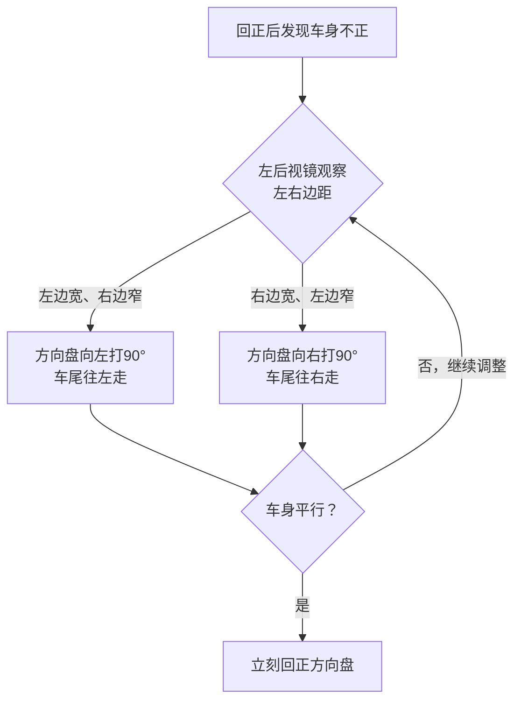
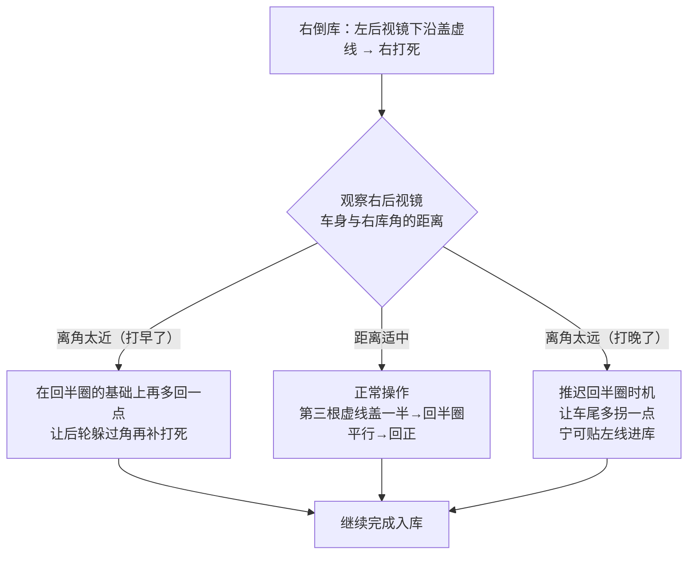

---

## 第一阶段：上车准备（不计分但决定成败）

```
开车门 → 调整 → 系安全带 → 检查 → 启动
```

| 顺序 | 操作 | 要点 |
|:---:|------|------|
| ① | **开车门** | 左手开门，确认后方安全 |
| ② | **调座椅** | **先调座椅再调镜**。右脚踩刹车到底，膝盖微弯（约120°），靠背调至手腕搭方向盘顶部 |
| ③ | **调左右后视镜** | 后门把手定位法——详见下方 |
| ④ | **系安全带** | **插到位**（插好拉一下确认不弹开） |
| ⑤ | **确认挡位/手刹** | 确认挡位在P挡或N挡，手刹已拉起 |
| ⑥ | **踩刹车点火** | 一键启动或钥匙点火，仪表盘亮为正常 |
| ⑦ | **语音报到** | 听语音提示"开始考试" |

> ⚠️ **高频失误**：不系安全带直接起步 → 不合格（0分）。座椅没调到位导致看点位偏差 → 压线。

### 后视镜调整（后门把手定位法·法一）

| 镜子 | 左右（车身占比） | 上下（后门把手位置） | 效果 |
|:---:|:--------------:|:-----------------:|:----|
| **左后视镜** | 车身占镜面约1/4 | 后门把手在镜子**上沿三分之一处**（露出约1/3镜高） | 地平线在镜中偏上 |
| **右后视镜** | 车身占镜面约1/4 | 后门把手在镜子**上沿三分之一处**（同上） | 地平线在镜中偏下 |

---

### 通用微调原理（贯穿全程）

**原理一：车速 = 你的反应时间**
车越慢，你就有越多时间看点位、修方向。自动挡全程用**刹车**控速，能不加油就不加。同一套点位，车速5km和10km打出来的轨迹完全不一样。

**原理二："哪边宽往哪边打"**
倒车入库和侧方停车入库后，如果车身不正：
- 左后视镜看到左边宽 → 向左打（车尾往左走）
- 左后视镜看到右边宽 → 向右打（车尾往右走）
幅度90°起步，平行立刻回正。



**原理三：打多少回多少**
每次方向盘动作都记住当前打了多少。回正是**主动打回来**，不是松手让它自己回：
打死（一圈半）→ 回半圈 → 还剩一圈；再回一圈 → 回正。错一步后面全乱。

**原理四：看远修近**
远处看整体走向，近处分次看点位到没到。不要死盯近处。

**原理五：打方向宁早勿晚**
早了大不了多回一点让过去，方向还能补；晚了直接压线/压角，没有补救空间。

---

## 基础操作详解（零基础必读）

以下内容是开车最基础的常识，理解了这些再上车，教练说的每一句话你都知道为什么。

### 一、自动挡原理——为什么没有离合器

手动挡的车有三个踏板（离合·刹车·油门），自动挡**只有两个**（刹车·油门）。

**自动挡的工作原理**：
- 发动机的动力传递到车轮之间有一个叫**液力变矩器**的东西，它用液体传递动力，不需要你踩离合来切断动力
- D挡下，你松刹车车就会自己走（叫**蠕行**）——因为液力变矩器在发动机怠速时已经有动力输出，只是不够大，需要松刹车释放
- 你踩刹车时，相当于告诉变速箱"断开动力"，松刹车时重新接上

**对考试的影响**：
- C2全程左脚放在休息踏板上不用动，刹车和油门都用右脚控制，不存在离合器
- 科目二全程用**怠速**走（就是发动机自己最低转速的那个速度），不需要踩油门，全用刹车控制快慢
- 踩得深一点 → 车更慢甚至停；抬一点 → 车快一点

---

### 二、点火操作

考试车上通常有两种点火方式：

**方式A：钥匙点火（老款车型）**
```
钥匙插入 → 先拧到通电（仪表盘亮）→ 再拧到START（启动）→ 松手
```
- 不要一下拧到底——先通电等2秒自检，再拧到启动
- 听到发动机轰轰一声就松手，不要一直拧着
- 启动后仪表盘上的发动机灯会亮几秒然后自己熄灭，这是正常自检

**方式B：一键启动（新款车型）**
```
踩死刹车 → 按一下启动键 → 仪表盘亮 → 发动机启动
```
- **必须踩住刹车才能按**，否则按了只是通电
- 启动后仪表盘很多灯亮一下又灭，这是自检，正常的

**点火后检查什么（三件事）**：
1. 是不是P挡（看挡杆旁边的字母）
2. 手刹灯是不是还亮着（如果是，说明手刹没松）
3. 车门关好了吗（仪表盘上有门未关提示）

---

### 三、挡位详解——P·R·N·D

自动挡一般四个挡位，考试只用到其中两个（D和R）。

```
  P ← 停车挡（Parking）—— 长时间停车用，熄火前挂这个
  R ← 倒挡（Reverse）—— 倒车用，倒库和侧方停车用
  N ← 空挡（Neutral）—— 等待的时候用（等红灯等），考试基本不用
  D ← 前进挡（Drive）—— 往前走，全程用这个
```

**怎么操作**：
- 大部分考试车是**直排式**（一条直线上下推）
- 也有的车是**蛇形**（曲线槽，需要沿着槽走）
- **挂挡前一定要踩死刹车**，否则推不动
- 换挡时看仪表盘上显示的字母，确认挂进去了

**挂挡要点**：

| 操作 | 步骤 | 确认方式 |
|:----:|------|---------|
| 挂D挡 | 踩刹车 → 从P挡或N挡向下拉一格 | 仪表盘显示D |
| 挂R挡 | 踩刹车 → 从D挡或N挡向上推一格 | 仪表盘显示R |
| 回P挡 | 踩刹车 → 按解锁钮 → 推到最上面 | 仪表盘显示P |

> ⚠️ 换挡时**不看挡杆看仪表盘**——挡杆的位置不一定准确，但仪表盘上显示的字母一定是当前的真实挡位。

---

### 四、手刹操作

考试车有**两种手刹**：手动拉杆和电子手刹。

**手动拉杆式（最常见）**

| 操作 | 做法 | 确认方法 |
|:----:|------|---------|
| 拉手刹（停车） | 右手抓住拉杆**直接向上拉到底**，听到咔咔声 | 仪表盘亮起红色圆圈⭕ + P字母灯 |
| 松手刹（起步） | 按住拉杆前端的按钮，**向下放到底** | 仪表盘上的灯**熄灭**；或用手按一下手刹顶部确认已松到底 |

> **常见错误**：手刹没松到底就起步——车子动不了还以为是车坏了，硬加油门结果一直带着刹车跑。考试时手刹灯没灭就起步 → 扣分（有些考场直接判熄火）。

**电子手刹（部分新款考试车）**
- 起步：踩刹车 → 按一下电子手刹按钮（通常在挡杆旁边，标有P+圆圈）
- 停车：挂P挡 → 拉起电子手刹按钮（听到电机声）

---

### 五、方向盘操作——基础术语

方向盘的所有动作归结为三个量：**打了多少**、**往哪打**、**回没回正**。

**方向盘的正确握法**：
```
    左手        右手
    9点         3点
  ┌────┬────┬────┐
  │    │    │    │
  │    │  ⚪  │    │
  │    │    │    │
  └────┴────┴────┘
```
- 左手握9点位置，右手握3点位置（想象时钟的位置）
- **不要掏轮**（手心向上从下面掏着打），**不要搓轮**（单手搓方向盘）
- 打死后再回正时，手要**从上面交叉换手**，不要松手让它自己弹

**方向盘的关键术语**：

| 术语 | 含义 | 说明 |
|:---:|------|:----:|
| **一圈** | 方向盘转一整圈（360度），从9点位置回到9点位置 | 打到底就是一圈半 |
| **半圈** | 方向盘转半圈（180度），从9点到3点 | 中间位置 |
| **一圈90度** | 转一圈再转90度，总共450度 | 接近但不到打死 |
| **打死** | 转到转不动为止，总共约540度（一圈半） | 极限位置 |
| **回正** | 让方向盘回到正中间（车子直走的状态） | 轮胎完全朝前 |

**如何知道方向盘打了几圈——一个实用的记忆方法**：
```
以左手握的9点位置为参考：
- 9点在正左 → 方向盘是正的
- 9点转到正下（6点位置）→ 打了90度（四分之一圈）
- 9点转到正右（3点位置）→ 打了半圈
- 9点转回正左（回到9点）→ 打了一圈
- 继续转到转不动 → 打了一圈半（打死）
```

**科目二的方向盘口诀**：

| 指令 | 实际操作 |
|:----:|---------|
| 右打死 | 双手交叉向右打一圈半，打不动为止 |
| 左打死 | 双手交叉向左打一圈半，打不动为止 |
| 回半圈 | 反向打半圈（180度） |
| 回一圈 | 反向打一圈 |
| 回正 | 回到方向盘摆正状态（轮胎朝前） |

---

### 六、刹车和油门——科目二只用一个踏板

C2科目二全程**只踩刹车，不碰油门**。

**为什么不用油门**：
怠速（车自己不动油门时的速度）足够快。科目二场地限速很低，怠速已经是上限了，加油门反而太快，点位看不准。

**刹车的控制方法**：
```
右脚脚后跟放在刹车踏板正下方作为支点：
- 脚掌抬一点 → 车往前走（怠速）
- 脚掌往下踩一点 → 车变慢
- 继续踩 → 车停住

想象你在用水龙头控制水流：
抬是开大（车快），踩是关小（车慢）
```

**控速技巧**：
- 科目二不需要猛踩猛抬，用**极小幅度的脚掌动作**控制
- 脚后跟始终在地上，只用脚掌的上下活动来控
- 点位没到之前提前稍微减速（比踩死后再放更稳）
- 需要完全停车时再一脚踩死

---

### 七、仪表盘——需要认识的灯

考试中你不需要看复杂的仪表信息，但下面几个灯要有概念：

| 灯 | 含义 | 什么时候亮 | 亮了怎么办 |
|:--:|------|----------|----------|
| 红色圆圈+⭕P | **手刹已拉起** | 拉手刹时亮，松手刹灭 | 起步前确认它**灭了** |
| 🔋电池灯 | 发电机未充电 | 刚通电时亮，启动后灭 | 启动后不灭→熄火后可能打不着 |
| 🛢️机油灯 | 机油压力不足 | 刚通电时亮，启动后灭 | 正常，启动后还亮就有问题 |
| 🚪门未关 | 车门没关好 | 门没关严时亮 | 重新关门 |
| 发动机灯 | 发动机状态 | 启动时会亮几秒自检，然后灭 | 一直亮着说明发动机有故障 |

**考试需要确认的两个灯**：
1. 手刹灯——**灭了才能走**
2. 挡位显示——**挂D挡还是R挡，以仪表盘为准**

---

## 第二阶段：起步进入考场

| 顺序 | 操作 | 要点 |
|:---:|------|------|
| ① | **右脚踩死刹车** | 左脚放休息踏板不动 |
| ② | **挂D挡** | 看清挡位 |
| ③ | **松手刹** | 按到底，仪表盘手刹灯熄灭 |
| ④ | **慢抬刹车**，车缓慢前进 | 自动挡怠速足够 |

> 全程用刹车控速，**能不加油就不加油**。

---

## 第三阶段：项目一 · 倒车入库（限时210s）

```
停车位置 → 右倒库 → 左出库 → 左倒库 → 右出库 → 驶离
```

### ① 停车到位

引擎盖右侧1/3沿黄线内侧走（车身距左边线约1.5米），前轮过控制线停车（肩膀与虚线平齐）。挂**R挡**。

### ② 右倒库

| 动作 | 参照点 | 方向盘 |
|:----:|--------|:-------:|
| 倒车 | 左后视镜下沿盖住虚线 | **右打死** |
| 继续倒 | 右后视镜观察，第三根虚线盖一半 | **回半圈** |
| 继续倒 | 左后视镜看车身与库边平行 | **回一圈（回正）** |
| 停车 | 左后视镜下沿盖住库口黄线 | ✅ 停车 |

### 右倒库轨迹示意图

![[svg/右倒库轨迹.svg]]

### 右倒库·细节经验与微调

**① 起点停车位置为什么重要**
距左边线1.5米不是随便来的：太窄→右打死时车尾离库角太近→容易压右角；太宽→左前轮容易扫左边线。1.5米约等于两个虚线宽度。

**② 右打死时机偏差怎么救**
- **打早了**（后视镜下沿刚碰虚线就打死）：车身离右库角很近。观察右后视镜，如果右后轮离库角太近，**在"回半圈"的基础上再多回一点（如回大半圈）**，让后轮躲过角，然后视情况补打死。
- **打晚了**（后视镜完全盖过虚线才打死）：车身离右库角很远。**推迟回半圈的时机**，让车尾多拐一点再回。如果太晚，宁可车身贴左线进库（不扣分），也不要强行调整压右线。

**③ 入库后车身歪的修正**
回正后发现车身与库边不平行：
- 左后视镜看左边**窄**（右边宽）→ 车尾偏左 → **向右打90度** → 平行后回正
- 左后视镜看左边**宽**（右边窄）→ 车尾偏右 → **向左打90度** → 平行后回正
- 口诀：**哪边宽往哪边打**（方向盘方向跟宽的一边一致）

**④ 停车时机**
后视镜下沿**刚盖住**黄线就刹，不要等"完全盖死"——车有惯性，看到盖完再踩已经过了。

**⑤ 关于210秒限时**
正常120-150秒足够。**只要偏差不大就往前走，别追求完美入库**。车身歪一点停进去不扣分，超时直接不合格。



---

### ③ 左出库

| 动作 | 参照点 | 方向盘 |
|:----:|--------|:-------:|
| 挂D挡前进 | 车窗过虚线约三指宽 | **左打一圈90度** |
| 继续前进 | 车门对齐左起点线 | ✅ 停车·挂R挡 |

### 左出库轨迹示意图

![[svg/左出库轨迹.svg]]

### 左出库·细节经验

**为什么出库只打一圈90度而不是打死？**
因为左倒库需要的是向左打死入库。如果出库打死了，到左起点停车时方向盘是死的，挂倒挡后还要先判断"当前打了多少"。出库只打一圈90度保留了半圈余量：
- 出库轨迹更平缓，不容易扫左边线
- 倒车时只需要再补半圈就到死点
- 万一打多了/打少了还能用那半圈余量修正

---

### ④ 左倒库

| 动作 | 参照点 | 方向盘 |
|:----:|--------|:-------:|
| 倒车（接上一步位置） | 左后视镜对准库角 | **向左打死** |
| 继续倒 | 左后视镜第三根虚线盖一半 | **回半圈** |
| 继续倒 | 右后视镜看车身与库边平行 | **回一圈（回正）** |
| 停车 | 后视镜下沿盖黄线 | ✅ 停车·挂D挡 |

### 左倒库轨迹示意图

![[svg/左倒库轨迹.svg]]

### 左倒库·细节经验

左倒库是右倒库的镜像，原理完全一样：
- 左倒库打死**早了**（左后轮离左库角太近）→ 回半圈之后再多回一点让过去
- 打死**晚了**（左后轮离左库角太远）→ 推迟回半圈时机
- 入库后修正同样适用"哪边宽往哪边打"
- **特别注意**：左倒库看平行用的是**右后视镜**，不是左后视镜

---

### ⑤ 右出库（驶离倒库区）

| 动作 | 参照点 | 方向盘 |
|:----:|--------|:-------:|
| 前进 | 车头盖住前方黄线 | **向右打死** |
| 前进 | 车头方向与道路对齐 | **回正** |

> 驶离倒库区，沿车道向**侧方停车**项目前进。

---

## 第四阶段：项目二 · 侧方停车（限时90s）

### ① 进入项目区

车身靠右，**引擎盖右1/3沿右边缘线**，保持边距30-50cm，直行至右后视镜中出现库前角（A角），停车。

### ② 侧方入库

| 动作 | 参照点 | 方向盘 |
|:----:|--------|:-------:|
| 挂R挡倒车 | 右后视镜中A角消失 | **右打死** |
| 看左后视镜 | 露出库底右后角（B角） | **回正** |
| 看左后视镜 | 左后轮即将压虚线 | **向左打死** |
| 停车 | 车身完全入库，车头正 | ✅ 停车 |

### 侧方停车示意图

![[svg/侧方停车示意图.svg]]

### 侧方入库·细节经验与微调

**① 边距30-50cm的重要性**
- 太窄（＜20cm）：倒车时右后轮可能一上来就碰右边线
- 太宽（＞60cm）：左前轮出库时容易扫左边线，且右打死时车尾离库角太远
- **宁窄勿宽**——窄了入库轨迹对，宽了可能直接进不去

**② 三个方向盘动作的时机偏差补救**

| 动作 | 太早了怎么办 | 太晚了怎么办 |
|:----:|:----------:|:----------:|
| A角消失**右打死** | 右后轮离库左线很近 → 下次晚一点打 | 右后轮离库左线很远 → 下次早一点打 |
| B角露出**回正** | 车身会偏右 → 下次让B角再多露一点再回 | 车身会偏左 → 下次B角一露就回 |
| 轮压虚线**左打死** | 车头可能还没完全进库 → 等轮快碰虚线再打 | 车头可能摆过头 → 下次轮刚过虚线边就打 |

**③ 最后停车**
左打死入库后不要等车身完全摆正再停。左打死持续到车身跟库平行就立刻停车——等完全平行再停，车身会继续偏过头。

---

### ③ 侧方出库

| 动作 | 参照点 | 方向盘 |
|:----:|--------|:-------:|
| **打左转向灯** ⚠️ | 先打灯再挂挡 | 左灯 |
| 挂D挡前进 | 车头左前角碰左边缘线 | **回正** |
| 继续前进 | 引擎盖中间碰左边线 | **右打一圈** |
| 继续前进 | 车身与道路平行 | **回正** |

### 侧方出库轨迹示意图

![[svg/侧方出库轨迹.svg]]

### 侧方出库·细节经验

**① 打灯顺序为什么重要**
考试系统检测逻辑：挡位从R切到D后，传感器就开始检测转向灯状态。**如果挂了D挡才打灯，系统可能已经记了"未打灯"**。

标准顺序：
```
打左灯（确认亮） → 挂D挡 → 观察 → 起步
```

**② 出库两步方向盘**
- 回正：解除左打死状态，车头开始往左偏
- 右打一圈：等车头中间碰左边线时打，让车尾往右摆正
- 右打一圈不要打太猛，防止右后轮扫库角。车身平行立刻回正

---

## 第五阶段：项目三 · 曲线行驶（S弯）

### 进入项目区

车身**居中对准S弯入口**，怠速进入。

### 操作

| 阶段 | 参照点 | 方向盘 |
|:----:|--------|:-------:|
| 入弯 | 人正对入口中线 | 直行 |
| 左弯 | 左车头角盖**右边缘线** | **左打一圈**+微调（≤90度） |
| 过渡（左→右） | 左头角碰到**左边缘线** | **回正** |
| 右弯 | 右车头角盖**左边缘线** | **右打一圈**+微调（≤90度） |
| 出弯 | 车身与出口对齐 | **回正** |

### S弯轨迹示意图

![[svg/S弯轨迹示意图.svg]]

### S弯·细节经验与微调原理

**① 左弯阶段**
左车头角沿右边缘线走。但光看车头不够——实测中需要**同时扫一眼左后视镜**，确认左后轮与左边线的距离：
- 左后轮离左边线**太近**（＜20cm）→ 向右微调90度，拉开距离后回正
- 左后轮离左边线**太远**（＞50cm）→ 不用管，正常走

**② 过渡段（左→右）——最高风险区**
这是S弯最容易压线的地方。原因是左弯走完急着回正，但车头还偏左，回正后马上右打一圈，车头猛然向右拐，**右后轮可能扫右边线**。

**正确做法**：
1. 左头角碰到左边缘线时**先回正**
2. 保持直行**约半秒到1秒**（让车往前走一点）
3. 等右头角盖到左边缘线时再**右打一圈**
4. 中间半秒的停顿就是防止扫线的关键

**③ 出弯时机**
不要等到完全出弯再回正。当车头已经对准出口、车身大约一半还在弯里时就开始回正。回正太晚→车尾扫右线。

**④ 关于不限时**
S弯不限时，但别长时间静止。保持在极低速蠕动即可。

---

## 第六阶段：项目四 · 直角转弯

### ① 进入项目区

- **打右转向灯** ⚠️
- 车身靠右，引擎盖右1/3沿右边缘线，保持边距约30cm
- 直行

### ② 过弯

| 动作 | 参照点 | 方向盘 |
|:----:|--------|:-------:|
| 前进 | 左侧门锁块（或门内把手）对齐内直角拐点 | **向右打死** |
| 转向 | 转过拐点后关闭转向灯（如未自动关闭） | — |
| 前进 | 车身与外侧道路平行 | **回正** |

### 直角转弯示意图

![[svg/直角转弯示意图.svg]]

### 直角转弯·细节经验与微调

**① 30cm边距控制**
- 宁宽勿窄——宽了（35-40cm）右前轮还有空间，窄了（＜20cm）右后轮必然压内角
- 可以用左后视镜看左边线作为参考（左边距约1.2米时右边距约30cm）
- 小幅微调，不要频繁大幅度修正

**② 打方向的时机——三选一**

| 方法 | 优点 | 缺点 |
|:----:|:----:|:----:|
| **门锁块对齐拐点** | 最准，不受坐高影响 | 需要转头看门 |
| 左肩与拐点对齐 | 坐姿固定时很稳 | 座椅调前调后点位变 |
| 车头盖前方横线 | 最直观 | 误差最大，不推荐首选 |

**③ 宁早勿晚的具体操作**
打早了（前轮还没到拐点就打死）怎么救——驾校不教但考场上能救命：

```
打完右死后 → 立刻看右后视镜
  → 如果右后轮与内角的距离在缩小、即将碰到
    → 迅速回半圈到一圈（不要全回），让后轮绕过去
    → 后轮过了角再补打死
    → 车身平行后回正
```

打晚了没有任何补救机会，直接压内角。

**④ 转向灯**
进项目就拨灯，不要等到拐弯才打。转过弯后检查灯有没有自动灭——没灭的话手动拨回。

---

## 第七阶段：考试结束

| 顺序 | 操作 |
|:---:|------|
| ① | 过完直角后根据语音指示行驶到终点区域 |
| ② | **挂P挡**（或空挡N+拉手刹） |
| ③ | **拉手刹**（拉到底） |
| ④ | 解开安全带 |
| ⑤ | 熄火 |
| ⑥ | 听语音播报成绩 |
| ⑦ | **开门→下车→关门**（确认后方安全） |

---

## 完整时间线

```mermaid
flowchart LR
    A["上车准备"] --> B["起步进入考场"]
    B --> C["① 倒车入库<br/>限时210s"]
    C --> D["② 侧方停车<br/>限时90s"]
    D --> E["③ 曲线行驶<br/>S弯·不限时"]
    E --> F["④ 直角转弯<br/>打右灯"]
    F --> G["考试结束<br/>P挡·手刹·熄火"]
---

## 必记扣分清单

| 行为 | 扣分 |
|------|:---:|
| 不系安全带 | **不合格** |
| 压线（任何项目） | **不合格** |
| 倒库/侧方超过限时 | **不合格** |
| 车身出库位线（倒库/侧方） | **不合格** |
| 中途停车超过2秒（倒库/侧方/S弯/直角） | **扣5分/次** |
| 侧方出库不打左灯 | **扣10分** |
| 直角转弯不打右灯 | **扣10分** |
| 发动机熄火 | **扣10分** |

> C2自动挡总分100分，**80分合格**。压线或不系安全带直接不合格。


<!-- test -->
<!-- fix-r-l -->
<!-- audit-v3 -->
<!-- audit-final -->
<!-- arrow-v2 -->
