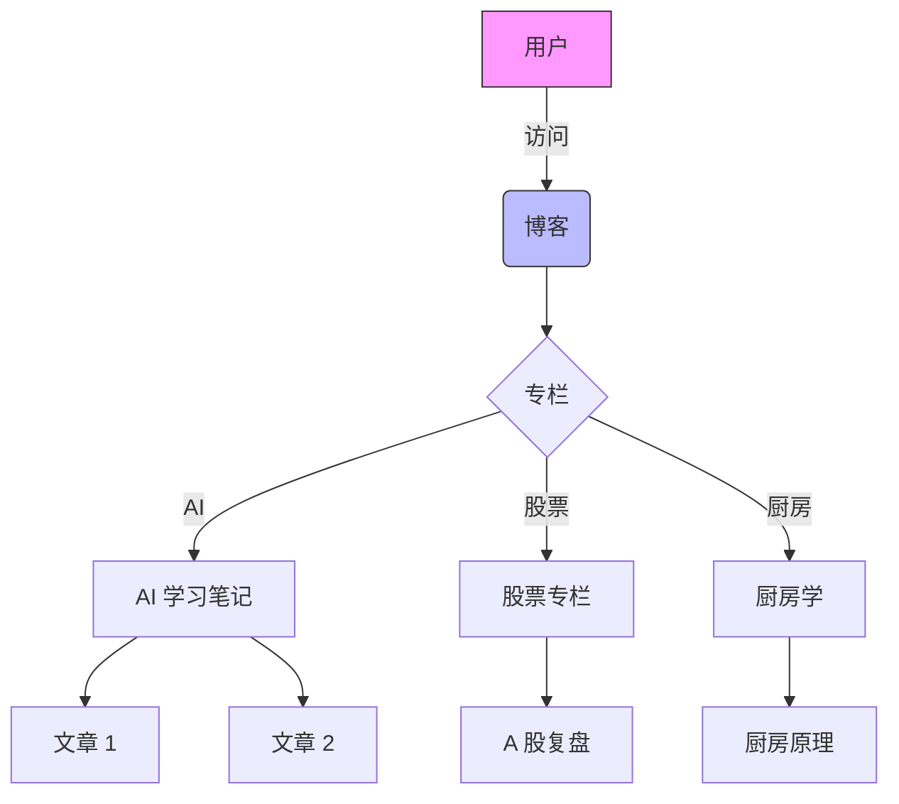
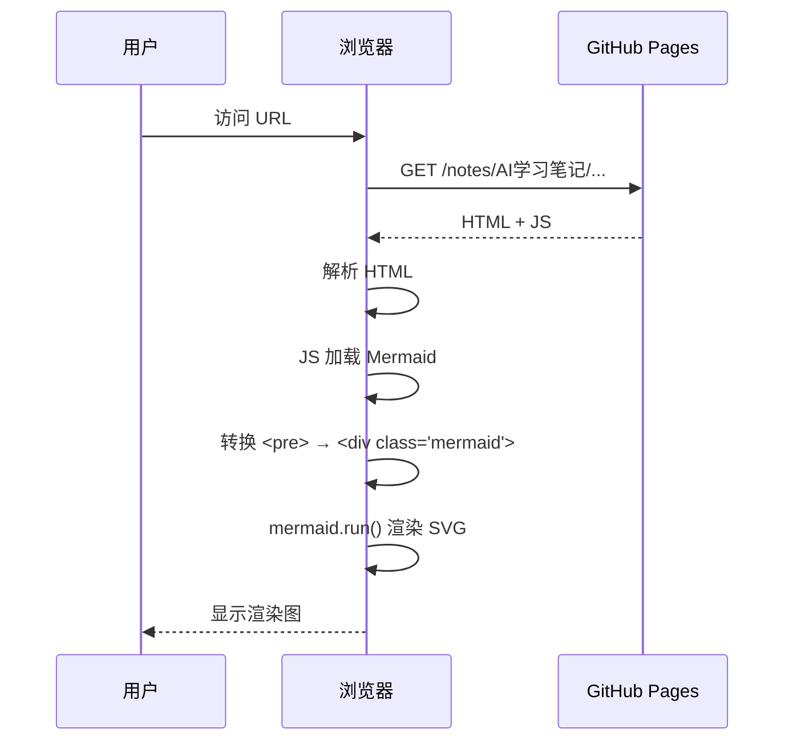
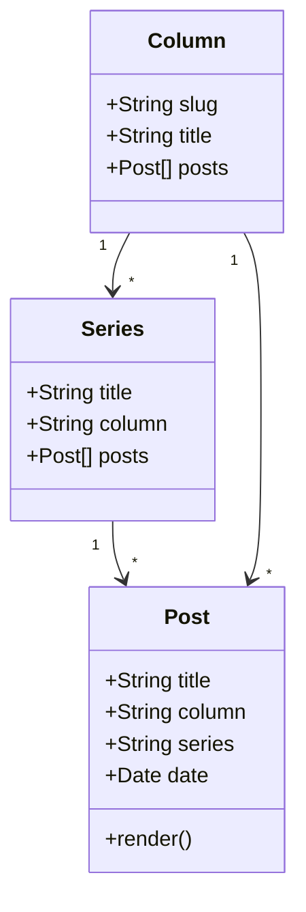

## Mermaid 图测试

### 流程图



### 时序图



### 类图



## LaTeX 测试

### 行内公式

质能方程：$E = mc^2$ 是物理学的核心。欧拉恒等式 $e^{i\pi} + 1 = 0$ 被誉为「数学之美」。

### 块级公式

高斯积分：

$$
\int_{-\infty}^{\infty} e^{-x^2} \, dx = \sqrt{\pi}
$$

矩阵乘法：

$$
\begin{bmatrix}
a & b \\
c & d
\end{bmatrix}
\begin{bmatrix}
x \\
y
\end{bmatrix}
=
\begin{bmatrix}
ax + by \\
cx + dy
\end{bmatrix}
$$

求和与级数：

$$
\sum_{n=1}^{\infty} \frac{1}{n^2} = \frac{\pi^2}{6}
$$

机器学习损失函数（交叉熵）：

$$
L = -\frac{1}{N} \sum_{i=1}^{N} \left[ y_i \log(\hat{y}_i) + (1-y_i) \log(1-\hat{y}_i) \right]
$$

### 转义测试

代码块内的 `$$ 不应被识别为公式：

```
def foo():
    return "$ 100 + $ 200 = $ 300"  # 这里 $$ 不应触发 MathJax
```

行内代码 `$\int f(x)dx$` 也不应被识别（已通过 `skipHtmlTags: code` 跳过）。

## 结论

- ✅ Mermaid 三种图（流程 / 时序 / 类）正常渲染
- ✅ LaTeX 行内 `$...$` 和块级 `$$...$$` 正常渲染
- ✅ 代码块内 `$$` 不误触发
- ✅ 行内 code 内 `$...$` 不误触发
